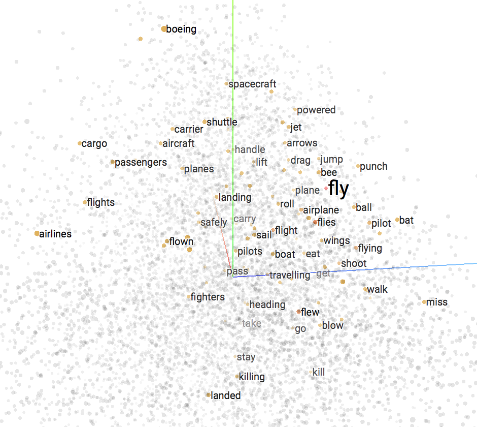

# 자연어처리의 최근 트랜드

## 딥러닝의 자연어처리 정복 과정

![[Mikolov et al.2010]](../assets/01-05-01.png)

이전에 다루었던 대로, 인공지능의 다른 분야에 비해서 자연어처리는 가장 늦게 빛을 보기 시작하였다고 하였지만, 여러 문제에 딥러닝을 적용하려는 시도는 많이 이루어졌고, 진전은 있었습니다. 2010년에는 RNN을 활용하여 언어모델(language modeling)을 시도[Mikolov et al.2010], [Sundermeyer at el.2012]하여 기존의 n-gram 기반의 언어모델의 한계를 극복하려 하였습니다. 그리하여 기존의 n-gram 방식과의 interpolation을 통해서 더 나은 성능의 언어모델을 만들어낼 수 있었지만, 기존에 언어모델이 주로 사용되던 음성인식과 기계번역에 적용되기에는 구조적인 한계와 비교적 높은 연산량으로 인해 더 큰 성과를 거둘 수는 없었습니다. <comment> 애초에 n-gram 기반 언어모델의 한계는 WFST에 기반하였기 때문이라고도 볼 수 있습니다. 닭이 먼저냐, 달걀이 먼저냐의 문제와 같습니다. </comment>

![Skip-gram과 CBOW의 구조 [Mikolov et al.2013]](../assets/01-05-02.png)

그러던 와중에 Mikolov는 2013년 Word2Vec[Mikolov et al.2013]을 발표합니다. 단순한 구조의 신경망을 사용하여 효과적으로 단어들을 latent(레이턴트) 공간에 성공적으로 프로젝션(projection) 시킴으로써, 본격적인 자연어처리 문제에 대한 딥러닝 활용의 신호탄을 쏘아 올렸습니다. 아래와 같이 우리는 고차원의 공간에 단어가 어떻게 배치되는지 알 수 있음으로 해서, 딥러닝을 활용하여 자연어처리에 대한 문제를 해결하고자 할 때에 네트워크 내부는 어떤식으로 동작하는지에 대한 인사이트를 얻을 수 있었습니다.

이때까지는 문장이란 단어들의 시퀀셜 데이터이므로, 당연히 Recurrent Neural Network(RNN)을 통해 해결해야 한다는 고정관념이 지배하고 있었습니다 <comment> 이미지=CNN, 텍스트=RNN. </comment> 하지만 2014년, Kim은 CNN만을 활용해 기존의 텍스트 분류보다 성능을 끌어올린 방법을 제시[Kim et al.2014]하며 한차례 파란을 일으킵니다. 이 방법은 단어 임베딩 벡터와 결합하여 더 성능을 극대화 할 수 있었습니다. 위의 방법을 통해서 학계는 자연어처리에 대한 시각을 한차례 더 넓힐 수 있게 됩니다.

![CNN 텍스트 분로 모델 [Kim et al.2014]](../assets/01-05-04.png)

이외에도 형태소 분석(part of speech tagging), 문장 파싱(sentence parsing), NER(Named Entity Recognition), SR(Semantic Role) labeling등에서도 기존의 최고 성능을 뛰어넘는 성과를 이루냅니다. 하지만 딥러닝의 등장으로 인해 대부분의 문제들이 end-to-end를 통해 문제를 해결하고자 함에따라, (또한, 딥러닝 이전에도 이미 매우 좋은 성과를 내고 있었거나, 딥러닝의 적용 후에도 큰 성능의 차이가 없음에) 큰 파란을 일으키지는 못합니다.

## 자연어 생성의 시작

2014년 자연어처리에 큰 혁명이 다가옵니다. Sequence-to-Sequence의 발표[Sutskever et al.2014]에 이어, 어텐션(Attention) 기법이 개발되어 성공적으로 기계번역에 적용[Bahdanau et al.2014]하여 큰 성과를 거둡니다. 이에 자연어처리 분야는 일대 혁명을 맞이합니다. 기존의 한정적인 적용 사례에서 벗어나, 주어진 정보에 기반하여 자유롭게 문장을 생성(자연어생성, Natural Language Generation)할 수 있게 된 것입니다. 따라서, 기계번역 뿐만 아니라, 요약, 챗봇 등 더 넓고 깊은 주제의 자연어처리의 문제를 적극적으로 해결해보려 시도 할 수 있게 되었습니다.

또한, 이와 같이 자연어처리 분야에서 딥러닝을 활용하여 큰 성과를 거두자, 더욱더 많은 연구가 활기를 띄게 되어 관련한 연구가 쏟아져 나오게 되었고, 기계번역은 가장 먼저 end-to-end 방식을 활용하여 상용화에 성공하였을 뿐만 아니라, 자연어처리에 대한 이해도가 더욱 높아지게 되었습니다.

## 메모리를 활용한 심화 연구

어텐션이 큰 성공을 거두자, continuous한 방식으로 저장소(memory)에 접근하는 기법에 대한 관심이 커졌습니다. 곧이어 Neural Turing Machine(NTM)[Graves et al.2014]이 대담한 그 이름대로 큰 파란을 일으키며 주목을 받았습니다. Continuous한 방식으로 저장소에서 정보를 읽고/쓰는 방법을 제시하였고, 이어서 Differential Neural Computer (DNC)[Graves et al.2016]가 제시되며 활용 방법에 대한 관심이 높아졌습니다.

![[Graves et al.2016]](../assets/01-05-06.png)

이러한 신경망을 통해 메모리를 활용하는 기법은 Memory Augmented Neural Network(MANN)이라 불리우며, 이 기법이 발전한다면 최종적으로는 우리가 원하는 정보를 신경망을 통해 저장하고 필요할 때 잘 조합하여 꺼내쓰는, Question Answering (QA)과 같은 문제에 효율적으로 대응 할 수 있게 될 것입니다.

<!--
* 참고사이트:
* [https://jamiekang.github.io/2017/05/08/neural-turing-machine](https://jamiekang.github.io/2017/05/08/neural-turing-machine)
* [https://sites.google.com/view/mann-emnlp2017/](https://sites.google.com/view/mann-emnlp2017/)
-->

## 강화학습의 자연어처리 분야에 대한 성공적인 적용

일찌감치 Variational Auto Encoder(VAE)[Kingma et al.2013]와 Generative Adversarial Networks(GAN)[Goodfellow et al.2014]을 통해 영상처리(Computer Vision) 분야는 기존의 discriminative 학습 방식을 벗어나 generative 학습에 관심이 옮겨간 것과 달리, 자연어처리 분야는 그럴 필요가 없었습니다. 이미 언어모델 자체가 문장에 대한 generative 학습이기 때문입니다.

하지만, 기계번역 분야에서 큰 성과를 거두면서 학계는 다른 어려움에 부딪히게 됩니다. 딥러닝에서 사용하는 손실 함수와 실제 기계번역을 위한 목적함수(objective function)와의 괴리(discrepancy)가 있었기 때문입니다. 따라서, 마치 영상처리 분야에서 기존의 MSE loss의 한계를 벗어나기 위해 GAN을 도입한 것 처럼, 기존의 손실함수와 다른 무엇인가가 필요하였습니다.

![[[Yu et al.2016]](https://arxiv.org/abs/1609.05473)](../assets/01-05-07.png)

이때 성공적으로 강화학습의 폴리시 그래디언트(policy gradients) 방식을 자연어생성에 적용함으로써[Bahdanau et al.2016], [Yu et al.2016], 마치 영상처리 분야의 적대적 학습(adversarial learning)을 자연어처리에서도 흉내 낼 수 있게 되었습니다. 이렇게, 강화학습(RL)을 사용하여 실제 자연어생성에서의 목적함수(objective function)으로부터 reward(보상)를 받을 수 있게 됨에 따라, 더욱 성능을 극대화 할 수 있게 되었습니다.
