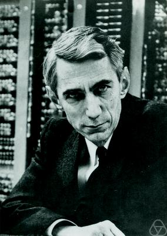

# 이 책을 깊게 공부하기 위한 기초 수학

{ width=500px }

대부분의 머신러닝은 통계에 기반하여 동작합니다. 그리고 딥러닝은 그 머신러닝에 기초하여 발전한 학문 입니다. 다행히도 정말 넓은 수학과 통계의 영역에 비하면 아직은 좁은 영역의 내용을 사용합니다. 하지만 그 내용을 모른다면 좀 더 깊이 나아가고자 할 때, 그 근본적인 동작 이유에 대해서 이해하고자 할 때, 어려움을 겪을 수 밖에 없습니다. 딥러닝 또한 확률과 통계 위에서 동작하는 모델 입니다. 따라서 앞으로 (특히 책 후반부) 이와 관련된 내용들이 많이 나올 것 입니다. 그러므로 이번 챕터에서는 앞으로 이 책에서 주로 사용될 수학 표현에 대해서 간단하게 살펴보고자 합니다.
