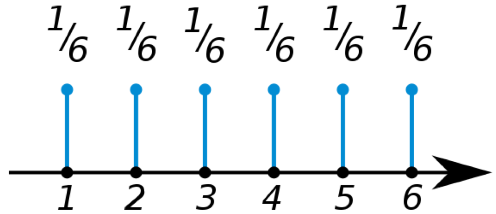
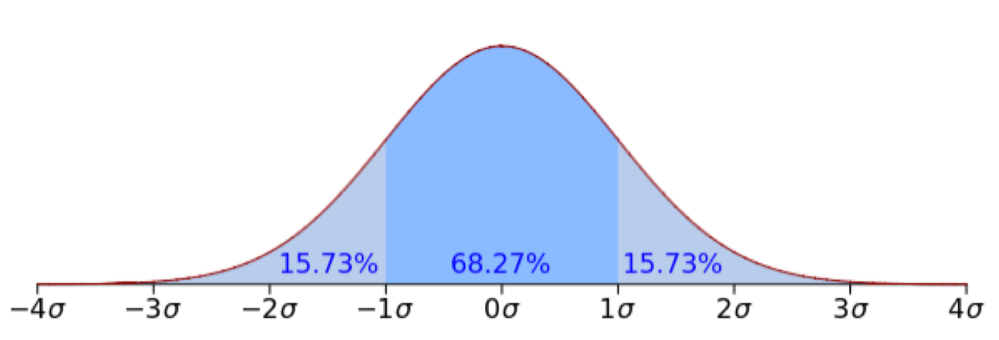
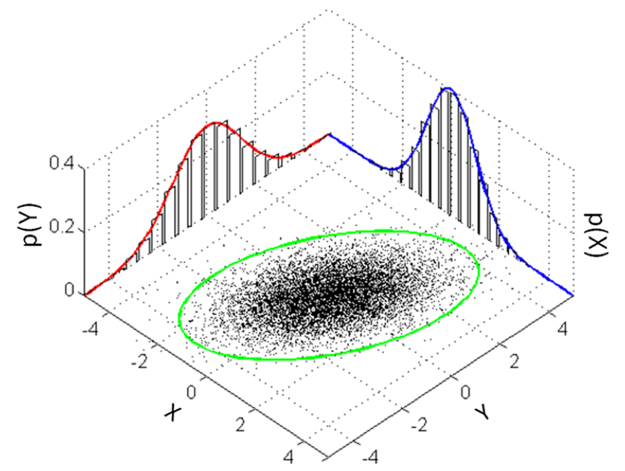

# 랜덤 변수와 확률 분포

## 랜덤 변수 (Random Variable)

랜덤 변수는 확률을 이야기 할 때, 어떤 사건(event)을 정의 합니다. 예를 들어 주사위를 던져 (사건 $\text{x}$ ) 주사위의 면이 6(값 3)이 나왔다고 한다면, 우리는 아래와 같이 표현 할 수 있습니다. 그리고 그 값은 $1/6$ 이 될 겁니다.

$$P(\text{x}=3)=\frac{1}{6}$$

우리는 위의 수식을 읽을 때, 주사위를 던져 3이 나올 확률은 $1/6$ 이라고 읽습니다. 보통 우리는 값 $x$ 가 나올 확률 $p$ 를 아래와 같이 표현 합니다.

$$P(\text{x}=x)=P(x)=p \text{ where }0\le p\le 1$$

이때 확률 $p$ 는 0에서 1 사이의 값이 될 수 있습니다.

$$\sum_{i=1}^N{P(\text{x}=x_i)}=\sum_{i=1}^N{P(x_i)}=1$$

또한 랜덤 변수 $\text{x}$ 가 가질 수 있는 N개의 값에 대한 확률을 모두 더하면 1이 됩니다.

### Discrete(이산) 랜덤 변수와 Discrete(이산) 확률 분포 (Probability Distribution)

보통 우리가 접하는 확률 변수는 discrete(불연속, 이산)한 값인 경우가 많습니다. 주사위가 하나의 예가 될 수 있습니다. 이처럼 discrete한 확률 변수를 다루는 확률 분포(probabiliy distribution)를 그리면 아래와 같이 나타낼 수 있습니다.

우리는 이와 같이 discrete한 랜덤 변수에 대한 확률 함수를 확률 질량 함수(probability mass function)이라 합니다. 위의 분포에서 알 수 있듯이, 우리는 어떤 값에 대한 확률값을 바로 알 수 있습니다. <comment> $P(\text{x}=3)=1/6$ </comment>

Discrete한 랜덤 변수를 갖는 확률 분포로는 베르누이(Bernoulli) 확률 분포와 멀티눌리(Multinoulli) 확률 분포가 있습니다. 베르누이 확률 분포는 0과 1 두 개의 값만 가질 수 있는 확률 분포이고, 멀티눌리 확률 분포는 주사위의 경우와 같이 여러개의 discrete한 값을 가질 수 있는 경우를 말합니다. 두 확률 분포를 좀 더 일반화하여 여러번 일어날 수 있는 확률에 대하여 이야기 할 때, binomial 확률 분포와 mulinomial 확률 분포라고 이릅니다.

### Continuous(연속) 랜덤 변수와 Continuous(연속) 확률 분포 (Probability Distribution)

Discrete한 랜덤 변수 이외에도 우리는 연속적인 값을 다루는 continuous 랜덤 변수를 가질 수 있습니다. 상상하긴 어려울 수 있지만, 주사위가 마치 완벽한 '구'로 이루어져 있다고 생각 해 볼 수도 있을 것 입니다.

$$\begin{gathered}
\forall x \in X,~p(x)\ge0. \\
\text{It is not necessary that }p(x)\le1. \\
\int_{-\infty}^{\infty}{p(x)}~dx=1
\end{gathered}$$

위와 같이 $p(x)$ 는 꼭 1보다 작을 필요는 없으며, $p(x)$ 를 적분한 값은 항상 1 입니다. 우리는 위의 확률 분포 함수를 continuous한 랜덤 변수에 대한 확률 밀도 함수(probability density function)라고 합니다. 가우시안(Guassian 또는 정규) 확률 분포 함수가 가장 좋은 예가 될 수 있습니다.

Continuous 확률 분포 함수에서 확률 값이란 어떠한 구간의 넓이를 말합니다. 따라서 우리는 특정 값 $x$ 가 주어졌을 때, 확률 값을 구할 수 없습니다. 확률 밀도 값만 구할 수 있을 뿐 입니다. 확률 값을 구하기 위해서는 구간(예를 들어 $x_1$ 과 $x_2$ )이 주어져야 합니다. 위의 그림에서는 $-1\sigma$ 에서 $1\sigma$ 까지의 넓이가 68.27% 임을 알 수 있습니다.

## 결합 확률 (Joint Probability)

두 사건이 동시에 일어날 확률을 말합니다. 따라서 두개의 랜덤 변수를 가지고 있습니다. 예를 들어 주사위 2개 $A$ 와 $B$ 를 던질 때의 확률은 아래와 같이 나타낼 수 있습니다.

$$P(A, B)$$

이때 A가 3이 나오고, B가 2가 나올 확률은 아래와 같이 표현 할 수 있습니다.

$$P(A=3, B=2)$$

### 독립 확률 (Independent Probability)

위와 같이 2개의 주사위를 던지는 경우에는 각각의 주사위를 던지는 사건이 서로에게 영향을 끼치지 않을 것 같습니다. 이때 우리는 두 사건을 독립이라고 합니다. 두 사건이 독립 관계일 때, 항상 아래의 조건을 만족 합니다.

$$P(A,B)=P(A)P(B)$$

따라서 우리는 두 주사위를 수없이 많이 던져보고 확률 값을 계산 해 보면, 두 사건이 독립인지 아닌지 확인 할 수 있을 것 입니다.

## 조건부 확률 (Conditional Probability)

조건부 확률은 머신러닝와 딥러닝에 있어서 매우 중요합니다. 우리가 다루는 대부분의 문제들이 이에 기반하기 때문입니다. 조건부 확률 또한 두 사건에 대한 확률 분포 입니다. 다만 하나의 랜덤 변수가 주어졌을 때, 다른 랜덤 변수에 대한 확률 분포 입니다.

$$\begin{gathered}
P(A|B)=\frac{P(A,B)}{P(B)} \\
\text{or} \\
P(A,B)=P(A|B)P(B)
\end{gathered}$$

위의 식은 사건 B가 주어졌을 때, 사건 A에 관한 확률 분포를 가리킵니다. 예를 들어 아까와 같이 주사위 2개를 던진다고 하였을 때는 아래와 같이 표현 가능 할 겁니다.

$$P(A=3|B=2)$$

위의 식은 주사위 B가 2가 나왔을 때, 주사위 A의 값이 3이 나올 확률값을 말합니다.

$$P(A|B=2)$$

위의 수식은 주사위 $B$ 가 $2$ 가 나왔을 때, 주사위 $A$ 의 확률 분포를 말합니다. 위의 수식과 이전의 수식의 차이점은 $A$ 의 값이 주어지지 않았기 때문에, 확률 값을 반환(return)하는 것이 확률 분포(distribution)를 반환한다는 것 입니다.

### 베이즈 정리 (Bayes Theorem)

베이즈 정리 또한 조건부 확률 만큼 매우 중요한 역할을 합니다.

$$P(A|B)=\frac{P(B|A)P(A)}{P(B)}$$

위의 수식에서처럼 사건 A와 B에 대한 관계를 반대로 만들 수 있습니다. 우리는 이를 활용한 방법을 추후 다뤄 보도록 하겠습니다.

## Marginal 확률 분포

마지막으로 Marginal 확률 분포에 대해 이야기 해보겠습니다. 아래 그림에서와 같이 두 랜덤 변수의 결합 확률 분포(joint probability distribution)가 있을 때, 하나의 랜덤 변수에 대해서 적분을 수행한 결과를 말합니다.

이는 마치 두 랜덤 변수의 분포가 3차원 공간에 존재할 때에, 한쪽으로만 손전등을 비추었을 때 생기는 그림자와 같다고 볼 수 있을 것 입니다. 이를 수식으로 나타내면 아래와 같습니다.

$$P(x)=\sum_{y\in\mathcal{Y}}{P(x,y)}=\sum_{y\in\mathcal{Y}}{P(x|y)P(y)}$$

위의 수식은 discrete 랜덤 변수에 관한 marginal이고, 랜덤 변수의 값이 continuous한 경우에는 아래와 같이 적분으로 표현 가능 합니다.

$$p(x)=\int{p(x,y)}dy=\int{p(x|y)p(y)}dy$$
