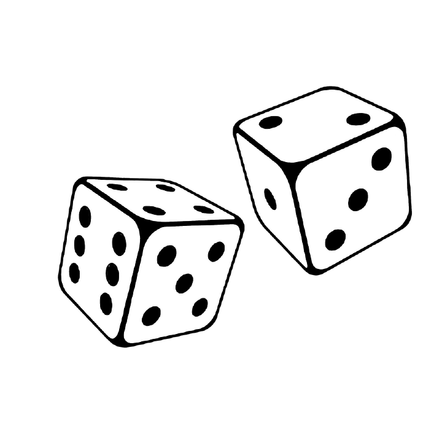
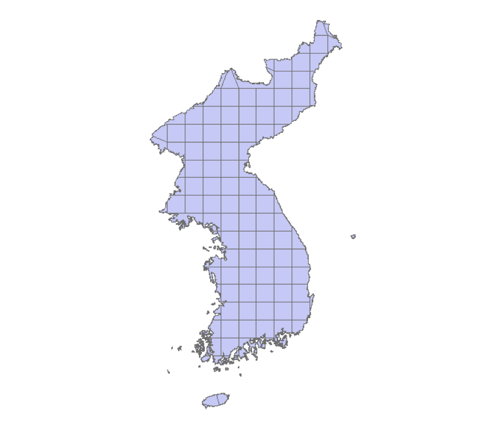

# 기대값과 샘플링

## 기대값 (Expectation)

우리가 어릴 때 배우기로 기대값(expectation)은 보상(reward)과 그 보상을 받을 확률을 곱한 값의 총 합을 통해 얻을 수 있었습니다. 즉, 보상에 대한 가중평균(weighted average)이라고 볼 수 있습니다. 주사위의 경우에는 보상 함수의 결과값을 1부터 6까지 받을 수 있지만, 각 보상 값에 대한 확률은 $1/6$ 로 동일합니다.

$$\begin{gathered}
\text{expected reward from dice}=\sum^6_{x=1}{P(\text{x}=x)\times \text{reward}(x)} \\
\text{where }P(x)=\frac{1}{6}, \forall x\text{ and reward}(x)=x.
\end{gathered}$$

따라서 실제 주사위 보상의 기대값은 아래와 같이 3.5가 됩니다.

$$\frac{1}{6}\times(1+2+3+4+5+6)=3.5$$

즉, 기대값은 특정 함수에 대한 가중평균(weighted average)임을 알 수 있습니다. 또한, 위의 수식은 아래와 같이 표현 할 수 있습니다.

$$\mathbb{E}_{\text{x} \sim P(\text{x})}[\text{reward(x)}]=\sum^6_{x=1}{P(\text{x}=x)\times \text{reward}(x)}=3.5$$

위의 수식은 주사위의 확률 분포 $P(\text{x})$ 에서 샘플링한 $\text{x}$ 를 $\text{reward(x)}$ 함수에 넣어 실행하는 것이라고 해석할 수 있습니다. 주사위의 경우에는 discrete 랜덤 변수에 대한 확률 분포이고, continuous 랜덤 변수 확률 분포의 경우에는 적분을 통해 기대값을 구할 수 있습니다.

$$\mathbb{E}_{\text{x}\sim p}[\text{reward(x)}]=\int{p(x)\cdot\text{reward}(x)}\text{ }dx$$

## 몬테카를로 샘플링(Monte-Carlo Sampling)

몬테카를로 샘플링은 랜덤 성질을 이용하여 임의의 함수의 적분을 근사하는 방법입니다. 아래의 그림과 같이 한반도의 넓이를 근사하고 싶다면, 한반도를 포함하는 큰 도형(사각형 또는 원)을 그린 후에 랜덤하게 점을 흩뿌려 보았을 때, 한반도 안에 떨어진 점과 밖에 떨어진 점의 비율을 통해 우리는 도형의 넓이에서 한반도가 차지하는 비율을 알 수 있을 것 입니다.

이때 점을 많이 흩뿌릴수록 점점 정확한 한반도의 넓이를 근사할 수 있을 것 입니다. 이를 수식으로 일반화하면 아래와 같습니다.

$$\mathbb{E}_{\text{x}\sim P}[f(\text{x})]=\sum_{x\in\mathcal{X}}{P(x)\cdot f(x)}\approx\frac{1}{K}\sum_{i=1}^K{f(x_i)}$$

Continuous 랜덤 변수의 경우는 아래와 같습니다.

$$\mathbb{E}_{\text{x}\sim p}[f(\text{x})]=\int{p(x)\cdot f(x)}{\text{ }dx}\approx\frac{1}{K}\sum_{i=1}^K{f(x_i)}$$

위와 같이 우리는 K번 샘플링한 값을 유니폼(uniform) 분포인 것처럼 다루어 가중 평균(weighted average) 대신 단순한 $\frac{1}{K}$ , 산술 평균을 취합니다. 재미있는 것은 컴픁터를 통해 몬테카를로 샘플링을 수행 할 때에, $K=1$ 인 경우에도 훌륭하게 동작한다는 것 입니다.
