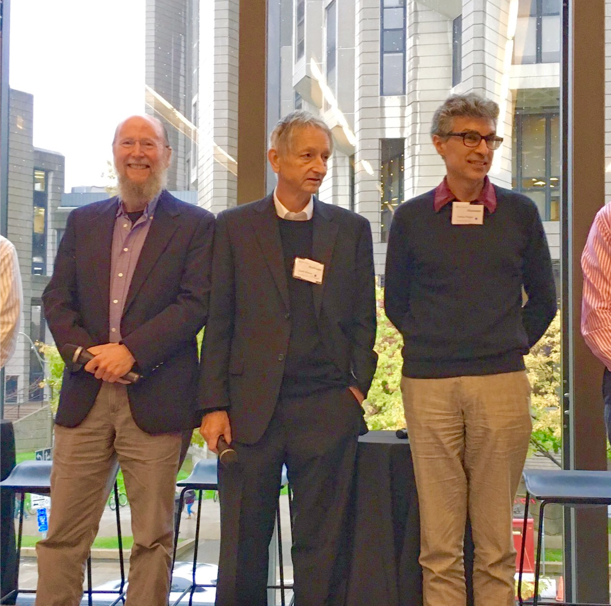

# Introduction to PyTorch

{ width=500px }

요즈음의 우리와 같은 딥러닝 연구자 및 개발자들은 파이토치와 같은 딥러닝 프레임워크를 통해서 쉽게 딥러닝을 구현하고 연구할 수 있게 되었습니다. 이 프레임워크들은 대부분 미분을 자동으로 수행하여, 그래디언트 기반 최적화를 편리하게 이용할 수 있게 합니다. 딥러닝 전문가가 되고자 한다면, 이러한 프레임워크들을 자유자재로 다룰 수 있어야 할 것 입니다. 아쉽게도 이 책은 자연어처리에 대해 깊이있게 다루고자 하고, 파이토치와 기본 딥러닝을 다루고자 하는 책이 아니기 때문에, 자세한 파이토치의 사용 방법은 다루지 않고자 합니다. 따라서 이번 챕터에서는 간단한 파이토치에 대한 소개와 짧은 예제에 대해서 다룹니다.
