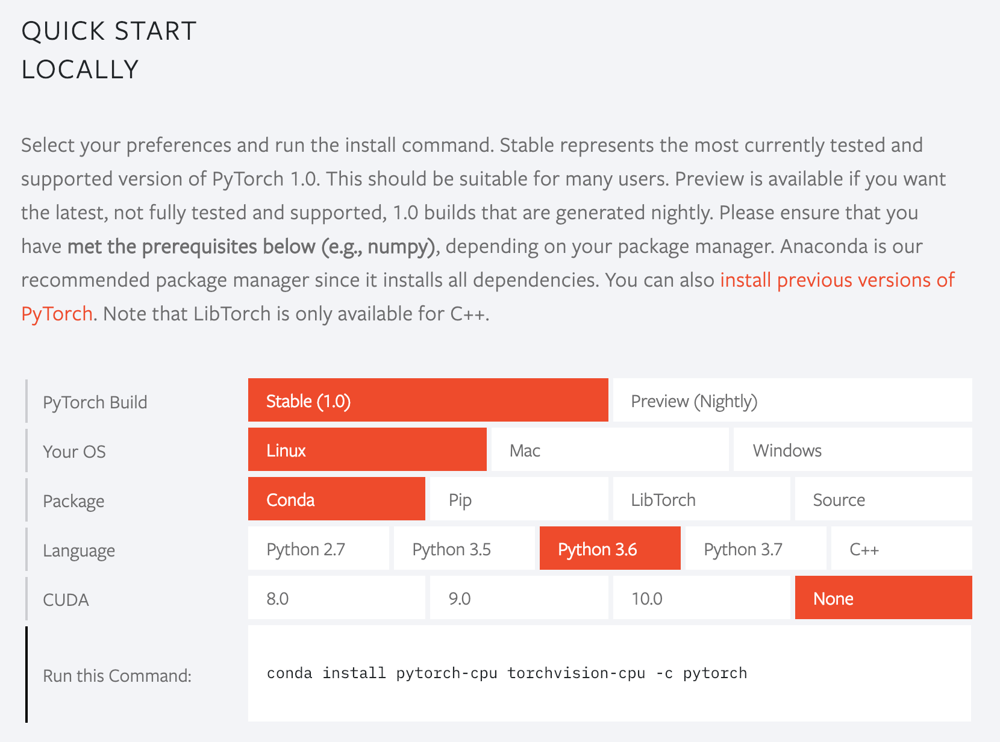

# 설치 방법

리눅스(우분투) 기준으로 파이토치를 설치하고 실행하는 것을 살펴 보도록 하겠습니다.

## 아나콘다(Anaconda)

대부분 리눅스를 설치하면 기본적으로 파이썬이 설치되어 있는 것을 볼 수 있습니다. 대부분의 경우 아래와 같은 경로에 설치되어 있습니다.

```bash
$ sudo which python
/usr/bin/python
```

이 경우에는 시스템 전체 사용자들이 공통으로 사용하는 파이썬이기 때문에 아나콘다를 설치하여 해당 사용자만을 위한 python을 설치하고, 그 위에 여러 패키지를 자유롭게 설치 또는 제거 하는 것이 편리합니다. 또한, 경우에 따라 발생할 수 있는 권한 문제에서도 훨씬 자유롭습니다. 따라서 아나콘다를 사용하는 것을 권장합니다. 아나콘다는 아래의 주소에서 다운로드 받을 수 있습니다.

> [https://www.anaconda.com/download/\#linux](https://www.anaconda.com/download/#linux)

또한 많은 패키지가 기본으로 설치되는 아나콘다와 달리 미니콘다(Miniconda)를 설치하여 훨씬 더 가볍게 사용할 수도 있습니다.

### 2.7 vs 3.x

파이썬을 처음 접하는 많은 사용자들이 2.7과 3.x 사이에서 어떤 것을 택해야 할 지 고민하게 됩니다. 처음 python을 접하는 사람들은 3.x을 택하는 것을 추천합니다. 특히, 이 책에서 다루는 자연어처리와 관련된 텍스트 인코딩의 default값이 UTF-8로 되어 있어서 훨씬 더 편리하게 사용할 수 있습니다. 따라서, 시간을 아끼기 위해서는 3.x으로 시작할 것을 권장합니다. 다만, 2.7에서 작성된 코드를 3.x에서 사용하기 위해서는 코드를 약간 수정해야 할 필요성이 있습니다. (참고로, 대부분의 경우 3.x에서 작성한 코드는 2.7에서 잘 돌아갈 가능성이 훨씬 더 높습니다.)

## 파이토치 설치

파이토치는 리눅스, 맥, 윈도우즈를 모두 공식 지원 합니다. 올바른 최신 버전의 파이토치를 설치하기 위해서는 파이토치 홈페이지(https://pytorch.org/)를 접속하면 친절한 설치 안내를 받을 수 있습니다.



## 왜 파이토치 인가?


텐서플로우(Tensorflow)를 개발한 구글에 맞서, 파이토치는 페이스북의 주도하에 개발이 진행되고 있습니다. 자체 딥러닝 전용 하드웨어인 TPU를 가지고 있어 상대적으로 엔비디아 GPU에서 보다 자유로운 구글과 달리, 파이토치는 엔비디아도 참여한 프로젝트이기 때문에 엔비디아의 CUDA GPU에 더욱 최적화 되어 있습니다. 실제로도, 엔비디아에서도 적극 파이토치를 권장하는 모습이며, 특히 자연어처리 분야에서는 텐서플로우에 비하여 적극 권장하기도 합니다. 하지만 일찌감치 텐서플로우를 내세운 구글과 달리, 파이토치는 그에비해 훨씬 뒤늦게 딥러닝 프레임워크 개발에 뛰어들었기 때문에, 상대적으로 훨씬 적은 유저풀을 갖고 있습니다.

](../assets/03-02-03.png)

하지만, 파이토치가 가진 장점과 매력 때문에, 산업계보다는 학계에서 적극적으로 파이토치의 사용을 늘려가고 있는 추세이며, 이러한 트렌드는 산업계에도 점점 퍼져나가고 있습니다. 따라서, 파이토치는 논문을 구현한 수많은 github 소스코드와 pretrain된 모델 웨이트가 있는 것이 장점이긴 하지만, 파이토치도 빠르게 따라잡고 있는 추세 입니다. <comment> 물론 아직은 텐서플로우를 넘기에는 부족합니다. </comment>

](../assets/03-02-04.png)

테슬라의 AI 수장인 Karpathy는 자신의 트위터에서 파이토치를 찬양하였습니다. 그럼 무엇이 그를 찬양하도록 만들었는지 좀 더 알아보도록 하겠습니다. 파이토치는 주류 딥러닝 프레임워크 중에서 가장 늦게 나온 편인 만큼, 그동안 여러 프레임워크의 장점을 모두 갖고 있습니다.

* Python First, 깔끔한 코드
* 먼저 텐서플로우와 달리 "Python First"를 표방한 파이토치는 텐서(tensor) 연산과 같이 속도에 크리티컬 한 부분을 제외하고는 대부분의 모듈이 파이썬으로 짜여 있습니다. 따라서 코드가 깔끔합니다. 더욱이, 텐서플로우는 버전업이 빠르며 버전에 따른 파편화가 심하지만, 파이토치는 상대적으로 매우 적은 파편화가 발생하였습니다.
* NumPy/SciPy과 뛰어난 호환성
* Theano/Keras의 장점인 NumPy와의 호환성이 파이토치에도 그대로 들어왔습니다. 따라서 기존 numpy를 사용하던 사용자들은 처음 파이토치를 접하더라도 큰 위화감 없이 그대로 적응할 수 있습니다.
* Autograd
* 단지 값을 앞으로 피드포워드(feed-forward)하며 차례차례 계산 한 것일 뿐인데, backward() 호출 한번에 그래디언트를 구할 수 있습니다.
* Dynamic Graph
* 텐서플로우의 경우 세션(session)이라는 개념이 있어서, 세션이 시작되면 모델 아키텍처등의 연산 그래프 구조의 수정이 어려웠습니다. 하지만, 파이토치는 연산과 동시에 그래프가 생성되기 때문에 매우 자유롭습니다.
