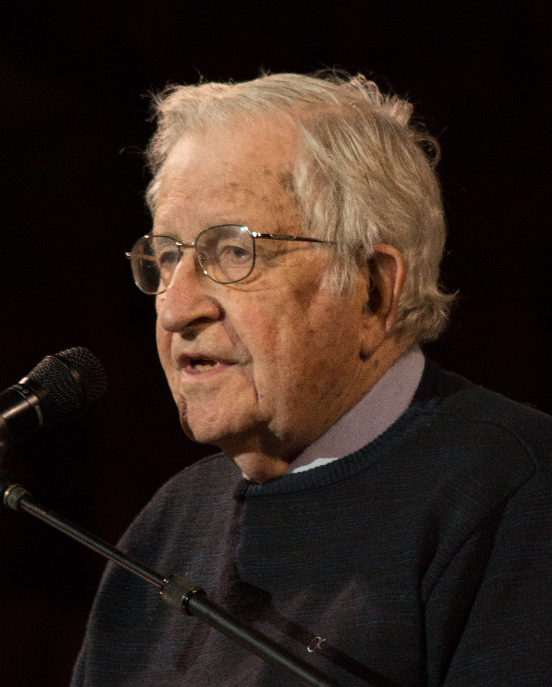

# Preprocessing

{ width=400px }

모두들 새로운 딥러닝 또는 자연어처리 알고리즘이 나오면 관심을 갖고 열광하곤 합니다. 하지만, 사실 전처리 과정이야말로 자연어처리에서 가장 덜 주목받지만 가장 중요한 부분이라고 볼 수 있습니다. 아쉽게도 시중의 도서들이나, 논문들은 그 전처리 방법에 대해서는 자세히 다루고 있지 않습니다. 또한 최신의 기술들은 논문들과 소스코드들이 공개 되어 모두가 따라하고 구현할 수 있는 반면에, 자세한 전처리 방법이나 노하우는 그만큼 공유되고 있지 않은 실정입니다. 전처리 과정이 기계적이고 지루하기 때문일 수도 있습니다. 하지만 전처리는 다루고자 하는 문제에 따라 다르고, 언어에 따라 다르게 적용 됩니다. 결국 이러한 자연어처리 전처리는 경험과 연륜이 매우 중요 합니다. 이번 챕터에서는 자연어처리를 위한 전처리에 대해 다루고자 합니다.
