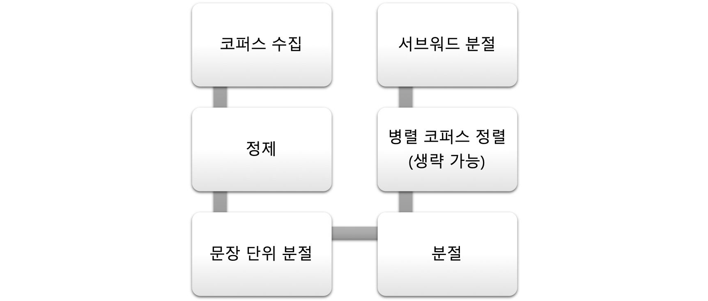

# 전처리 (Preprocessing)

자연어처리 분야에서 전처리는 매우 중요합니다. 사실 어떻게 보면 이미지를 다루는 영상처리(computer vision)나 눈에 보이지 않는 신호를 다루는 오디오 또는 음성 분야에 비하면 데이터의 성격이 다루기 쉬워 보일 수 있습니다. 하지만, 오히려 discrete한 심볼로 이루어져 있기 때문에 continuous한 값들로 이루어진 다른 데이터의 형태에 비해 훨씬 더 정제의 중요성이 강조됩니다. 예를 들어 이미지는 $1,000\times1,000$ 이미지의 픽셀 하나의 색깔이 살짝 바뀌어도 그 이미지의 의미는 변화가 없다고 할 수 있지만, 문장에서의 단어 하나의 변화는 문장의 뉘앙스를 바꿀 수도 있고, 아예 문장의 의미 자체를 완전히 다른 것으로 만들어 버릴 수도 있습니다. 따라서 자연어처리 분야에서의 전처리는 매우 중요한 의미를 가지고 있습니다.

## 코퍼스(Corpus)란?

코퍼스(corpus)는 말뭉치라고 불리우기도 합니다. <comment> 복수 표현은 corpora </comment> 보통 문장은 여러 단어들로 이루어져 있고, 이러한 문장들의 집합을 코퍼스라고 합니다. 자연어처리 분야의 머신러닝을 수행하기 위해서는 훈련 데이터가 필요한데 보통 이런 다수의 문장들로 구성된 코퍼스가 필요합니다.

한가지 언어로 구성된 코퍼스는 monolingual 코퍼스라고 부르며, 두 개의 언어로 구성된 코퍼스는 bilingual 코퍼스라고 부릅니다. 더 많은 숫자의 언어로 구성되면 multilingual 코퍼스가 됩니다. 이때, 예를 들어 아래와 같이 언어간에 쌍으로 구성된 코퍼스를 병렬(parallel) 코퍼스라고 부릅니다.

|English|한글|
|-|-|
|I love to go to school.|나는 학교에 가는 것을 좋아한다.|
|I am a doctor.|나는 의사 입니다.|

이러한 코퍼스가 많을 수록, 오류가 없을 수록 우리는 자연어처리 머신러닝을 더욱 정교하게 할 수 있고, 모델의 정확도를 높힐 수 있습니다. 우리은 이 챕터에서 코퍼스를 수집하고 정제하여 효율성을 높힐 수 있도록하는 전처리 방법에 대해서 다루어 보도록 하겠습니다.

## 전처리 과정 개요

자연어처리 분야에서의 전처리는 목적에 따라 약간씩 다르지만 대체로 아래와 같이 비슷한 과정을 지니고 있습니다. 이번 챕터에서는 이러한 과정에 대해서 다루고 넘어갈 것입니다.

1. 코퍼스(corpus) 수집
1. 코퍼스(corpus) 정제(normalization)
    1. 정제(cleaning)
    1. 문장 단위 분절(Sentence Tokenization)
    1. 분절(Tokenization)
    1. 서브워드 분절(Subword segmentation)
