# 정제

정제(normalization)는 텍스트를 사용하기에 앞서 필수적인 과정입니다. 원하는 업무와 문제에 따라, 또는 응용분야에 따라서 필요한 정제의 수준 또는 깊이가 다를 수 있습니다. 예를 들어 음성인식을 위한 언어모델의 경우에는 사람의 음성을 그대로 받아적어야 하기 때문에, 괄호 또는 별표와 같은 기호나 특수문자들은 포함되어서는 안됩니다. 또한, 전화번호나 이메일 주소, 신용카드 번호와 같은 개인정보나 민감한 정보들은 제거되거나 변조된 채로 모델링 되야 할 수도 있습니다. 각 경우에 따라서 필요한 형태를 얻어내기 위해서는 효과적인 정제 방법을 사용해야 합니다.

## 전각문자 제거

대부분의 중국어와 일본어 문서, 그리고 일부 한국어 문서들은 숫자, 영자, 기호가 전각문자로 되어 있는 경우가 있습니다. 이러한 경우에 일반적으로 사용되는 반각문자로 변환해 주는 작업이 필요합니다. 대표적으로 반각/전각문자로 혼용되는 문자들은 아래와 같습니다. 아래의 문자들을 각 문자에 해당하는 반각문자로 바꾸어주는 작업이 필요합니다.

```
！”＃＄％＆’（）＊＋，－．／０１２３４５６７８９：；＜＝＞？＠ＡＢＣＤＥＦＧＨＩＪＫＬＭＮＯＰＱＲＳＴＵＶＷＸＹＺ［＼］＾＿｀ａｂｃｄｅｆｇｈｉｊｋｌｍｎｏｐｑｒｓｔｕｖｗｘｙｚ｛｜｝～
```

## 대소문자 통일

일부 영어 코퍼스에서는 또는 코퍼스마다 약자 등에서의 대소문자 표현이 통일되지 않은 경우가 있습니다. 예를 들어 New York City의 줄임말(약자)인 NYC의 경우에 아래와 같은 다양한 표현이 가능합니다.

|번호|New York City|
|-|-|
|1|NYC|
|2|nyc|
|3|N.Y.C.|
|4|N.Y.C|

따라서 이러한 다양한 표현을 일원화 시켜주는 것은 한개의 의미를 지니는 여러 단어의 형태를 하나로 통일시켜 줌으로써, 희소성(Sparsity)을 감소시키는 효과를 거둘 수 있습니다. 하지만, 딥러닝의 시대에 접어들어 워드 임베딩을 통한 효율적인 표현이 가능해지면서, 다양한 단어들을 비슷한 값의 벡터로 나타낼 수 있게 되어, 대소문자 통일과 같은 작은 문제(전체 코퍼스에서 차지하는 비율이 적은 문제)에 대한 해결 필요성이 줄어들었습니다.

## 정규식(regular expression)을 사용한 정제

또한, 크롤링을 통해 얻어낸 다량의 코퍼스는 보통 특수문자, 기호 등에 의해서 노이즈(noise)가 섞여 있는 경우가 많습니다. 또한, 웹사이트의 성격에 따라 일정한 패턴을 띄고 있는 경우도 많습니다. 이러한 노이즈들을 효율적으로 감지하고 없애기 위해서는 정규식의 사용은 필수적 입니다. 따라서, 이번 섹션은 정규식의 사용방법에 대해서 살펴 봅니다.

### [ ]의 사용

아래의 정규식은 마치 '2 or 3 or 4 or 5 or c or d or e'와 같은 의미를 냅니다.

```
[2345cde]
```

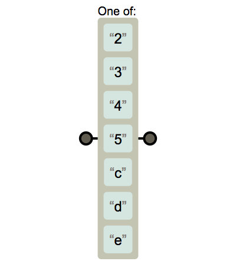

또는 아래와 같이 표현 할 수도 있습니다.

```
(2|3|4|5|c|d|e)
```

### -의 사용

사실 위의 정규식에서 연속된 숫자 또는 알파벳임에도 불구하고 하나씩 모두 적는것은 매우 비효율적임을 느낄 수 있습니다. 따라서 이때 '-'를 사용하여 연속 숫자 또는 알파벳 등을 표현할 수 있습니다. 아래의 정규식은 좀 전의 정규식과 같은 표현 입니다.

```
[2-5c-e]
```
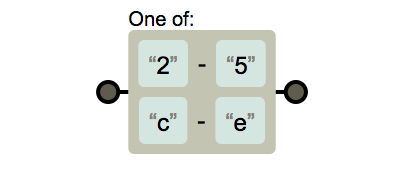

### [^ ]의 사용

Not을 기호 '^'를 써서 표현할 수 있습니다. 아래의 정규식은 2부터 5, c부터 e를 제외한 한글자를 의미 합니다.

```
[^2-5c-e]
```

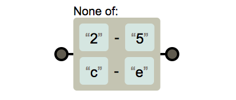

### ( )의 사용

괄호의 사용을 통해 그룹을 만들 수 있습니다. 이때 만들어지는 그룹은 나중에 매우 유용하게 사용 됩니다.

```
(x)(yz)
```
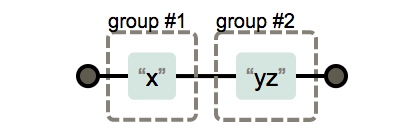

### |의 사용

or를 의미 합니다.

```
(x|y)
```
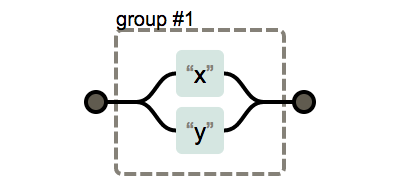

### ?, *, +의 사용

?는 앞의 수식하는 부분이 나타나지 않거나 한번만 나타날 경우 사용 합니다.

```
x?
```


+는 앞의 수식하는 부분이 한 번 이상 나타날 경우 사용 합니다.

```
x+
```


*는 앞의 수식하는 부분이 나타나지 않거나 여러번 나타날 경우 사용 합니다.

```
x*
```
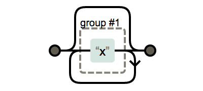

### {n}, {n,}, {n,m}의 사용

좀 전의 반복 여부에 대한 정규식도 매우 유용하지만, 정확하게 반복 횟수의 범위를 알고 있다면 아래와 같은 방법을 사용하는 것이 더 좋습니다.

```
x{n}
```
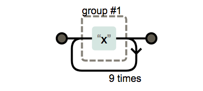
```
x{n,}
```
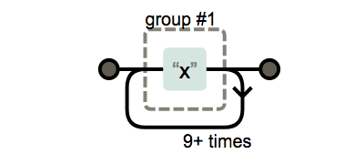
```
x{n,m}
```
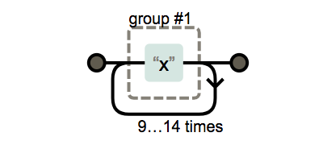

### . 의 사용

'.'은 매우 강력한 표현 입니다. 그 어떤 글자도 '.'에 포함 될 수 있습니다. 따라서 그만큼 유의해서 사용해야 합니다.

```
.
```


### ^와 $의 사용

'\['과 '\]'내에 포함되지 않은 '^'은 라인의 시작을 의미 합니다. 또한 '$'은 라인의 종료를 의미 합니다.

```
^x$
```
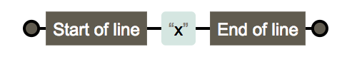

### 지정문자의 사용

이외에도 지정문자를 사용하여 비슷한 유형의 글자들을 표현할 수 있습니다.

|Meta Characters|Description|
|-|-|
|\\s|공백문자(white space)|
|\\S|공백문자를 제외한 모든 문자|
|\\w|alphanumeric(알파벳 + 숫자) + '_' ([A-Za-z0-9_]와 같음)|
|\\W|non-alphanumeric 문자 '_'도 제외 ([^A-Za-z0-9_]와 같음)|
|\\d|숫자 ([0-9]와 같음)|
|\\D|숫자를 제외한 모든 문자 ([^0-9]와 같음)|

### 예제

실제 예를 들어 보겠습니다. 자연어처리 문제를 풀고 있는 중에, 문서의 마지막 줄에 종종 아래와 같은 개인의 전화번호 정보가 포함되어 있는 문서를 데이터셋으로 사용하려 할 때, 해당 정보를 제외하고 사용하고 싶다고 가정 해 보겠습니다.

> Hello Ki,
> I would like to introduce regular expression in this section.
> ~~
> Thank you!
> Sincerely,
> **Ki: +82-10-1234-5678**

무턱대고 마지막 줄을 지우기에는 마지막 줄에 전화번호 정보가 없는 경우도 많기 때문에 선택적으로 지워야 할 것 같습니다. 따라서 데이터를 쭈욱 흝어가며 살펴보니, 마지막 줄은 아래와 같은 규칙을 따르는 것 같습니다.

* 이름이 전화번호 앞에 나올 수도 있다.
* 이름 뒤에는 콜론(:)이 나올 수도 있다.
* 콜론 앞/뒤로는 공백(탭 포함)이 다수가 존재할 수도 있다.
* 전화번호는 국가번호를 포함할 수도 있다.
* 국가번호는 최대 3자리이다.
* 국가번호의 앞에는 '+'가 붙을 수도 있다.
* 전화번호 사이에 '-'가 들어갈 수도 있다.
* 전화번호는 빈칸이 없이 표현 된다.
* 전화번호의 맨 앞과 지역번호(또는 010)의 다음에는 괄호가 들어갈 수도 있다.
* 괄호는 한쪽만 나올 수도 있다.
* 지역번호 자리의 맨 처음 나오는 0은 빠질 수도 있다. 즉, 2자리가 될 수도 있다.
* 지역번호 다음 번호 그룹은 3에서 4자리 숫자이다.
* 마지막은 항상 4자리 숫자이다.

위의 규칙을 따르는 정규식을 표현하면 아래와 같습니다.

```regex
([\w]+\s*:?\s*)?\(?\+?([0-9]{1,3})?\-?[0-9]{2,3}(\)|\-)?[0-9]{3,4}\-?[0-9]{4}
```

위의 수식을 그림으로 표현하면 아래와 같습니다.

](../assets/04-03-14.png)

### 파이썬에서 정규식 사용하기

파이썬에서도 정규식을 사용하여 작업을 수행할 수 있습니다. 원하는 패턴을 포함한 문자열을 찾아내거나, 문자열 내에서 원하는 부분을 치환할 때 매우 유용합니다.

```python
>>> import re
>>> regex = r"([\w]+\s*:?\s*)?\(?\+?([0-9]{1,3})?\-?[0-9]{2,3}(\)|\-)?[0-9]{3,4}\-?[0-9]{4}"
>>> x = "Ki: +82-10-9420-4104"
>>> re.sub(regex, "REMOVED", x)
'REMOVED'
>>> x = "CONTENT jiu 02)9420-4104"
>>> re.sub(regex, "REMOVED", x)
'CONTENT REMOVED'
```

### 치환자의 사용

이제까지 다룬 정규식 표현만으로도 많은 문제를 해결 할 수 있지만, 아직 2% 부족함이 남아 있습니다. 예를 들어 아래와 같은 경우를 다루어 보겠습니다.

> **알파벳(소문자) 사이에 있는 숫자를 제거하라.**
> abcdefg
> 12345
> ab12
> a1bc2d
> 12ab
> a1b
> 1a2
> a1
> 1a
> hijklmnop

만약 그냥 [0-9]+으로 숫자를 찾아서 없애면 두번째 줄의 숫자만 있는 경우와 숫자가 가장자리에 있는 경우도 사라지게 됩니다. 그럼 어떻게 해야 할까요? 이때 유용한 방법이 치환자를 사용하는 것 입니다.

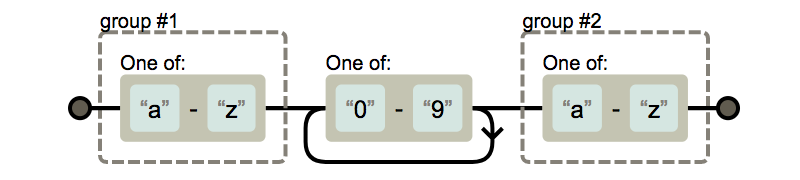

괄호로 묶인 부분은 그룹(group)으로 지정이 되고, 바뀔 문자열 내에서 역슬래시(\\)와 함께 숫자로 가리킬 수 있습니다. 예를 들어 아래와 같이 구현 할 수 있습니다.

```python
x = '''abcdefg
12345
ab12
a1bc2d
12ab
a1b
1a2
a1
1a
hijklmnop'''

regex = r'([a-z])[0-9]+([a-z])'
to = r'\1\2'

y = '\n'.join([re.sub(regex, to, x_i) for x_i in x.split('\n')])
```

위의 방법은 굳이 파이썬과 같은 프로그래밍/스크립팅 언어가 아니더라도 sublime text와 같이 지원되는 텍스트 에디터들이 있으니 에디터 상에서의 정제를 할 때에도 유용하게 사용할 수 있습니다. 치환자를 사용하게 되면, 기존의 코딩이 필요한 일들도 간단한 수준에서는 정규식으로 정제가 가능해져 매우 효율적으로 정제 작업을 수행할 수 있게 됩니다.
