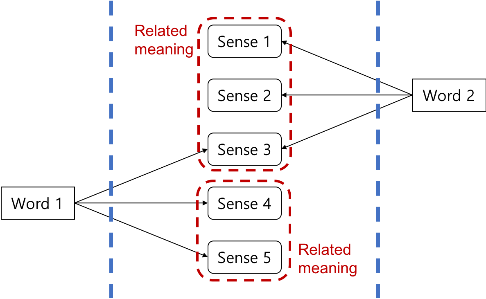

# 서문

이번 챕터에서는 자연어처리 분야에서 가장 기초이자 근간이 되면서도 가장 어려운 문제인 단어의 의미(Word Sense)와 의미의 유사성(similarity), 모호성(ambiguity)에 대해 다루어 볼까 합니다. 단어는 겉 형태 내에 의미를 갖고 있습니다. 따라서 하나의 형태에 여러 의미가 있기도 하고, 다른 형태의 단어가 같은 의미를 공유하기도 합니다. 게다가 사람의 언어는 마치 생명체 처럼 효율성을 추구하도록 진화하여 왔기 때문에, 모호성이 굉장히 두드러집니다. 따라서 언어의 가장 기본을 이루는 단어도 모호성의 문제로 인해, 컴퓨터가 인간의 언어를 이해하고 처리함에 있어 굉장히 큰 문제로 작용 합니다. 챕터 후반부의 단어 중의성 해소로 본격적으로 나아가기 전에 자연어처리에서 단어와 의미와의 관계를 좀 더 짚고 넘어가도록 하겠습니다.

## 단어와 의미의 관계

단어는 겉으로 보이는 형태(lemma) 속에 여러 의미들을 담고 있습니다. 따라서 우리가 단어를 소리내어 말하거나 글자로 써내려 갈 때는 겉의 형태를 사용하지만, 각각 상황에 따라 다른 의미들이 사용되는 경우가 많습니다. 대부분 사람은 주변 정보(context)에 따라서 그 숨겨진 의미를 파악하고 이해합니다. 하지만 때로는 주변 정보의 부족함으로 인한 모호성이 증가하거나, (자신의 과거 기억 등으로 인하여) 주변 정보를 다르게 해석하는 경우에는, 사람 조차도 원래의 의미를 잘못 이해하는 경우도 종종 발생합니다.

아래는 [국립국어원](https://krdict.korean.go.kr/)에서 '차'라는 단어에 대해서 검색 한 결과 입니다.

|연관 의미|세부 의미|풀이|
|-|-|-|
|차#1|차1-1|좋은 향기나 맛이 있는 식물의 잎이나 뿌리, 열매 등을 달이거나 우려서 만든 마실 것.|
|차#2|차2-1|바퀴가 달려 있어 사람이나 짐을 실어 나르는 기관.|
||차2-2|사람이나 물건을 차에 실어 그 분량을 세는 단위.|
||차2-3|장기의 말 중에서 ‘車’ 자를 새긴 말.|
|차#3|차3-1|둘 이상을 비교했을 때 서로 다르게 나타나는 수준이나 정도.|
||차3-2|어떤 수나 식에서 다른 수나 식을 뺀 나머지.|
|차#4|차4-1|어떤 일의 차례나 횟수를 나타내는 말.|
||차4-2|어떠한 일을 하던 기회나 순간.|
||차4-3|일정한 주기나 기간이 지난 해당 시기를 나타내는 말.|

'차' 자체에도 크게 4가지의 의미로 나누어지고, 해당 의미들은 다시 세부적으로 다른 의미를 가집니다. 좀 더 이해를 돕기 위해서 이것을 그림으로 나타내면 아래와 같습니다.

단어는 형태는 공유하지만 서로 다른 뜻을 가진 의미들로 구성되어 있을 수 있습니다. 이 의미들은 경우에 따라서 비슷한 의미들이기도 하고, 전혀 다른 의미일 수도 있습니다. 또한 어떤 의미는 다른 단어에서도 사용 될 수 있습니다. 사람은 머릿속으로는 대부분 파란선 안쪽의 '의미'를 받아들이지만, 사용할 때에는 파란선 바깥 쪽의 '단어' 매개체(media)로 사용하여 그 의미를 전달합니다.

이처럼 하나의 형태의 단어에 여러 의미가 포함되어 생기는 중의성 문제는 자연어처리에서 매우 중요한 위치를 차지 합니다. 특히, 이후에 우리가 다룰 기계번역에서는 단어의 의미에 따라서 해당 번역 단어의 형태가 완전히 바뀌기 때문에 매우 중요합니다. 결국 인공지능이란 사람을 돕거나 사람처럼 동작해야 하기 때문에, 바깥의 "단어"라는 매개체를 이해하여 안쪽의 "의미"로 내부적으로 (명시적이든 명시적이지 않든) 변환하여 사용해야 할 것 입니다.

## 동형이의어(Homonym)와 다의어(Polysemy)

위에서 다루었듯이, 같은 형태의 단어이지만 다른 뜻을 가질 수 있습니다. 우리는 이것을 동형이의어라고 부릅니다. 동형이의어와 아래에서 다룰 다의어와 다른 점은 한 형태의 단어 내에 여러 의미를 지니지만, 그 의미들은 비슷한 뜻을 갖고 있다는 점 입니다. 즉, 다의어는 아예 어원이 다른 의미들이 같은 형태를 띄고 있는 단어를 이릅니다.

|종류|단어 형태|의미1|의미2|
|-|-|-|-|
|동형이의어 (Homonym)|강남역|지하철역사|역 주변 상권|
|다의어 (Polysemy)|차|마시는 차(茶, tea)|달리는 차(車, car)|

사용 빈도가 높은 대부분의 단어들은 의미를 한가지만 갖기보단, 동형이의어 또는 다의어의 가능성이 높습니다. 이렇게 여러 뜻을 가진 단어의 경우에는 자연어처리를 하고자 할 때, 문제를 어렵게 만들곤 합니다. 특히, 다의어의 경우에는 완전히 단어의 의미가 다를 수 있기 때문에, 문장 자체를 다르게 이해하고 처리 할 가능성도 있습니다.

따라서 이렇게 한 형태 내에서 여러 의미를 지니는 동형이의어 또는 다의어의 경우에는 단어 중의성 해소(Word Sense Disambiguation, WSD)라는 방법을 통해, 단어의 의미를 좀 더 명확히 하는 과정이 필요할 수 있습니다. 특히, 딥러닝 이전의 전통적인 자연어처리 방식에서는 여러 서브 모듈들이 합쳐져 하나의 큰 문제를 해결하는 경우가 많았기 때문에, 서브 모듈들의 과정 중에 단어 중의성 해소 모듈을 포함하여 같이 처리하기도 하였습니다. 이때, 주로 단어의 중의성을 해소하기 위해, 주변 문맥을 통해 원래 단어의 의미를 파악하는 방법을 가장 많이 사용 합니다.

다행히 딥러닝의 시대에 들어서는 end-to-end 학습 방법이 선호되고, 자연어처리 분야에서 주로 사용되는 딥러닝 모델 구조가 recurrent 뉴럴 네트워크가 되면서, 단어 중의성 해소에 대한 필요도가 낮아지게 되었습니다. 하지만, 여전히 단어의 모호한 의미로 인해서 문제 해결이 어려운 경우가 많이 남아 있으며, 아직까지 풀지 못한 숙제 중 하나 입니다.

## 동의어(Synonyms)

그럼 의미가 다른 단어에 대해서 다루었으니, 의미가 같은 경우에 대해서 다루어 보고자 합니다. 단어는 그 의미가 다양하게 구성되어 있는 만큼, 다른 형태의 단어와 의미가 겹치는 경우도 발생합니다. 이렇게 다른 형태이지만 의미가 같은 단어를 동의어(Synonym)라고 합니다. 물론 그 의미라고 하는 것은 마치 형태처럼 딱 떨어지는 discrete한 것이 아니기 때문에, 완벽하게 똑같지 않을 수도 있습니다. (하지만 어느정도 비슷할 경우에 동의어라고 칭한다라고 하는 일종의 컨센서스가 있을 것 입니다.) 그리고 이런 동의어가 여러개 존재 할 수 있을텐데, 이런 동의어의 집합을 Synset이라고 부릅니다. 따라서 아래와 같이 하나의 단어 형태에 대해서 여러 의미가 있을 것이고, 각 의미 별로 동의어 집합이 존재 할 것 입니다.

|형태|의미|동의어 집합(Synset)|
|-|-|-|
|home|home#1|place#7|
|home|home#2|dwelling#1, domicile#2, abode#2, habitation#2,  ...|
|home|home#3||
|home|home#4|home plate#1, home base#1, plate#1|
|home|home#5|base#14|
||...||
|place|place#7|home#1|
|place|place#8|position#6, post#3, berth#1, office#7, spot#8, billet#3, place#8|
||...||

## 어휘 분류(Taxonomy): 상위어(Hypernym)와 하위어(Hyponym)

사실 사람이 사용하는 단어가 나타내는 것은 하나의 추상적 개념이라고 할 수 있습니다. 따라서 그 개념들을 포함하는 상위 개념 또는 하위 개념이 존재할 수 있습니다. 이때 상위 개념을 가리키는 단어를 상위어(Hypernym)라고 하며, 하위 개념을 표현하는 단어를 하위어(Hyponym)라고 합니다.

|상위어(Hypernym)|하위어(Hyponym)|
|-|-|
|동물|포유류|
|포유류|코끼리|
|코끼리|아프리카코끼리|
|사물|전화기|
|전화기|핸드폰|
|사물|컴퓨터|
|컴퓨터|노트북|

따라서 이런 단어들의 상위 개념과 하위 개념에 따라서 단어간의 관계 구조를 계층화 할 수 있을 것 입니다. 우리는 이렇게 계층화된 단어간의 관계를 활용하면 자연어처리에 유용하게 사용할 수 있습니다. 단어간의 유사도를 구할 수 있을 것이며, 부족한 정보를 비슷한 관계의 다른 단어로부터 얻어올 수도 있을 것 입니다.

## 모호성 해소 (disambiguation)

이와 같이 사람이 쓰는 언어는 그 특성상 겉의 형태는 discrete한 심볼이지만, 내부적으로는 어떤 의미를 가지고 있습니다. 그리고 여러 의미는 하나의 형태를 공유하기도 합니다. 또한, 그 의미들은 매우 다르기도 하고, 비슷하기도 할 것 입니다. 하지만 컴퓨터가 가진 것은 텍스트 뿐이기 때문에, 그 텍스트가 내포한 진짜 의미를 파악하는 과정이 필요합니다. 내포된 의미를 이해해야 제대로 된 자연어처리를 진행 할 수 있을 것 입니다. 즉, 텍스트(단어의 겉 형태)만 가진 상태에서는 모호성(ambiguity)이 매우 높습니다. 모호성을 제거함으로써, 자연어처리의 성능을 높일 수 있을 것 입니다. 이렇게 단어가 가지는 모호성을 제거하는 과정을 단어 중의성 해소(Word Sense Disambiguation, WSD)라고 합니다.
