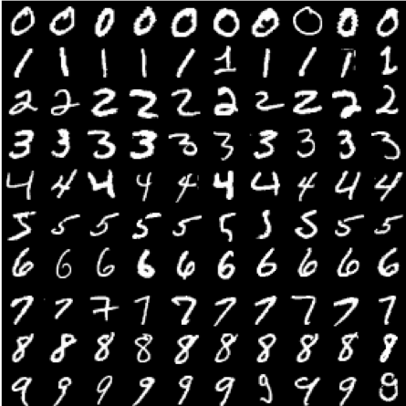

# 피쳐(Feature)

우리는 one-hot 벡터를 통해 단어를 표현(represent)하였을 때, 많은 문제가 발생하는 것을 이야기 하였습니다. 이것은 one-hot 벡터의 표현 방식이 효과적이지 않기 때문입니다. 그럼 효과적인 표현 방식이란 무엇일까요? 효과적으로 정보를 추출하고 배우기 위해서는 어떤 대상의 특징을 잘 표현해야 합니다. 피쳐(feature)는 대상을 잘 설명하는 특징을 의미 합니다. 각 피쳐들은 수치로 표현이 되며 최대한 많은 샘플들을 설명 할 수 있어야 합니다. 즉 샘플들은 수치가 다른 공통된 특징을 가집니다. 또한 피쳐로 표현된 샘플들은 최대한 다양하게 표현되는 것이 좋습니다.

예를 들어 손글자 숫자 인식 데이터셋인 MNIST에서의 피쳐를 생각해보도록 하겠습니다.

1. 굵기
1. 기울기
1. 각 위치 별 직선/곡선 여부

물론 이외에도 다양한 피쳐들이 존재할 수 있습니다. 하지만 이미 상기한 피쳐만으로도 충분히 많은 다양한 샘플들을 잘 설명할 수 있을 것 입니다. 이에 따라 각 샘플 별로 피쳐들마다 수치를 가지게 될 것 입니다. 이런 피쳐 별 수치들을 모아 벡터로 표현할 수 있습니다. 우리는 이것을 피쳐 벡터라고 합니다.

## 단어의 피쳐 벡터를 구성하기 위한 가정

그럼 자연어처리에서 단어의 피쳐 벡터는 어떻게 구성하는 것이 좋을까요? 아래와 같은 가정을 해 볼 수 있습니다.

1. 의미가 비슷한 단어라면 쓰임새가 비슷할 것
1. 쓰임새가 비슷하기 때문에, 비슷한 문장 안에서 비슷한 역할로 사용될 것
1. 따라서 함께 나타나는 단어들이 유사할 것

앞으로 우리는 단어들에 대한 피쳐를 잘 학습하고 표현하기 위한 방법들을 딥러닝 이전의 전통적인 방식에서부터 딥러닝을 활용한 방식에 이르기까지 배우도록 하겠습니다.
