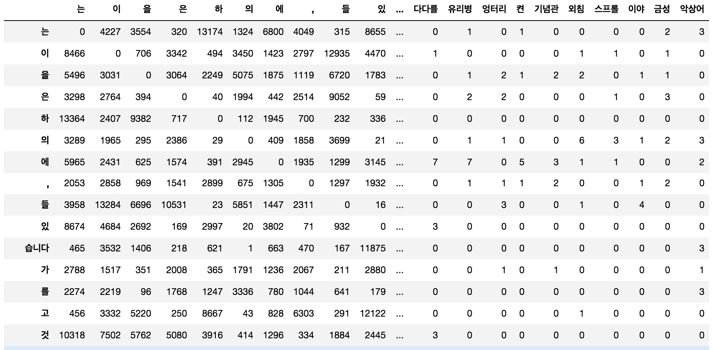
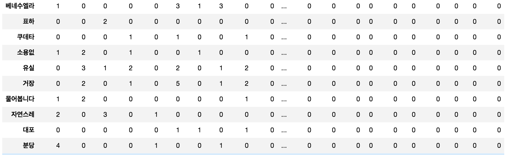
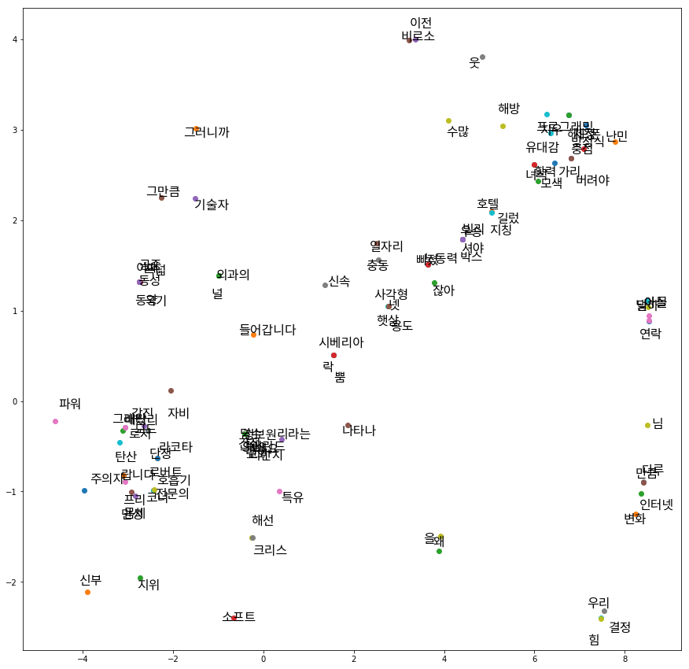

# 피쳐 벡터 만들기

## Term-Frequency 행렬 만들기

앞서 우리는 TF-IDF에 대해서 살펴 보았습니다. TF-IDF 뿐만 아니라 TF(term frequency) 또한 훌륭한 피쳐(feature)가 될 수 있습니다. 예를 들어 어떤 단어가 각 문서별로 출현한 횟수가 차원별로 구성되면, 하나의 피쳐 벡터를 이룰 수 있습니다. 물론 각 문서별 TF-IDF 자체를 사용하는 것도 좋습니다.

```python
def get_tf(docs):
    vocab = {}
    tfs = []
    for d in docs:
        vocab = get_term_frequency(d, vocab)
        tfs += [get_term_frequency(d)]

    from operator import itemgetter
    import numpy as np

    stats = []
    for word, freq in vocab.items():
        tf_v = []
        for idx in range(len(docs)):
            if tfs[idx].get(word) is not None:
                tf_v += [tfs[idx][word]]
            else:
                tf_v += [0]
        stats.append((word, freq, *tf_v))

    return pd.DataFrame(stats, columns=('word',
                                        'frequency',
                                        'doc1',
                                        'doc2',
                                        'doc3')).sort_values('frequency', ascending=False)
```

```python
>>> get_tf([doc1, doc2, doc3])
```

위의 코드를 사용하여 단어들의 각 문서별 출현 횟수(TF)를 나타내면 아래와 같습니다.

|단어 $w$ |TF $w$ |TF $w,d_1$ |TF $w,d_2$ |TF $w,d_3$ |
|-|-|-|-|-|
|는|47|15|14|18|
|을|39|8|10|21|
|이|32|8|8|16|
|은|15|6|2|7|
|가|14|1|7|6|
|여러분|12|5|6|1|
|남자|9|9|0|0|
|여자|7|5|0|2|
|차이|7|5|2|0|
|요인|6|0|6|0|
|얼마나|5|4|1|0|
|학습|5|0|4|1|
|이야기|5|0|1|4|
|결과|5|0|4|1|
|실제로|4|2|1|1|
|능력|4|3|1|0|
|시험|4|0|4|0|
|환경|4|0|4|0|
|동일|3|2|1|0|
|유형|3|0|3|0|
|유전자|3|0|3|0|
|수행|3|0|2|1|
|연구|3|0|2|1|
|유전|3|0|3|0|
|쌍둥이|3|0|3|0|

여기서 마지막 3개 컬럼(column)이 각 단어별 문서에 대한 출현 횟수를 활용한 피쳐 벡터가 될 것 입니다. 지금은 문서가 3개 밖에 없기 때문에, 사실 정확한 피쳐 벡터를 구성했다고 하기엔 무리가 있습니다. 따라서 문서가 많다면 우리는 지금보다 더 나은 피쳐 벡터를 구할 수 있을 것 입니다. 하지만 마찬가지로 문서가 너무나도 많을 경우에는 벡터의 차원이 너무 커져버릴 수 있습니다. 예를 들어 문서가 10,000개가 있다고 하면 단어 당 10,000차원의 벡터가 만들어질 것 입니다. 문제는 이 10,000차원의 벡터 대부분은 값이 없이 0으로 채워져 있을 것 입니다. 이렇게 벡터의 극히 일부분에만 의미있는 값들로 채워져 있는 벡터를 sparse(희소) 벡터라고 합니다. Sparse 벡터의 각 차원들은 사실 대부분의 경우 0일 것이기 때문에, 어떤 유의미한 통계를 얻는데 큰 장애물이 될 수 있습니다. 이처럼 희소성(sparsity) 문제는 자연어처리 분야의 고질적인 문제로 작용 합니다.

또한, 단순히 문서에서의 출현 횟수를 가지고 피쳐 벡터를 구성하였기 때문에, 많은 정보가 유실되었고, 굉장히 단순화되어 여전히 매우 정확한 피쳐 벡터를 구성하였다고 하기엔 무리가 있습니다.

### 컨텍스트 윈도우를 사용하여 공기(Co-occurrence) 정보 활용하기

함께 나타나는 단어들을 활용한 방법 입니다. 앞선 섹션에서 가정했던대로, 의미가 비슷한 단어라면 쓰임새가 비슷할 것 입니다. 또한, 쓰임새가 비슷하기 때문에, 비슷한 문장 안에서 비슷한 역할로 사용될 것이고, 따라서 함께 나타나는 단어들이 유사할 것 입니다. 이러한 관점에서 우리는 결국 함께 나타나는 단어들이 유사한 단어들이 유사한 형태의 벡터를 갖도록 해야 합니다.

함께 나타나는 단어들을 조사하기 위해서, 우리는 컨텍스트 윈도우를 사용하여 windowing을 실행 합니다. windowing이란 윈도우(window)를 움직이며 윈도우 안에 있는 유닛들의 정보를 취합하는 방법을 이릅니다. 각 단어별로 윈도우 내에 속해 있는 이웃 단어들의 출현빈도를 세어 행렬로 나타내는 것 입니다.

이 방법은 좀 전에 다룬 문서 내의 단어 출현 횟수(term frequency)를 가지고 피쳐 벡터를 구성한 방식보다 좀 더 정확하다고 할 수 있습니다. 하지만, 윈도우의 크기라는 하나의 하이퍼 파라미터가 추가되어, 사용자가 그 값을 정해주어야 합니다. 만약 윈도우의 크기가 너무 크다면, 현재 단어와 너무 관계가 없는 단어들까지 출현빈도를 세게 될 수 있습니다. 하지만, 너무 작은 윈도우 크기를 갖는다면, 관계가 있는 단어들의 출현빈도를 세지 않을 수 있습니다. 따라서, 적절한 윈도우 크기를 정하는 것이 중요 합니다. 또한, 윈도우를 문장을 벗어나서도 적용 시킬 것인지도 중요합니다. 문제에 따라 다르지만 대부분의 경우에는 윈도우를 문장 내에만 적용합니다.

파이썬 코드를 통해 아래와 같은 문장들에 대해서 우리는 windowing을 수행 할 수 있습니다.

|번호|내용|
|-|-|
|1|왜 냐고요 ?|
|2|산소 의 낭비 였 지요 .|
|3|어느 날 , 저 는 요요 를 샀 습니다 .|
|4|저 는 회사 의 가치 에 따른 가격 책정 을 돕 습니다 .|
|5|하지만 내게 매우 내부 적 인 문제 가 생겼 다 .|
|...|...|
|9995|고독 은 여러분 스스로 찾 을 수 있 는 곳 에 있 어서 다른 사람 들 에게 도 다가 갈 수 있 습니다 .|
|9996|두 번 째 로 이 발견 은 새로운 치료 방법 의 아주 분명 한 행로 를 제시 합니다 . 여기 서부터 무엇 을 해야 하 는지 는 로켓 과학자 가 아니 더라도 알 수 있 잖아요 .|
|9997|전쟁 전 에 는 시리아 도시 에서 그런 요구 들 이 완전히 무시 되 었 습니다 .|
|9998|세로 로 된 아찔 한 암석 벽 에 둘러쌓 여 있 으며 숲 에 숨겨진 은빛 폭포 도 있 죠 .|
|9999|얼마간 시간 이 지나 면 큰 소리 는 더 이상 큰 소리 가 아니 게 될 겁니다 .|
|10000|이러 한 마을 차원 의 아이디어 는 정말 훌륭 한 아이디어 입니다 .|

<!--
```python
def read(fn):
lines = []

f = open(fn, 'r')
for line in f:
if line.strip() != '':
lines += [line.strip()]
f.close()

return lines
```
-->

문장들을 입력으로 받아 주어진 윈도우 사이즈(w_size) 내에서 함께 출현한 단어들의 빈도를 세는 함수는 아래와 같습니다.

```python
from collections import defaultdict

import pandas as pd

def get_context_counts(lines, w_size=2):
    co_dict = defaultdict(int)

    for line in lines:
        words = line.split()

        for i, w in enumerate(words):
            for c in words[i - w_size:i + w_size]:
                if w != c:
                    co_dict[(w, c)] += 1

    return pd.Series(co_dict)
```

위의 함수와 앞서 TF-IDF를 위해 작성했던 get_term_frequency() 함수를 활용하여, 공기 정보를 통해 벡터를 만드는 코드 입니다.

```python
def co_occurrence(co_dict, vocab):
    data = []

    for word1 in vocab:
        row = []

        for word2 in vocab:
            try:
                count = co_dict[(word1, word2)]
            except KeyError:
                count = 0
            row.append(count)

        data.append(row)

    return pd.DataFrame(data, index=vocab, columns=vocab)
```

그리고 이 코드를 통해 얻은 결과의 일부는 아래와 같습니다. 아래의 결과에 따르면 1000개의 문장(문서)에서는 '습니다'의 컨텍스트 윈도우 내에 마침표가 3616번 등장 합니다.



앞쪽 출현빈도가 많은 단어들은 대부분 값이 잘 채워져 있는 것을 볼 수 있습니다. 하지만 뒤쪽 출현빈도가 낮은 단어들은 많은 부분이 0으로 채워져 있는 것을 볼 수 있습니다. 출현빈도가 낮은 단어들의 row로 갈 경우에는 그 문제가 더욱 심각해 집니다. 이런 sparse 벡터들이 많으면, 유사도를 구하거나 벡터간 연산을 할 때, 직교하는 경우가 많아 매우 곤란해 집니다.



위의 컨텍스트 윈도우 실행 결과 얻은 피쳐 벡터들을 tSNE를 이용하여 시각화를 수행한 모습은 아래와 같습니다. 딱히 비슷한 단어끼리 모이지 않은 것도 많지만, 운좋게 비슷한 단어끼리 붙어 있는 경우도 종종 볼 수 있습니다. 여전히 위의 벡터를 피쳐 벡터로 활용하기엔 뭔가 부족한 모습입니다.



이러한 부족함을 해결하기 위해서 다음 챕터에서는 본격적으로 차원축소를 통해 희소성(sparsity) 문제를 해결하고 단어 임베딩을 수행하는 방법에 대해서 다루도록 하겠습니다.
