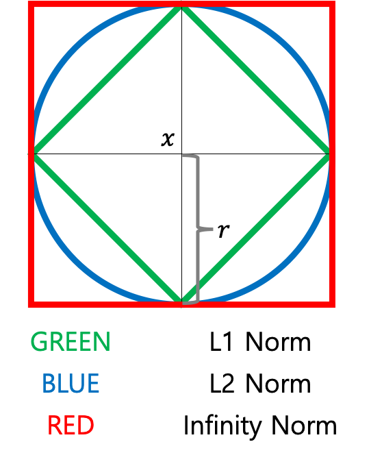

# 벡터 유사도 구하기

우리는 단어들은 겉의 discrete한 형태와 달리 내부적으로 의미를 지닌다는 것을 배웠습니다. 이에따라 단어들은 서로 유사성을 지닙니다. 데이터를 기반으로 모델의 정확도를 높여나가는 머신러닝을 자연어처리 분야에 적용하기 위해서는, 최대한 데이터를 효율적으로 활용하여 모델을 학습시키는 것이 중요합니다. 그러므로 수십년동안 자연어처리 연구자들은 단어들로부터 정확한 피쳐 벡터를 추출하여 유사한 단어(또는 단어들의 집합)로부터 더 많은 정보를 추출하여 학습에 활용하고자 하였습니다.

이를 위해 앞서 구한 피쳐 벡터를 어떻게 사용할 수 있을까요? 피쳐 벡터는 단어 사이의 유사도를 구할 때 아주 유용하게 쓸 수 있습니다. 앞서 우리는 워드넷의 그래프 구조에서 단어 사이의 거리를 측정하여, 이를 바탕으로 단어 사이의 유사도를 구하는 방법에 대해서 이야기 했습니다. 그럼 벡터 사이의 유사도 또는 거리는 어떻게 구할 수 있을까요? 이번 섹션에서는 두 벡터가 주어졌을 때, 벡터 사이의 유사도 또는 거리를 구하는 방법들에 대해 다루어 보겠습니다. 그리고 파이토치를 사용하여 해당 수식들을 직접 구현 해 보겠습니다.

```python
import torch
```

아래의 코드들은 위와 같이 모두 torch를 import하여 사용합니다.

## L1 디스턴스 (맨하탄 디스턴스)

$$\text{d}_{\text{L1}}(w,v)=\sum_{i=1}^d{|w_i-v_i|},\text{ where }w,v\in\mathbb{R}^d.$$

L1 norm을 사용한 L1 디스턴스 입니다. 이 방법은 두 벡터의 각 차원별 값의 차이의 절대값을 모두 합한 값 입니다.

```python
def get_l1_distance(x1, x2):
    return ((x1 - x2).abs()).sum()
```

위의 코드는 파이토치 텐서 $x_1$ , $x_2$ 를 입력으로 받아 L1 디스턴스를 반환 해 주는 코드 입니다.

## L2 디스턴스 (유클리디안 디스턴스)

$$\text{d}_{\text{L2}}(w,v)=\sqrt{\sum_{i=1}^d{(w_i-v_i)^2}},\text{ where }w,v\in\mathbb{R}^d.$$

우리가 가장 친숙한 거리 방법 중의 하나인 유클리디안 디스턴스 입니다. 각 차원 별 값 차이의 제곱의 합에 루트를 취한 형태 입니다.

```python
def get_l2_distance(x1, x2):
    return ((x1 - x2)**2).sum()**.5
```

L2 디스턴스를 구하기 위해 파이토치 텐서들읍 입력으로 받아 계산하는 함수의 코드는 위와 같습니다.


위의 그림은 L1 디스턴스와 L2 디스턴스의 차이를 쉽게 나타낸 그림 입니다. L2 디스턴스를 의미하는 초록색 선을 제외하고 나머지 L1 디스턴스를 나타내는 세가지 선의 길이는 모두 같습니다. L1 디스턴스의 또 다른 이름인 맨하탄 디스턴스의 그 이름답게 마치 잘 계획된 도시의 길을 지나가는 듯한 선의 형태를 나타내고 있습니다.

## 인피니티 Norm

$$d_{\infty}(w,v)=\max(|w_1-v_1|,|w_2-v_2|,\cdots,|w_d-v_d|),\text{ where }w,v\in\mathbb{R}^d$$

L1, L2 디스턴스가 있다면 $L_\infty$ 디스턴스도 있습니다. 재미있게도 infinity norm(인피니티 노름)을 이용한 디스턴스는 각 차원별 값의 차이 중 가장 큰 값을 나타냅니다. 위의 수식을 파이토치 텐서에 대해서 계산하는 코드는 아래와 같습니다.

```python
def get_infinity_distance(x1, x2):
    return ((x1 - x2).abs()).max()
```



위의 그림은 각 L1, L2, $L_\infty$ 별로 거리의 크기가 $r$ 일때 모습 입니다. 각 색깔의 선 위의 점들은 모두 해당 디스턴스 방법에서 같은 거리를 나타냅니다. 보이는바와 같이 L1 디스턴스는 각 값들을 동시에 나타냅니다. 하지만 L2, $L_\infty$ 로 갈수록 큰 값에 대해서 더욱 집중해서 디스턴스를 나타냅니다. 즉, 각 디스턴스를 최소화(minimize)하도록 최적화(optimization)를 수행한다면, L2, $L_\infty$ 로 갈수록 큰 값을 자체에 집중하여 작아지도록 최적화를 수행 합니다.

## 코사인(Cosine) 유사도

$$\begin{aligned}
\text{sim}_{\text{cos}}(w,v)&=\overbrace{\frac{w\cdot v}{|w||v|}}^{\text{dot product}}
=\overbrace{\frac{w}{|w|}}^{\text{unit vector}}\cdot\frac{v}{|v|} \\
&=\frac{\sum_{i=1}^{d}{w_iv_i}}{\sqrt{\sum_{i=1}^d{w_i^2}}\sqrt{\sum_{i=1}^d{v_i^2}}} \\
\text{where }&w,v\in\mathbb{R}^d
\end{aligned}$$

위와 같은 수식을 갖는 코사인 유사도(cosine similarity) 함수는 두 벡터 사이의 방향과 크기를 모두 고려하는 방법 입니다. 수식에서 분수의 윗변은 두 벡터 사이의 element-wise 곱을 사용하므로 벡터의 내적과 같습니다. 따라서 코사인 유사도의 결과가 $1$ 에 가까울수록 방향은 일치하고, $0$ 에 가까울수록 직교(orthogonal)이며, $-1$ 에 가까울수록 반대 방향임을 의미 합니다. 위와 같이 코사인 유사도는 크기와 방향 모두를 고려하기 때문에, 자연어처리에서 가장 널리 쓰이는 유사도 측정 방법 입니다. 하지만 수식 내 윗변의 벡터 내적 연산이나 밑변 각 벡터의 크기(L2 norm)를 구하는 연산이 비싼 편에 속합니다. 따라서 벡터 차원의 크기가 클수록 연산량이 부담이 됩니다.

희소(sparse) 벡터인 경우에 여기서 가장 큰 문제가 나타납니다. 윗변이 벡터 곱으로 표현되어 있기 때문에, 0이 들어간 차원이 많은 경우에는 해당 차원이 직교(orthogonal)하게 되어 곱의 값이 0이 되므로, 정확한 유사도 또는 거리를 반영하지 못하기 때문입니다.

코사인 유사도는 아래와 같이 파이토치 코드로 나타낼 수 있습니다.

```python
def get_cosine_similarity(x1, x2):
    return (x1 * x2).sum() / ((x1**2).sum()**.5 * (x2**2).sum()**.5)
```

## 자카드(Jaccard) 유사도

$$\begin{aligned}
\text{sim}_{\text{jaccard}}(w,v)&=\frac{|w \cap v|}{|w \cup v|} \\
&=\frac{|w \cap v|}{|w|+|v|-|w \cap v|} \\
&\approx\frac{\sum_{i=1}^d{\min(w_i,v_i)}}{\sum_{i=1}^d{\max(w_i,v_i)}} \\
\text{where }&w,v\in\mathbb{R}^d.
\end{aligned}$$

자카드 유사도(jaccard similarity)는 두 집합 간의 유사도를 구하는 방법 입니다. 수식의 윗변에는 두 집합의 교집합의 크기가 있고, 이를 밑변에서 두 집합의 합집합의 크기로 나누어 줍니다. 이때, 피쳐 벡터의 각 차원이 집합의 엘리먼트(element)가 될 것 입니다. 다만, 각 차원에서의 값이 0 또는 0이 아닌 값이 아니라, 수치 자체에 대해서 자카드 유사도를 구하고자 할 때에는, 두 번째 줄의 수식과 같이 두 벡터의 각 차원의 숫자에 대해서 $\min$ , $\max$ 연산을 통해서 계산 할 수 있습니다. 이를 파이토치 코드로 나타내면 아래와 같습니다.

```python
def get_jaccard_similarity(x1, x2):
    return torch.stack([x1, x2]).min(dim=0)[0].sum() / torch.stack([x1, x2]).max(dim=0)[0].sum()
```

## 문서(문장)간 유사도 구하기

문장의 경우에는 단어들이 모여 하나의 문장을 이룹니다. 또한, 문장들이 모여 하나의 문서를 이룹니다. 따라서 문서는 좀 더 많은 단어들의 집합으로 생각할 수 있습니다. 방금은 단어에 대한 피쳐를 수집하고 유사도를 구하였다면, 마찬가지로 문서에 대해 피쳐를 추출하여 문서간의 유사도를 구할 수 있습니다. 예를 들어 문서내의 단어들에 대해 출현 빈도(term frequency)나 TF-IDF를 구하여 벡터를 구성하고, 이를 활용하여 벡터 사이의 유사도를 구할 수도 있을 것 입니다.
