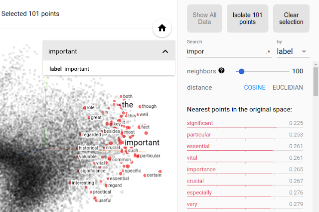

# Word2Vec 예제

이번 섹션에서는 단어 임베딩 실제 예제에 대해 다뤄 보도록 하겠습니다. 다만 이미 단어 임베딩 방법은 이미 온라인 상에 훌륭한 오픈소스가 굉장히 많이 존재하기 때문에, 기존에 잘 짜여진 공개되어 있는 오픈소스를 잘 활용하는 방법에 대해서 다뤄보도록 합니다.

## FastText를 활용한 단어 임베딩 벡터 학습

단어 임베딩 벡터를 훈련하는 기능을 제공하는 공개 라이브러리는 여러가지가 있습니다. 가장 대표적으로 사용되는 것이 Gensim과 FastText 입니다. Gensim은 공개 연혁이 상대적으로 오래되었지만, 덕분에 학습 속도가 좀 더 느린것이 단점 입니다. 대신 페이스북에서 공개한 FastText 라이브러리는 이름 그대로 좀 더 빠른 속도를 자랑합니다. 기존의 CBOW, Skip-gram 뿐만 아니라, FastText 자체의 알고리즘[[Bojanowski et al.2016](https://arxiv.org/abs/1607.04606)]이 매우 빠르기 때문입니다.

### 설치 방법

FastText는 깃허브 또는 웹사이트를 방문하여 설치 할 수 있습니다.

- 웹사이트: https://github.com/facebookresearch/fastText/
- 깃허브: https://fasttext.cc/

아래와 같이 cmake를 통해서 컴파일을 할 수도 있고,

```bash
$ git clone https://github.com/facebookresearch/fastText.git
$ cd fastText
$ mkdir build && cd build && cmake ..
$ make && make install
```

파이썬에서의 손쉬운 사용을 위하여 빌드(build)할 수도 있습니다.

```bash
$ git clone https://github.com/facebookresearch/fastText.git
$ cd fastText
$ pip install .
```

### 훈련 방법

cmake를 통해서 컴파일 할 경우, 아래와 같이 bash에서 바로 호출하여 훈련할 수 있습니다. 아래의 경우에는 'ko.tok.txt' 파일을 입력으로 받아, 코퍼스 내에서 5번 이상 출현한 단어(토큰)들을 대상으로, 100 epoch를 훈련하고, 256차원의 단어 임베딩 벡터를 훈련하여, 'ko.tok'이라는 prefix를 가진 파일들로 출력하도록 하는 것 입니다.

```bash
$ fasttext skipgram -input ko.tok.txt -output ko.tok -dim 256 -epoch 100 -minCount 5
```

위 명령의 결과 'ko.tok.vec'이라는 파일이 만들어질 것 입니다. 이 안에는 각 라인별로 단어와 임베딩 벡터가 차례대로 들어있게 됩니다. 아래는 해당 파일에서 한 라인을 임의로 발췌한 것 입니다. 보다시피 '촬영'이라는 단어에 대해서 벡터의 각 차원의 값이 들어있는 것을 알 수 있습니다.

___
촬영 -0.30049 -0.27479 -0.43818 0.056079 0.068176 -0.53987 0.41705 -0.35568 0.078862 -0.12667 -0.28311 0.5588 -0.20907 -0.16669 -0.064912 -0.3866 -0.25608 0.25637 -0.77676 -0.42474 0.21109 -0.4109 0.28652 0.41771 0.023559 0.51021 0.15914 0.093466 0.045295 0.069438 -0.036252 -0.11999 0.088997 0.014748 -0.1673 0.2476 -0.14465 0.19278 -0.08946 -0.094399 0.14175 0.13542 0.10889 0.23826 0.34676 -0.1355 -0.038017 0.51304 -0.36301 -0.32441 0.012909 0.29507 0.12083 -0.47198 0.36246 0.076359 -0.066361 -0.05295 0.022325 0.39298 0.02694 -0.068333 0.079553 -0.17073 0.066274 0.17637 0.18572 -0.45727 -0.12573 0.0085866 -0.15182 -0.23277 -0.37062 0.32833 0.28013 -0.24376 -0.063293 -0.23257 -0.16648 -0.4133 -0.021861 -0.16759 -0.049369 -0.23903 -0.027399 -0.00596 0.069234 -0.082556 0.38559 0.28921 -0.33756 0.4544 0.12822 0.039436 0.27746 -0.032044 0.2242 -0.17465 0.09278 -0.066618 0.40113 0.071247 0.13806 -0.28714 0.29182 -0.019736 -0.60646 0.21601 -0.35039 0.39005 -0.48375 -0.37153 0.54958 -0.13222 0.12656 0.11137 -0.09963 -0.11327 0.27946 0.096646 0.12036 -0.12723 -0.059219 -0.084785 -0.031961 0.15732 0.165 -0.083092 -0.23834 -0.085212 -0.44454 -0.033081 0.07863 -0.26559 -0.28083 -0.0043754 -0.46392 -0.17816 -0.39975 0.22265 -0.38893 0.1812 -0.31321 -0.15805 -0.60734 -0.3732 0.49243 -0.19759 -0.088215 0.36309 0.27838 0.071866 -0.64213 -0.38649 -0.1741 0.036854 -0.021916 0.19315 0.41876 0.0074033 -0.20591 -0.21669 -0.0084667 0.031286 0.065346 0.3166 -0.1406 -0.15883 -0.1432 -0.44998 -0.58866 -0.17928 -0.042042 -0.33279 -0.24109 0.50589 0.020337 0.44724 0.10124 -0.23082 0.19181 -0.22696 -0.34854 0.32602 -0.40675 0.29436 -0.067564 0.6188 -0.50881 -0.0016607 0.24916 -0.24403 -0.065638 0.18127 -0.098888 0.63328 0.037931 -0.19607 -0.1775 0.16986 -0.12993 0.0092868 0.30575 -0.27033 -0.53837 0.28689 -0.18733 0.062879 -0.054557 -0.037306 0.002098 0.015686 -0.083881 0.031186 -0.23759 -0.44099 -0.13307 0.18399 -0.47533 -0.27385 0.25828 -0.16529 0.082031 -0.076342 -0.32419 -0.44845 -0.24306 0.50583 0.33845 -0.083792 0.034088 0.30473 0.22714 -0.55472 -0.39668 -0.098729 -0.15137 -0.05757 0.095003 0.022835 0.3855 0.1283 -0.20362 0.0806 0.16278 -0.069562 0.19079 0.34336 -0.083464 0.34151 -0.28831 -0.13618 0.06726 0.29167 -0.45248 0.14794
___

동시에 'ko.tok.bin'이라는 파일도 만들어질 것 입니다. 이 파일은 위의 단어 임베딩 벡터를 만들어낼 수 있는 모델 웨이트 파라미터가 저장되어 있습니다. FastText를 실행하기 전에 코퍼스는 분절이 되어 있는 것을 권장 합니다. 좀 더 자세한 설명을 원한다면 아래와 같이 명령어를 입력하면 자세한 설명을 볼 수 있습니다.

```bash
$ ./fasttext skipgram
Empty input or output path.

The following arguments are mandatory:
-input              training file path
-output             output file path

The following arguments are optional:
-verbose            verbosity level [2]

The following arguments for the dictionary are optional:
-minCount           minimal number of word occurences [5]
-minCountLabel      minimal number of label occurences [0]
-wordNgrams         max length of word ngram [1]
-bucket             number of buckets [2000000]
-minn               min length of char ngram [3]
-maxn               max length of char ngram [6]
-t                  sampling threshold [0.0001]
-label              labels prefix [__label__]

The following arguments for training are optional:
-lr                 learning rate [0.05]
-lrUpdateRate       change the rate of updates for the learning rate [100]
-dim                size of word vectors [100]
-ws                 size of the context window [5]
-epoch              number of epochs [5]
-neg                number of negatives sampled [5]
-loss               loss function {ns, hs, softmax} [ns]
-thread             number of threads [12]
-pretrainedVectors  pretrained word vectors for supervised learning []
-saveOutput         whether output params should be saved [false]

The following arguments for quantization are optional:
-cutoff             number of words and ngrams to retain [0]
-retrain            whether embeddings are finetuned if a cutoff is applied [false]
-qnorm              whether the norm is quantized separately [false]
-qout               whether the classifier is quantized [false]
-dsub               size of each sub-vector [2]
```

<comment> FastText는 단어 임베딩 벡터 뿐만 아니라 추가적으로 텍스트 분류를 훈련하는 기능[[Joulin et al.2016](https://arxiv.org/abs/1607.01759)]도 갖추고 있으니 참고 바랍니다. </comment>

## 시각화

위의 방법을 통해 얻어진 벡터들은 시각화 툴을 사용하여 시각화하면 쉽게 훈련 결과에 대해서 살펴 볼 수 있습니다. 다만 아쉽게도 파이토치에서는 시각화 툴을 제공하지 않습니다. 하지만 우리는 텐서플로우에서 제공하는 텐서보드(TensorBoard)를 활용하면 쉽고 간편하게 훌륭한 시각화를 수행할 수 있습니다.



더군다나 텐서보드는 interactive한 사용자 인터페이스를 갖고 있기 때문에, 3차원으로 시각화 한 경우에도 마우스를 통해서 시점을 이리저리 옮겨가며 임베딩 벡터의 결과를 살펴볼 수 있다는 장점이 있습니다.

<!--

-->

이밖에도 텐서보드는 뉴럴네트워크 훈련에 있어서 유용한 기능들을 많이 제공하므로, 유용하게 사용할 수 있습니다. 다만 우리는 파이토치를 사용하기 때문에, 파이토치 텐서를 NumPy 값으로 변환하여 텐서보드에서 사용해야 합니다. 구글링을 해 보면 이와 관련하여 간편하게 사용할 수 있도록 도와주는 공개 코드들이 많이 있으니 참고 바랍니다.
