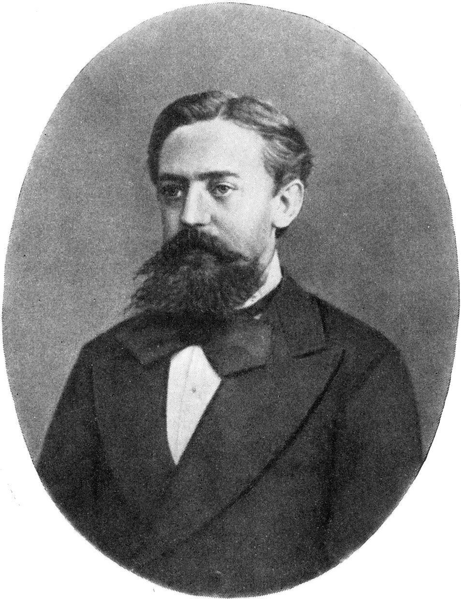

# Sequence Modeling

{ width=500px }

문장은 단어들의 순차적인 조합을 통해 만들어집니다. 따라서 문장은 단어의 순서 정보가 포함된 시퀀셜 데이터 입니다. 이러한 시퀀셜 데이터는 가변 길이의 데이터일 뿐더러, 같은 데이터 사이의 출현에 영향을 주고 받습니다. 그러므로 우리는 기존의 뉴럴네트워크(fully connected neural network) 대신에 순서 정보를 다룰 수 있는 Recurrent Neural Network(RNN)를 통해서 시퀀셜 데이터를 모델링 하고자 합니다. 하지만, RNN을 통한 훈련방식은 기존과 달라 참고해야 할 점이 많습니다. 따라서, 이번 챕터에서는 RNN에 대해서 다루고, 기본 RNN 모델의 단점을 보완하기 위한 파생 모델과 그래디언트 클리핑과 같은 기법들을 배웁니다.
