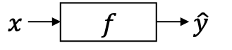
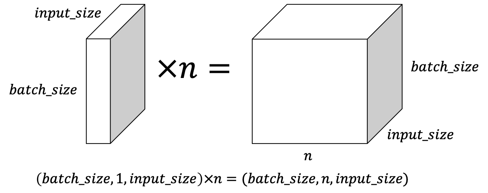

# 리커런트 뉴럴 네트워크

기존의 뉴럴 네트워크의 구조는 정해진 입력 $x$ 를 받아 $y$ 를 출력해 주는 형태였습니다.

$$y=f(x;\theta)$$

하지만 리커런트 뉴럴 네트워크(recurrent neural network, RNN)는 입력 $x_t$ 와 직전 자신의 히든 스테이트(hidden state) $h_{t-1}$ 를 참조하여 현재 자신의 상태 $h_t$ 를 결정하는 작업을 여러 time-step에 걸쳐 수행 합니다. 각 time-step별 RNN의 히든스테이트는 경우에 따라 출력값이 될 수 있습니다. 일단 추후 다른 경우에 대해서 소개하기 전까지 RNN의 출력값은 히든스테이트라고 가정 하겠습니다.

$$h_t=f(x_t, h_{t-1};\theta)$$

위의 수식 처럼 RNN은 이전 time-step의 히든스테이트를 현재 time-step의 입력과 함께 받아 현재 time-step의 히든스테이트를 반환합니다.

## 값이 앞으로 전달되는 과정: 피드포워드(feed-forward)

기본적인 RNN을 활용한 피드포워드(feed-forward) 계산의 흐름은 아래와 같습니다. 아래의 그림은 각 time-step 별로 입력 $x_t$ 와 이전 time-step의 $h_t$ 가 RNN으로 들어가서 출력으로 $h_t$ 를 반환하는 모습입니다. 이렇게 얻어낸 $h_t$ 들을 $\hat{y}_t$ 로 삼아서 정답인 $y_t$ 와 비교하여 손실(loss) $\mathcal{L}$ 을 계산 합니다.

위 그림을 수식으로 표현하면 아래와 같습니다. 함수 $f$ 는 $x_t$ 와 $h_{t-1}$ 을 입력으로 받아서 파라미터 $\theta$ 를 통해 $h_t$ 를 계산 합니다. 이때, 각 입력과 출력 그리고 내부 파라미터의 크기는 다음과 같습니다.

$$x_t \in \mathbb{R}^w, h_t \in \mathbb{R}^d, W_{ih} \in \mathbb{R}^{d \times w}, b \in \mathbb{R}^{d}, W_{hh} \in \mathbb{R}^{d \times d}, b_{hh} \in \mathbb{R}^{d}$$

입력 $x_t$ 를 받아서 입력에 대한 웨이트 $W_{ih}, b_{ih}$ 를 곱하고 더한 후, 같이 입력으로 받은 이전 time-step의 히든 스테이트 $h_{t-1}$ 과 웨이트 $W_{hh}, b_{hh}$ 를 곱하고 더해 준 값을 모두 더합니다. 이후에 활성함수(activation function) tanh를 거쳐 현재 time-step의 히든 스테이트 $h_t$ 를 반환 합니다.

$$\begin{aligned}
\hat{y}_t=h_t&=f(x_t,h_{t-1};\theta) \\
&=\tanh(W_{ih} x_t + b_{ih} + W_{hh} h_{t-1} + b_{hh}) \\
&\text{where }\theta=\{W_{ih},b_{ih},W_{hh},b_{hh}\}.
\end{aligned}$$

위의 수식에서 나타나듯이 RNN에서는 ReLU나 다른 활성함수들을 사용하기보단 $\tanh$ 를 주로 사용합니다. 최종적으로 각 time-step별로 $y_t$ 를 계산하여 아래의 수식처럼 모든 time-step에 대한 손실(loss) $\mathcal{L}$ 을 구한 후, time-step의 수만큼 평균 내어 줍니다.

$$\mathcal{L}=\frac{1}{n}\sum_{t=1}^{n}{\mathcal{L}(y_t,\hat{y}_t)}$$

### RNN의 입력 텐서와 히든 스테이트 텐서의 크기

이때 입력으로 주어지는 $x_t$ 의 미니배치(mini-batch)까지 감안한 사이즈는 아래와 같습니다. 사실 수식에서는 벡터로 표현되었지만 우리는 미니배치 단위로 피드포워드 및 학습을 수행하기 때문에 벡터 대신에 미니배치 내부의 샘플 인덱스의 차원이 추가된 텐서(tensor)가 실제 구현에서는 사용 됩니다.

$$x_t \in \mathbb{R}^{\text{batch\_size}, 1, \text{input\_size}}$$

앞으로는 표현의 편의성을 위하여 위의 수식은 아래와 같이 표현하겠습니다. <comment> 마치 파이토치의 텐서에 대해서 size() 함수를 호출 하였을 때 반환되는 튜플(tuple)값과 같다고 보면 좋을 것 같습니다. </comment>

$$|x_t|=(\text{batch\_size},1,\text{input\_size})$$

텐서에서 첫 번째 차원은 미니배치 내에서의 샘플의 인덱스를 나타내며, 마지막 차원은 미리 정해진 입력 벡터의 차원<comment> 예를들어 임베딩 레이어의 출력 벡터의 차원 수 </comment>을 가리킵니다. 두 번째 차원은 시퀀스 내에서 현재 time-step의 인덱스를 나타냅니다. 현재는 하나의 time-step에 대한 텐서였으므로 1이 들어가있는 것을 알 수 있습니다. <comment> 총 1개의 시퀀스에 대해서 첫 번째 time-step </comment> 그럼 $n$ 개의 time-step을 가진 전체 시퀀스를 텐서로 나타낸다면 아래와 같을 것 입니다.

$$\begin{gathered}
|X|=(\text{batch\_size},n,\text{input\_size}) \\
\text{where }X=\{x_1, x_2, \cdots, x_n\}
\end{gathered}$$

위 크기의 텐서를 입력으로 받아 RNN은 매 time-step 마다 히든 스테이트를 갱신합니다. 이 히든 스테이트 텐서의 크기는 아래와 같습니다.

$$|h_t|=(\text{batch\_size},\text{hidden\_size})$$

이것을 n개 time-step에 대해서 이어붙이면 RNN의 전체 time-step에 대한 출력 텐서가 됩니다.

$$\begin{gathered}
|h_{1:n}|= (\text{batch\_size},n,\text{hidden\_size}) \\
\text{where }h_{1:n}=[h_1;h_2;\cdots;h_n].
\end{gathered}$$

위 수식에서 세미콜론은 이어붙이는 작업(concatenate)을 의미 합니다. 이어붙이기를 time-step의 차원에 대해서 수행하면 전체 time-step에 대한 히든 스테이트가 위와 같이 만들어질 겁니다.

## Back-propagation Through Time (BPTT)

그럼 이렇게 feed-forward 된 이후에 오류의 back-propagation(역전파)은 어떻게 될까요? 우리는 수식보다 좀 더 개념적으로 접근 해 보도록 하겠습니다.

각 time-step의 RNN에 사용된 파라미터 $\theta$ 는 모든 시간에 공유되어 사용 되는 것을 기억 해 봅시다. 따라서, 앞서 구한 손실 $\mathcal{L}$ 에 미분을 통해 back-propagation 하게 되면, 각 time-step 별로 뒤( $t$ 가 큰 time-step)로부터 $\theta$ 의 그래디언트가 구해지고, 이전 time-step ( $t-1$ ) $\theta$ 의 그래디언트에 더해지게 됩니다. 즉, $t$ 가 0에 가까워질수록 RNN 파라미터 $\theta$ 의 그래디언트는 각 time-step 별 그래디언트가 더해져 점점 커지게 됩니다.

$$\frac{\partial{\mathcal{L}}}{\partial{\theta}}=\sum_{t}{\frac{\partial{\mathcal{L}(y_t,\hat{y}_t)}}{\partial{\theta}}}$$

위 그림에서는 붉은색이 점점 짙어지는 것으로 그런 RNN back-propagation의 속성을 나타내었습니다. 이 속성을 back-propagation through time(BPTT)이라고 합니다.

이런 RNN back-propagation의 속성으로 인해, 마치 RNN은 time-step의 수 만큼 레이어가 있는 것이나 마찬가지가 됩니다. 따라서 time-step이 길어짐에 따라, 매우 깊은 신경망과 같이 동작 합니다.

## 그래디언트 소실 (그래디언트 Vanishing)

상기 했듯이, BPTT로 인해 RNN은 마치 time-step 만큼의 레이어가 있는 것과 비슷한 속성을 띄게 됩니다. 그런데 위의 RNN의 수식을 보면, 활성함수(activation function)으로 $\tanh$ (Hyperbolic Tangent, '탄에이치'라고 읽기도 합니다.)가 사용 된 것을 볼 수 있습니다. $\tanh$ 은 아래와 같은 형태를 띄고 있습니다.

$$\begin{aligned}
tanh(x)&=\frac{1-e^{-x}}{1+e^{-x}} \\
sigmoid(x)&=\frac{1}{1+e^{-x}} \\
&=2\times tanh(2x) - 1
\end{aligned}$$

$\tanh$ 의 양 끝은 점점 기울기가 0에 가깝게되어 점점 -1 또는 1에 근접하는 것을 볼 수 있습니다. 문제는 이렇게 되면, $\tanh$ 양 끝의 그래디언트는 0에 가까워진다는것 입니다. 따라서 $\tanh$ 양 끝의 값을 반환하는 레이어의 경우에는 그래디언트가 0에 가깝게 되어, 그 다음으로 back-propgation 되는 레이어는 제대로 된 그래디언트를 전달 받을 수가 없게 됩니다.

더욱이, 위의 도함수 그래프에서 볼 수 있듯이, tanh와 sigmoid의 도함수 모두 그래디언트의 값이 1보다 작거나 같기 때문에, 레이어를 거칠수록 그래디언트의 크기는 작아질 수 밖에 없습니다.

이를 그래디언트 소실(vanishing)이라고 합니다. 따라서, RNN과 같이 time-step이 많거나, RNN이 아니더라도 여러층으로 되어 있는 신경망(multi-layered perceptron, MLP)의 경우에는 이 그래디언트 소실 문제가 쉽게 발생하게 되고, 이는 딥러닝 이전의 신경망 학습에 큰 장애가 되곤 하였습니다. <comment> 하지만 MLP에서는 ReLU의 등장으로 그래디언트 소실 문제는 더이상 어려운 문제가 아닙니다. </comment>

## RNN으로 여러 레이어 쌓기 (Multi-layered RNN)

기본적으로 time-step별로 RNN이 동작하지만, 아래의 그림과 같이 한 time-step 내에서 RNN을 여러 층을 쌓아올릴 수 있습니다. 그림상으로 시간의 흐름은 왼쪽에서 오른쪽으로 간다면, 여러 레이러를 아래에서 위로 쌓아 올릴 수 있습니다. 따라서 여러개의 RNN 레이어가 쌓여 하나의 RNN을 이루고 있을 때, 가장 위층의 히든 스테이트가 전체 RNN의 출력값이 됩니다.

당연히 각 층 별로 파라미터 $\theta$ 를 공유하지 않고 따로 갖습니다. 보통은 각 레이어 사이에 드랍아웃(dropout)을 끼워 넣기도 합니다.

기존의 하나의 레이어만 갖는 RNN의 경우에는 히든 스테이트와 출력 값이 같은 값이었지만, 여러 층이 쌓여 이루어진 RNN의 경우에는 각 time-step의 RNN 전체 출력 값은 맨 윗층의 히든 스테이트가 됩니다. 따라서 여전히 RNN의 출력 텐서의 크기는 아래와 같습니다. 앞서 소개한 1개 레이어를 가진 RNN과 같은것을 알 수 있습니다.

$$|h_{1:n}|=(\text{batch\_size},n,\text{hidden\_size})$$

대신에 여러 레이어를 가진 RNN의 히든스테이트의 크기는 아래와 같습니다.

$$|h_t|=(\text{\#layers},\text{batch\_size},text{hidden\_size})$$

## 양방향(Bi-directional) RNN

여러 층을 쌓는 방법에 대해 이야기 했다면, 이제 RNN의 방향에 대해서 이야기 할 차례 입니다. 이제까지 이야기한 RNN은 time-step t가 1에서부터 마지막 time-step 까지 차례로 입력을 받아 진행 하였습니다. 하지만, 양방향(bi-directional) RNN을 사용하게 되면, 기존의 정방향과 추가적으로 마지막 time-step에서부터 거꾸로 역방향(reverse direction)으로 입력을 받아 진행 합니다. 양방향 RNN의 경우에도 당연히 정방향과 역방향의 파라미터 $\theta$ 는 공유되지 않습니다.

보통은 여러 층의 양방향 RNN을 쌓게 되면, 각 층마다 두 방향의 각 time-step 별 출력(hidden state)값을 이어붙여(concatenate) 다음 층(layer)의 각 방향 별 입력으로 사용하게 됩니다. <comment> 경우에 따라서 전체 RNN 레이어들 중에서 일부 층만 양방향 RNN 레이어를 사용하기도 합니다. </comment> 따라서 양방향 RNN의 히든스테이트 텐서의 크기는 아래와 같습니다.

$$|h_t|=(\text{\#direction}\times\text{\#layers},\text{batch\_size},\text{hidden\_size})$$

## 자연어처리에 RNN을 적용하는 사례

그럼 위에서 다룬 내용을 바탕으로 RNN을 자연어처리를 비롯한 실무에서는 어떻게 적용하는지 알아보도록 하겠습니다. 기본적으로 적용 분야를 떠나 RNN의 입력과 출력은 아래와 같이 분류할 수 있습니다.

|입력|출력|비고|
|-|-|-|
|다수|단일|many to one|
|다수|다수|many to many|
|단일|다수|one to many|

앞으로 표현 할 그림에서는 RNN을 한개 층만 쌓아 정방향으로만 다룬 것 처럼 묘사하였지만, 여러 층을 양방향으로 쌓아 사용하는 것도 대부분의 경우 가능 합니다.

### 하나의 출력을 사용하는 경우

가장 쉬운 사용케이스로 마지막 time-step의 출력값만 사용하는 경우입니다.

가장 흔한 예제로 그림의 감성분석과 같이 텍스트 분류(text classification)의 경우에 단어(토큰)의 갯수 만큼 입력이 RNN에 들어가고, 마지막 time-step의 결과값을 받아서 softmax 함수를 통해 해당 입력 텍스트의 클래스(class)를 예측하는 확률 분포를 근사(approximate)하도록 동작 하게 됩니다.

$$\text{softmax}(x_{i}) = \frac{e^{x_i}}{\sum_{j=1}^{|\mathcal{C}|}{e^{x_j}}}$$

앞에서부터 계속 언급하였다시피, 자연어처리에서 단어는 discrete한 값을 지닌다고 하였습니다. 따라서 이때, 각 time-step 별 입력 단어 $x_t$ 는 discrete한 분포로부터 샘플링 된 샘플로, one-hot 벡터로 표현(encoded)되고, 임베딩 레이어(embedding layer)를 거쳐 정해진 차원의 단어 임베딩 벡터(dense vector)로 표현되어 RNN에 입력으로 주어지게 됩니다. 마찬가지로 정답 또한 discrete한 값인 단어 또는 클래스가 될 것 입니다. 따라서 우리는 softmax 함수를 통해 [multinoulli](https://www.statlect.com/probability-distributions/multinoulli-distribution) 확률 분포를 표현 합니다. 또한 원래의 정답도 one-hot 벡터가 되어 크로스 엔트로피(cross entropy) 손실함수(loss function)를 통해 softmax 결과값 벡터와 비교하여 손실(loss)값을 구하게 됩니다.

$$\begin{gathered}
\text{CrossEntropy}(y, \hat{y})=-\sum_{i=1}^{|\mathcal{C}|}{y_i\log{\hat{y}_i}} \\
\text{where }y\text{ and }\hat{y}\text{ is probability distribution, such as }\hat{y}=P(\text{y}|x;\theta). \\
\text{thus, }y_i=P(\text{y}=i|x)\text{ and }\hat{y}_i=P(\text{y}=i|x;\theta).
\end{gathered}$$

이때, 사실 RNN은 모든 time-step에 대해서 출력을 반환하지만, 우리는 여기서 나머지는 버리고 하나의 time-step에 대해서만 값을 취합니다. 따라서 뉴럴 네트워크는 back-propagation을 통해서 해당 time-step의 출력값에 필요한 정보를 모아주도록 훈련 될 것 입니다.

### 모든 출력을 사용하는 경우

그리고 많이 이용되는 방법은 모든 time-step의 출력값을 모두 사용하는 것 입니다. 우리는 이 방법을 언어모델(language modeling)이나 기계번역(machine translation)으로 실습 해 볼 것이지만, 굳이 그런 방법이 아니어도, 문장을 입력으로 주고, 각 단어 별 형태소를 분류(classification)하는 문제라던지 여러가지 방법으로 응용이 가능합니다.

여전히 입력은 discrete한 값이 될 것이고, 출력 또한 discrete한 값이 될 것 입니다. 따라서 그림과 같이 각 time-step 별로 discrete한 샘플인 one-hot 벡터를 입력으로 받아 임베딩 레이어를 거쳐 dense 벡터를 만들어 RNN을 거치고, RNN은 각 time-step별로 결과물을 출력 하여, 각 time-step 별로 softmax 함수를 거쳐 discrete 확률 분포의 형태로 만듭니다. 이후 discrete한 one-hot 벡터로 구성된 정답과 비교하여 손실(loss)를 구합니다.

대부분의 경우 RNN은 여러 층(layer)과 양방향(bi-directional)으로 구현 될 수 있습니다. 하지만 위의 그림에서와 같이 입력과 출력이 같은 데이터를 공유 하는 경우에는 양방향 RNN을 사용할 수 없습니다. 즉, 좀 더 구체적으로 설명하면 이전 time-step의 출력값이 현재 time-step의 입력으로 사용되는 모델 구조의 경우에는 양방향 RNN을 사용할 수 없습니다. 우리는 이렇게 이전 자신의 상태(출력)가 현재 자신의 상태를 결정하는 모델을 auto-regressive모델이라고 합니다. 하지만 형태소 분석기와 같이 출력이 다음 time-step에 입력에 영향을 끼치지 않는 경우에는 양방향 RNN을 사용할 수 있습니다.

## 정리

보다시피, 자연어처리에서의 입력과 출력의 거의 대부분의 형태는 모두 discrete한 값을 띄고 있습니다. 따라서 리그레션(regression) 문제가 아닌 분류 문제에 가깝습니다. 따라서 우리는 쉽게 크로스 엔트로피(cross entropy) 손실 함수를 사용하여 뉴럴 네트워크를 훈련 할 수 있습니다.

이처럼 RNN은 가변길이의 입력을 받아 가변길이의 출력을 내어줄 수 있는 모델 입니다. 하지만 기본(Vanilla) RNN은 time-step이 길어질 수록 앞의 데이터를 기억하지 못하는 치명적인 단점이 있습니다. 이를 해결하기 위해서 Long Short Term Memory (LSTM)이나 Gated Recurrent Unit (GRU)와 같은 응용 아키텍쳐들이 나왔고 훌륭한 개선책이 되어 널리 사용되고 있습니다. 다음 섹션에서 이에 대해 알아보도록 하겠습니다.
