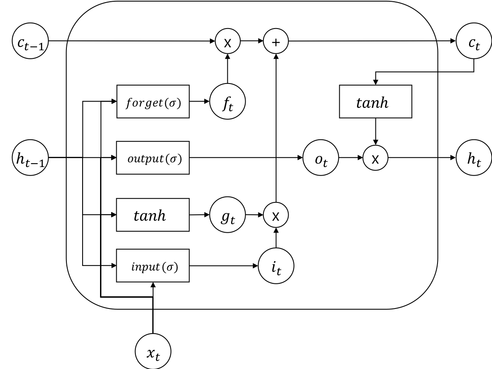

# Long Short Term Memory (LSTM)

RNN은 가변길이의 시퀀셜(sequential) 데이터 형태의 입력에 대해서 훌륭하게 동작하지만, 그 길이가 길어지면 앞서 입력된 데이터를 잊어버리는 치명적인 단점이 있습니다. 하지만 Long Short Term Memory(LSTM)의 등장으로 RNN을 단점을 보완할 수 있게 되었습니다. LSTM은 기존 RNN의 히든 스테이트(hidden state) 이외에도 별도의 셀 스테이트(cell state)라는 변수(variable)를 두어, 그 기억력을 증가시켰을 뿐만 아니라, 여러가지 게이트(gate)를 두어 기억하거나, 잊어버리거나, 출력하고자 하는 데이터의 양을 상황에 따라서, 마치 수도꼭지를 잠궜다 열듯이, 효과적으로 제어하여 긴 길이의 데이터에 대해서도 효율적으로 대처할 수 있게 되었습니다.

하지만 덕분에 LSTM의 수식은 RNN에 비하면 굉장히 복잡해지게 되었고, 더 많아진 파라미터들을 훈련시키기 위해서는 상대적으로 더 많은 데이터들로 더 오래 훈련 해야 합니다. 다행히, 빅데이터의 시대를 맞이하여 범람하는 정보들과, 그래픽카드의 발달로 인한 GPU의 빨라진 속도로 인해, 지금은 아무런 어려움 없이 당연하게 LSTM을 사용하는 시대가 되었습니다. 아래는 LSTM의 수식입니다.

$$\begin{aligned}
i_t &= \sigma(W_{ii} x_t + b_{ii} + W_{hi} h_{(t-1)} + b_{hi}) \\
f_t &= \sigma(W_{if} x_t + b_{if} + W_{hf} h_{(t-1)} + b_{hf}) \\
g_t &= \tanh(W_{ig} x_t + b_{ig} + W_{hg} h_{(t-1)} + b_{hg}) \\
o_t &= \sigma(W_{io} x_t + b_{io} + W_{ho} h_{(t-1)} + b_{ho}) \\
c_t &= f_t c_{(t-1)} + i_t g_t \\
h_t &= o_t \tanh(c_t)
\end{aligned}$$

각 게이트(gate) 앞에는 sigmoid( $\sigma$ )가 붙어 0에서 1 사이의 값으로 얼마나 게이트를 열고 닫을지를 결정합니다. 그럼 그 결정된 값에 따라서 셀 스테이트(cell state) $c_{t-1}$ 와 $g_t$ , $c_t$ 가 새롭게 인코딩(encoding) 됩니다.

RNN과 마찬가지로 LSTM 또한 여러층으로 쌓거나, 양방향(bi-directional)으로 구현할 수 있습니다. 더 길어진 길이에 대해서도 RNN보다 훨씬 훌륭하게 대처하지만, 무한정 길어지는 길이에 대처 할 수 있는 것은 아닙니다. 따라서 여전히 긴 길이의 데이터에 대해서 기억하지 못하는 문제점은 아직 남아 있습니다.
