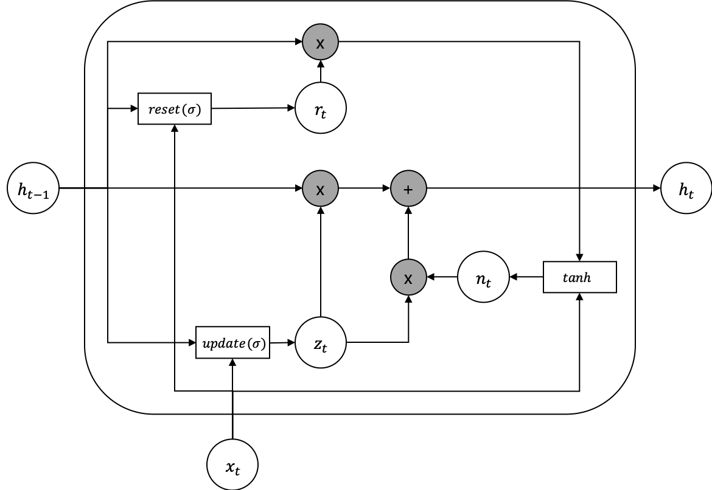

# Gated Recurrent Unit (GRU)

Gated Recurrent Unit (GRU)는 뉴욕대학교 조경현 교수가 제안한 방법입니다. 기존 LSTM이 너무 복잡한 모델이므로 좀 더 간단하면서 성능이 비슷한 방법을 제안하였습니다. 마찬가지로 GRU 또한 시그모이드(sigmoid) $\sigma$ 로 구성 된 리셋 게이트(reset gate) $r_t$ 와 업데이트 게이트(update gate) $z_t$ 가 있습니다. 마찬가지로 시그모이드 함수로 인해서 게이트의 출력값은 0 과 1 사이의 값이 나오므로, 데이터의 흐름을 게이트를 열고 닫아 제어할 수 있습니다. 기존 LSTM 대비 게이트의 숫자가 줄어든 것을 볼 수 있고, 따라서 게이트에 딸려있던 파라미터들이 그만큼 줄어든 것 입니다.

$$\begin{aligned}
r_t &= \sigma(W_{ir} x_t + b_{ir} + W_{hr} h_{(t-1)} + b_{hr}) \\
z_t &= \sigma(W_{iz} x_t + b_{iz} + W_{hz} h_{(t-1)} + b_{hz}) \\
n_t &= \tanh(W_{in} x_t + b_{in} + r_t (W_{hn} h_{(t-1)}+ b_{hn})) \\
h_t &= (1 - z_t) n_t + z_t h_{(t-1)} \\
\end{aligned}$$

사실 LSTM 대비 GRU는 더 가벼운 몸집을 자랑하지만, 아직까지는 LSTM을 사용하는 빈도가 더 높은 것이 사실이긴 합니다. 사실 특별히 성능의 차이가 있다고 하기보단, LSTM과 GRU의 러닝 레이트(learning-rate)나 히든 스테이트의 크기 (hidden size)등의 하이퍼 파라미터(hyper-parameter)가 다르므로, 사용 모델에 따라서 다시 파라미터 셋팅을 찾아내야 합니다. 따라서 연구자의 관성에 따라 사용 경향이 달라지는 것 같습니다.
