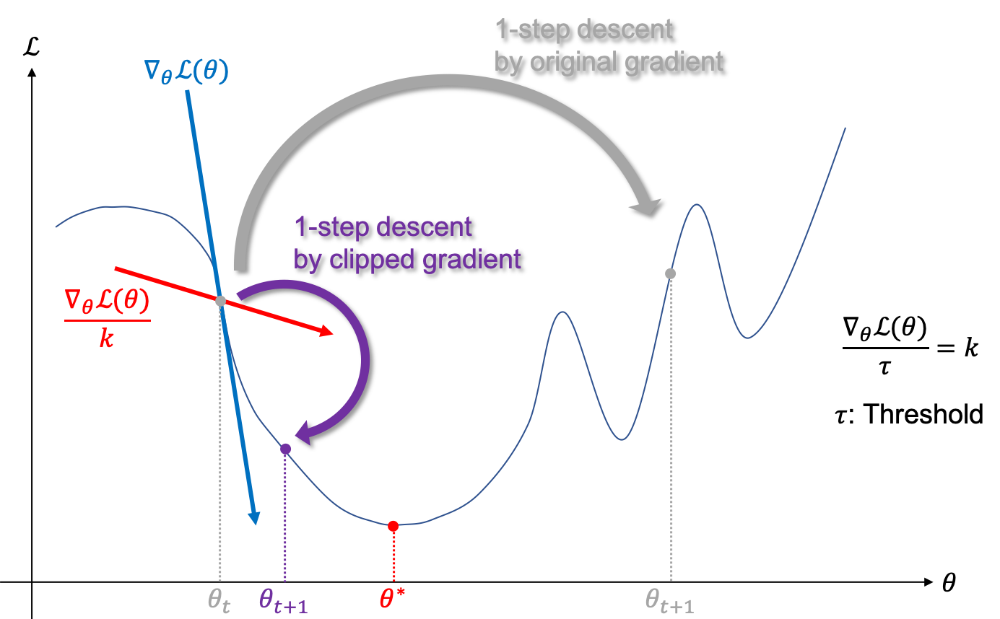

# 그래디언트 클리핑 (Gradient Clipping)

RNN은 Backpropagation through time (BPTT)을 통해서 그래디언트를 시간에 역행하여 구합니다. 매 time-step 마다 RNN의 파라미터에 그래디언트가 더해지므로, 출력의 길이에 따라서 그래디언트의 크기가 달라지게 됩니다. 즉, 길이가 길수록 자칫 그래디언트가 너무 커질 수 있기 때문에, 러닝레이트(learning-rate, lr)를 조절하여 그래디언트 디센트의 업데이트 속도를 조절해야 합니다. 너무 큰 러닝레이트를 사용하게 되면 그래디언트 디센트에서 한 번의 업데이트 스텝(step)의 크기가 너무 커져, 자칠 잘못된 방향으로 학습 및 발산(gradient exloding) 해 버릴 수 있기 때문입니다.

이처럼 그래디언트의 크기(norm)가 너무 큰 경우, 가장 쉬운 대처 방법은 러닝레이트로 아주 작은 값을 취하는 것 입니다. 하지만 작은 러닝레이트를 사용할 경우, 평소 정상적인 그래디언트의 크기를 갖는 상황에서 너무 적은 양만 배우므로 훈련 속도가 매우 느려질 것 입니다. 즉, 길이는 가변이므로 러닝레이트를 매번 알맞게 최적의 값을 찾아 조절 해 주는 것은 매우 어려운 일이 될 것입니다. 이때 그래디언트 클리핑(gradient clipping)이 큰 힘을 발휘합니다.

그래디언트 클리핑은 신경망 파라미터 $\theta$ 의 norm(노름) <comment>보통 L2 norm</comment>을 구하고, 이 norm의 크기를 제한하는 방법 입니다. 따라서 그래디언트 벡터의 방향은 유지하되, 그 크기는 학습이 망가지지 않을 정도로 줄어들 수 있게 됩니다. 물론 norm의 최대 값을 사용자가 지정해 주어야 하기 때문에, 또 하나의 하이퍼 파라미터(hyper-parameter)가 생기게 되지만, 최대 값보다 큰 norm을 가진 그래디언트 벡터의 경우에만 그래디언트 클리핑을 수행하기 때문에, 능동적으로 러닝레이트를 조절하는 것과 비슷한 효과를 가질 수 있습니다. 따라서 그래디언트 클리핑은 RNN 계열의 학습 및 훈련을 할 때 널리 사용되는 방법 입니다.

$$\begin{aligned}
\frac{\partial\epsilon}{\partial\theta} \leftarrow &\begin{cases}
\frac{\text{threshold}}{\Vert\hat{g}\Vert}\hat{g} &\text{if } \Vert\hat{g}\Vert\ge\text{threshold}  \\
\hat{g} &\text{otherwise}
\end{cases} \\
&\text{where }\hat{g}=\frac{\partial\epsilon}{\partial\theta}.
\end{aligned}$$

수식을 보면, 그래디언트 norm이 정해진 최대값(역치, threshold)보다 클 경우에, 그래디언트 벡터를 최대값 보다 큰 만큼의 비율로 나누어 줍니다. 따라서 그래디언트는 항상 역치 보다 작으며 이는 학습이 발산함을 방지함과 동시에, 그래디언트의 방향 자체는 바뀌지 않고 유지하기 때문에 모델 파라미터 $\theta$ 가 학습해야 하는 방향은 잃지 않습니다. 즉, 손실 함수(loss function)을 최소화(minimize)하기 위한 그래디언트의 방향은 유지한 채, 크기만 조절하는 것을 볼 수 있습니다. <comment> 덕분에 이후 소개할 신경망 기계번역과 같은 문제를 풀 때, learning-rate를 1과 같은 큰 값으로 학습에 사용할 수 있습니다. </comment>



다만, 기존의 Stochastic Gradient Descent (SGD)가 아닌, Adam [[Kingma et al.,2014]](https://arxiv.org/pdf/1412.6980.pdf)과 같은 동적인 러닝레이트를 갖는 optimizer(옵티마이저)를 사용할 경우에는 굳이 그래디언트 클리핑을 적용하지 않아도 괜찮습니다. <comment> 하지만 안전장치로 적용하는 것은 괜찮은 생각 입니다. </comment>

아래와 같이 파이토치에서도 기능을 [torch.nn.utils.clip_grad_norm_](https://pytorch.org/docs/stable/nn.html?highlight=clip#torch.nn.utils.clip_grad_norm_) 이라는 함수를 제공하고 있으므로 매우 쉽게 사용 할 수 있습니다.

```python
import torch.optim as optim
import torch.nn.utils as torch_utils

learning_rate = 1.
max_grad_norm = 5.

optimizer = optim.SGD(model.parameters(), lr=learning_rate)
# In orther to avoid gradient exploding, we apply gradient clipping.
torch_utils.clip_grad_norm_(model.parameters(),
max_grad_norm
)
# Take a step of gradient descent.
optimizer.step()
```
