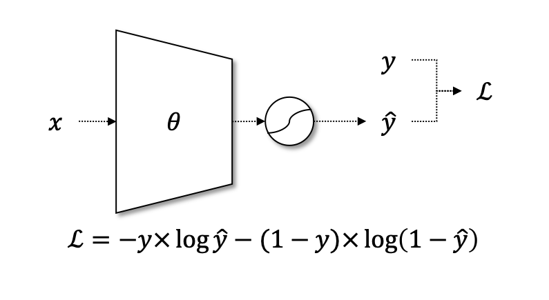
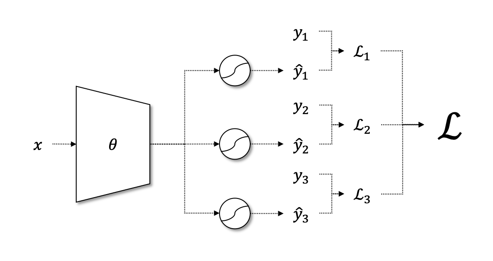
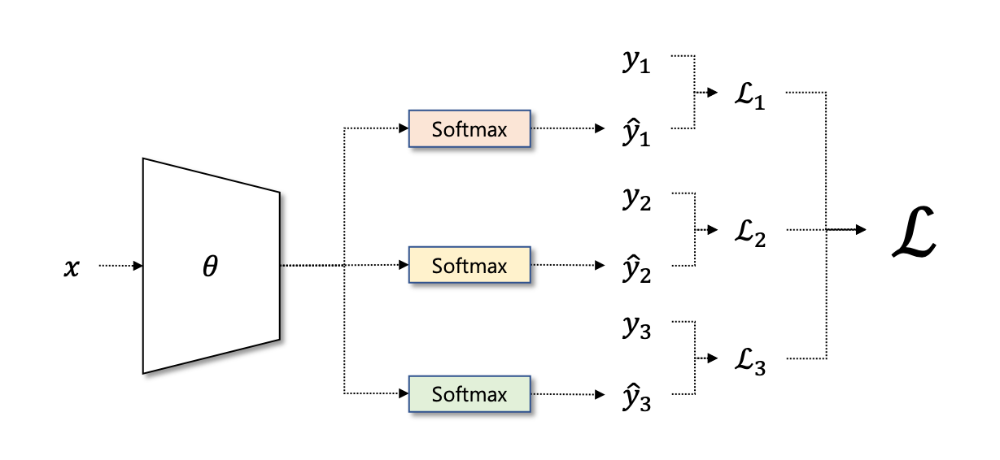

# 쉬어가기: 멀티 레이블 분류

필자가 그동안 자연어 처리 강의를 진행해오면서, 자연어 처리 기술 자체에 대해서 알고 싶으신 분들도 있었고, 실제 번역 또는 텍스트 분류와 같은 업무가 주어져서, 실무에 대한 필요성에 의해서 제 강의를 찾아오신 분들도 많았습니다. 수강생분들이 진행하시는 프로젝트를 들어보면 텍스트를 활용하여 다양한 분류를 하고자 하는 것을 알 수 있었습니다. 의외로 멀티 레이블 분류에 대한 수요가 높은 것도 확인할 수 있었습니다.

이번 절에서는 멀티 레이블 분류에 대해서 살펴보도록 합니다. 멀티 레이블 분류란, 기존의 소프트맥스(softmax) 분류와 다르게 여러개의 클래스가 동시에 정답이 될 수 있는 것을 의미 합니다. 기존의 소프트맥스 분류에서는 문장의 클래스가 여러가지 후보 중에서 한 개만 해당 될 수 있었을 겁니다. 예를 들어 다음과 같은 사용자의 리뷰에 대해서 감성분석을 해야 한다고 가정하겠습니다.

- 상품 품질은 참 좋은데, 배송이 너무 느리네요.

그럼 이 리뷰의 감성분석 결과는 ‘긍정’일까요, ‘부정’일까요? 품질에 대한 반응은 긍정적이지만, 배송에 대한 반응이 부정적이니, ‘중립’으로 가는게 맞을까요? 게다가 단순히 사용자의 반응이 궁금한게 아니라, 특정 항목에 대해서 사용자의 반응이 궁금할 수 있습니다. 예를 들어 ‘품질’에 대한 감성분석과, ‘배송’에 대한 감성분석이 동시에 필요할 수도 있습니다. 그럼 우리는 애초에 레이블링(labeling) 작업을 수행할 때, 위의 항목들 각각에 대해서 레이블을 달아주어야 합니다.

|문장|품질|배송|
|-|-|-|-|
|상품 품질은 참 좋은데, 배송이 너무 느리네요.|상|하|

## 이진분류

이때 우리는 위의 문제를 여러개의 이진분류(binary classification) 문제로 접근해 볼 수 있습니다. 그럼 먼저 이진 분류를 위해서는 어떤 활성함수(activation function)와 손실함수(loss function)을 사용하면 좋을까요?

먼저 이진분류를 위해서 네트워크의 마지막 계층(layer)은 2개의 노드에 소프트맥스 활성함수를 사용하는 것이 아닌, 1개의 노드에 시그모이드(sigmoid) 함수를 사용합니다. 얼핏 생각하면 기존에 n개의 클래스를 분류하기 위해서 n개의 노드를 갖는 마지막 계층에 소프트맥스 함수를 사용하였지만, 2개의 클래스만을 갖는 이진분류 문제에서는 1개의 노드의 값이 결정되면 다른 1개 노드의 값이 결정되는 것은 당연하기 때문에, 1개의 노드만 갖는 것이 맞습니다. 즉, 이진분류 상황에서는 다음의 수식을 항상 만족하기 때문입니다.

$$P(\text{y}=1|x)=1-P(\text{y}=0|x)$$

그리고 이진분류에는 이진 크로스 엔트로피 손실함수(Binary Cross Entropy Loss, BCELoss)를 활용할 수 있습니다. BCELoss는 기존의 크로스 엔트로피 손실함수의 한 케이스로, 이진분류에 특화된 버전이라고 볼 수 있습니다.

$$\text{BCELoss}(\hat{y}, y)=-\big(y\times\log{\hat{y}}+(1-y)\times\log{(1-\hat{y})}\big)$$

이 수식에서 $y$ 는 0 또는 1의 값을 갖는 불연속적인 값 입니다. 그리고 $\hat{y}$ 은 시그모이드 함수의 출력값이 됩니다. 따라서 0에서 1사이의 연속적인 실수값을 갖게 됩니다.

## 멀티 이진분류

그럼 이제 다시 멀티 레이블 문제로 돌아와서, 이진분류를 문제에 어떻게 적용할까요? 매우 간단합니다. n개의 항목을 갖는 분류 문제에 대해서는, 신경망의 마지막 계층에 n개의 노드를 주고 모두 시그모이드 함수를 적용하면 됩니다. 그럼 하나의 모델로 여러 개의 이진분류 작업을 수행할 수 있게 됩니다.

그럼 최종 손실함수는 아래와 같이 될 것 입니다.

$$\begin{gathered}
\mathcal{L}=\sum_{i=1}^n{\text{BCELoss}(\hat{y}_i,y_i)} \\
\text{where }\text{BCELoss}(\hat{y}_i,y_i)=-\big(y_i\times\log{\hat{y}_i}+(1-y_i)\times\log{(1-\hat{y}_i)}\big)
\end{gathered}$$

## 이진분류가 아닌 경우

만약 우리가 분류하고자 하는 문제가 이진문제가 아닌 경우는 어떻게 할까요? 감성분석을 단순히 ‘긍정’과 ‘부정’으로 나누기보단, ‘중립’과 같이 좀 더 세밀한 분류가 필요할 수도 있습니다. 게다가 다음과 같이 사용자가 언급하지 않은 항목에 대해서는 ‘긍정’과 ‘부정’을 레이블링 할 수도 없을 것 입니다.

|문장|품질|배송|가격|
|-|-|-|-|
|상품 품질은 참 좋은데, 배송이 너무 느리네요.|상|하|중|
|가격도 싸고, 품질도 너무 만족스럽네요!|상|중|상|

이때는 어쩔 수 없이 여러개의 소프트맥스 계층이 필요할 것 입니다. 만약 ‘상/중/하’ 3개의 레이블만 존재한다면, 3개의 노드를 갖는 계층이 필요할 겁니다. 근데, 해당 계층이 n개의 항목에 대해서 각각 필요할 겁니다.

그럼 최종적인 손실함수는 다음과 같이 될 겁니다.

$$\begin{gathered}
\mathcal{L}=\sum_{i=1}^n{\text{CrossEntropy}(\hat{y}_i,y_i)} \\
\text{where }\hat{y}_i\in\mathbb{R}^3,y_i\in\{0,1\}^3\text{ and }|y_i|=1. \\
\begin{aligned}
\text{CrossEntropy}(\hat{y}i,y_i)&=-y_i\times\log{\hat{y}_i} \\
&=-\sum_{j=1}^3{y_{i,j}\times\log{\hat{y}_{i,j}}}
\end{aligned} \\
\end{gathered}$$

이와 같이 우리는 한개의 신경망 모델로 여러 항목에 대해서 분류를 진행할 수 있습니다.
