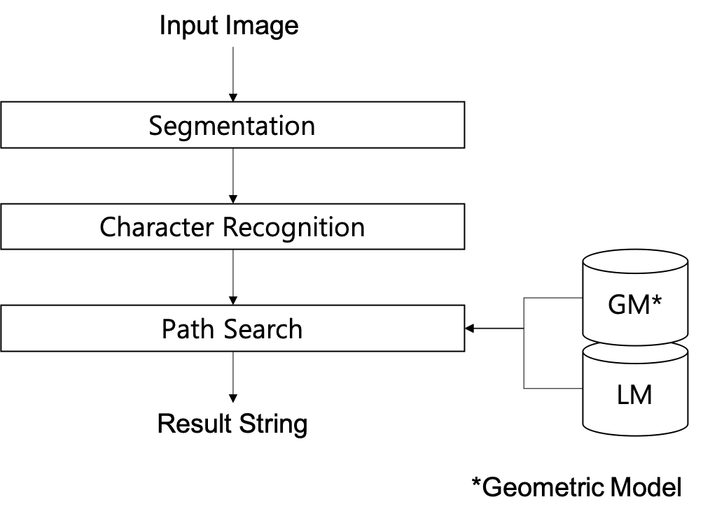

# 언어모델의 활용

사실 언어모델 자체를 단독으로 사용하는 경우는 굉장히 드뭅니다. 그렇다면 왜 언어모델이 중요할까요? 하지만, 자연어생성(Natural Language Generation, NLG)의 가장 기본이라고 할 수 있습니다. 자연어생성은 현재 딥러닝을 활용한 자연어처리 분야에서 가장 큰 연구주제 입니다. 기계번역에서부터 챗봇까지 모두 자연어생성의 영역에 포함된다고 할 수 있습니다. 이러한 자연어생성의 기본 초석이 되는 것이 바로 언어모델(LM) 입니다. 따라서, 언어모델 자체의 활용도는 그 중요성에 비해 떨어질지언정, 언어모델의 중요성과 그 역할은 부인할 수 없습니다. 대표적인 활용 분야는 아래와 같습니다.

## 음성인식 (Automatic Speech Recognition, ASR)

음성인식(Speech recognition) 시스템을 구성할 때, 언어모델은 중요하게 쓰입니다. 사실 실제 사람의 경우에도 말을 들을 때 언어모델이 굉장히 중요하게 작용합니다. 어떤 단어를 발음하고 있는지 명확하게 알아듣지 못하더라도, 머릿속에 저장되어 있는 언어모델을 이용하여 알아듣기 때문입니다. 예를 들어, 우리는 갑자기 쌩뚱맞은 주제로 대화를 전환하게 되면 보통 한번에 잘 못알아듣는 경우가 많습니다. 컴퓨터의 경우에도 음소별 뷴류(classification)의 성능은 이미 사람보다 뛰어납니다. 다만, 사람에 비해 주변 문맥(context) 정보를 활용할 수 있는 능력, 눈치가 없기 때문에 음성인식률이 떨어지는 경우가 많습니다. 따라서, 그나마 좋은 언어모델을 학습하여 사용함으로써, 음성인식의 정확도를 높일 수 있습니다.

아래는 음성인식 시스템의 수식을 개략적으로 나타낸 것 입니다. 음성 신호 $X$가 주어졌을 때 확률을 최대로 하는 문장 $\hat{Y}$ 를 구하는 것이 목표 입니다.

$$\begin{gathered}
\hat{Y} =\underset{Y\in\mathcal{Y}}{\text{argmax}}P(Y|X)=\underset{Y\in\mathcal{Y}}{\text{argmax}}\frac{P(X|Y)P(Y)}{P(X)}, \\
\text{where X is an audio signal and }\text{Y is a word sequence, }Y = \{ y_1, y_2, \cdots , y_n \}.
\end{gathered}$$

그럼 베이즈 정리(Bayes Theorem)에 의해서 수식은 전개 될 수 있습니다. 그리고 밑변(evidence) $P(X)$ 는 날려버릴 수 있습니다.

$$\underset{Y\in\mathcal{Y}}{\text{argmax}}\frac{P(X|Y)P(Y)}{P(X)} =\underset{Y\in\mathcal{Y}}{\text{argmax}}P(X|Y)P(Y)$$

여기서 $P(X|Y)$ 가 음향모델(Acoustic Model, AM)을 의미하고, $P(Y)$ 는 언어모델(LM)을 의미 합니다. 즉, $P(Y)$ 는 문장의 확률을 의미하고, $P(X|Y)$ 는 문장(단어 시퀀스 또는 음소 시퀀스)이 주어졌을 때, 해당 음향 시그널이 나타날 확률을 나타냅니다.

이처럼 언어모델은 음향모델과 결합하여, 문맥 정보에 기반하여 다음 단어를 예측하도록 함으로써, 음성인식의 성능을 더울 향상 시킬 수 있고, 매우 중요한 역할을 차지하고 있습니다.

## 기계번역 (Machine Translation, MT)

번역 시스템을 구성 할 때에도 언어모델은 중요한 역할을 합니다. 기존 통계기반번역(Statistical Machine Translation, SMT) 시스템에서는 위의 음성인식 시스템과 매우 유사하게 언어모델이 번역모델(translation model)과 결합하여 자연스러운 문장을 만들어내도록 동작 하였으며, 신경망 기계번역(Neural Machine Translation, NMT)의 경우에도 언어모델이 마찬가지로 매우 중요한 역할을 차지 합니다. 더 자세한 내용은 다음 챕터에서 다루도록 하겠습니다.

## 광학문자인식 (Optical Character Recognition, OCR)

광학문자인식 시스템을 만들 때에도 언어모델이 사용 됩니다. 사진에서 추출하여 글자를 인식 할 때에 각 글자(character) 간의 확률을 정의하면 훨씬 더 높은 성능을 얻어낼 수 있습니다. 따라서, OCR에서도 언어모델의 도움을 받아 글자나 글씨를 인식합니다.

## 그밖의 자연어생성 문제

사실 위에 나열한 음성인식, 기계번역, 문자인식도 주어진 정보를 바탕으로 문장을 생성해내는 자연어생성에 속한다고 볼 수 있습니다. 이외에도 자연어생성 문제가 적용 될 수 있는 영역은 굉장히 많습니다. 기계학습의 결과물로써 문장을 만들어내는 작업은 모두 자연어생성 문제의 범주에 속한다고 볼 수 있습니다. 예를 들어, 주어진 정보를 바탕으로 뉴스 기사를 쓸 수도 있고, 주어진 뉴스 기사를 요약하여 제목을 생성 해 낼 수도 있습니다. 또한, 사용자의 응답에 따라 대답을 생성 해 내는 챗봇도 생각 해 볼 수 있습니다.

## 기타

이외에도 여러가지 영역에 정말 다양하게 사용됩니다. 검색엔진에서 사용자가 검색어를 입력하는 도중에 밑에 드롭다운(drop-down)으로 제시되는 검색어 완성 등에도 언어모델이 사용 될 수 있습니다.
