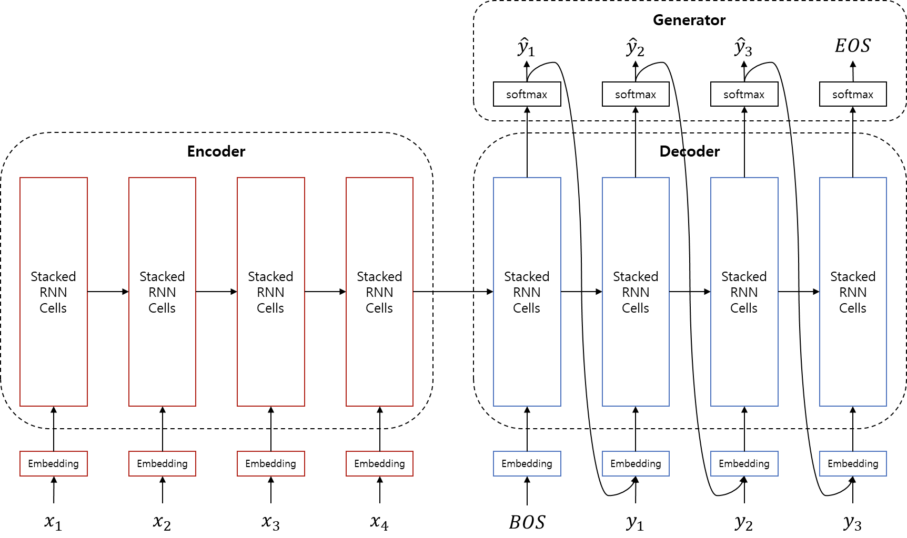
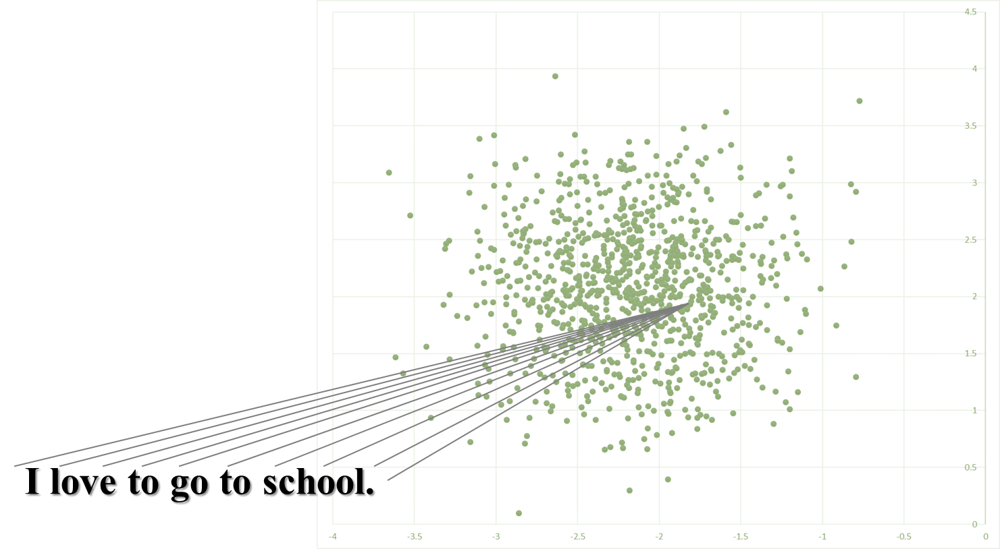

# Sequence-to-Sequence (시퀀스 투 시퀀스, Seq2seq)

## 구조 소개

우리는 sequence-to-sequence를 모델 구조를 활용하여 MLE를 수행하여 주어진 데이터를 가장 잘 설명하는 파라미터 $\theta$ 를 찾아내야 합니다. 그것을 수식으로 나타내면 아래와 같습니다.

$$\hat{\theta}=\underset{\theta}{\text{argmax }}P(Y|X;\theta)\text{ where }=\{x_1,x_2,\cdots,x_n\},~Y=\{y_1,y_2,\cdots,y_m\}$$

$P(Y|X;\theta)$ 를 최대로 하는 모델 파라미터를 찾는 작업 입니다. 이렇게 파라미터에 대한 학습이 완료되면, 사후확률을 최대로 하는 $ Y$를 찾아야 합니다.

$$\hat{Y}=\underset{Y\in\mathcal{Y}}{\text{argmax }}P(Y|X;\theta)$$

이를 위해서 sequence-to-sequence는 크게 3개의 서브 모듈(인코더, 디코더, 제너레이터)로 구성되어 있습니다.



### 인코더 (Encoder)

인코더는 주어진 소스(source) 문장을 입력으로 받아 문장을 함축하는 문장 임베딩 벡터(sentence embedding vector)로 만들어 냅니다. $P(\text{z}|X)$ 를 모델링 하는 것이라고 볼 수 있습니다. 사실 새로운 형태라기 보단, 이전 챕터에서 다루었던 텍스트 분류(Text Classificaion)에서 사용되었던 RNN 모델과 거의 같다고 볼 수 있습니다. $P(\text{z}|X)$ 를 모델링하여, 주어진 문장을 차원축소(dimension reduction)하여 해당 도메인의 latent 공간(매니폴드)의 어떤 한 점에 투영하는 작업 입니다.



다만 기존의 텍스트 분류 문제에서는 모든 정보가 필요하지 않기 때문에 <comment> 예를들어 감성분석(Sentiment Analysis)에서는 "나는"과 같이 중립적인 단어는 감성을 분류하는데 필요하지 않기 때문에 해당 정보를 굳이 간직해야 하지 않을 수도 있습니다. </comment> 벡터로 만들어내는 과정에서 많은 정보를 간직하지 않아도 되지만, 기계번역을 위한 문장 임베딩 벡터를 생성하기 위해서는 최대한 많은 정보를 간직해야 할 것 입니다.

$$\begin{gathered}
h_{t}^{\text{src}} = \text{RNN}_{enc}(\text{emb}_{\text{src}}(x_t), h_{t-1}^{\text{src}}) \\
H^{\text{src}} = [h_{1}^{\text{src}}; h_{2}^{\text{src}}; \cdots; h_{n}^{\text{src}}]
\end{gathered}$$

인코더(encoder)를 수식으로 나타내면 위와 같습니다. $[;]$ 는 이어 붙이는 작업(concatenate)을 의미합니다. 위의 수식은 time-step 별로 GRU를 통과시킨 것을 나타낸 것이고, 사실상 실제 구현을 하면 아래와 같이 됩니다.

$$H^{\text{src}} = \text{RNN}_{enc}(\text{emb}_{\text{src}}(X), h_{0}^{\text{src}})$$

### 디코더 (Decoder)

마찬가지로 디코더(decoder)도 사실 새로운 개념이 아닙니다. 이전 챕터에서 다루었던 신경망언어모델(Nerual Network Langauge Model, NNLM)의 연장선으로써, 조건부 신경망언어모델(Conditional Neural Network Language Model)이라고 할 수 있습니다. 위에서 다루었던 sequence-to-sequence 모델의 수식을 좀 더 time-step에 대해서 풀어서 써보면 아래와 같습니다.

$$\begin{gathered}
P_\theta(Y|X)=\prod_{t=1}^{m}P_\theta(y_t|X,y_{<t}) \\
\log P_\theta(Y|X) = \sum_{t=1}^{m}\log P_\theta(y_t|X, y_{<t})
\end{gathered}$$

보면 RNNLM의 수식에서 조건부 랜덤 변수(random variable) 부분에 $X$ 가 추가 된 것을 확인 할 수 있습니다. 즉, 인코더의 결과인 문장 임베딩 벡터와 이전 time-step 까지 번역하여 생성한 단어들에 기반하여, 현재 time-step의 단어를 생성하는 작업을 수행합니다.

$$\begin{gathered}
h_{t}^{\text{tgt}} = \text{RNN}_{dec}(\text{emb}_{\text{tgt}}(y_{t-1}), h_{t-1}^{\text{tgt}}) \\
\text{ where }h_{0}^{\text{tgt}}=h_{n}^{\text{src}}\text{ and }y_{0}=\text{BOS}.
\end{gathered}$$

위 수식은 디코더를 나타낸 것입니다. 특기할 점은 뉴럴 네크워크 언어모델과 같이 디코더 입력의 초기값으로써, $y_0$ 에 BOS 토큰을 입력으로 준다는 것 입니다.

### 제너레이터 (Generator)

제너레이터는 디코더에서 각 time-step별로 결과 벡터 $h_t^{\text{tgt}}$ 를 받아 softmax를 계산하여 각 목표 언어(target language)의 각 단어(어휘)별 확률값을 반환하는 단순한 작업을 하는 모듈 입니다. 즉, 제너레이터의 결과값은 각 단어가 나타난 확률인 discrete 확률 분포가 됩니다. 이때도 주의할 점은, 문장의 길이가 $|Y|=m$ 일때 맨 마지막 반환되는 단어 $y_{m}$ 은 EOS 토큰이 됩니다. 이 마지막 $y_{m}$ 은 EOS이므로 디코더 계산의 종료를 나타내기 때문에, 이론상으로는 디코더의 입력으로 들어가는 일이 없습니다.

$$\begin{gathered}
\hat{y}_{t}=\text{softmax}(\text{linear}_{hs\rightarrow|V_{\text{tgt}}|}(h_{t}^{\text{tgt}}))\text{ and }\hat{y}_{m}=\text{EOS} \\
\text{where }hs\text{ is hidden size of RNN, and }|V_{\text{tgt}}|\text{ is size of output vocabulary}.
\end{gathered}$$

## Sequence-to-Sequence의 활용 분야

이와 같이 구성된 sequence-to-sequence 모델은 꼭 기계번역 문제에서만 사용해야 하는 것이 아니라 정말 많은 분야에 적용할 수 있습니다. 특정 도메인의 시계열(time-series) 데이터 또는 시퀀스(sequential) 데이터 입력을 다른 도메인의 시계열 또는 시퀀스 데이터로 출력하는데 탁월한 능력을 발휘합니다.

| 활용분야 | 입력과 출력 |
| --- | --- |
| 기계번역 | 특정 언어 문장을 입력으로 받아 다른 언어의 문장으로 출력 |
| 챗봇 | 사용자의 문장 입력을 받아 대답을 출력 |
| 요약(Summarization) | 긴 문장을 입력으로 받아 같은 언어의 요약된 문장으로 출력 |
| 기타 자연어처리 분야 | 사용자의 문장 입력을 받아 프로그래밍 코드로 출력 등 |
| 음성인식 | 사용자의 음성을 입력으로 받아 해당 언어의 문자열(문장)으로 출력 |
| 독순술 | 입술 움직임의 동영상을 입력으로 받아 해당 언어의 문장으로 출력 |
| 이미지 캡셔닝(captioning) | 변형된 seq2seq를 사용하여 이미지를 입력으로 받아 그림을 설명하는 문장을 출력 |

## 한계점

사실 sequence-to-sequence는 [AutoEncoder](https://en.wikipedia.org/wiki/Autoencoder)의 일종이라고 볼 수 있습니다. 그 중에서도 특히 시계열 또는 시퀀스 데이터에 대한 강점이 있는 모델이라고 볼 수 있습니다. 하지만 아래와 같은 한계점들이 있습니다.

### 장기 기억력

신경망 모델은 차원축소(dimension reduction)을 통해 데이터를 압축하는데에 탁월한 성능([매니폴드 가설 참고](https://en.wikipedia.org/wiki/Semi-supervised_learning#Manifold_assumption))을 지녔습니다. 하지만, sequence-to-sequence를 통하여도 [도라에몽의 주머니](https://namu.wiki/w/4차원 주머니#toc)처럼 무한하게 정보를 압축 할 수 없습니다. 따라서 압축 할 수 있는 정보는 한계가 있기 때문에, 문장(또는 time-step)이 길어질수록 압축 성능이 떨어지게 됩니다. 비록 LSTM이나 GRU를 사용함으로써 RNN에 비하여 성능을 끌어올릴 수 있었지만 한계가 있기 마련입니다.

### 구조 정보의 부재

현재 주류의 딥러닝 자연어처리에서는 문장을 이해함에 있어서 구조 정보를 사용하기보단, 단순히 시퀀스(sequential) 데이터로 다루는 경향이 있습니다. <comment> 아마도 RNN등의 뉴럴 네트워크가 알아서 구조를 파악해 줄 것이라 믿는 것이겠지요. </comment> 비록 이 접근 방법은 현재까지 대성공을 거두고 있지만, 다음 단계로 나아가기 위해서는 구조 정보도 필요할 것이라 생각하는 사람들이 많습니다.

### 챗봇 또는 QA봇

사실 이 항목은 단점이라기보다는 그냥 당연한 이야기일 수 있습니다. sequence-to-sequence는 시퀀스 데이터를 입력으로 받아서 다른 도메인의 시계열 데이터로 출력하는 능력이 뛰어납니다. 따라서, 처음에는 많은 사람들이 sequence-to-sequence를 잘 훈련시키면 챗봇의 기능도 어느정도 할 수 있지 않을까 하는 기대를 했습니다. 하지만 자세히 생각해보면, 대화의 흐름에서 대답은 질문에 비해서 새로운 정보(지식-knowledge, 문맥-context)가 추가 된 경우가 많습니다. 따라서 기존의 전형적인 sequence-to-sequence의 문제(번역, 요약)등은 새로운 정보의 추가가 별로 없기 때문에 잘 해결할 수 있지만, 대화의 경우에는 좀 더 발전된 구조가 필요할 것 입니다.

## 파이토치 예제 코드

기계번역을 수행 하는 sequence-to-sequence를 파이토치로 구현하는 방법을 소개합니다. 이번 챕터에서 사용될 전체 코드는 저자의 깃허브에서 다운로드 할 수 있습니다. (업데이트 여부에 따라 코드가 약간 다를 수 있습니다.)

- Github Repository URL: https://github.com/kh-kim/simple-nmt
- 파일 URL: https://github.com/kh-kim/simple-nmt/blob/master/simple_nmt/seq2seq.py

### 인코더 클래스

인코더의 RNN은 그 역할이 그렇듯이, 텍스트 분류기의 코드와 매우 유사함을 알 수 있습니다. 마찬가지로 양방향 LSTM을 사용하기 때문에, 선언 할 때에 bidirectional 옵션을 True로 준 것을 볼 수 있습니다. 또한 양방향 LSTM의 히든스테이트는 기존 단방향 LSTM의 히든스테이트보다 2배로 늘어나기 때문에, 애초에 "hidden_size / 2"를 RNN의 hidden_size로 사용한 것을 볼 수 있습니다.

```python
class Encoder(nn.Module):

    def __init__(self, word_vec_dim, hidden_size, n_layers=4, dropout_p=.2):
        super(Encoder, self).__init__()

        # Be aware of value of 'batch_first' parameter.
        # Also, its hidden_size is half of original hidden_size, because it is bidirectional.
        self.rnn = nn.LSTM(word_vec_dim,
                           int(hidden_size / 2),
                           num_layers=n_layers,
                           dropout=dropout_p,
                           bidirectional=True,
                           batch_first=True
                           )

    def forward(self, emb):
        # |emb| = (batch_size, length, word_vec_dim)

        if isinstance(emb, tuple):
            x, lengths = emb
            x = pack(x, lengths.tolist(), batch_first=True)

            # Below is how pack_padded_sequence works.
            # As you can see, PackedSequence object has information about mini-batch-wise information, 
            # not time-step-wise information.
            # 
            # a = [torch.tensor([1,2,3]), torch.tensor([3,4])]
            # b = torch.nn.utils.rnn.pad_sequence(a, batch_first=True)
            # >>>>
            # tensor([[ 1,  2,  3],
            #     [ 3,  4,  0]])
            # torch.nn.utils.rnn.pack_padded_sequence(b, batch_first=True, lengths=[3,2]
            # >>>>PackedSequence(data=tensor([ 1,  3,  2,  4,  3]), batch_sizes=tensor([ 2,  2,  1]))
        else:
            x = emb

        y, h = self.rnn(x)
        # |y| = (batch_size, length, hidden_size)
        # |h[0]| = (num_layers * 2, batch_size, hidden_size / 2)

        if isinstance(emb, tuple):
            y, _ = unpack(y, batch_first=True)

        return y, h
```

#### Pack Padded Sequence

아래는 pack_padded_sequence 함수가 동작하는 모습 입니다. 이 함수는 기존의 샘플 별 미니배치(mini-batch)를 time-step 별로 표현 해 줍니다. PackedSequence로 표현된 time-step별 미니배치는 각 time-step별 샘플의 숫자를 추가적인 정보로 갖고 있습니다. 따라서, 이를 위해서는 미니배치 내에는 가장 긴 길이의 문장부터 차례대로 정렬되어 있어야 합니다.

```python
a = [torch.tensor([1, 2, 3]), torch.tensor([3, 4])]
b = torch.nn.utils.rnn.pad_sequence(a, batch_first=True)
>>>> tensor([[ 1,  2,  3],
             [ 3,  4,  0]])
torch.nn.utils.rnn.pack_padded_sequence(b, batch_first=True, lengths=[3, 2]
>>>>PackedSequence(data=tensor([ 1,  3,  2,  4,  3]), batch_sizes=tensor([ 2,  2,  1]))
```

### 디코터 클래스

추후 어텐션 및 추가 개념이 더해질 것이기 때문에, 디코더 클래스 코드는 이후 섹션에서 다루기로 합니다.

### 제너레이터 클래스

```python
class Generator(nn.Module):

    def __init__(self, hidden_size, output_size):
        super(Generator, self).__init__()

        self.output = nn.Linear(hidden_size, output_size)
        self.softmax = nn.LogSoftmax(dim=-1)

    def forward(self, x):
        # |x| = (batch_size, length, hidden_size)

        y = self.softmax(self.output(x))
        # |y| = (batch_size, length, output_size)

        # Return log-probability instead of just probability.
        return y
```

### 전체 sequence-to-sequence 클래스

추후 어텐션 및 추가 개념이 더해진 후 다루도록 합니다.

### 손실 함수

sequence-to-sequence는 기본적으로 각 time-step 별로 가장 확률이 높은 단어를 선택하는 분류 문제(classification task)이므로, 크로스 엔트로피(cross entropy)를 손실함수(loss function)으로 사용합니다. 또한 기본적으로 조건부 언어모델(conditional language model)이라고 볼 수 있기 때문에, 이전 언어모델 챕터에서 다루었듯이 perplexity를 통해 번역 모델의 성능을 나타낼 수 있고, 이 또한 크로스 엔트로피와 매우 깊은 연관을 가집니다.

아래는 손실값을 계산하기 위해 파이토치로부터 손실 함수를 준비하는 모습입니다. 사실 실제 구현할 때에는 "softmax 레이어 + [cross entropy](https://pytorch.org/docs/stable/nn.html?highlight=crossentropyloss#torch.nn.CrossEntropyLoss)"를 사용하기보단, "log softmax layer + [negative log likelihood](https://pytorch.org/docs/stable/nn.html?highlight=nll#torch.nn.NLLLoss)"를 사용합니다. <comment> 크로스 엔트로피와 negative 로그 라이클리후드에 관계에 대한 내용은 이전 기초 수학 챕터를 참고하세요. </comment>

```python
# Default weight for loss equals to 1, but we don't need to get loss for PAD token.
# Thus, set a weight for PAD to zero.
loss_weight = torch.ones(output_size)
loss_weight[data_loader.PAD] = 0.
# Instead of using Cross-Entropy loss, we can use Negative Log-Likelihood(NLL) loss with log-probability.
crit = nn.NLLLoss(weight=loss_weight,
                  reduction='sum',
                  )
```

따라서 softmax 레이어를 사용하는 대신에, log-softmax 레이어를 사용하여 로그 확률(log probability)을 구하고, 수식의 나머지 작업을 수행하면 됩니다.

```python
    def _get_loss(self, y_hat, y, crit=None):
        # |y_hat| = (batch_size, length, output_size)
        # |y| = (batch_size, length)
        crit = self.crit if crit is None else crit
        loss = crit(y_hat.contiguous().view(-1, y_hat.size(-1)),
                    y.contiguous().view(-1)
                    )

        return loss
```
