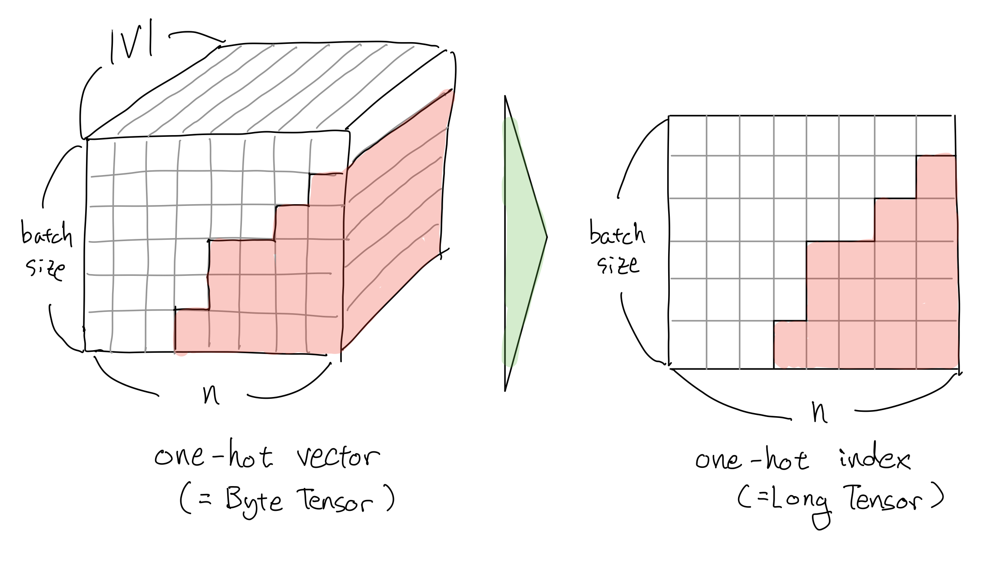
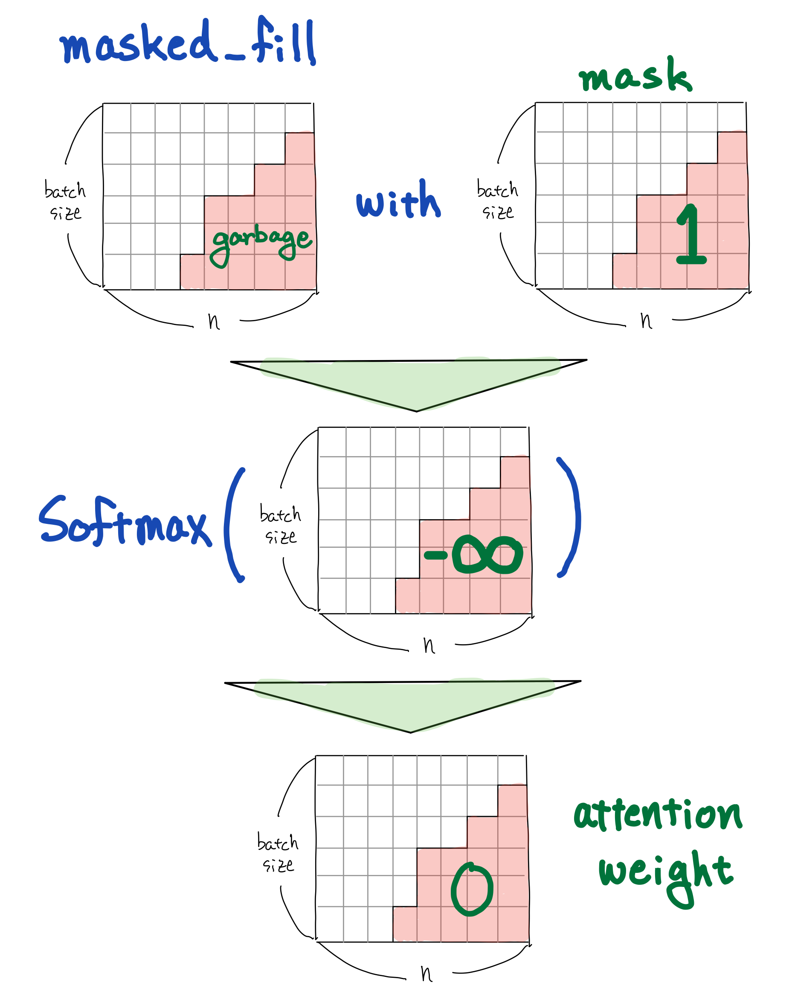
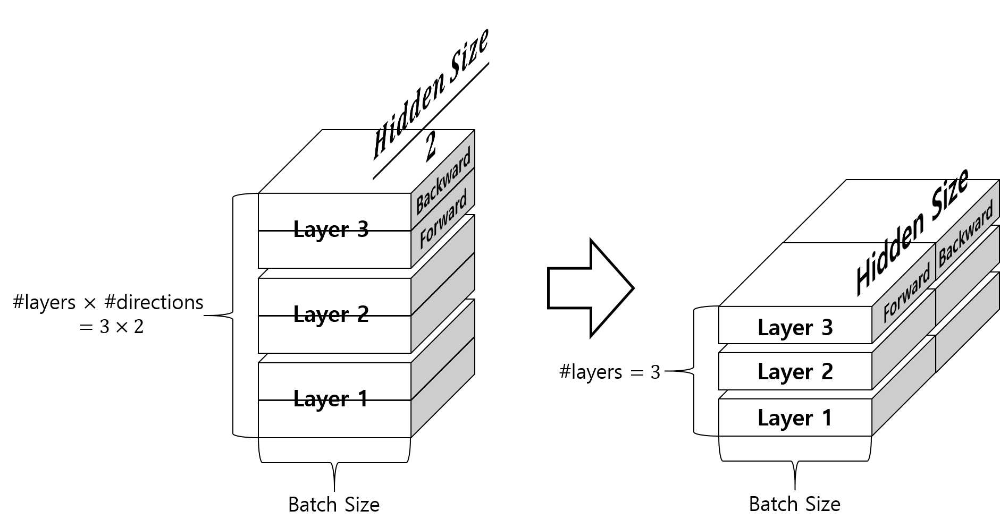

# Input Feeding

각 time-step의 디코더 출력값과 어텐션 결과값을 이어붙이기(concatenate) 한 이후에 제너레이터 모듈에서 softmax를 취하여 확률 분포를 구합니다. 이후에 해당 확률 분포에서 argmax를 수행하여 $\hat{y}_{t}$ 을 샘플링 합니다. 하지만 분포에서 샘플링하는 과정에서 많은 정보가 손실됩니다. 따라서 단순히 다음 time-step에 $\hat{y}_{t}$ 을 입력으로 넣어 주는 것보다, softmax 이전의 값도 같이 넣어주어 계산한다면, 좀 더 정보의 손실 없이 더 좋은 효과를 얻을 수 있습니다.


 $y$ 와 달리 concat 레이어의 출력은 $y$ 가 임베딩 레이어에서 dense 벡터로 변환되고 난 이후에 임베딩 벡터와 이어붙이기(concatenate)되어 디코더 RNN에 입력으로 주어지게 됩니다. 이러한 과정을 input feeding이라고 합니다.

$$\begin{gathered}
h_{t}^{src} = \text{RNN}_{enc}(\text{emb}_{src}(x_t), h_{t-1}^{src}) \\
H^{src}=[h_{1}^{src}; h_{2}^{src}; \cdots; h_{n}^{src}] \\ 
\\
h_{t}^{tgt}=\text{RNN}_{dec}([\text{emb}_{tgt}(y_{t-1});\tilde{h}_{t-1}^{tgt}], h_{t-1}^{tgt})\text{ where }h_{0}^{tgt}=h_{n}^{src}\text{ and }y_{0}=\text{BOS}. \\ 
\\
w=\text{softmax}({h_{t}^{tgt}}^T W \cdot H^{src}) \\
c = H^{src} \cdot w\text{ and }c\text{ is a context vector}. \\ 
\\
\tilde{h}_{t}^{tgt}=\tanh(\text{linear}_{2hs \rightarrow hs}([h_{t}^{tgt}; c])) \\ 
\\
\hat{y}_{t}=\text{softmax}(\text{linear}_{hs \rightarrow |V_{tgt}|}(\tilde{h}_{t}^{tgt})) \\ 
\\
\text{where }hs\text{ is hidden size of RNN, and }|V_{tgt}|\text{ is size of output vocabulary}.
\end{gathered}$$

위는 어텐션과 input feeding이 추가된 sequence-to-sequence의 처음부터 끝까지를 수식으로 나타낸 것 입니다. $\text{RNN}_{dec}$ 는 이제 $\tilde{h}_{t-1}^{tgt}$ 를 입력으로 받기 때문에, 모든 time-step을 한번에 처리하도록 구현할 수 없다는 점이 구현상의 차이점 입니다.

## 단점

이 방식은 훈련 속도 저하라는 단점을 가집니다. input feeding 이전의 방식에서는 훈련 할 때, 인코더와 마찬가지로 디코더도 모든 time-step에 대해서 한번에 계산하는 작업이 가능했습니다. 하지만 input feeding으로 인해, 디코더 RNN의 입력으로 이전 time-step의 결과( $\tilde{h}_t^{tgt}$ )가 필요하게 되어, 각 time-step 별로 순차적으로 계산을 해야 합니다.

하지만 이 단점이 크게 부각되지 않는 이유는 어차피 추론(inference)단계에서는 디코더는 input feeding이 아니더라도 time-step 별로 순차적으로 계산되어야 하기 때문입니다. 추론 단계에서는 이전 time-step의 출력값인 $\hat{y}_t$ 를 디코더(정확하게는 디코더 RNN이전의 임베딩 레이어)의 입력으로 사용해야 하기 때문에, 어쩔 수 없이 병렬(parallel)처리가 아닌 순차적으로 계산해야 합니다. 따라서 추론 할 때, input feeding으로 인한 속도 저하는 거의 없습니다. 훈련 할 때와 추론 할 때의 차이점에 대해서 다음 섹션에서 좀 더 자세히 다루도록 하겠습니다.

## 성능 개선

| 번호 | 모델 | 알고리즘 | Perplexity | En $\rightarrow$ De BLEU |
|:-:|-|-|-|-|
|1| Base | 기본적인 sequence-to-sequence 모델 | 10.6 | 11.3 |
|2| 1 + reverse | Bi-directional LSTM을 인코더에 추가 | 9.9 | 12.6(+1.3) |
|3| 2 + dropout | 드랍아웃(확률 0.2) 추가 | 8.1 | 14.0(+1.4) |
|4| 3 + attention | 어텐션 추가 | 7.3 | 16.8(+2.8) |
|5| 4 + feed input | input feeding 추가 | 6.4 | 18.1(+1.3) |

<reference>[[Loung et al.2015] Effective Approaches to Attention-based Neural Machine Translation](https://arxiv.org/pdf/1508.04025.pdf)</reference>

우리는 위 테이블을 통해 어텐션과 input feeding을 사용함으로써, 최종적으로 훨씬 더 나은 성능을 얻을 수 있음을 알 수 있습니다.

## 구현 관점에서 바라보기

자, 그럼 이제 기본적인 sequence-to-sequence에 대해 이야기했으니, 구현 관점에서 sequence-to-sequence의 수식을 따라가보도록 하겠습니다. 먼저 아래와 같이 소스(source) 문장과 타겟(target) 문장으로 이루어진 병렬 코퍼스가 있습니다.

$$\begin{gathered}
\mathcal{B}=\{\text{X}_i,\text{Y}_i\}_{i=1}^N \\
\text{where }\text{X}=\{x_1,\cdots,x_n\}\text{, }\text{Y}=\{y_1,\cdots,y_m\}.
\end{gathered}$$

소스 문장은 n개의 단어로 이루어져 있고, 타겟 문장은 m개의 단어로 이루어져 있습니다. 이때, 미니배치 단위로 sequence-to-sequence의 훈련이 어떻게 이루어지는지 살펴보겠습니다. 따라서 각 소스 문장과 타겟 문장의 미니배치 사이즈는 아래와 같습니다.

$$\begin{gathered}
|\text{X}|=(\text{batch\_size},n,|V_\text{src}|) \\
|x_t|=(\text{batch\_size},1,|V_\text{src}|) \\
|\text{Y}|=(\text{batch\_size},m,|V_\text{tgt}|) \\
|y_t|=(\text{batch\_size},1,|V_\text{tgt}|)
\end{gathered}$$

이때, 인코더에 1 time-step을 넣고 피드포워드 하는 과정은 아래와 같습니다. 하나의 단어 또는 토큰을 임베딩 레이어에 통과시켜 정해진 단어 임베딩 벡터 사이즈의 텐서를 얻습니다. 이것을 다시 이전 time-step의 RNN의 히든 스테이트와 함게 RNN에 입력으로 넣으면, 현재 time-step RNN의 히든스테이트가 나옵니다. RNN이 1개의 레이어만 가지고 있으면, 히든스테이트가 곧 출력값이 됩니다. 만약, RNN이 여러개의 레이어를 갖고 있으면 마지막 레이어의 히든 스테이트가 출력값이 됩니다. 지금은 RNN이 1개의 레이어만 가지고 있다고 가정하고, 히든스테이트가 곧 출력값이 됩니다.

$$\begin{gathered}
h_{t}^{src} = \text{RNN}_{enc}(\text{emb}_{src}(x_t), h_{t-1}^{src}) \\
|\text{emb}_\text{src}(x_t)|=(\text{batch\_size},1,\text{word\_vec\_dim}) \\
|h_t^{src}|=(\text{batch\_size},1,\text{hidden\_size})
\end{gathered}$$

이것을 전체 time-step에 대해서 인코더에서 수행할 수 있습니다. 이는 CUDA(쿠다)와 파이토치에 의해서 쉽게 구현 가능 합니다.

$$\begin{gathered}
\begin{aligned}
H^{src}&=[h_{1}^{src}; h_{2}^{src}; \cdots; h_{n}^{src}] \\
&=\text{RNN}_{enc}(\text{emb}_{src}(X),h_0^{src})
\end{aligned}
\end{gathered}$$

이때, 전체 time-step의 RNN의 출력 텐서의 사이즈는 아래와 같습니다. 이는 각 time-step의 RNN의 히든스테이트들을 순서 차원(dimension)에 대해서 이어붙이기(concatenate)한 것과 같습니다. 따라서, 1 time-step일 때의 텐서 크기보다 n배 커졌습니다.

$$|H^{src}|=(\text{batch\_size},n,\text{hidden\_size})$$

이제 디코더의 피드포워드에 대해서 다루겠습니다. 마찬가지로 1 time-step의 단어 또는 토큰을 타겟 언어의 임베딩 레이어에 통과시키면 정해진 단어 임베딩 벡터 사이즈의 텐서를 얻습니다. 이것을 다시 디코더의 RNN에 이전 time-step의 히든스테이트와 함께 넣어주어 현재 time-step의 히든 스테이트를 구합니다. 주의할 점은 RNN에 넣어줄 때, 이전 time-step의 $\tilde{h}_{t-1}^{tgt}$ 를 단어 임베딩 텐서에 이어붙여(concatenate) 넣어준다는 것 입니다. 따라서 RNN의 허용 가능한 입력의 크기를 주목하기 바랍니다. 또한, 첫 번째 time-step의 디코더 입력 단어는 BOS로 문장의 시작을 가리키며, 첫 번째 time-step의 디코더 RNN 히든 스테이트는 인코더 RNN의 마지막 time-step 히든 스테이트 입니다.

$$\begin{gathered}
h_{t}^{tgt}=\text{RNN}_{dec}([\text{emb}_{tgt}(y_{t-1});\tilde{h}_{t-1}^{tgt}], h_{t-1}^{tgt}) \\
\text{ where }h_{0}^{tgt}=h_{n}^{src}\text{ and }y_{0}=\text{BOS}. \\
|\text{emb}_{src}(y_{t-1})|=(\text{batch\_size},1,\text{word\_vec\_dim}) \\
|h_{t}^{tgt}|=(\text{batch\_size},1,\text{hidden\_size}) \\
|[\text{emb}_{tgt}(y_{t-1});\tilde{h}_{t-1}^{tgt}]|=(\text{batch\_size},1,\text{word\_vec\_dim}+\text{hidden\_size})
\end{gathered}$$

어텐션(attention)의 구현 부분을 보도록 하겠습니다. 아래의 수식은 기존의 어텐션과 아주 약간 다른 것을 볼 수 있습니다. 이는 배치행렬곱(batch matrix multiplication, bmm)을 위해서 수식을 이에 맞게 고쳐 쓴 것 입니다. 따라가 보도록 하겠습니다. 아래 수식에서 곱하기 부호 $\times$ 는 실제 곱하기가 아닌, 좌우의 사이즈를 가진 텐서간의 행렬곱이 일어남을 의미 합니다. 기본적으로 행렬곱은 2차원의 행렬에 대해서만 정의 되며, 이는 보통 마지막 2개 차원에 대해서 이루어집니다. 따라서 나머지 차원의 크기는 같아야 합니다. 아래의 수식은 어텐션 웨이트를 구하는 수식 입니다.

$$\begin{gathered}
w=\text{softmax}\big(H^{src}\cdot(h_t^{tgt}\cdot{W})\big) \\
|W|=(\text{hidden\_size},\text{hidden\_size}) \\
\begin{aligned}
|h_t^{tgt}\cdot{W}|&=(\text{batch\_size},1,\text{hidden\_size})\times(\text{hidden\_size},\text{hidden\_size}) \\
&=(\text{batch\_size},1,\text{hidden\_size}) \\
&=(\text{batch\_size},\text{hidden\_size}) \\
&=(\text{batch\_size},\text{hidden\_size},1)
\end{aligned} \\
\begin{aligned}
|H^{src}\cdot(h_t^{tgt}\cdot{W})|&=(\text{batch\_size},n,\text{hidden\_size})\times(\text{batch\_size},\text{hidden\_size},1) \\
&=(\text{batch\_size},n,1) \\
&=(\text{batch\_size},1,n) \\
\end{aligned} \\
|w|=(\text{batch\_size},1,n)
\end{gathered}$$

어텐션 웨이트 텐서의 크기를 주목하세요. 첫 번째 차원은 미니배치 내의 샘플의 순서 인덱스(index)를 가리킵니다. 두 번째 차원은 문장 내 time-step을 의미하는데, 1이 들어있어 타겟 문장의 1개 time-step임을 알 수 있습니다. 마지막 세 번째 차원은 n이 들어있어, 소스 문장의 전체 time-step임을 알 수 있습니다. 즉, 어텐션 웨이트 텐서가 의미하는 값은, 

- 미니배치의 각 샘플별로
- 디코더의 현재 time-step에 대해서
- 인코더의 각각 time-step별 어텐션 웨이트값

을 가지게 되는 것을 알 수 있습니다.

아래의 수식은 위에서 얻어진 어텐션 웨이트에 인코더 RNN 전체 time-step의 출력 텐서를 곱하여, 웨이트에 따라 가중합을 구하는 과정 입니다. 이렇게 구해진 텐서는 컨텍스트 텐서 $c$ 가 됩니다.

$$\begin{gathered}
c=w\cdot{H^{src}} \\
\begin{aligned}
|c|&=(\text{batch\_size},1,n)\times(\text{batch\_size},n,\text{hidden\_size}) \\
&=(\text{batch\_size},1,\text{hidden\_size})
\end{aligned}
\end{gathered}$$

컨텍스트 텐서와 현재 time-step의 디코더의 출력값을 이어붙여(concatenate) 원래 hidden_size의 2배가 되는 텐서를 얻습니다.

$$\begin{gathered}
\tilde{h}_{t}^{tgt}=\tanh(\text{linear}_{2hs\rightarrow hs}([h_{t}^{tgt};c])) \\
\begin{aligned}
|[h_{t}^{tgt};c]|&=(\text{batch\_size},1,\text{hidden\_size}+\text{hidden\_size}) \\
&=(\text{batch\_size},1,2\times\text{hidden\_size})
\end{aligned}
\end{gathered}$$

 이를 아래와 같은 리니어(linear) 레이어에 넣고 $\tanh$ 를 통과시켜 원래의 hidden_size를 갖는 텐서로 만들어 줍니다. 이를 우리는 $\tilde{h}_{t}^{tgt}$ 라고 부르며, 다음 time-step의 디코더의 또다른 입력값으로 주어 input-feeding을 구현 합니다.

$$\begin{gathered}
\text{linear}_{2hs\rightarrow{hs}}(x)=Wx+b \\
\text{where }W\in\mathbb{R}^{2\text{hidden\_size}\times\text{hidden\_size}}\text{ and }b\in\mathbb{R}^{\text{hidden\_size}}. \\
|\tilde{h}_{t}^{tgt}|=(\text{batch\_size},1,\text{hidden\_size})
\end{gathered}$$

위에서 얻어진 $\tilde{h}_{t}^{tgt}$ 를 softmax 레이어를 통과시켜, 소스 문장과 이전 time-step의 타겟 단어들이 주어졌을 때, 현재 time-step의 타겟 단어에 대한 확률 분포를 구합니다. 이는 discrete한 multinoulli 확률 분포입니다. 즉, 타겟 언어의 각 단어별 확률값을 가진 레이어가 됩니다. 여기서 최고 확률 값을 갖는 단어를 $\hat{y}_t$ 라고 하겠습니다.

$$\begin{gathered}
P(\text{y}_t|\text{X},y_{<t};\theta)=\text{softmax}(\text{linear}_{hs\rightarrow|V_{tgt}|}(\tilde{h}_{t}^{tgt})) \\
\hat{y}_{t}=\underset{y\in\mathcal{Y}}{\text{argmax }}P(\text{y}_t|\text{X},y_{<t};\theta) \\
\text{linear}_{hs\rightarrow|V_{tgt}|}(x)=Wx+b \\
\text{where }W\in\mathbb{R}^{\text{hidden\_size}\times|V_{tgt}|}\text{ and }b\in\mathbb{R}^{|V_{tgt}|}
\end{gathered}$$

따라서 현재 time-step의 타겟 단어 텐서의 크기는 아래와 같습니다.

$$\begin{gathered}
|\hat{y}_t|=(\text{batch\_size},1,|V_{tgt}|)
\end{gathered}$$

그럼 sequence-to-sequence 뉴럴 네트워크 파라미터 $\theta$ 를 훈련하기 위한 손실 함수를 살펴보도록 하겠습니다. 크로스 엔트로피 손실함수를 사용하면 아래와 같은 수식이 만들어질 것 입니다. 이전 챕터에서 설명하였듯이, $y_t^i$ 는 one-hot 벡터이므로, 정답 단어 인덱스(index)만 1이고 나머지는 0으로 채워져 있을 것 입니다. 따라서, 예측한 확률 분포에서 정답 단어 인덱스의 확률값에 대한 평균 곱하기 -1인 것과 같습니다.

$$\begin{gathered}
\mathcal{L}(\theta)=-\frac{1}{N}\sum_{i=1}^N{y_t^i\cdot\log{P(\text{y}_t|\text{X}_i,y_{<t}^i;\theta)}} \\
\text{where }y_t\text{ is one-hot vector.} \\
\\
\begin{aligned}
|y_t^i\cdot\log{P(\text{y}_t|\text{X}_i,y_{<t}^i;\theta)}|&=(\text{batch\_size},1,|V_{tgt}|)\times(\text{batch\_size},1,|V_{tgt}|) \\
&=(\text{batch\_size},1,|V_{tgt}|)\times(\text{batch\_size},|V_{tgt}|,1) \\
&=(\text{batch\_size},1,1) \\
&=(\text{batch\_size},)
\end{aligned} \\
\end{gathered}$$

미니배치 내의 각 샘플별 손실값이 구해지면, 이를 모두 평균내어 스칼라(scalar)로 만들고, -1을 곱합니다. 이후 그 손실값을 $\theta$ 에 대해서 미분하여 그래디언트 디센트를 수행하면, 우리는 sequence-to-sequence의 파라미터를 업데이트 할 수 있습니다.

$$\theta\leftarrow\theta-\gamma\nabla_\theta\mathcal{L}_\theta(\hat{\text{Y}},\text{Y})$$

이렇게 우리는 미니배치까지 감안하여 수식 상에서 계산이 어떻게 이루어지는지 살펴 보았습니다. 그럼 이제 위의 수식을 파이토치 코드로 구현한 것을 살펴 보도록 하겠습니다.

## 파이토치 예제 코드

이제까지 다룬 sequence-to-sequence를 파이토치로 구현하는 방법을 소개합니다. 전체 코드는 저자의 깃허브에서 다운로드 할 수 있습니다. (업데이트 여부에 따라 코드가 약간 다를 수 있습니다.)

- Github Repository URL: https://github.com/kh-kim/simple-nmt
- 파일 URL: https://github.com/kh-kim/simple-nmt/blob/master/simple_nmt/seq2seq.py

### 어텐션 클래스

앞 섹션의 코드와 동일합니다.

```python
class Attention(nn.Module):

    def __init__(self, hidden_size):
        super(Attention, self).__init__()

        self.linear = nn.Linear(hidden_size, hidden_size, bias=False)
        self.softmax = nn.Softmax(dim=-1)

    def forward(self, h_src, h_t_tgt, mask=None):
        # |h_src| = (batch_size, length, hidden_size)
        # |h_t_tgt| = (batch_size, 1, hidden_size)
        # |mask| = (batch_size, length)

        query = self.linear(h_t_tgt.squeeze(1)).unsqueeze(-1)
        # |query| = (batch_size, hidden_size, 1)

        weight = torch.bmm(h_src, query).squeeze(-1)
        # |weight| = (batch_size, length)
        if mask is not None:
            # Set each weight as -inf, if the mask value equals to 1.
            # Since the softmax operation makes -inf to 0, masked weights would be set to 0 after softmax operation.
            # Thus, if the sample is shorter than other samples in mini-batch, the weight for empty time-step would be set to 0.
            weight.masked_fill_(mask, -float('inf'))
        weight = self.softmax(weight)

        context_vector = torch.bmm(weight.unsqueeze(1), h_src)
        # |context_vector| = (batch_size, 1, hidden_size)

        return context_vector
```

#### 어텐션을 위한 마스크 생성

어텐션 코드를 살펴보면 앞서 소개한 연산 이외에도 마스크의 존재 유무에 따라서 masked_fill_ 함수를 수행하는 것을 볼 수 있습니다. 미니배치 내부의 문장들은 길이가 서로 다를 수 있기 때문에, 마스킹을 통해 선택적으로 어텐션을 수행하기 위한 것 입니다. 미니배치의 크기는 미니배치 내부의 가장 긴 문장의 길이에 좌우 됩니다. 길이가 짧은 문장들은 문장의 종료 후에 패딩(padding)으로 채워지게 됩니다.



따라서 해당 미니배치가 인코더를 통과하고 디코더로부터 어텐션 연산을 수행하였을 때, 문제가 발생합니다. 어찌되었든 어텐션 연산은 벡터 내적(행렬곱)을 사용하여 어텐션 웨이트를 계산하기 때문에, 패딩이 존재하는 time-step에도 어텐션이 갈 수 있다는 것 입니다. 즉, 단어가 존재하지 않는 곳인데 디코더에게 쓸데없는 정보를 넘겨주게 되는 것 입니다. 따라서, 해당 time-step에는 어텐션 웨이트를 추가적으로 다시 0으로 만들어주는 작업이 필요합니다.



위의 어텐션 코드에서는 softmax를 수행하기 전에 masked_fill_ 함수를 따라서 마스크에 따라서 음의 무한대의 값으로 바꿔주는 작업을 수행합니다. 그럼 해당 time-step의 softmax결과는 0이 될 것이고, 우리는 패딩이 있는 (마스킹이 된) 위치에는 어텐션 웨이트를 주지 않게 될 것 입니다. 아래는 곧 소개 될 sequence-to-sequence 클래스 내부에 정의되어 있는 마스크를 생성하는 함수 입니다.

```python
    def generate_mask(self, x, length):
        mask = []

        max_length = max(length)
        for l in length:
            if max_length - l > 0:
                # If the length is shorter than maximum length among samples, 
                # set last few values to be 1s to remove attention weight.
                mask += [torch.cat([x.new_ones(1, l).zero_(),
                                    x.new_ones(1, (max_length - l))
                                    ], dim=-1)]
            else:
                # If the length of the sample equals to maximum length among samples, 
                # set every value in mask to be 0.
                mask += [x.new_ones(1, l).zero_()]

        mask = torch.cat(mask, dim=0).byte()

        return mask
```


### 인코더 클래스

앞 섹션의 코드와 동일합니다.

```python
class Encoder(nn.Module):

    def __init__(self, word_vec_dim, hidden_size, n_layers=4, dropout_p=.2):
        super(Encoder, self).__init__()

        # Be aware of value of 'batch_first' parameter.
        # Also, its hidden_size is half of original hidden_size, because it is bidirectional.
        self.rnn = nn.LSTM(word_vec_dim,
                           int(hidden_size / 2),
                           num_layers=n_layers,
                           dropout=dropout_p,
                           bidirectional=True,
                           batch_first=True
                           )

    def forward(self, emb):
        # |emb| = (batch_size, length, word_vec_dim)

        if isinstance(emb, tuple):
            x, lengths = emb
            x = pack(x, lengths.tolist(), batch_first=True)

            # Below is how pack_padded_sequence works.
            # As you can see, PackedSequence object has information about mini-batch-wise information, not time-step-wise information.
            # 
            # a = [torch.tensor([1,2,3]), torch.tensor([3,4])]
            # b = torch.nn.utils.rnn.pad_sequence(a, batch_first=True)
            # >>>>
            # tensor([[ 1,  2,  3],
            #     [ 3,  4,  0]])
            # torch.nn.utils.rnn.pack_padded_sequence(b, batch_first=True, lengths=[3,2]
            # >>>>PackedSequence(data=tensor([ 1,  3,  2,  4,  3]), batch_sizes=tensor([ 2,  2,  1]))
        else:
            x = emb

        y, h = self.rnn(x)
        # |y| = (batch_size, length, hidden_size)
        # |h[0]| = (num_layers * 2, batch_size, hidden_size / 2)

        if isinstance(emb, tuple):
            y, _ = unpack(y, batch_first=True)

        return y, h
```

### 디코더 클래스

디코더는 한 time-step 씩 입력을 받아 동작하도록 설계되어 있는 것을 볼 수 있습니다. 또한 인코더와 달리 이전 time-step의 $\tilde{h}$ 를 받아 이어붙여(concatenate) RNN의 입력을 만들어주는 것을 볼 수 있습니다. 따라서 디코더 RNN의 입력 크기는 단순히 단어 임베딩 벡터의 크기가 아니라 hidden_size가 더해져서 RNN이 선언되는 것을 볼 수 있습니다.

```python
class Decoder(nn.Module):

    def __init__(self, word_vec_dim, hidden_size, n_layers=4, dropout_p=.2):
        super(Decoder, self).__init__()

        # Be aware of value of 'batch_first' parameter and 'bidirectional' parameter.
        self.rnn = nn.LSTM(word_vec_dim + hidden_size,
                           hidden_size,
                           num_layers=n_layers,
                           dropout=dropout_p,
                           bidirectional=False,
                           batch_first=True
                           )

    def forward(self, emb_t, h_t_1_tilde, h_t_1):
        # |emb_t| = (batch_size, 1, word_vec_dim)
        # |h_t_1_tilde| = (batch_size, 1, hidden_size)
        # |h_t_1[0]| = (n_layers, batch_size, hidden_size)
        batch_size = emb_t.size(0)
        hidden_size = h_t_1[0].size(-1)

        if h_t_1_tilde is None:
            # If this is the first time-step,
            h_t_1_tilde = emb_t.new(batch_size, 1, hidden_size).zero_()

        # Input feeding trick.
        x = torch.cat([emb_t, h_t_1_tilde], dim=-1)

        # Unlike encoder, decoder must take an input for sequentially.
        y, h = self.rnn(x, h_t_1)

        return y, h
```

### 제너레이터 클래스

앞 섹션의 코드와 동일합니다.

```python
class Generator(nn.Module):

    def __init__(self, hidden_size, output_size):
        super(Generator, self).__init__()

        self.output = nn.Linear(hidden_size, output_size)
        self.softmax = nn.LogSoftmax(dim=-1)

    def forward(self, x):
        # |x| = (batch_size, length, hidden_size)

        y = self.softmax(self.output(x))
        # |y| = (batch_size, length, output_size)

        # Return log-probability instead of just probability.
        return y
```

### Sequence-to-Sequence 클래스

이 클래스는 앞서 정의된 인코더, 디코더, 제너레이터 그리고 어텐션의 클래스를 활용하여 전체 sequence-to-sequence의 클래스의 동작을 정의하는 코드 입니다.

#### 클래스 선언 및 초기화

```python
class Seq2Seq(nn.Module):

    def __init__(self,
                 input_size,
                 word_vec_dim,
                 hidden_size,
                 output_size,
                 n_layers=4,
                 dropout_p=.2
                 ):
        self.input_size = input_size
        self.word_vec_dim = word_vec_dim
        self.hidden_size = hidden_size
        self.output_size = output_size
        self.n_layers = n_layers
        self.dropout_p = dropout_p

        super(Seq2Seq, self).__init__()

        self.emb_src = nn.Embedding(input_size, word_vec_dim)
        self.emb_dec = nn.Embedding(output_size, word_vec_dim)

        self.encoder = Encoder(word_vec_dim,
                               hidden_size,
                               n_layers=n_layers,
                               dropout_p=dropout_p
                               )
        self.decoder = Decoder(word_vec_dim,
                               hidden_size,
                               n_layers=n_layers,
                               dropout_p=dropout_p
                               )
        self.attn = Attention(hidden_size)

        self.concat = nn.Linear(hidden_size * 2, hidden_size)
        self.tanh = nn.Tanh()
        self.generator = Generator(hidden_size, output_size)
```

#### 인코더의 히든 스테이트를 디코더의 히든 스테이트로 변환하기

앞서 설명하였듯이, 인코더는 텍스트 분류 문제와 같이 양방향 LSTM을 통해 구현 됩니다. 양방향 LSTM은 방향의 갯수만큼 히든스테이트를 갖기 때문에, 단방향 LSTM과 다른 히든스테이트 형태를 갖게 됩니다. 즉, 양방향 LSTM은 "2 $\times$ 레이어의 갯수" 만큼의 히든 스테이트를 갖게 됩니다. 이에 반해서 단방향 LSTM은 단순히 레이어의 갯수만큼 히든스테이트를 가집니다. 인코더의 마지막 time-step 히든스테이트는 디코더의 이니셜 히든스테이트가 될 것이기 때문에, 그 크기를 맞춘 다음에 인코더의 히든스테이트로 넣어주어야 합니다. 이를 위해서 우리는 애초에 인코더의 hidden_size를 원래의 반으로 사용하였습니다. 이는 인코더 클래스에서 LSTM을 선언할 때 확인할 수 있습니다. 그럼 아래의 그림과 같이 텐서의 위치를 조작하여 디코더의 히든스테이트에 알맞은 형태로 만들어줄 수 있습니다.



위의 그림을 코드로 나타내면 아래와 같습니다.

```python
    def merge_encoder_hiddens(self, encoder_hiddens):
        new_hiddens = []
        new_cells = []

        hiddens, cells = encoder_hiddens

        # i-th and (i+1)-th layer is opposite direction.
        # Also, each direction of layer is half hidden size.
        # Therefore, we concatenate both directions to 1 hidden size layer.
        for i in range(0, hiddens.size(0), 2):
            new_hiddens += [torch.cat([hiddens[i], hiddens[i + 1]], dim=-1)]
            new_cells += [torch.cat([cells[i], cells[i + 1]], dim=-1)]

        new_hiddens, new_cells = torch.stack(new_hiddens), torch.stack(new_cells)

        return (new_hiddens, new_cells)
```

하지만 위의 코드는 보이는바와 같이 for 반복문을 사용하여 순차적으로 처리하였음을 알 수 있습니다. 하지만 이는 우리가 지양해야 하는 작업입니다. 우리는 뉴럴 네트워크 연산 수행속도를 최대화 하기 위해서 최대한 반복문과 같은 순차적인 작업을 병렬 작업으로 변환해 주어야 합니다. 이는 아래와 같은 코드가 될 것 입니다. 아래의 코드는 forward 함수 내부에 정의되어 있습니다. 아래의 코드를 사용함으로써, 위의 함수를 호출하지 않고 병렬 연산을 통해 인코더의 히든스테이트를 디코더의 히든스테이트로 변환할 수 있습니다.

```python
        # Merge bidirectional to uni-directional
        # We need to convert size from (n_layers * 2, batch_size, hidden_size / 2) to (n_layers, batch_size, hidden_size).
        # Thus, the converting operation will not working with just 'view' method.
        h_0_tgt, c_0_tgt = h_0_tgt
        h_0_tgt = h_0_tgt.transpose(0, 1).contiguous().view(batch_size,
                                                            -1,
                                                            self.hidden_size
                                                            ).transpose(0, 1).contiguous()
        c_0_tgt = c_0_tgt.transpose(0, 1).contiguous().view(batch_size,
                                                            -1,
                                                            self.hidden_size
                                                            ).transpose(0, 1).contiguous()
        # You can use 'merge_encoder_hiddens' method, instead of using above 3 lines.
        # 'merge_encoder_hiddens' method works with non-parallel way.
```

#### 포워드 함수 정의

아래는 sequence-to-sequence의 전체 피드포워드 동작에 대한 정의 입니다. 보이는 바와 같이 인코더는 모든 time-step에 대해서 한번에 연산을 수행하는 것을 볼 수 있지만, 디코더의 경우에는 input feeding 때문에 for 반복문을 사용하여 타겟(target) 문장의 길이 만큼의 time-step을 반복 수행하는 것을 볼 수 있습니다.

```python
    def forward(self, src, tgt):
        batch_size = tgt.size(0)

        mask = None
        x_length = None
        if isinstance(src, tuple):
            x, x_length = src
            # Based on the length information, gererate mask to prevent that shorter sample has wasted attention.
            mask = self.generate_mask(x, x_length)
            # |mask| = (batch_size, length)
        else:
            x = src

        if isinstance(tgt, tuple):
            tgt = tgt[0]

        # Get word embedding vectors for every time-step of input sentence.
        emb_src = self.emb_src(x)
        # |emb_src| = (batch_size, length, word_vec_dim)

        # The last hidden state of the encoder would be a initial hidden state of decoder.
        h_src, h_0_tgt = self.encoder((emb_src, x_length))
        # |h_src| = (batch_size, length, hidden_size)
        # |h_0_tgt| = (n_layers * 2, batch_size, hidden_size / 2)

        # Merge bidirectional to uni-directional
        # We need to convert size from (n_layers * 2, batch_size, hidden_size / 2) to (n_layers, batch_size, hidden_size).
        # Thus, the converting operation will not working with just 'view' method.
        h_0_tgt, c_0_tgt = h_0_tgt
        h_0_tgt = h_0_tgt.transpose(0, 1).contiguous().view(batch_size,
                                                            -1,
                                                            self.hidden_size
                                                            ).transpose(0, 1).contiguous()
        c_0_tgt = c_0_tgt.transpose(0, 1).contiguous().view(batch_size,
                                                            -1,
                                                            self.hidden_size
                                                            ).transpose(0, 1).contiguous()
        # You can use 'merge_encoder_hiddens' method, instead of using above 3 lines.
        # 'merge_encoder_hiddens' method works with non-parallel way.
        # h_0_tgt = self.merge_encoder_hiddens(h_0_tgt)

        # |h_src| = (batch_size, length, hidden_size)
        # |h_0_tgt| = (n_layers, batch_size, hidden_size)
        h_0_tgt = (h_0_tgt, c_0_tgt)

        emb_tgt = self.emb_dec(tgt)
        # |emb_tgt| = (batch_size, length, word_vec_dim)
        h_tilde = []

        h_t_tilde = None
        decoder_hidden = h_0_tgt
        # Run decoder until the end of the time-step.
        for t in range(tgt.size(1)):
            # Teacher Forcing: take each input from training set, not from the last time-step's output.
            # Because of Teacher Forcing, training procedure and inference procedure becomes different.
            # Of course, because of sequential running in decoder, this causes severe bottle-neck.
            emb_t = emb_tgt[:, t, :].unsqueeze(1)
            # |emb_t| = (batch_size, 1, word_vec_dim)
            # |h_t_tilde| = (batch_size, 1, hidden_size)

            decoder_output, decoder_hidden = self.decoder(emb_t,
                                                          h_t_tilde,
                                                          decoder_hidden
                                                          )
            # |decoder_output| = (batch_size, 1, hidden_size)
            # |decoder_hidden| = (n_layers, batch_size, hidden_size)

            context_vector = self.attn(h_src, decoder_output, mask)
            # |context_vector| = (batch_size, 1, hidden_size)

            h_t_tilde = self.tanh(self.concat(torch.cat([decoder_output,
                                                         context_vector
                                                         ], dim=-1)))
            # |h_t_tilde| = (batch_size, 1, hidden_size)

            h_tilde += [h_t_tilde]

        h_tilde = torch.cat(h_tilde, dim=1)
        # |h_tilde| = (batch_size, length, hidden_size)

        y_hat = self.generator(h_tilde)
        # |y_hat| = (batch_size, length, output_size)

        return y_hat
```
