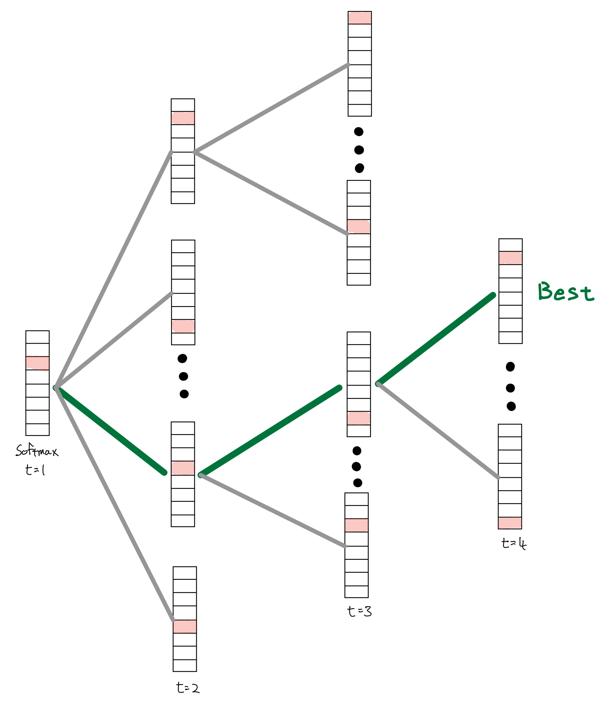
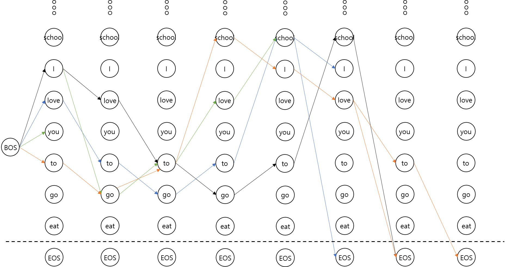
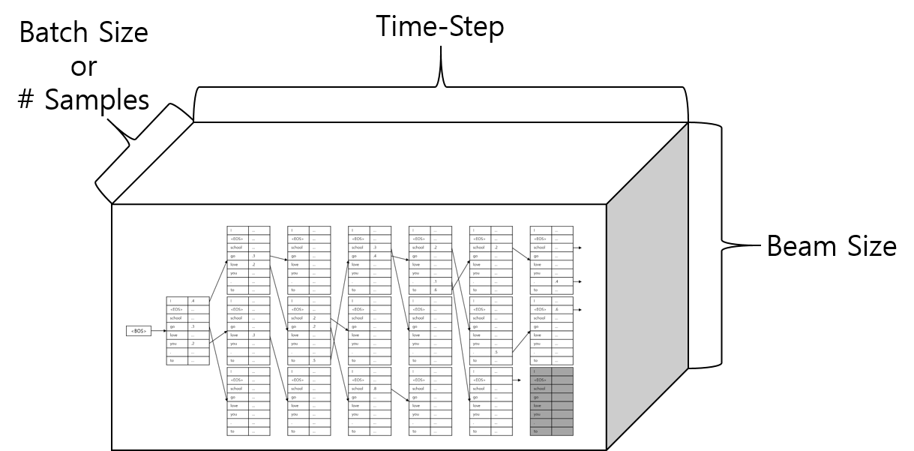
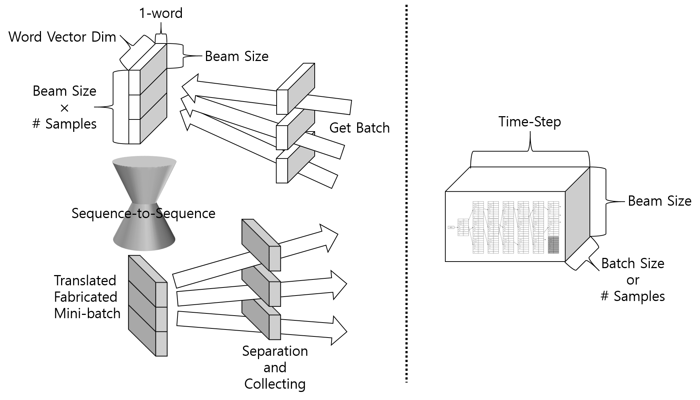

# 탐색(추론)

이제까지 $X$ 와 $Y$ 가 모두 주어진 훈련상황을 가정하였습니다만, 이제부터는 $X$ 만 주어진 상태에서 $\hat{Y}$ 을 추론(예측)하는 방법에 대해서 서술하겠습니다. 이러한 과정을 우리는 추론(inference) 또는 탐색(search)이라고 부릅니다. 우리가 기본적으로 이 방식을 탐색이라고 부르는 이유는 탐색 알고리즘(search algorithm)에 기반하기 때문입니다. 결국 우리가 원하는 것은 단어들 사이에서 최고의 확률을 갖는 경로(path)를 찾는 것이기 때문입니다. 따라서 이번 섹션에서는 머신러닝에 관한 소개를 하는 것이 아닌, 소프트웨어 엔지니어링 관점에서 살펴보도록 하겠습니다.

## 샘플링 (Sampling)

사실 먼저 우리가 생각할 수 있는 가장 정확한 방법은 각 time-step별 $\hat{y}_t$ 를 고를 때, 마지막 softmax 레이어에서의 확률 분포(probability distribution)대로 샘플링을 하는 것 입니다. 그리고 다음 time-step에서 그 선택( $\hat{y}_t$ )을 기반으로 다음 $\hat{y}_{t+1}$ 을 또 다시 샘플링하여 최종적으로 EOS가 나올 때 까지 샘플링을 반복하는 것 입니다. 이렇게 하면 우리가 원하는 $P(Y|X)$ 에 가장 가까운 형태의 번역이 완성될 겁니다. 하지만, 이러한 방식은 같은 입력에 대해서 매번 다른 출력 결과물을 만들어낼 수 있습니다. 따라서 우리가 원하는 형태의 결과물이 아닙니다.

$$\hat{y}_t\sim{P(\text{y}_t|X,\hat{y}_{<t};\theta)}$$

## 욕심쟁이 탐색 기법 (Gready Search)

우리는 자료구조, 알고리즘 수업에서 깊이우선탐색(DFS), 너비우선탐색(BFS), 다이나믹 프로그래밍(Dynamic Programming) 등 수많은 탐색 기법에 대해 배웠습니다. 우리는 이중에서 욕심쟁이(greedy) 알고리즘을 기반으로 탐색을 구현합니다. 즉, softmax 레이어에서 가장 확률 값이 큰 인덱스(index)를 뽑아 해당 time-step의 $\hat{y}_t$ 로 사용하게 되는 것 입니다.



$$\hat{y}_t=\underset{y\in\mathcal{Y}}{\text{argmax }}P(\text{y}_t|X,\hat{y}_{<t};\theta)$$

## 파이토치 예제코드

아래의 코드는 샘플링 또는 욕심쟁이 탐색기법을 위한 코드 입니다. 사실 인코더가 동작하는 부분까지는 완전히 똑같습니다. 다만, 이후 추론을 위한 부분은 기존 훈련 코드와 상이합니다. Teacher Forcing을 사용하였던 훈련 방식(실제 정답 $y_{t-1}$ 을 t time-step의 입력으로 사용함)과 달리, 실제 이전 time-step의 출력을 현재 time-step의 입력으로 사용 합니다.

```python
    def search(self, src, is_greedy=True, max_length=255):
        mask, x_length = None, None

        if isinstance(src, tuple):
            x, x_length = src
            mask = self.generate_mask(x, x_length)
        else:
            x = src
        batch_size = x.size(0)

        emb_src = self.emb_src(x)
        h_src, h_0_tgt = self.encoder((emb_src, x_length))
        h_0_tgt, c_0_tgt = h_0_tgt
        h_0_tgt = h_0_tgt.transpose(0, 1).contiguous().view(batch_size,
                                                            -1,
                                                            self.hidden_size
                                                            ).transpose(0, 1).contiguous()
        c_0_tgt = c_0_tgt.transpose(0, 1).contiguous().view(batch_size,
                                                            -1,
                                                            self.hidden_size
                                                            ).transpose(0, 1).contiguous()
        h_0_tgt = (h_0_tgt, c_0_tgt)

        # Fill a vector, which has 'batch_size' dimension, with BOS value.
        y = x.new(batch_size, 1).zero_() + data_loader.BOS
        is_undone = x.new_ones(batch_size, 1).float()
        decoder_hidden = h_0_tgt
        h_t_tilde, y_hats, indice = None, [], []

        # Repeat a loop while sum of 'is_undone' flag is bigger than 0, or current time-step is smaller than maximum length.
        while is_undone.sum() > 0 and len(indice) < max_length:
            # Unlike training procedure, take the last time-step's output during the inference.
            emb_t = self.emb_dec(y)
            # |emb_t| = (batch_size, 1, word_vec_dim)

            decoder_output, decoder_hidden = self.decoder(emb_t,
                                                          h_t_tilde,
                                                          decoder_hidden
                                                          )
            context_vector = self.attn(h_src, decoder_output, mask)
            h_t_tilde = self.tanh(self.concat(torch.cat([decoder_output,
                                                         context_vector
                                                         ], dim=-1)))
            y_hat = self.generator(h_t_tilde)
            # |y_hat| = (batch_size, 1, output_size)
            y_hats += [y_hat]

            if is_greedy:
                y = torch.topk(y_hat, 1, dim=-1)[1].squeeze(-1)
            else:
                # Take a random sampling based on the multinoulli distribution.
                y = torch.multinomial(y_hat.exp().view(batch_size, -1), 1)
            # Put PAD if the sample is done.
            y = y.masked_fill_((1. - is_undone).byte(), data_loader.PAD)
            is_undone = is_undone * torch.ne(y, data_loader.EOS).float()
            # |y| = (batch_size, 1)
            # |is_undone| = (batch_size, 1)
            indice += [y]

        y_hats = torch.cat(y_hats, dim=1)
        indice = torch.cat(indice, dim=-1)
        # |y_hat| = (batch_size, length, output_size)
        # |indice| = (batch_size, length)

        return y_hats, indice
```

가끔 너무 어렵거나 훈련 데이터에서 볼 수 없었던 형태의 문장이 인코딩되어 들어오거나, 훈련 데이터가 적어서 디코더가 잘 훈련되어 있지 않으면, 같은 단어를 반복하며 끝이 없는 문장을 뱉어내는 현상이 발생할 수 있습니다. 즉, EOS가 나오지 않는 상황이 발생할 수 있습니다.

|정상|비정상|
|-|-|
|나는 학교에 갑니다.|나는 학교에 학교에 학교에 학교에 학교에 학교에 ...|

따라서 우리는 위의 함수 입력에서 볼 수 있듯이, 최대 가능 문장 길이를 정해주어 끝이 없는 문장이 나오는 경우에 대비 합니다.

## 빔서치 (Beam Search)

하지만 우리는 자료구조와 알고리즘 수업에서 배웠다시피, 욕심쟁이 알고리즘은 굉장히 쉽고 간편하지만, 최적의(optimal) 해를 보장하지 않습니다. 따라서 최적의 해에 좀 더 가까워지기 위해서 우리는 약간의 트릭을 첨가합니다. k개의 후보를 더 추적하는 것 입니다. 이때 k를 빔(beam)의 크기라고 합니다.


<!--

-->

현재 time-step에서 최고 누적 확률을 가진 인덱스(index)의 단어 k개를 뽑아서, 다음 time-step에 대해서 k번 추론을 수행합니다. 그리고 총 $k * |V|$ 개의 softmax 결과 값 중에서 다시 최고 누적 확률 k개를 뽑아 다음 time-step으로 넘깁니다. <comment> $|V|$ 는 어휘 사전의 크기 입니다. </comment> 여기서 중요한 점은 두가지 입니다.

1. 누적 확률을 사용하여 최고 순위 k개를 뽑습니다. 이때 보통 로그 확률을 사용하므로 현재 time-step 까지의 로그 확률에 대한 합을 추적하고 있어야 합니다.
2. 이전 time-step에서 뽑힌 k개에 대해서 계산한 현재 time-step의 모든 결과물들 중에서 최고 누적확률 k개를 다시 뽑습니다. 이전 time-step의 k개에 대해서 각각 k개를 뽑는 것이 아닌것에 주의하세요.

빔서치를 사용하면 좀 더 넓은 경로에 대해서 탐색을 수행하므로 더 나은 성능을 보장합니다. 하지만 빔의 크기 만큼 번역을 더 수행해야 하기 때문에 속도에 저하가 있습니다. 다행히도 우리는 k번 반복해야 하는 이 작업을 병렬로 수행하여 문제를 해결할 수 있습니다. 따라서 매 time-step마다 임시로 기존의 미니배치에 k배가 곱해진 미니배치를 만들어 수행하면 됩니다. 물론 병렬 작업에 의해서 모든 문제가 해결되는 것은 아니기 때문에 속도 저하가 전혀 없지는 않습니다.

아래는 빔서치의 성능향상에 대한 실험 결과 입니다. 샘플링 방법은 단순한 욕심쟁이 탐색 기법보다 더 좋은 성능을 제공하지만, 결과적으로는 욕심쟁이 탐색기법이 발전된 알고리즘인 빔서치가 가장 좋은 성능을 보여줍니다.

|알고리즘|Valid 데이터셋 NLL(BLEU)|테스트 데이터셋 NLL(BLEU)|
|-|:-:|:-:|
|샘플링|22.98 (15.64)|26.25 (16.76)|
|욕심쟁이 탐색기법|27.88 (15.50)|26.49 (16.66)|
|빔서치 (k=5)|20.18 (17.03)|22.81 (18.56)|
|빔서치 (k=10)|19.92 (17.13)|22.44 (18.59)|

<reference> 출처: [Cho et al.,2016] </reference>

<!--
![각 추론 방법에 따른 성능 비교 - 출처: [Cho et al.,2016]](../assets/10-06-04.png)
-->

특기할 점은 기계번역 문제에서는 보통 빔의 크기를 10 이하로 사용한다는 것 입니다. 보통 빔의 크기가 커질수록 더 많은 과거 사항을 기억하기 때문에 유리해지지만, 기계번역에서는 10개 이상의 빔을 사용하는 것은 성능의 개선의 효과가 거의 없음을 알 수 있습니다.

### 구현 관점에서 바라보기

위의 그림은 하나의 샘플에 대해서 추론을 수행하기 위한 빔서치를 나타낸 그림 입니다. 여기서 빔의 크기 k=3 입니다. 보통 빔서치는 EOS가 k만큼 나올 때 까지 수행 됩니다. 즉, 아래에서는 3개 이상의 EOS가 출현하면 빔서치는 종료 됩니다. 아래의 그림에서는 마지막 직전의 time-step에서 1개의 EOS가 발생한 것을 볼 수 있고, EOS로부터 다시 이어지는 추론 대신에, 다른 2개의 추론 중에서 최고 누적확률 3개를 다시 선택 하는 것을 볼 수 있습니다. <comment> 우리는 EOS 이후의 해당 빔의 누적확률 값을 0을 주어 이것을 쉽게 구현할 수 있습니다. </comment> 참고로 k개 이상의 EOS가 등장하여 디코딩이 끝나고 최고 누적확률 k개를 뽑을 때는 누적 확률이 높은 순서대로 뽑게 됩니다.

$$\begin{gathered}
\text{Given }X={x_1,x_2,\cdots,x_n}, \\
\text{we need to find }b^* \\
\text{where }\mathcal{B}_t={b_t^1,b_t^2,\cdots,b_t^K}\text{ and }b_t^i=\{\hat{y}_1^i,\cdots,\hat{y}_t^i\}. \\
\\
\hat{y}_t^k=\underset{y\in\mathcal{Y}}{\text{argmax}^k}\big\{\log{P_\theta(\text{y}_t|X,b_{t-1}^1)}+\log{P_\theta(b_{t-1}^K|X)},\cdots,\log{P_\theta(\text{y}_t|X,b_{t-1}^1)}+\log{P_\theta(b_{t-1}^K|X)}\big\} \\
\begin{aligned}
b_t^k&=\{\hat{y}_1^k,\cdots,\hat{y}_{t-1}^k\}+\{\hat{y}_t^k\}=\{\hat{y}_1^k,\cdots,\hat{y}_t^k\} \\
&=\underset{b\in\mathcal{B}_t}{\text{argmax}^k}\big\{\log{P_\theta(\text{y}_t|X,b_{t-1}^1)}+\log{P_\theta(b_{t-1}^K|X)},\cdots,\log{P_\theta(\text{y}_t|X,b_{t-1}^1)}+\log{P_\theta(b_{t-1}^K|X)}\big\} + \{\hat{y}_t^k\}
\end{aligned} \\
\\
\begin{aligned}
\text{where }\log{P_\theta(b_{t}^i|X)}&=\log{P_\theta(\text{y}_t=\hat{y}_t^i|X)}+\log{P_\theta(b_{t}^i|X)} \\
&=\sum_{i=1}^{t}{\log{P_\theta(\text{y}_t=\hat{y}_t^i|X,\hat{y}_{<t}^i)}}
\end{aligned} \\
\\
\text{Pick best beam path }b, \\
\text{where }\hat{b}=\underset{b}{\text{argmax }}\big\{b_1^1,\cdots,b_1^k,b_2^1,\cdots,b_t^k:\text{where }b_j^i[-1]=\text{EOS}\big\}.
\\
\end{gathered}$$

예를 들어 $|V|=30,000$ 이고 k=3 라고 가정하겠습니다. 그럼 softmax 레이어의 유닛 갯수는 30,000개 입니다. 따라서 한 time-step의 예측 결과의 갯수는 $|V|\times k=90,000$ 가 됩니다. 이 9만개의 softmax 레이어 유닛(vocabulary의 각 단어)들의 각각의 확률 값에, 이전 time-step에서 선택된 빔(beam)의 누적 확률 값을 더해 최종 누적 확률 값 90,000개를 얻습니다. 여기서 총 90,000개의 누적 확률 값 중에서 최고의 k개를 뽑아, 다음 time-step의 예측을 위한 디코더의 입력으로 사용하게 됩니다. 이때 반복하는 k번의 작업을 for반복문을 사용해서 해결하는 것도 한가지 방법이겠지만, 우리는 더 나은 방법에 대해서 고민해야 할 것 입니다. 따라서 마치 미니배치 사이즈가 k인것 처럼 미니배치를 구성해서 sequence-to-sequence에 넣어주면 될 것 입니다. 이것은 한개의 문장이 주어졌을때 시나리오이고, 미니배치로 문장이 주어진다면 $\text{batch\_size}\times|V|\times{k}$ 가 될 것 입니다.



미니배치 단위로 문장이 입력으로 주어졌을 때, 빔서치를 병렬로 수행하기 위해서는 트릭이 필요합니다. 겉보기에는 복잡하고 어려워보일 수 있으나, 필요성과 기본 원리를 이해한다면 구현하는 것은 그렇게 어렵지 않을 것 입니다.



Sequence-to-sequence는 미니배치를 입력으로 받아 미니배치를 출력으로 반환합니다. 따라서 상황에 따라서 그때그때 필요한 입력들을 모아서 미니배치를 만들고, 그에 해당하는 출력을 미니배치로 받아서 입력에 대해서 필요한 출력을 나눠 가지면 되는 것 입니다. 아까 1개의 문장에 대해서 설명할 때, k번 반복하는 작업에 대해서 for 반복문을 사용하는 대신, 마치 미니배치 사이즈가 k개인것처럼 미니배치를 만들어 병렬 연산을 통해 구현하는 것을 이야기 하였습니다. m개의 문장이 주어지는 미니배치 상황에서도 똑같습니다. 각 문장별로 k번 반복하는 작업이 있기 때문에, 결국 최종 임시 미니배치 사이즈는 $m\times{k}$ 가 될 것 입니다. 우리는 매 time-step 마다 각 m개의 문장(샘플)별로 최고 누적확률 k개의 입력을 뽑아내서, $m\times{k}$ 크기의 미니배치를 구성하여 sequence-to-sequence에 입력으로 넣습니다. Sequence-to-sequence가 $m\times{k}$ 크기의 미니배치를 출력으로 반환하면, 다시 m개의 문장별로 k개씩 확률 분포를 뽑아서, 최고 누적확률을 계산하여 다음 time-step의 입력이 될 것을 정하면 됩니다.

### 빔서치 수행 결과 비교

실제 보통 빔서치를 제대로 구현하게 되면 BLEU 성능이 2 가량 올라가는 것을 볼 수 있습니다. 아래의 테이블은 빔의 크기 k=1인 단순한 욕심쟁이 탐색 기법일 때와, k=5인 빔서치의 결과를 비교한 것 입니다. 대체적으로 표현이 좀 더 풍부해지는 것을 느낄 수 있습니다.

|번호|빔 크기 k=1|빔 크기 k=5|
|-|-|-|
|1|너 스스로 말하고, 나를 위해 말하지마.|당신 자신을 위해 말하세요, 당신은 나를 위해 말하지 않아요.|
|2|걱정마. 난 그것에 익숙해.|걱정마. 난 그것에 익숙해져 있어.|
|3|너는 내 상사에게 말해야 한다.|너는 나의 상사에게 말해야 한다.|
|4|그녀는 그와 결혼하지 않기로 결심한 것을 느꼈다.|그녀는 그와 결혼하지 않기로 결심한 그녀의 결심을 느꼈다.|
|5|배달 채널을 삭제할 수 없습니다.|배달 채널이 삭제되지 않았습니다.|
|6|하지만 여러모로 나는 행복한 사람들이 나를 화나게 하지 않는다.|하지만 많은 면에서 나는 행복한 사람들이 나를 화나게 하지 않는다.|
|7|그 점원의 불의의 정중함은 나를 기분 좋게 만들었다.|그 점원의 예상치 못한 공손함이 나를 기분 좋게 만들었다.|
|8|내가 너의 조종사를 보고 있는 것을 신경쓰지 않기를 바란다.|내가 너의 조종사를 감시하는 것을 신경쓰지 않았으면 좋겠어.|
|9|저 소녀는 너와 이야기하고 싶어해.|저 소녀는 너에게 말하고 싶어해.|

특히 7번 번역문의 경우에 빔서치의 효과를 톡톡히 본것을 확인할 수 있습니다.

### 길이 패널티 (Length Penalty)

위의 탐색 알고리즘을 직접 짜서 수행시켜 보면 한가지 문제점이 발견됩니다. 현재 time-step 까지의 확률을 모두 곱(로그 확률의 경우에는 합)하기 때문에 문장이 길어질 수록 확률이 낮아진다는 점 입니다. 따라서 짧은 문장일수록 더 높은 점수를 획득하는 경향이 있습니다. 우리는 이러한 현상을 방지하기 위해서 예측한 문장의 길이에 따른 페널티를 주어 짧은 문장이 긴 문장을 제치고 선택되는 것을 방지합니다. 길이 패널티의 수식은 아래와 같습니다. 이를 위해서 우리는 2개의 추가적인 hyper-parameter가 필요합니다.

$$\begin{gathered}
\log{\tilde{P}(\hat{Y}|X)}=\log{P(\hat{Y}|X)}\times\text{penalty} \\
\text{penalty}=\frac{(1+\text{length})^\alpha}{(1+\beta)^\alpha} \\
\text{where }\beta\text{ is hyper-parameter of minimum length}.
\end{gathered}$$

## 파이토치 예제 코드

### SingleBeamSearchSpace 클래스

- URL: https://github.com/kh-kim/simple-nmt/blob/master/simple_nmt/search.py

#### 클래스 선언 및 초기화

```python
from operator import itemgetter

import torch
import torch.nn as nn

import data_loader

LENGTH_PENALTY = 1.2
MIN_LENGTH = 5


class SingleBeamSearchSpace():

    def __init__(self,
                 hidden,
                 h_t_tilde=None,
                 beam_size=5,
                 max_length=255
                 ):
        self.beam_size = beam_size
        self.max_length = max_length

        super(SingleBeamSearchSpace, self).__init__()

        # To put data to same device.
        self.device = hidden[0].device
        # Inferred word index for each time-step. For now, initialized with initial time-step.
        self.word_indice = [torch.LongTensor(beam_size).zero_().to(self.device) + data_loader.BOS]
        # Index origin of current beam.
        self.prev_beam_indice = [torch.LongTensor(beam_size).zero_().to(self.device) - 1]
        # Cumulative log-probability for each beam.
        self.cumulative_probs = [torch.FloatTensor([.0] + [-float('inf')] * (beam_size - 1)).to(self.device)]
        # 1 if it is done else 0
        self.masks = [torch.ByteTensor(beam_size).zero_().to(self.device)]

        # We don't need to remember every time-step of hidden states: prev_hidden, prev_cell, prev_h_t_tilde
        # What we need is remember just last one.
        # Future work: make this class to deal with any necessary information for other architecture, such as Transformer.

        # |hidden[0]| = (n_layers, 1, hidden_size)
        self.prev_hidden = torch.cat([hidden[0]] * beam_size, dim=1)
        self.prev_cell = torch.cat([hidden[1]] * beam_size, dim=1)
        # |prev_hidden| = (n_layers, beam_size, hidden_size)
        # |prev_cell| = (n_layers, beam_size, hidden_size)

        # |h_t_tilde| = (batch_size = 1, 1, hidden_size)
        self.prev_h_t_tilde = torch.cat([h_t_tilde] * beam_size,
                                        dim=0
                                        ) if h_t_tilde is not None else None
        # |prev_h_t_tilde| = (beam_size, 1, hidden_size)

        self.current_time_step = 0
        self.done_cnt = 0
```

#### 길이 패널티 구현하기

우리는 파일 초반에 길이 패널티의 두 하이퍼 파라미터를 미리 정의 해 놓았습니다. 이것을 사용하여 길이 패널티 함수를 구현 및 사용합니다.

```python
    def get_length_penalty(self,
                           length,
                           alpha=LENGTH_PENALTY,
                           min_length=MIN_LENGTH
                           ):
        # Calculate length-penalty, 
        # because shorter sentence usually have bigger probability.
        # Thus, we need to put penalty for shorter one.
        p = (1 + length) ** alpha / (1 + min_length) ** alpha

        return p
```

#### 디코딩 작업 종료 체크

EOS가 한개씩 나타날 때마다 'self.done_cnt'가 증가하도록 되어 있기 때문에, 빔의 크기 k 보다 'self.done_cnt'가 크면 디코딩(탐색) 작업이 종료 됩니다.

```python
    def is_done(self):
        # Return 1, if we had EOS more than 'beam_size'-times.
        if self.done_cnt >= self.beam_size:
            return 1
        return 0
```

#### 가짜 미니배치의 일부 만들기

매 time-step마다 sequence-to-sequence에게 1개의 문장에 대해서 k개의 입력이 주어져야 합니다. 배치사이즈가 m일 때, m개의 문장에 대해서 각각 k개의 입력이 될 것 입니다. 최종 미니배치의 사이즈는 $m\times{k}$ 가 될 것이므로, 그 일부인 k개를 반환하는 함수 입니다.

```python
    def get_batch(self):
        y_hat = self.word_indice[-1].unsqueeze(-1)
        hidden = (self.prev_hidden, self.prev_cell)
        h_t_tilde = self.prev_h_t_tilde

        # |y_hat| = (beam_size, 1)
        # |hidden| = (n_layers, beam_size, hidden_size)
        # |h_t_tilde| = (beam_size, 1, hidden_size) or None
        return y_hat, hidden, h_t_tilde
```

#### 최고 누적확률 k개를 고르기

매 time-step마다 k개의 결과값(softmax 레이어 결과값)을 받아서 이전 time-step으로부터의 빔서치 정보를 이용하여 누적확률을 계산하고, 최고 누적확률 k개를 뽑는 작업을 수행하는 함수 입니다. 'self.mask'의 값에 따라 이전에 EOS가 출현한 경우에는 직전 누적확률을 0(로그확률 마이너스 무한대)으로 만들어 계산하는 것을 볼 수 있습니다.

```python
    def collect_result(self, y_hat, hidden, h_t_tilde):
        # |y_hat| = (beam_size, 1, output_size)
        # |hidden| = (n_layers, beam_size, hidden_size)
        # |h_t_tilde| = (beam_size, 1, hidden_size)
        output_size = y_hat.size(-1)

        self.current_time_step += 1

        # Calculate cumulative log-probability.
        # First, fill -inf value to last cumulative probability, 
        # if the beam is already finished.
        # Second, expand -inf filled cumulative probability to fit to 'y_hat'. 
        # (beam_size) --> (beam_size, 1, 1) --> (beam_size, 1, output_size)
        # Third, add expanded cumulative probability to 'y_hat'
        cumulative_prob = y_hat + self.cumulative_probs[-1].masked_fill_(self.masks[-1], -float('inf')).view(-1, 1, 1).expand(self.beam_size, 1, output_size)
        # Now, we have new top log-probability and its index. We picked top index as many as 'beam_size'.
        # Be aware that we picked top-k from whole batch through 'view(-1)'.
        top_log_prob, top_indice = torch.topk(cumulative_prob.view(-1),
                                              self.beam_size,
                                              dim=-1
                                              )
        # |top_log_prob| = (beam_size)
        # |top_indice| = (beam_size)

        # Because we picked from whole batch, original word index should be calculated again.
        self.word_indice += [top_indice.fmod(output_size)]
        # Also, we can get an index of beam, which has top-k log-probability search result.
        self.prev_beam_indice += [top_indice.div(output_size).long()]

        # Add results to history boards.
        self.cumulative_probs += [top_log_prob]
        self.masks += [torch.eq(self.word_indice[-1],
                       data_loader.EOS)
                       ]  # Set finish mask if we got EOS.
        # Calculate a number of finished beams.
        self.done_cnt += self.masks[-1].float().sum()

        # Set hidden states for next time-step, using 'index_select' method.
        self.prev_hidden = torch.index_select(hidden[0],
                                              dim=1,
                                              index=self.prev_beam_indice[-1]
                                              ).contiguous()
        self.prev_cell = torch.index_select(hidden[1],
                                            dim=1,
                                            index=self.prev_beam_indice[-1]
                                            ).contiguous()
        self.prev_h_t_tilde = torch.index_select(h_t_tilde,
                                                 dim=0,
                                                 index=self.prev_beam_indice[-1]
                                                 ).contiguous()
```

#### 결과값 정리

디코딩이 종료되었을 때, 최종적으로 살아남은 k개의 빔(beam)에 대해서 최고 누적확률 n개를 고르고, 마지막 time-step에서부터 뒤로 역추적하여 문장을 복원하는 작업을 수행합니다.

```python
    def get_n_best(self, n=1):
        sentences, probs, founds = [], [], []

        for t in range(len(self.word_indice)):  # for each time-step,
            for b in range(self.beam_size):  # for each beam,
                if self.masks[t][b] == 1:  # if we had EOS on this time-step and beam,
                    # Take a record of penaltified log-proability.
                    probs += [self.cumulative_probs[t][b] / self.get_length_penalty(t)]
                    founds += [(t, b)]

        # Also, collect log-probability from last time-step, for the case of EOS is not shown.
        for b in range(self.beam_size):
            if self.cumulative_probs[-1][b] != -float('inf'):
                if not (len(self.cumulative_probs) - 1, b) in founds:
                    probs += [self.cumulative_probs[-1][b]]
                    founds += [(t, b)]

        # Sort and take n-best.
        sorted_founds_with_probs = sorted(zip(founds, probs),
                                          key=itemgetter(1),
                                          reverse=True
                                          )[:n]
        probs = []

        for (end_index, b), prob in sorted_founds_with_probs:
            sentence = []

            # Trace from the end.
            for t in range(end_index, 0, -1):
                sentence = [self.word_indice[t][b]] + sentence
                b = self.prev_beam_indice[t][b]

            sentences += [sentence]
            probs += [prob]

        return sentences, probs
```

### 병렬 빔서치 수행 함수

아래의 함수는 기존의 seq2seq.py 파일내에 함수로 정의되어 있습니다. 배치사이즈 m 일때, 매 time-step마다 m개의 'SingleBeamSearchSpace' 객체로부터 k개의 입력을 받아 미니배치를 임시로 구성하고, sequence-to-sequence에 통과시켜 얻은 결과값을 다시 m개의 'SingleBeamSearchSpace' 객체에게 k개씩 나누어줍니다.

- URL: https://github.com/kh-kim/simple-nmt/blob/master/simple_nmt/seq2seq.py

```python
    def batch_beam_search(self, src, beam_size=5, max_length=255, n_best=1):
        mask, x_length = None, None

        if isinstance(src, tuple):
            x, x_length = src
            mask = self.generate_mask(x, x_length)
            # |mask| = (batch_size, length)
        else:
            x = src
        batch_size = x.size(0)

        emb_src = self.emb_src(x)
        h_src, h_0_tgt = self.encoder((emb_src, x_length))
        # |h_src| = (batch_size, length, hidden_size)
        h_0_tgt, c_0_tgt = h_0_tgt
        h_0_tgt = h_0_tgt.transpose(0, 1).contiguous().view(batch_size,
                                                            -1,
                                                            self.hidden_size
                                                            ).transpose(0, 1).contiguous()
        c_0_tgt = c_0_tgt.transpose(0, 1).contiguous().view(batch_size,
                                                            -1,
                                                            self.hidden_size
                                                            ).transpose(0, 1).contiguous()
        # |h_0_tgt| = (n_layers, batch_size, hidden_size)
        h_0_tgt = (h_0_tgt, c_0_tgt)

        # initialize 'SingleBeamSearchSpace' as many as batch_size
        spaces = [SingleBeamSearchSpace((h_0_tgt[0][:, i, :].unsqueeze(1),
                                         h_0_tgt[1][:, i, :].unsqueeze(1)
                                         ),
                                        None,
                                        beam_size,
                                        max_length=max_length
                                        ) for i in range(batch_size)]
        done_cnt = [space.is_done() for space in spaces]

        length = 0
        # Run loop while sum of 'done_cnt' is smaller than batch_size, 
        # or length is still smaller than max_length.
        while sum(done_cnt) < batch_size and length <= max_length:
            # current_batch_size = sum(done_cnt) * beam_size

            # Initialize fabricated variables.
            # As far as batch-beam-search is running, 
            # temporary batch-size for fabricated mini-batch is 
            # 'beam_size'-times bigger than original batch_size.
            fab_input, fab_hidden, fab_cell, fab_h_t_tilde = [], [], [], []
            fab_h_src, fab_mask = [], []

            # Build fabricated mini-batch in non-parallel way.
            # This may cause a bottle-neck.
            for i, space in enumerate(spaces):
                # Batchfy only if the inference for the sample is still not finished.
                if space.is_done() == 0:
                    y_hat_, (hidden_, cell_), h_t_tilde_ = space.get_batch()

                    fab_input += [y_hat_]
                    fab_hidden += [hidden_]
                    fab_cell += [cell_]
                    if h_t_tilde_ is not None:
                        fab_h_t_tilde += [h_t_tilde_]
                    else:
                        fab_h_t_tilde = None

                    fab_h_src += [h_src[i, :, :]] * beam_size
                    fab_mask += [mask[i, :]] * beam_size

            # Now, concatenate list of tensors.
            fab_input = torch.cat(fab_input, dim=0)
            fab_hidden = torch.cat(fab_hidden, dim=1)
            fab_cell = torch.cat(fab_cell, dim=1)
            if fab_h_t_tilde is not None:
                fab_h_t_tilde = torch.cat(fab_h_t_tilde, dim=0)
            fab_h_src = torch.stack(fab_h_src)
            fab_mask = torch.stack(fab_mask)
            # |fab_input| = (current_batch_size, 1)
            # |fab_hidden| = (n_layers, current_batch_size, hidden_size)
            # |fab_cell| = (n_layers, current_batch_size, hidden_size)
            # |fab_h_t_tilde| = (current_batch_size, 1, hidden_size)
            # |fab_h_src| = (current_batch_size, length, hidden_size)
            # |fab_mask| = (current_batch_size, length)

            emb_t = self.emb_dec(fab_input)
            # |emb_t| = (current_batch_size, 1, word_vec_dim)

            fab_decoder_output, (fab_hidden, fab_cell) = self.decoder(emb_t,
                                                                      fab_h_t_tilde,
                                                                      (fab_hidden, fab_cell)
                                                                      )
            # |fab_decoder_output| = (current_batch_size, 1, hidden_size)
            context_vector = self.attn(fab_h_src, fab_decoder_output, fab_mask)
            # |context_vector| = (current_batch_size, 1, hidden_size)
            fab_h_t_tilde = self.tanh(self.concat(torch.cat([fab_decoder_output,
                                                             context_vector
                                                             ], dim=-1)))
            # |fab_h_t_tilde| = (current_batch_size, 1, hidden_size)
            y_hat = self.generator(fab_h_t_tilde)
            # |y_hat| = (current_batch_size, 1, output_size)

            # separate the result for each sample.
            cnt = 0
            for space in spaces:
                if space.is_done() == 0:
                    # Decide a range of each sample.
                    from_index = cnt * beam_size
                    to_index = from_index + beam_size

                    # pick k-best results for each sample.
                    space.collect_result(y_hat[from_index:to_index],
                                         (fab_hidden[:, from_index:to_index, :],
                                          fab_cell[:, from_index:to_index, :]
                                          ),
                                         fab_h_t_tilde[from_index:to_index]
                                         )
                    cnt += 1

            done_cnt = [space.is_done() for space in spaces]
            length += 1

        # pick n-best hypothesis.
        batch_sentences = []
        batch_probs = []

        # Collect the results.
        for i, space in enumerate(spaces):
            sentences, probs = space.get_n_best(n_best)

            batch_sentences += [sentences]
            batch_probs += [probs]

        return batch_sentences, batch_probs
```
