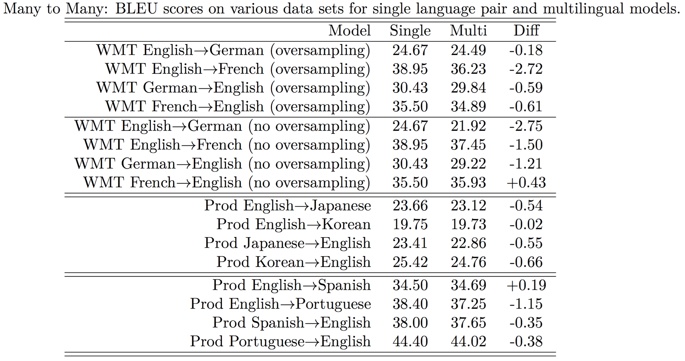

# 다국어 신경망 번역

이제부터는 기계번역의 성능을 끌어올리기 위한 고급 기법들을 설명하고자 합니다. 코드를 직접 구현하고 실습을 해 보기보단, 논문을 소개하는 위주가 될 것 입니다. 앞으로 소개할 기술(논문)들은 일부는 기계번역에만 적용 가능한 기술들도 있지만, 자연어 생성 또는 시퀀스 데이터 생성에 응용될 수 있는 기술들도 있습니다. 기존의 번역 시스템이 sequence-to-sequence를 필두로 어느정도 안정된 성능을 제공함에 따라서, 이를 활용한 여러가지 추가적인 연구 주제가 생겨났습니다. 하나의 end2end 모델에서 여러 언어쌍의 번역을 동시에 제공하는 다국어(multi-lingual) 기계번역이 그 주제중에 하나입니다.

## 제로샷 학습(Zero-shot Learning)

이 흥미로운 방법은 [[Johnson at el.2016]](https://arxiv.org/pdf/1611.04558.pdf)에서 제안 되었습니다. 이 방식의 특징은 여러 언어 쌍의 병렬 코퍼스를 하나의 모델에 훈련하면 부가적으로 학습에 참여한 코퍼스에 존재하지 않는 언어쌍도 번역이 가능하다는 것 입니다. 즉 한번도 기계번역 모델에게 데이터를 보여준 적이 없지만, 해당 언어쌍 번역을 처리할 수 있기 때문에, 제로샷 학습이라는 이름이 붙었습니다. 뿐만 아니라, 병렬 코퍼스에서 특정 언어쌍이 적은 경우에도 부가적인 효과를 발휘 합니다.

구현하는 방법은 너무나도 간단합니다. 아래와 같이 기존 병렬 코퍼스의 맨 앞에 특수 토큰을 삽입하고 훈련을 함으로써 완성됩니다. 삽입된 토큰에 따라서 타겟(target) 언어가 결정됩니다.

||소스 언어|타겟 언어|
|-|-|-|
|기존|Hello, how are you? | Hola, ¿cómo estás? |
|제로샷| $<2\text{es}>$ Hello, how are you? | Hola, ¿cómo estás? |

실험의 목표는 단순히 다국어 신경망 기계학습 end2end 모델을 구현하는 것이 아닌, 서로 다른 언어쌍의 코퍼스를 활용하여 번역기의 모든 언어쌍에 대해 전체적인 성능을 올릴 수 있는가에 대한 관점도 있습니다. 이에 따라 실험은 크게 4가지 관점에서 수행되었습니다.

|번호|방법|설명|
|-|-|-|
|1|다수의 언어에서 한 언어로|다수의 언어를 인코더에 넣고 훈련시킵니다.|
|2|한 언어에서 다수의 언어로|다수의 언어를 디코더에 넣고 훈련시킵니다.|
|3|다수 언어에서 다수 언어로|다수의 언어를 인코더와 디코더에 모두 넣고 훈련시킵니다.|
|4|제로샷 번역|위의 방법으로 훈련된 모델에서 훈련 코퍼스에 존재하지 않던 언어쌍의 번역 성능을 평가합니다.|

언어가 다른 코퍼스를 하나로 합치다보면 양이 다르기 때문에 이에 대한 대처 방법도 정의 되어야 합니다. 따라서 아래의 실험들에서 오버샘플링(oversampling) 기법의 사용 유무도 같이 실험이 되었습니다. 오버샘플링 기법은 양이 적은 코퍼스를 양이 많은 코퍼스에 양과 비슷하도록 (데이터를 반복시켜) 양을 늘려 맞춰주는 방법을 말합니다.

### 다수의 언어에서 하나의 언어로 (Many to One)

<!--

-->

|그룹|방법|기존 방법|제안 방법|차이|
|-|-|-|-|-|
|1|WMT 독일어 $\rightarrow$ 영어 (오버샘플링) | 30.43 | 30.59 | +.16 |
||WMT 프랑스어 $\rightarrow$ 영어 (오버샘플링) | 35.50 | 35.73 | +.23 |
|2|WMT 독일어 $\rightarrow$ 영어 | 30.43 | 30.54 | +.11 |
||WMT 프랑스어 $\rightarrow$ 영어 | 35.50 | 36.77 | +1.27 |
|3|일본어 $\rightarrow$ 영어 (오버샘플링) | 23.41 | 23.87 | +.46 |
||한국어 $\rightarrow$ 영어 (오버샘플링) | 25.42 | 25.47 | +.05 |
|4|스페인어 $\rightarrow$ 영어 (오버샘플링) | 38.00 | 38.73 | +.73 |
||포르투갈어 $\rightarrow$ 영어 (오버샘플링) | 44.40 | 45.19 | +.79 |

이 실험에서는 전체적으로 성능이 향상 된 것을 볼 수 있습니다. 실제 문제로 주어진 언어 데이터셋 이외에도, 동시에 훈련된 다른 언어의 데이터셋을 통해서도 해당 언어의 번역성능을 높이기 위한 정보를 추가로 얻을 수 있는 것을 알 수 있습니다.

### 하나의 언어에서 다수의 언어로 (One to Many)

<!--

-->

|그룹|방법|기존 방법|제안 방법|차이|
|-|-|-|-|-|
|1|WMT 영어 $\rightarrow$ 독일어 (오버샘플링) | 24.67 | 24.97 | +.30 |
||WMT 영어 $\rightarrow$ 프랑스어 (오버샘플링) | 38.95 | 36.84 | -2.11 |
|2|WMT 영어 $\rightarrow$ 독일어 | 24.67 | 22.61 | -2.06 |
||WMT 영어 $\rightarrow$ 프랑스어 | 38.95 | 38.16 | -0.79 |
|3|영어 $\rightarrow$ 일본어 (오버샘플링) | 23.66 | 23.73 | +.07 |
||영어 $\rightarrow$ 한국어 (오버샘플링) | 19.75 | 19.58 | -.17 |
|4|영어 $\rightarrow$ 스페인어 (오버샘플링) | 34.50 | 35.40 | +.90 |
||영어 $\rightarrow$ 포르투갈어 (오버샘플링) | 38.40 | 38.63 | +.23 |

이 실험에서는 이전 실험과 달리 성능의 향상이 있다고 보기 힘듭니다. 게다가 오버샘플링과 관련해서 코퍼스의 양이 적은 영어/독일어 언어쌍 코퍼스는 오버샘플링의 이득을 본 반면, 양이 충분한 영어/프랑스어 언어쌍 코퍼스의 경우에는 오버샘플링을 하면 더 큰 손해를 보는 것을 볼 수 있습니다.

### 다수의 언어에서 다수의 언어로 (Many to Many)

<!--

-->

|그룹|방법|기존 방법|제안 방법|차이|
|-|-|-|-|-|
|1|WMT 영어 $\rightarrow$ 독일어 (오버샘플링) | 24.67 | 24.49 | -.18 |
||WMT 영어 $\rightarrow$ 프랑스어 (오버샘플링) | 38.95 | 36.23 | -2.72 |
||WMT 독일어 $\rightarrow$ 영어 (오버샘플링) | 30.43 | 29.84 | -.59 |
||WMT 프랑스어 $\rightarrow$ 영어 (오버샘플링) | 35.50 | 34.89 | -.61 |
|2|WMT 영어 $\rightarrow$ 독일어 | 24.67 | 21.92 | -2.75 |
||WMT 영어 $\rightarrow$ 프랑스어 | 38.95 | 37.45 | -1.50 |
||WMT 독일어 $\rightarrow$ 영어 | 30.43 | 29.22 | -1.21 |
||WMT 프랑스어 $\rightarrow$ 영어 | 35.50 | 35.93 | +.43 |
|3|영어 $\rightarrow$ 일본어 (오버샘플링) | 23.66 | 23.12 | -.54 |
||영어 $\rightarrow$ 한국어 (오버샘플링) | 19.75 | 19.73 | -.02 |
||일본어 $\rightarrow$ 영어 (오버샘플링) | 23.41 | 22.86 | -.55 |
||한국어 $\rightarrow$ 영어 (오버샘플링) | 25.42 | 24.76 | -.66 |
|4|영어 $\rightarrow$ 스페인어 (오버샘플링) | 34.50 | 34.69 | +.19 |
||영어 $\rightarrow$ 포르투갈어 (오버샘플링) | 38.40 | 37.25 | -1.15 |
||스페인어 $\rightarrow$ 영어 (오버샘플링) | 38.00 | 37.65 | -.35 |
||포르투갈어 $\rightarrow$ 영어 (오버샘플링) | 44.40 | 44.02 | -.38 |

이 실험에서도 대부분의 실험결과가 성능의 하락으로 이어졌습니다. 물론 다양한 언어쌍을 하나의 모델에 몰아넣어 훈련한 것 치고는 절대적인 BLEU 수치는 쓸만합니다. 하지만 실제 필드에서 필요할지는 의문 입니다.

### 제로샷 번역 테스트

<!--

-->

|번호|방법|제로샷|BLEU|
|:-:|-|-|-|
|a|PBMT 브릿지|X|28.99|
|b|NMT 브릿지|X|30.91|
|c|NMT 포르투갈어 $\rightarrow$ 스페인어 |X|31.50|
|d|모델1: 포르투갈어 $\rightarrow$ 영어, 영어 $\rightarrow$ 스페인어 |O|21.62|
|e|모델2: 영어 $\leftrightarrow$ 포르투갈어, 스페인어|O|24.75|
|f|모델2 + incremental 학습|X|31.77|

이 실험은 제로샷 학습의 성능을 평가하였습니다. 위 테이블의 브릿지(bridged) 방법은 중간 언어를 영어로 하여 포르투갈어 $\rightarrow$ 영어 $\rightarrow$ 스페인어 2단계에 걸쳐 번역을 한 경우를 말합니다. <comment> PBMT 방식은 통계적 기계번역(SMT) 방식 중의 하나입니다. </comment> NMT 포르투갈어 $\rightarrow$ 스페인어는 단순 병렬 코퍼스를 활용하여 기존의 방법대로 훈련한 베이스라인 입니다. 제로샷 훈련 방식으로는 물론 절대 넘을 수 없는 수치가 될 것 입니다.

'모델1'은 포르투갈어 $\rightarrow$ 영어, 영어 $\rightarrow$ 스페인어를 한 모델에 훈련한 버전 입니다. 그리고 모델2는 영어 $\leftrightarrow$ 포르투갈어, 영어 $\leftrightarrow$ 스페인어 코퍼스를 한 모델에 훈련한 방법 입니다. '모델2'는 총 4가지 코퍼스를 훈련 한 점을 주의해야 합니다. 마지막으로 '모델2 + incremental' 학습 방식은 $(c)$ 보다 적은양의 병렬 코퍼스를 가지고 훈련한 기존의 모델에 추가적으로 모델2 방식으로 훈련한 모델 입니다.

비록 '모델1'과 '모델2'는 훈련 중에 한번도 포르투갈어 $\rightarrow$ 스페인어 병렬 코퍼스를 보지 못했지만, 20이 넘는 BLEU를 보여주는 것을 알 수 있습니다. 하지만 물론 브릿지 방식의 $(a),(b)$ 보다 성능이 떨어지는 것을 알 수 있습니다. 다행히도 $(f)$의 경우에는 $(c)$보다 큰 차이는 아니지만 성능이 뛰어난 것을 알 수 있습니다. 따라서 우리는 병렬 코퍼스의 양이 얼마 되지 않는 언어쌍의 번역기를 훈련할 때에 위와 같은 방법을 통해서 성능을 끌어올릴 수 있음을 알 수 있습니다.

## 다른 활용 방안

위와 같이 여러가지 다양한 언어쌍을 하나의 모델에 넣고 훈련하는 다국어 기계번역 모델로서는 의의가 있지만, 성능에 있어서는 큰 이득이 없었기 때문에 실제 사용에는 한계가 있습니다. 더군다나 훈련 데이터의 양이 적은 언어쌍에 대해서는 성능의 향상이 있지만 뒤 챕터에 설명할 방법들을 사용하면 그다지 좋은 방법은 아닙니다.

하지만 우리는 합성 토큰을 추가하는 방식을 다른 곳에서도 응용할 수 있습니다. 다른 도메인의 데이터를 하나로 모아 번역기를 훈련시키는 과정에 사용 가능합니다. 예를 들어 코퍼스를 뉴스기사와 미드 자막에서 각각 모았다고 가정하면, 문어체와 대화체로 도메인을 나누어 특수 토큰을 추가하여 우리가 원하는대로 번역문의 말투를 바꾸어줄 수 있을 겁니다. 또는 마찬가지로 의료용과 법률용으로 나누어 번역기의 모드를 바꾸어줄 수 있을 겁니다.

이것은 이전 언어모델 챕터에서 두 언어모델을 합치는 인터폴레이션(interpolation)에 대해서 설명할 때와 유사합니다. 비록 언어쌍은 같지만 서로 다른 도메인의 코퍼스를 위와 같은 방식으로 합쳐서 훈련한다면, 같은 언어쌍 훈련 데이터이기 때문에 서로 다른 도메인의 코퍼스라 할지라도 시너지를 받아서 전체적인 성능이 올라가는 효과를 얻을 수 있을 겁니다.
