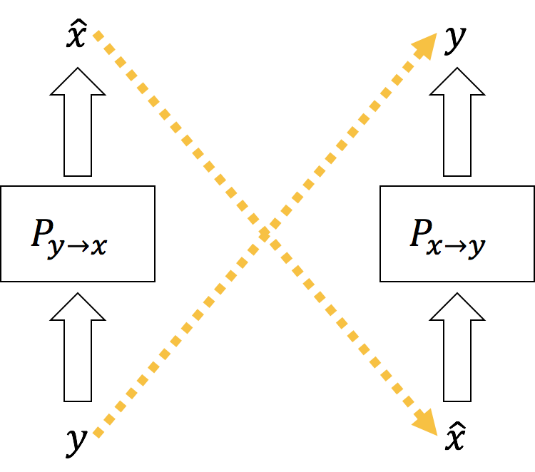
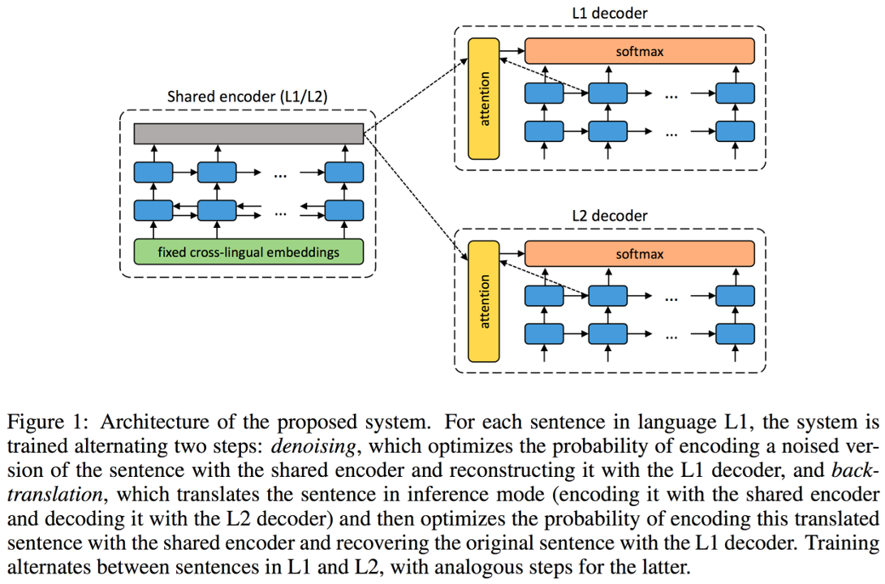
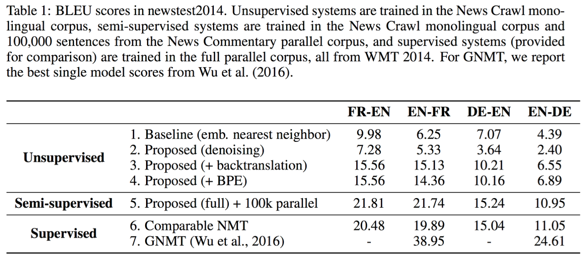

# 단방향 코퍼스를 활용하기

번역 시스템을 훈련하기 위해서는 다량의 병렬코퍼스가 필요합니다. 필자의 경험상 대략 300만 문장쌍이 있으면 완벽하지는 않지만 나름 쓸만한 번역기가 나오기 시작합니다. 하지만 인터넷에는 정말 수치로 정의하기도 힘들 정도의 단방향 코퍼스(monolingual corpus)가 널려 있는데 반해서, 이러한 병렬 코퍼스를 대량으로 얻는 것은 굉장히 어려운 일입니다. 또한, 단방향 코퍼스가 그 양이 많기 때문에 실제 우리가 사용하는 언어의 확률 분포에 좀 더 가까울 수 있고, 따라서 더 나은 언어모델을 학습함에 있어서 훨씬 유리합니다. 즉, 앞으로 소개할 기법들은 병렬 코퍼스 이외에도 추가적으로 다량의 단방향 코퍼스를 활용하여 해당 언어의 언어모델을 보완하는 것이 주 목적입니다. 이번 섹션은 이러한 값 싼 단방향 코퍼스를 활용하여 신경망 기계번역 시스템의 성능을 쥐어짜는 방법들에 대해서 다룹니다.

## 언어모델 앙상블

![[[Gulcehre at el.2015]](https://arxiv.org/pdf/1503.03535.pdf)](../assets/11-02-01.png)

이 방법은 벤지오(Bengio) 교수의 연구실에서 제안 된 방법[[Gulcehre at el.2015]](https://arxiv.org/pdf/1503.03535.pdf)입니다. 언어모델을 명시적으로 앙상블하여 디코더의 성능을 올리고자 하였습니다. 두 개의 다른 모델을 쓴 "shallow fusion" 방법 보다, 언어모델을 Sequence-to-Sequence에 포함시켜 end2end 학습을 통해 한 개의 모델로 만든 "deep fusion" 방법이 좀 더 나은 성능을 나타냈습니다. 두 방식 모두 단방향 코퍼스를 활용하여 언어모델을 학습한 이후 실제 번역기를 훈련시킬 때에는 네트워크 파라미터 값을 고정한 상태로 sequence-to-sequence 모델을 훈련합니다.

<!--
![[[Gulcehre at el.2015]](https://arxiv.org/pdf/1503.03535.pdf)](../assets/11-02-02.png)
-->

|방법|실험 1|실험 2|실험 3|실험 4|
|-|-|-|-|-|
|NMT|18.40|18.77|19.86|18.64|
|NMT+LM (Shallow)|18.48|18.80|19.87|18.66|
|NMT+LM (Deep)|20.17|20.23|21.34|20.56|

위 테이블은 터키어 $\rightarrow$ 영어 기계번역 성능을 각 방법을 적용하여 실험 한 결과 입니다. 비록 뒤에 다룰 내용들보다 성능 상의 이득이 적지만, 이 방법의 장점은 수집한 단방향 코퍼스를 전부 활용 할 수 있다는 것입니다.

## Dummy 문장을 활용하기

아래의 내용들은 전부 [에딘버러(Edinburgh) 대학의 Nematus 번역시스템](https://arxiv.org/pdf/1708.00726.pdf)에서 제안되고 사용된 내용들입니다. 이 페이퍼[[Sennrich et al.,2015]](https://arxiv.org/pdf/1511.06709.pdf)의 저자인 리코 센리치(Rico Sennrich)는 좀 전의 내용처럼 명시적으로 언어모델을 앙상블하는 대신, 디코더로 하여금 단방향 코퍼스를 학습할 수 있게 하는 방법을 제안하였습니다. 예전 챕터에서 다루었듯이 sequence-to-sequence의 디코더는 조건부 뉴럴 네트워크 언어모델(Conditional Neural Network Language Model)이라고 할 수 있는데, 소스(source) 문장인 $X$ 를 빈 입력으로 넣어줌으로써, (그리고 어텐션등을 모두 드랍아웃하여 끊어줌으로써) 인코더로부터 전달되는 정보들을 없애는 것이 이 방법의 핵심입니다. 저자는 이 방법을 사용하면 디코더가 단방향 코퍼스를 활용하여 언어모델을 학습하는 것과 같다고 하였습니다.

## Back Translation

그리고 같은 [[Sennrich et al.,2015](https://arxiv.org/pdf/1511.06709.pdf)]에서 좀 더 발전된 다른 방법을 제시하였습니다. 이 방법은 기존의 훈련된 반대 방향 번역기를 사용하여 단방향 코퍼스를 기계번역하여 합성(synthetic) 벙렬 코퍼스를 만든 후, 이것을 기존 양방향 병렬 코퍼스에 추가하여 훈련에 사용하는 방식 입니다. 중요한 점은 기계번역에 의해 만들어진 합성 병렬 코퍼스를 사용할 때, 반대 방향의 번역기의 훈련에 사용한다는 것 입니다.

사실 우리는 번역기를 만들게 되면 하나의 병렬 코퍼스를 가지고 두개의 번역 모델을 만들 수 있습니다. 예를 들어 한국어와 영어로 이루어진 병렬 코퍼스가 있다면, 자연스럽게 우리는 영한 번역기 뿐만 아니라, 한영 번역기도 얻게 될 것 입니다. 따라서 이 방법은 이렇게 동시에 얻어지는 두 개의 모델을 활용하여 서로 보완하여 성능을 향상 시키는 방법을 제시합니다.

$$\begin{gathered}
\hat{\theta}_e=\underset{\theta}{\text{argmax}}P_{f \rightarrow e}(e|\hat{f};\theta_e) \\
\text{where }\hat{f}=\underset{f}{\text{argmax}}P_{e \rightarrow f}(f|e;\theta_f)
\end{gathered}$$

예를 들어, 한국어 단방향 코퍼스가 있을 때, 이것을 기존에 훈련된 한 $\rightarrow$ 영 번역기에 기계번역시켜 한영 합성 병렬 코퍼스를 만들고, 이것을 기존에 수집한 오리지널 한영 병렬 코퍼스와 합쳐, 영 $\rightarrow$ 한 번역기를 훈련시키는데 사용하는 것 입니다. 이러한 방법의 특성 때문에 back translation이라고 명명되었습니다.

<!--
![[[Sennrich at el.2015]](https://arxiv.org/pdf/1511.06709.pdf)](../assets/11-02-04.png)
-->

|방법|병렬 코퍼스 크기|단방향 코퍼스 크기|실험 1|실험 2|
|-|:-:|:-:|-|-|
|기존|3,700만||19.9|22.8|
|+ dummy|4,900만|4,900만|20.4|23.2|
|+ back translation|4,400만|3,600만|22.7|25.7|

위의 테이블은 dummy 문장을 활용한 방법과 back translation 방식에 대해서 영어 $\rightarrow$ 독일어 성능을 실험한 결과 입니다. 두 가지 방법 모두 사용하였을 때에 성능이 제법 향상된 것을 볼 수 있습니다. 병렬 코퍼스와 거의 같은양의 단방향 코퍼스가 각각 사용되었습니다. 위에서 언급했듯이, 명시적으로 언어모델 앙상블하는 방식에서는 코퍼스 사용량의 제한이 없었지만, 이 방식에서는 기존의 병렬 코퍼스와 합성한 병렬 코퍼스를 섞어서 동시에 훈련에 사용하기 때문에, 단방향 코퍼스의 양이 너무 많아, 너무 많은 합성 병렬 코퍼스가 생성되어 사용되게 되면, 주객전도 현상이 일어날 수 있습니다. 따라서 그 양을 제한하여 훈련에 사용해야 합니다.

## Copied Translation

이 방식은 같은 저자인 Rich Sennrich에 의해서 [[Currey et al.,2017]](https://kheafield.com/papers/edinburgh/copy_paper.pdf)에서 제안 되었습니다. 앞서 설명한 기존의 더미 문장을 활용한 방식에서 좀 더 발전한 방식입니다. 기존의 방식 대신에 소스(source) 쪽과 타겟(target) 쪽에 똑같은 데이터를 넣어 훈련시키는 것 입니다. 기존의 더미 문장을 인코더에 넣는 방식은 인코더에서 디코더로 가는 길을 훈련 시에 드랍아웃 처리 해주어야 했지만, 이 방식은 그럴 필요가 없어진 것이 장점입니다. 하지만 소스 언어의 어휘(vocabulary)에 타겟 언어(target language)의 어휘가 포함되어야 하는 불필요함을 감수해야 합니다. 보통은 back-translation 방식과 함께 사용 됩니다.

<!--
![[[Sennrich at el.2017]](https://arxiv.org/pdf/1708.00726.pdf)](../assets/11-02-05.png)
-->

|방법|터키어 $\rightarrow$ 영어|영어 $\rightarrow$ 터키어|
|-|:-:|:-:|
|back-translation|19.7|14.7|
|+copied|19.7|15.6|

## 결론

위와 같이 여러 방법들이 제안되었지만, 위의 방법 중에서는 구현 방법의 용이성과 효율성 때문에 back translation과 coplied translation이 가장 많이 쓰이는 추세입니다. 이 두 방법은 매우 직관적이고 간단한 방법임에도 불구하고 효과적인 성능 향상을 얻을 수 있습니다.

<!--
## Unsupervised Neural Machine Translation

[[Artetxe at el.2017]](https://arxiv.org/pdf/1710.11041.pdf)

-->
