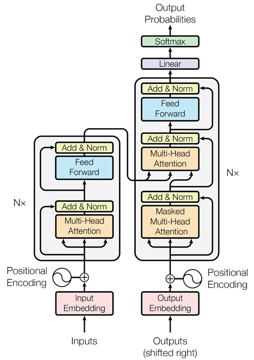
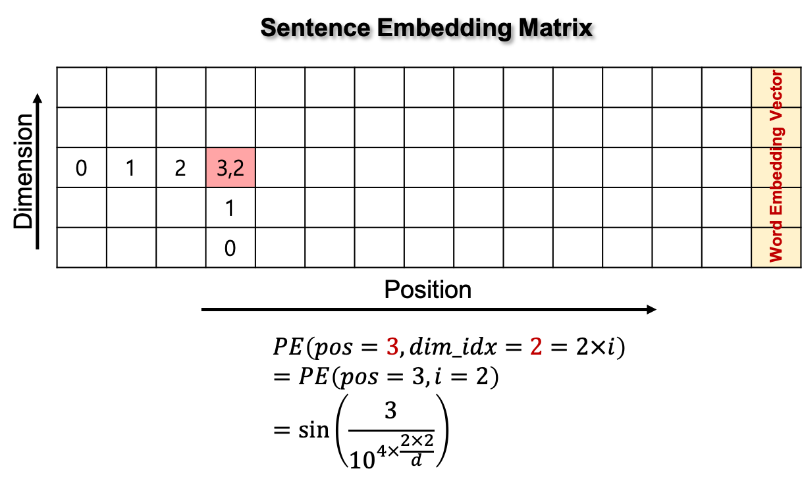
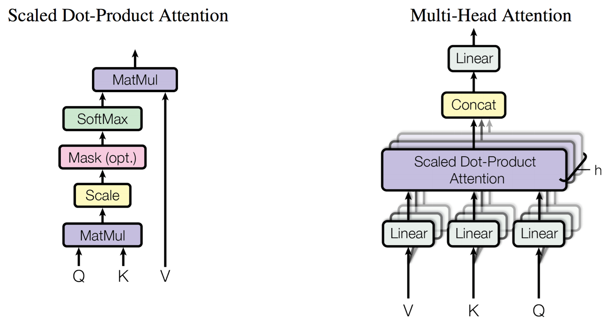
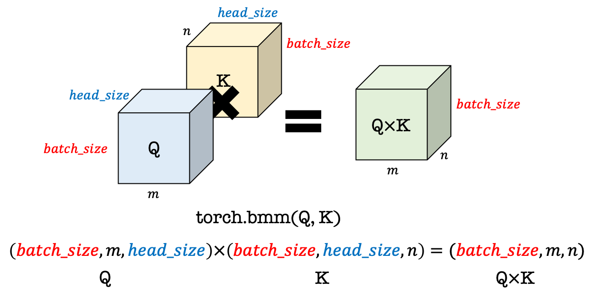
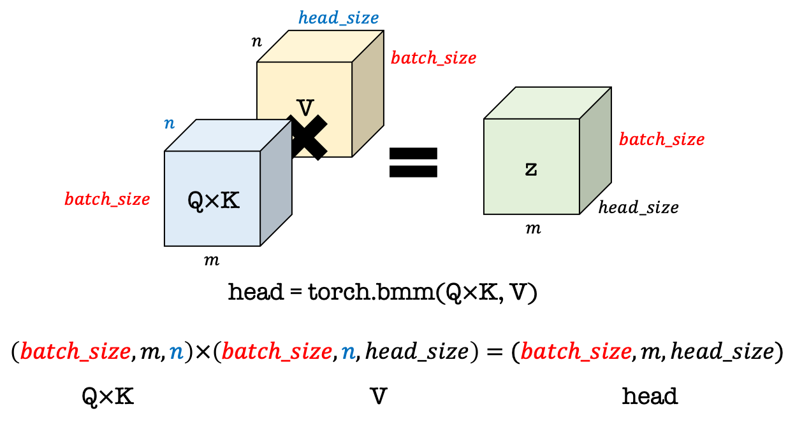

# 트랜스포머(Transformer, Attention is All You Need)

페이스북에서 CNN을 활용한 번역기에 대한 논문 <comment> [[Gehring et al.2017]](https://arxiv.org/pdf/1705.03122.pdf) </comment>을 내며, 기존의 구글 신경망 번역기보다 속도나 성능면에서 뛰어남을 자랑하자, 이에 질세라 구글에서 바로 곧이어 발표한 [Attention is all you need [Vaswani at el.2017]](https://arxiv.org/pdf/1706.03762.pdf) 논문입니다. 실제로 아카이브(ArXiv)에 페이스북이 5월에 해당 논문을 발표한데 이어서 6월에 이 논문이 발표되었습니다. 이 논문에서 구글은 아직까지 번역에 있어서 자신들의 기술력 우위성을 주장하였습니다.

논문의 제목에서 알 수 있듯이, 이 방법은 기존의 어텐션 연산만을 활용하여 sequence-to-sequence를 구현하였고, 성능과 속도 두마리 토끼를 성공적으로 잡아냈습니다. 하지만 이 모델은 기존의 어텐션을 활용한 것이기 때문에, 어텐션에 대한 정확한 이해가 있다면 따라가는데 크게 어려움이 없습니다.

## 구조

"Attention is all you need"라는 제목답게 이 구조는 정말로 어텐선만 사용하여 인코딩과 디코딩을 전부 수행합니다. 그리고 저자는 이 모델 구조를 트랜스포머(transformer)라고 이름 붙였습니다. 트랜스포머의 인코더와 디코더를 이루고 있는 서브모듈(sub-module)은 크게 3가지로 나뉘어 집니다.

|명칭|역할|
|-|-|
|셀프 어텐션|이전 레이어의 출력에 대해서 어텐션 연산을 수행합니다.|
|어텐션|기존의 sequence-to-sequence와 같이 인코더의 결과에 대해서 어텐션 연산을 수행 합니다.|
|피드포워드 레이어|어텐션 레이어를 거쳐 얻은 결과물을 최종적으로 정리합니다.|

인코더는 다수의 셀프 어텐션 레이어와 피드포워드 레이어로 이루어져 있습니다. 디코더는 다수의 셀프 어텐션과 일반 어텐션이 번갈아 나타나고 피드포워드 레이어가 나타납니다.

### 포지션 임베딩 (Position Embedding)

RNN은 데이터를 순차적으로 받으면서 자동적으로 순서에 대한 정보를 기록하게 됩니다. 하지만 트랜스포머는 RNN을 이용하지 않기 때문에, 순서 정보를 단어와 함께 주는 것이 필요합니다. 왜냐하면 같은 단어라 하더라도 위치에 따라서 그 쓰임새와 역할 의미가 달라질 수 있기 때문입니다. 따라서 포지션 임베딩이라는 방법을 통해서 위치 정보를 나타내고자 하였습니다.

$$\begin{gathered}
\text{PE}(\text{pos}, 2i) = \sin(\text{pos} / 10000^{2i / d_{model}}) \\
\text{PE}(\text{pos}, 2i + 1) = \cos(\text{pos} / 10000^{2i / d_{model}})
\end{gathered}$$

포지션 임베딩의 결과값의 차원은 단어 임베딩 벡터의 차원과 같습니다. 포지션 임베딩 행렬과 문장 임베딩 행렬 <comment> 단어 임베딩 벡터가 합쳐져서 문장 임베딩 행렬이 됩니다. </comment>, 두 행렬을 더하여 인코더 또는 디코더의 입력으로 넘겨주게 됩니다.

### 어텐션

트랜스포머의 어텐션 방식은 여러 개의 어텐션으로 구성된 멀티헤드(multi-head) 어텐션을 제안합니다. 이는 마치 CNN에서 여러 개의 필터(커널)가 다양한 피쳐들를 뽑아 내는 것과 같은 원리라고 볼 수 있습니다. 이전 챕터에서 어텐션에 대해서 설명 할 때, 어텐션은 쿼리(query)를 만들기 위한 선형 변환을 배우는 과정이라고 하였습니다. 이때, 다양한 쿼리들을 만들어내어 다양한 정보들을 추출할 수 있다면 훨씬 더 유용할 것 입니다. 따라서 멀티헤드를 통해 어텐션 여럿을 동시에 수행합니다.

기본적인 어텐션의 수식은 아래와 같습니다. 기본적인 어텐션은 원래 그냥 행렬 곱 연산인데, 'scaled'라는 이름이 붙은 이유는 키(key)의 차원 $d_k$ 이 주어졌을 때, 행렬 곱 연산 결과값을 $\sqrt{d_k}$로 나누어주었기 때문입니다. 이 나눗셈을 통해 좀 더 안정적인 학습 결과를 얻을 수 있다고 논문에서는 밝히고 있습니다. 이외에는 이전 챕터에서 다루었던 어텐션과 동일합니다.

아래와 같이 우리는 쿼리(query), 키(key), 밸류(value)를 입력으로 받는 어텐션 함수를 정의할 수 있습니다. 스칼라(scalar) 값으로 행렬 곱의 결과를 나누어 주는 것을 제외하면 이전에 배운 내용과 동일함을 알 수 있습니다.

$$\text{Attention}(Q, K, V) = \text{softmax}(\frac{QK^T}{\sqrt{d_k}})V$$

위의 어텐션 함수를 활용하여 아래의 멀티헤드 함수를 따라가보도록 하겠습니다.

$$\begin{gathered}
\text{MultiHead}(Q,K,V)=[head_1;head_2;\cdots;head_h]W^O \\
\text{where }head_i=\text{Attention}(QW_i^Q, KW_i^K, VW_i^V) \\
\end{gathered}$$

여기서 Q, K, V는 쿼리와 키, 밸류를 의미 합니다. 셀프 어텐션의 경우에는 Q, K, V 모두 같은 값으로써, 이전 레이어의 결과를 받아오게 됩니다. 그리고 일반 어텐션의 경우에는 쿼리 Q는 이전 레이어의 결과가 되고, K와 V는 인코더의 마지막 레이어 결과가 됩니다. 이 경우 Q, K, V 텐서의 크기는 아래와 같습니다. 여기서 n은 소스(source) 문장의 길이, m은 타겟(target) 문장의 길이를 의미 합니다.

$$\begin{gathered}
|Q|=(\text{batch\_size},m,\text{hidden\_size}) \\
|K|=|V|=(\text{batch\_size},m,\text{hidden\_size}) \\
\text{where }n\text{ is length of source sentence, and }m\text{ is length of target sentence.}
\end{gathered}$$

그리고 멀티헤드 함수에는 선형변환을 위한 수많은 뉴럴 네트워크 웨이트 파라미터 $W_i^Q, W_i^K, W_i^V \text{ and } W^O$ 들이 존재하는 것을 볼 수 있습니다. 이들의 크기는 아래와 같습니다.

$$\begin{gathered}
|W_i^Q|=|W_i^K|=|W_i^V|=(\text{hidden\_size},\text{head\_size}) \\
|W^O|=(\text{head\_size}\times{h},\text{hidden\_size}) \\
\\
\text{where }\text{hidden\_size}=512,h=8\text{ and }\text{hidden\_size}=\text{head\_size}\times{h}
\end{gathered}$$

위와 같이 구글은 하이퍼 파라미터인 hidden_size와 head의 갯수를 논문에 제시하였습니다. h는 헤드(head)의 갯수로 다양한 피쳐를 어텐션을 통해 뽑아낼 수 있도록 도와줍니다. 좀 더 자세한 셋팅 값은 논문을 참고하기 바랍니다.

위의 텐서 크기들을 활용하여 우리는 실제 각 계산별로 어떤 크기의 텐서들이 결과로 나오는지 따라갈 볼 수 있습니다. 실제 이렇게 손으로 따라는 연습을 해 두면, 새로운 논문이나 수식을 볼 때, 이것을 구현하는데 훨씬 수월합니다. 아래의 수식은 실제 곱셈을 하는 것이 아닌, 텐서 사이의 행렬곱 또는 배치행렬곱(batch matrix multiplication, bmm)을 수행할 때, 크기를 계산한 것을 나타낸 것 입니다. <comment> 이전 챕터에서 어텐션 설명과 torch.bmm() 함수 설명을 참고하세요. </comment>

$$\begin{aligned}
|QW_i^Q|&=(\text{batch\_size},m,\text{hidden\_size})\times(\text{hidden\_size},\text{head\_size}) \\
&=(\text{batch\_size},m,\text{head\_size}) \\
|KW_i^K|=|VW_i^V|&=(\text{batch\_size},n,\text{hidden\_size})\times(\text{hidden\_size},\text{head\_size}) \\
&=(\text{batch\_size},n,\text{head\_size}) \\
\\
|(QW_i^Q)\cdot(KW_i^K)^T|&=(\text{batch\_size},m,\text{head\_size})\times(\text{batch\_size},n,\text{head\_size})^T \\
&=(\text{batch\_size},m,\text{head\_size})\times(\text{batch\_size},\text{head\_size},n) \\
&=(\text{batch\_size},m,n) \\
\\
|\text{Attention}(QW_i^Q,KW_i^K,VW_i^V)|&=(\text{batch\_size},m,n)\times(\text{batch\_size},n,\text{head\_size}) \\
&=(\text{batch\_size},m,\text{head\_size}) \\
&=|head_i| \\
\\
|[head_1;\cdots;head_h]|&=(\text{batch\_size},m,\text{head\_size}\times{h}) \\
&=(\text{batch\_size},m,\text{hidden\_size}) \\
\\
|\text{MultiHead}(Q,K,V)|&=(\text{batch\_size},m,\text{hidden\_size})\times(\text{head\_size}\times{h},\text{hidden\_size}) \\
&=(\text{batch\_size},m,\text{hidden\_size})\times(\text{hidden\_size},\text{hidden\_size}) \\
&=(\text{batch\_size},m,\text{hidden\_size})
\end{aligned}$$

즉 최종 결과값인 멀티헤드 함수의 결과값의 크기를 보면, 미니배치의 각 샘플 별, 타겟 문장의 각 time-step 별, 히든 스테이트(hidden state) 벡터임을 알 수 있습니다. 이전 챕터의 오리지널 sequence-to-sequence의 경우에는 디코더의 한 time-step 별로 각각 어텐션 연산이 수행되었다면, 트랜스포머에서는 타겟 문장의 모든 time-step을 인코더(또는 대상 텐서)의 모든 time-step에 대해서 한번에 어텐션을 수행하는 것을 볼 수 있습니다. 따라서 이전 챕터의 어텐션 결과 텐서의 크기는 $(\text{batch\_size},1,\text{hidden\_size})$ 였지만, 멀티헤드 어텐션의 결과 텐서 크기는 $(\text{batch\_size},m,\text{hidden\_size})$ 가 되는 것 입니다. 셀프 어텐션도 키(key)와 밸류(value)가 쿼리(query)와 같은 텐서일 뿐, 원리는 똑같습니다. <comment> 따라서 $m=n$ 입니다. </comment>

### 디코더에서의 셀프 어텐션

디코더의 셀프 어텐션은 인코더의 그것과 조금 다릅니다. 이전 레이어의 출력값을 가지고 Q, K, V를 구성하는 것은 같지만, 약간의 제약이 더해져야 합니다. 왜냐하면 추론(inference)을 수행할 때, 사실은 당연히 다음 time-step의 입력 값을 알 수 없기 때문입니다. 따라서 이전 레이어의 결과값을 K와 V로 활용하는 셀프 어텐션을 수행 하더라도 미래 time-step에 대해서는 접근이 가능하지 않도록 훈련시에도 똑같이 구현해주어야 합니다. 이를 위해서 어텐션 연산을 할 때, 마스킹(masking)을 추가하여, 미래의 time-step에 대해서는 어텐션 웨이트(weight)를 가질 수 없도록 합니다.

### 피드포워드 레이어

$$\begin{gathered}
\text{FFN}(x)=\text{ReLU}(xW_1+b_1)W_2+b_2 \\
\text{where }|x|=(\text{batch\_size},n,\text{hidden\_size}) \\
\text{and }W_1\in\mathbb{R}^{\text{hidden\_size}\times{d_{ff}}}\text{, }W_2\in\mathbb{R}^{d_{ff}\times\text{hidden\_size}}\text{ and }d_{ff}=2048
\end{gathered}$$

피드 포워드 레이어를 통해 어텐션 결과를 정리하는 과정을 거칩니다.

## 평가

<!--

-->

|모델|영어 $\rightarrow$ 독일어 BLEU|훈련 비용(FLOPs)|영어 $\rightarrow$ 프랑스어|훈련 비용(FLOPs)|
|-|:-:|:-:|:-:|:-:|
|GNMT + RL [Wo at el.2016]|24.6| $2.3\times10^{19}$ |39.92| $1.4\times10^{20}$ |
|ConvS2S [Gehring et al.2017]|25.16| $9.6\times10^{18}$ |40.46| $1.5\times10^{20}$ |
|Transformer|27.3| $3.3\times10^{18}$ |38.1| $3.3\times10^{18}$ |
|Transformer (big model)|28.4| $2.3\times10^{19}$ |41.8| $2.3\times10^{19}$ |

구글은 트랜스포머를 통해서 기존의 다른 알고리즘 대비 훨씬 나은 성능을 달성하였다고 합니다. 뿐만 아니라, 기존의 RNN 및 페이습북의 ConvS2S보다 훨씬 빠른 속도로 훈련이 가능하다고 하였습니다. 실제로 위의 테이블을 보면, 트랜스포머의 훈련 속도의 크기는 $10^{18}$ 으로, 대부분의 다른 방식 $10^{19}$ 와 급격한 차이를 보이는 것을 알 수 있습니다.

또 하나의 속도 개선의 원인은 input feeding이 없어진 점 이라고 볼 수 있습니다. 기존의 RNN기반의 sequence-to-sequence 방식은 input feeding이 도입되면서 디코더를 훈련할 때 모든 time-step을 한번에 할 수 없게 되었습니다. 이로 인해서 연산 속도 대부분의 병목이 디코더에서 발생합니다. 하지만 트랜스포머는 input feeding이 없기 때문에 한번에 모든 time-step에 대해서 병렬적으로 계산할 수 있게 되었습니다.

## 결론

트랜스포머의 혁신적인 구조의 차이 때문인지 한동안 기계번역에서는 트랜스포머가 성능과 속도가 뛰어남에도 주류 알고리즘이 되지 못하였습니다. 하지만, 점차 상용 번역 시스템들도 트랜스포머로 바뀌기 시작하였으며, 2018년 마지막으로 발표 된 마이크로소프트의 번역 시스템에서는 트랜스포머를 사용하였음을 밝히고 있습니다. 또한, 트랜스포머는 sequence-to-sequence를 활용한 번역 및 자연어생성 시스템에 쓰일 뿐만이 아니라, [BERT[Devlin et al.2018]](https://arxiv.org/abs/1810.04805)와 같은 자연어이해의 범주에까지 발을 넓혀가고 있습니다.
