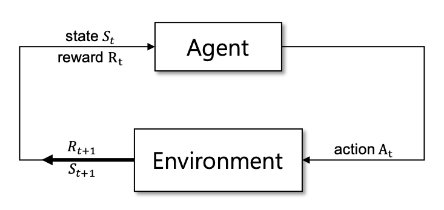

# 강화학습 기초

강화학습은 매우 방대하고 유서 깊은 학문입니다. 이 챕터에서 모든 내용을 상세하게 다루기엔 무리가 있습니다. 따라서 우리가 다룰 폴리시 그래디언트(policy gradient)를 알기 위해서 필요한 정도로 가볍게 짚고 넘어가고자 합니다. 더 자세한 내용은 Sutton(서튼) 교수의 강화학습 책 "Reinforcement Learning: An Introduction"을 참고하면 좋습니다.

## 유니버스

먼저, 강화학습은 어떤 형태로 구성이 되어 있는지 이야기 해 보겠습니다. 강화학습은 어떠한 객체가 주어진 환경에서 상황에 따라 어떻게 행동해야 할지 학습하는 방법에 대한 학문입니다. 그러므로 강화학습은 아래와 같은 요소들로 구성되어 동작 합니다.

처음 상태(state) $S_t$ (t=0)을 받아서 에이전트(agent)는 자신의 정책에 따라 행동(action) $A_t$ 를 선택합니다. 그럼 environment(환경)는 에이전트로부터 선택된 행동 $A_t$ 를 받아 보상(reward) $R_{t+1}$ 과 새롭게 바뀐 상태(state) $S_{t+1}$ 을 반환합니다. 그럼 에이전트는 다시 그것을 받아 주어진 기준에 따라 판단하여 다음 행동을 선택하게 됩니다. 따라서 아래와 같이 상태, 행동과 보상이 시퀀스(sequence)로 나타나게 됩니다.

$$S_0,A_0,R_1,S_1,A_1,R_2,S_2,A_2,R_3,S_3,A_3,\cdots$$

특정 조건이 만족되면 environment는 이 시퀀스를 종료하고, 이를 하나의 에피소드(episode)라고 합니다. 반복되는 에피소드 하에서 에이전트를 강화학습을 통해 적절한 행동(보상을 최대로)을 하도록 훈련하는 것이 우리의 목표 입니다.

## 마코프 결정 프로세스 (Markov Decision Process)

그리고 여기에 더해서 마코프 결정 프로세스(Markov Decision Process ,MDP)라고 하는 개념을 도입합니다. 우리는 온 세상의 현재 $T=t$ 이 순간을 하나의 상태(state)로 정의할 수 있을 겁니다. 그럼 현재 상태(present state)가 주어졌을 때, 미래 $T>t$는 과거 $T<t$ 로부터 독립(independent)이라고 가정 합니다. 그럼 이제 이 세상은 마코프 프로세스 위에서 동작한다고 볼 수 있습니다. 이제 우리는 현재 상황에서 미래 상황으로 바뀔 확률을 아래와 같이 수식으로 표현할 수 있습니다.

$$P(S'|S)$$

여기에 마코프 결정 프로세스는 결정을 내리는 과정, 즉 행동을 선택하는 과정이 추가 된 것 입니다. 풀어 설명하면, 현재 상황에서 어떤 행동을 선택 하였을 때 미래 상황으로 바뀔 확률이라고 할 수 있습니다. 따라서 그 수식은 아래와 같이 표현 할 수 있습니다.

$$P(S'|S, A)$$

이제 우리는 MDP 아래에서 environment(환경)와 에이전트가 상태와 보상, 행동을 주고 받으며 나아가는 과정을 표현 할 수 있습니다.

## 보상

앞서 에이전트가 어떤 행동을 선택 하였을 때, environment으로부터 보상(reward)을 받는다고 하였습니다. 이때 우리는 $G_t$ 를 어떤 시점으로부터 받은 보상의 누적 합이라고 정의 합니다. 따라서 $G_t$ 는 아래와 같이 정의 됩니다.

$$G_t\doteq R_{t+1}+R_{t+2}+R_{t+3}+\cdots+R_{T}$$

이때 우리는 discount factor $\gamma$ 를 도입하여 수식을 다르게 표현 할 수도 있습니다. $\gamma$ 는 0과 1 사이의 값으로, discount factor가 도입됨에 따라서 우리는 먼 미래의 보상보다 가까운 미래의 보상을 좀 더 중시해서 다룰 수 있게 됩니다.

$$G_t\doteq R_{t+1}+\gamma R_{t+2}+\gamma^2 R_{t+3}+\cdots=\sum_{k=0}^\infty{\gamma^k R_{t+k+1}}$$

## 정책

에이전트는 주어진 상태에서 앞으로 받을 보상의 누적 합을 최대로 하도록 행동해야 합니다. 마치 우리가 눈 앞의 즐거움을 참고 미래를 위해서 시험공부를 하듯이, 눈 앞의 작은 손해보다 먼 미래까지의 보상의 총 합이 최대가 되는 것이 중요 합니다. 따라서 에이전트는 어떠한 상황에서 어떻게 행동을 해야겠다라는 기준이 있어야 합니다.

사람도 상황에 따라서 즉흥적으로 임의의 행동을 선택하기보단 자신의 머릿속에 훈련되어 있는대로 행동하기 마련입니다. 무릎에 작은 충격이 왔을 때 다리를 들어올리는 '무릎반사'와 같은 무의식적인 행동에서부터, 파란불이 들어왔을 때 길을 건너는 행동, 눈 앞의 컴퓨터 게임을 멀리하고 시험 공부에 집중하는 행동까지, 모두 주어진 상황에 대해서 행동해야 하는 기준이 있습니다.

정책(policy)은 이렇게 에이전트가 상황에 따라서 어떻게 행동을 해야 할 지 확률적으로 나타낸 기준 입니다. 같은 상황이 주어졌을 때 어떤 행동을 선택할지에 대한 확률 분포라고 볼 수 있습니다. 따라서 우리가 행동을 하는 과정은 확률적인 프로세스라고 볼 수 있을 겁니다. 아래와 같이 함수를 통해 주어진 행동을 할 확률 값을 구할 수 있을 겁니다.

$$\pi(a|s)=P(A_t=a|S_t=s)$$

따라서 우리는 마음속의 정책에 따라 비가 오는 상태(state)에서 자장면과 짬뽕 중에 어떤 음식을 먹을지 확률적으로 선택 할 수 있고, 맑은 날에도 다른 확률 분포 중에서 선택 할 수 있습니다.

## 가치 함수 (Value Function)

가치함수(value function)는 주어진 정책(policy) $\pi$ 아래에서 상태(state) $s$ 에서부터 앞으로 얻을 수 있는 보상(reward)의 누적 합의 기대값을 표현합니다. $v_\pi(s)$ 라고 표기하며, 아래와 같이 수식으로 표현 될 수 있습니다.

$$v_\pi(s) \doteq \mathbb{E}_\pi[G_t|S_t=s]=\mathbb{E}_\pi\bigg[\sum_{k=0}^\infty{\gamma^k R_{t+k+1}\Big|S_t=s}\bigg], \forall s \in \mathcal{S}$$

앞으로 얻을 수 있는 보상의 총 합의 기대값은 기대누적보상(expected cumulative reward)라고 표현하기도 합니다.

### 행동 가치 함수 (Action-Value Function, Q-Function)

행동가치함수(action-value function)은 큐함수(Q-function)라고 불리기도 하며, 주어진 정책 $\pi$ 아래 상황(state) $s$ 에서 행동(action) $a$ 를 선택 하였을 때 앞으로 얻을 수 있는 보상(reward)의 누적 합의 기대값(expected cumulative reward, 기대누적보상)을 표현합니다. 가치함수는 어떤 상황 $s$에서 어떤 행동을 선택하는 것에 관계 없이 얻을 수 있는 누적 보상의 기대값이라고 한다면, 행동가치함수는 어떤 행동을 선택하는가에 대한 개념이 추가 된 것 입니다. 상태과 행동에 따른 기대누적보상을 나타내는 행동가치함수의 수식은 아래와 같습니다.

$$q_\pi(s,a) \doteq \mathbb{E}_\pi[G_t|S_t=s,A_t=a]=\mathbb{E}_\pi\bigg[\sum_{k=0}^\infty{\gamma^k R_{t+k+1}\Big|S_t=s,A_t=a}\bigg]$$

## 벨만 방정식

가치함수와 행동가치함수의 정의에 따라서 우리는 이상적인 가치함수와 행동가치함수를 정의할 때 벨만 방정식(Bellman equation)의 형태로 아래와 같이 나타낼 수 있습니다.

$$\begin{aligned}
v_*(s)&=\underset{a}{\max}~\mathbb{E}\Big[R_{t+1}+\gamma{v_*}(S_{t+1})|S_t=s,A_t=a\Big] \\
&=\underset{a}{\max}~\sum_{s',r}{P(s',r|s,a)\Big[r+\gamma{v_*}(s')\Big]}
\end{aligned}$$

$$\begin{aligned}
q_*(s,a)&=\mathbb{E}\Big[R_{t+1}+\gamma\underset{a'}{\max}~q_*(S_{t+1},a')|S_t=s,A_t=a\Big] \\
&=\sum_{s',r}{P(s',r|s,a)\Big[r+\gamma\underset{a}{\max}~q_*(s',a')\Big]}
\end{aligned}$$

벨만 방정식의 형태로 표현이 가능하다는 것은 우리가 다이나믹 프로그래밍(dynamic programming) 알고리즘 문제로 접근 가능하다는 것 입니다. 즉, 단순히 이것은 최단경로를 찾는 문제와 똑같이 생각할 수 있고, 위의 그림과 같이 가능한 모든 경우에 대해서 탐색을 수행하는 백트래킹(back-tracking)보다 훨씬 효율적이고 빠르게 문제 풀이에 접근할 수 있습니다.

## Monte Carlo (MC) Methods

하지만 그렇게 쉽게 문제가 풀리면 강화학습이 필요하지 않았을 겁니다. 문제는 대부분의 경우에 위의 수식에서 가장 중요한 $P(s’,r|s,a)$ 부분을 모른다는 것 입니다. 즉 어떤 상태에서 어떤 행동을 취했을 때, 어떤 확률로 다른 상태 $s’$ 와 보상 $r$ 을 받게 되는지 직접 부딪혀봐야 알 수 있다는 것 입니다. 따라서 다이나믹 프로그래밍이 적용될 수 없는 경우가 대부분 입니다. 그러므로 우리는 강화학습과 같이 시뮬레이션등의 경험을 통해서 에이전트를 학습해야 합니다.

$$V(S_t)\leftarrow V(S_t)+\alpha\big[G_t-V(S_t)\big]$$

이러한 이유로 우리는 몬테카를로 방법과 같이 샘플링을 통해서 벨만 방정식의 expectation 수식을 해결할 수 있는 것 입니다. 문제는 긴 에피소드에 대해서 샘플링을 통해 학습을 하는 경우 입니다. 실제 에피소드가 끝나야 $G_t$ 를 구할 수 있기 때문에 에피소드의 끝까지 기다려야 하는 수 밖에 없습니다. 하지만 우리가 익히 보아왔던 알파고 처럼 굉장히 긴 에피소드의 경우에는 학습을 위해 너무나도 많은 시간과 자원이 소모될 것 입니다.

## Temporal Difference (TD) Learning

이때 시간차 학습법이 유용합니다. 이 방법은 아래와 같이 에피소드 보상의 누적합이 필요 없이 바로 가치 함수를 업데이트 할 수 있습니다.

$$V(S_t)\leftarrow V(S_t)+\alpha\big[R_{t+1}+\gamma V(S_{t+1})-V(S_t)\big]$$

<!--
## Policy Iteration

### Policy Evaluation

$$\begin{aligned}
v_\pi(s) &\doteq \mathbb{E}_\pi[R_{t+1}+\gamma R_{t+2}+\gamma^2R_{t+3}+\cdots|S_t=s] \\
&= \mathbb{E}_\pi[R_{t+1}+\gamma v_\pi(S_{t+1})|S_t=s] \\
&= \sum_a{\pi(a|s)\sum_{s',r}{P(s',r|s,a)\Big[r+\gamma v_\pi(s')\Big]}}
\end{aligned}$$

### Policy Improvement

$$\begin{aligned}
\pi'(s) &\doteq \underset{a}{\text{argmax }}{q_\pi(s,a)} \\
&= \underset{a}{\text{argmax }}{\mathbb{E}[R_{t+1}+\gamma v_\pi(S_{t+1})|S_t=s,A_t=a]} \\
&= \underset{a}{\text{argmax }}{\sum_{s',r}{P(s',r|s,a)\Big[r+\gamma v_\pi(s')\Big]}}
\end{aligned}$$
-->

### 큐 러닝 (Q-learning)

만약 올바른 행동가치함수를 알고 있다면, 어떠한 상황이 닥쳐도 항상 기대누적보상을 최대화(maximize)하는 행복한 선택을 할 수 있을 것 입니다. 따라서 행동가치함수를 잘 학습하는 것을 Q-learning(큐러닝)이라고 합니다.

$$Q(S_t,A_t) \leftarrow Q(S_t,A_t)+\alpha\Big[\overbrace{R_{t+1}+\gamma\max_aQ(S_{t+1},a)}^{\text{Target}}-\overbrace{Q(S_t,A_t)}^{\text{Current}}\Big]$$

위 수식처럼 타겟(target)과 현재(current) 가치 함수 사이의 차이를 줄이면, 결국 올바른 큐함수를 학습하게 될 것 입니다.

### 딥-큐 러닝 (Deep Q-learning, DQN)

큐함수를 배울 때 상태(state) 공간의 크기와 행동(action) 공간의 크기가 너무 커서 상황과 행동이 희소한(sparse) 경우에는 문제가 생깁니다. 훈련 과정에서 희소성으로 인해 잘 볼 수 없기 때문 입니다. 따라서 우리는 상황과 행동이 discrete한 별개의 값이지만, 큐함수를 근사(approximation)함으로써 문제를 해결할 수 있습니다.

예를 들어, 아까 비가 올 때 자장면과 짬뽕을 선택하는 문제도, 비가 5mm가 오는것과 10mm가 오는 것은 비슷한 상황이며, 100mm 오는 것과는 상대적으로 다른 상황이라고 할 수 있습니다. 하지만 해가 짱짱한 맑은 날에 비해서 비가 5mm 오는 거소가 100mm 오는 것은 비슷한 상황이라고도 할 수 있습니다.

이처럼 상황과 행동을 근사하여 문제를 해결한다고 할 때, 뉴럴 네트워크는 매우 훌륭한 해결 방법이 될 수 있습니다. 딥마인드(DeepMind)는 신경망을 사용하여 근사한 큐러닝을 통해 아타리(Atari) 게임을 훌륭하게 플레이하는 강화학습 방법을 제시하였고, 이를 deep Q-learning (or DQN)이라고 이름 붙였습니다.

$$Q(S_t,A_t) \leftarrow \underbrace{Q(S_t,A_t)}_{\text{Approximated}}+\alpha\Big[R_{t+1}+\gamma\max_aQ(S_{t+1},a)-Q(S_t,A_t)\Big]$$

위의 수식처럼 큐함수 부분을 뉴럴 네트워크를 통해 근사(approximate)함으로써 희소성(sparseness)문제를 해결하였고, 심지어 사람보다 더 아타리 게임 플레이를 잘 하는 에이전트를 학습하기도 하였습니다.
