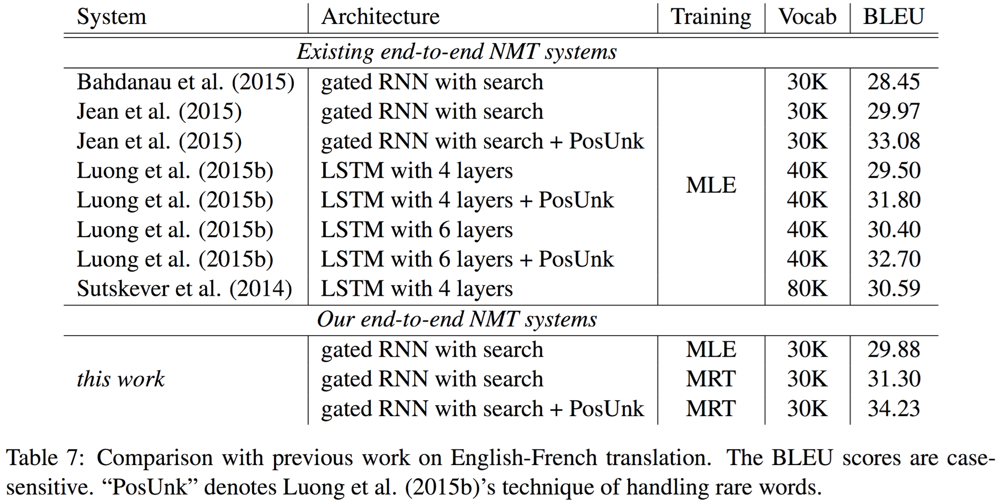

# 강화학습을 활용한 지도학습

자연어생성(NLG)을 위한 sequence-to-sequence의 훈련 과정에 teacher-forcing 및 크로스 엔트로피 손실함수를 적용하게 되면, 그 자체의 특성으로 인해서 실제 번역 품질과의 괴리(discrepancy)가 생기게 됩니다. 일반적으로 BLEU는 실제 사람이 평가한 번역의 품질과 높은 상관관계에 있다고 알려져 있기 때문에, BLEU를 훈련 과정의 목적함수(objective function)로 사용하게 된다면 더 좋은 결과를 얻을 수 있을 것 입니다. 마찬가지로 다른 NLG 문제(요약 및 챗봇 등)에 대해서도 비슷한 접근을 생각 할 수 있습니다.

## Minimum Risk Training (MRT)

위의 아이디어에서 출발한 논문[[Shen at el.2015]](https://arxiv.org/pdf/1512.02433.pdf)이 Minimum Risk Training이라는 방법을 제안하였습니다. 당시 저자는 폴리시 그래디언트를 직접적으로 사용하진 않았지만, 유사한 수식이 유도 되었다는 점이 매우 인상적입니다.

$$\begin{gathered}
\hat{\theta}_{\text{MLE}}=\underset{\theta}{\text{argmin}}~\mathcal{L}(\theta) \\
\text{where }\mathcal{L}(\theta)=-\sum_{s=1}^S\log{P(y^{(s)}|x^{(s)};\theta)}.
\end{gathered}$$

기존의 Maximum Likelihood Estimation (MLE)방식은 위와 같은 손실 함수(Loss function)를 사용하여 $|S|$ 개의 입력과 출력에 대해서 손실(loss)값을 구하고, 이를 최소화 하는 $\theta$ 를 찾는 것이 목표(objective)였습니다. 하지만 이 논문에서는 Risk를 아래와 같이 정의하고, 이를 최소화 하는 학습 방식을 Minimum Risk Training (MRT)라고 하였습니다.

$$\begin{aligned}
\mathcal{R}(\theta)&=\sum_{s=1}^S{\mathbb{E}_{y|x^{(s)};\theta}\big[\triangle(y,y^{(s)})\big]} \\
&=\sum_{s=1}^S{\sum_{y\in\mathcal{Y(x^{(s)})}}{P(y|x^{(s)};\theta)\triangle(y, y^{(s)})}}
\end{aligned}$$

위의 수식에서 $\mathcal{Y}(x^{(s)})$ 는 탐색 공간의 전체 집합(full search space)로써, $s$ 번째 입력 $x^{(s)}$ 가 주어졌을 때, 가능한 정답의 집합을 의미합니다. 또한 $\triangle(y,y^{(s)})$ 는 입력과 파라미터 $\theta$ 가 주어졌을 때, 샘플링한 $y$ 와 실제 정답 $y^{(s)}$ 의 차이(error)값을 나타냅니다. 즉, 위 수식에 따르면 risk $\mathcal{R}$ 은 주어진 입력과 현재 파라미터 상에서 얻은 y를 통해 현재 모델(함수)을 구하고, 동시에 이를 사용하여 risk의 기대값을 구한다고 볼 수 있습니다.

$$\hat{\theta}_{\text{MRT}}=\underset{\theta}{\text{argmin}}~\mathcal{R}(\theta)$$

이렇게 정의된 risk를 최소화(minimize) 하도록 하는 것이 목표(objective)입니다. 이에 반대로 risk 대신에 보상(reward)으로 생각하면, 보상을 최대화(maximize) 하는 것이 목표가 됩니다. 결국은 risk를 최소화 할 때에는 그래디언트 디센트, 보상을 최대화 할 때는 그래디언트 어센트를 사용하게 되므로, 수식을 풀어보면 결국 완벽하게 같은 이야기라고 볼 수 있습니다. 따라서 실제 구현에 있어서는 $\triangle(y,y^{(s)})$ 사용을 위해서 BLEU 점수에 $-1$ 을 곱하여 사용 합니다.

$$\begin{aligned}
\tilde{\mathcal{R}}(\theta)&=\sum_{s=1}^S{\mathbb{E}_{y|x^{(s)};\theta,\alpha}\Big[\triangle(y,y^{(s)})\Big]} \\
&=\sum_{s=1}^S{\sum_{y\in\mathcal{S}(x^{(s)})}{Q(y|x^{(s)};\theta,\alpha)\triangle(y,y^{(s)})}}
\end{aligned}$$

$$\begin{gathered}
\text{where }\mathcal{S}(x^{(s)})\text{ is a sampled subset of the full search space }\mathcal{y}(x^{(s)}) \\
\text{and }Q(y|x^{(s)};\theta,\alpha)\text{ is a distribution defined on the subspace }S(x^{(s)})\text{:} \\
Q(y|x^{(s)};\theta,\alpha)=\frac{P(y|x^{(s)};\theta)^\alpha}{\sum_{y'\in S(x^{(s)})}P(y'|x^{(s)};\theta)^\alpha}
\end{gathered}$$

하지만 주어진 입력에 대한 가능한 정답에 대한 전체 공간을 탐색(search)할 수는 없기 때문에, 전체 탐색공간 샘플링한 서브스페이스(sub-space)에서 샘플링 하는 것을 택합니다. 그리고 위의 수식에서 $\theta$ 에 대해서 미분을 수행합니다. 미분을 하여 얻은 수식은 아래와 같습니다.

$$\begin{gathered}
\begin{aligned}
\nabla_\theta\tilde{R}(\theta)&=\alpha\sum_{s=1}^{S}{\mathbb{E}_{y|x^{(s)};\theta,\alpha}\Bigg[\frac{\nabla_\theta P(y|x^{(s)};\theta)}{P(y|x^{(s)};\theta)}\times\bigg(\triangle(y,y^{(s)})-\mathbb{E}_{y'|x^{(s)};\theta,\alpha}\Big[\triangle(y',y^{(s)})\Big]\bigg)\Bigg]} \\
&=\alpha\sum_{s=1}^{S}{\mathbb{E}_{y|x^{(s)};\theta,\alpha}\Bigg[\nabla_\theta\log{P(y|x^{(s)};\theta)}\times\bigg(\triangle(y,y^{(s)})-\mathbb{E}_{y'|x^{(s)};\theta,\alpha}\Big[\triangle(y',y^{(s)})\Big]\bigg)\Bigg]} \\
&\approx\alpha\sum_{s=1}^{S}{\nabla_\theta\log{P(y|x^{(s)};\theta)}\times\Big(\triangle(y,y^{(s)})-\frac{1}{K}\sum_{k=1}^{K}{\triangle(y^{(k)},y^{(s)})}\Big)}
\end{aligned} \\
\\
\theta\leftarrow\theta-\nabla_\theta\tilde{R}(\theta)
\end{gathered}$$

이제 미분을 통해 얻은 MRT의 최종 수식을 해석 해 보겠습니다. 이해가 어렵다면 아래의 폴리시 그래디언트 수식과 비교하며 따라가면 좀 더 이해가 수월할 수 있습니다.

- $s$ 번째 입력 $x^{(s)}$ 를 신경망 $\theta$ 에 넣어 얻은 로그확률 $\log{P(y|x^{(s)};\theta)}$ 을 $\theta$ 에 대하여 미분하여 그래디언트를 얻습니다.
- 그리고 $\theta$ 로부터 샘플링한 $y$ 와 실제 정답 $y^{(s)}$ 와의 차이(여기서는 주로 BLEU에 $-1$ 을 곱하여 사용)값에서
- 또 다시 $\theta$ 로부터 샘플링하여 얻은 $y'$ 와 실제 정답 $y^{(s)}$ 와의 차이(마찬가지로 -BLEU)의 기대값을 빼 준 값
- 그 값을 risk로 아까 계산한 로그 확률값의 그래디언트에 곱해 줍니다.
- 이 과정을 전체 데이터셋(실제로는 미니배치) $S$ 에 대해서 수행한 후 합(summation)을 구하고 learning rate $\alpha$ 를 곱합니다.

최종적으로는 수식에서 기대값 부분을 몬테카를로 샘플링을 통해 제거할 수 있습니다. 아래는 폴리시 그래디언트의 REINFORCE 알고리즘 수식 입니다. 위의 MRT 수식과 비교하며 참고하기 바랍니다.

$$\begin{gathered}
\theta\leftarrow\theta+\alpha\nabla_\theta{J(\theta)} \\
\text{where }\nabla_\theta{J(\theta)}=\mathbb{E}_{\pi_\theta}\Big[\nabla_\theta\log{\pi_\theta(a|s)}\times\big(G_t-b(s)\big)\Big]. \\
\end{gathered}$$

MRT는 risk에 대해 최소화 해야 하기 때문에 그래디언트 디센트를 해 주는 것을 제외하면 똑같은 수식이 나오는 것을 알 수 있습니다. 하지만 결과적으로는 risk $\triangle(y,y^{(s)})$ 가 -BLEU로 정의되기 때문에, 결국에는 $\theta$ 를 업데이트 하는 방식은 그래디언트 디센트와 어센트를 떠나서 똑같은 수식이 나오게 됩니다.

|알고리즘|BLEU|
|-|-|
|Maximum Likelihood Estimation (MLE)|29.88|
|Minimum Risk Training (MRT)|31.30|

<!--

-->

위와 같이 훈련한 MRT에 대한 성능을 실험한 결과 입니다. 기존의 MLE 방식에 비해서 BLEU가 1.5가량 상승한 것을 확인할 수 있습니다. 이처럼 MRT는 강화학습으로써의 접근을 전혀 하지 않고도, 수식적으로 폴리시 그래디언트의 REINFORCE 알고리즘 수식을 이끌어내고 성능을 끌어올리는 방법을 제시한 점이 인상 깊습니다.

### 구현

우리는 아래의 방법을 통해 Minimum Risk Training을 파이토치로 구현 할 겁니다.

1. 주어진 입력 문장에 대해 정책 $\theta$ 를 이용하여 번역 문장을 샘플링 합니다.
1. 샘플링 문장과 정답 문장 사이의 BLEU를 계산하고 $-1$ 을 곱해주어 risk로 변환 합니다.
1. 그리고 로그 확률 분포 전체에 risk를 곱해주고, 각 샘플과 time-step 별로 구해진 negative 로그확률값의 합에 $-1$ 을 곱해줍니다.
1. 로그확률값의 합에 대해서 $\theta$ 로 미분을 수행하면, back-propagation을 통해서 신경망 $\theta$ 전체에 그래디언트가 구해집니다.
1. 이미 우리는 risk를 곱하였기 때문에, 곧바로 이 그래디언트를 통해 그래디언트 디센트를 수행하여 최적화를 수행 합니다.

이전 수식과 달리 그래디언트에 risk를 곱하는 것이 아닌, 로그확률값에 risk를 곱한 후에 그래디언트를 구하도록 하였습니다. 하지만 risk는 $\theta$ 에 대해서 상수이기 때문에, 미분 전에 곱해주어도 차이가 없습니다.

$$\begin{gathered}
\nabla_\theta{J(\theta)}=\nabla_\theta\sum_{s=1}^{S}{\bigg(\log{P(y|x^{(s)};\theta)}\times\Big(\triangle(y,y^{(s)})-\frac{1}{K}\sum_{k=1}^{K}{\triangle(y^{(k)},y^{(s)})}\Big)\bigg)} \\
\text{where }\triangle(\hat{y}, y)=-\text{BLEU}(\hat{y}, y) \\
\\
\theta\leftarrow\theta-\lambda\nabla_\theta{J(\theta)}
\end{gathered}$$

우리는 실험을 통해서 심지어 $K=1$ 일 때도, MRT가 잘 동작함을 확인할 수 있습니다. 즉 베이스라인을 위한 샘플링 횟수가 1회에 불과하더라도 몬테카를로 샘플링이 잘 동작하여 정상적으로 학습되는 것을 확인 가능 합니다.

### 파이토치 예제 코드

MRT을 파이토치를 사용하여 구현 해 보도록 하겠습니다. 자세한 전체 코드는 이전의 NMT 파이토치 실습 코드의 깃허브에서 다운로드 할 수 있습니다.

- git repo url: https://github.com/kh-kim/simple-nmt

#### simple_nmt/rl_trainer.py

우리는 보상함수 $\triangle(y^{(k)},y^{(s)})$ 로 BLEU를 사용할 것 입니다. 구글에서는 그들의 기계번역 시스템 구성을 소개하는 논문[Wo at el.2016]에서 BLEU를 사용할 경우 아주 약간의 헛점이 있어 자신들이 보완한 GLEU라는 함수를 사용한다고 하였습니다. 따라서 우리도 사실은 좀 더 정확히는 구글에서 공개한 GLEU라는 함수를 사용하도록 하겠습니다.

> 매우 흥미롭게도, 보상함수에서 아주 작은 빈틈이라도 있다면, 에이전트(agent)는 그 작은 틈을 파고 들어 치팅(cheating)을 통해 더 나은 점수를 얻도록 발전합니다. 유명인들의 인공지능에 대한 위험성의 경고도 여기에서 비롯된 것이라고 볼 수 있습니다. 비록 최초의 목적함수는 매우 선한 목적이었을지라도, 인공지능은 인간과 같은 윤리의식이 없기 때문에, 주어진 목표를 달성하기 위해서 어떠한 일도 가리지 않을 것이기 때문입니다. 비록 우리에게 주어진 문제는 스카이넷과 같은 인공지능을 만드는 일은 아니지만, 마찬가지로 잘 정의된 빈틈없는 목적함수가 필요합니다. 물론 다행히 자연어 생성 또는 번역과 같은 문제는 매우 간단하여 쉽게 보상함수를 설계할 수 있습니다.

다행히도 널리 쓰이는 자연어처리 툴킷인 NLTK에서는 BLEU와 GLEU 둘 다 비슷한 인터페이스로 제공하고 있습니다. 따라서 직접 구현할 필요 없이 아래와 같이 필요에 따라서 사용하면 될 것 입니다.

```python
from tqdm import tqdm
# from nltk.translate.bleu_score import sentence_bleu as score_func
from nltk.translate.gleu_score import sentence_gleu as score_func

import torch
import torch.nn.utils as torch_utils

import utils
import data_loader

from simple_nmt.trainer import Trainer
```

아래와 같이 보상함수를 활용하는 함수를 작성합니다. 이 함수는 미니배치로 문장이 주어졌을 때, 미니배치의 샘플 수 만큼의 보상을 반환하는 함수 입니다. 따라서 MRT를 구현하기 위해서는 이 함수의 결과값에 -1을 곱해주어 risk로 변환해야 합니다. 아쉽게도 이 함수는 아래에서 보이는바와 같이 다중 for 반복문으로 구성되어 있습니다. 따라서 병렬 처리가 미흡하여 현재 구현에서 매우 큰 병목으로 작용하고 있습니다.

기존의 multi_blue.perl을 통한 평가를 할 때엔 4-gram까지 보는 것이 일반적입니다. 하지만 아쉽게도 우리는 서브워드(subword) 분절까지 적용 된 상태에서 BLEU를 적용하는 것이기 때문에, <comment> 분절을 복원한 이후에 BLEU를 채점한다면 속도에서 너무나 큰 손해를 볼 수 밖에 없습니다. </comment> 6-gram까지 보는 것을 확인할 수 있습니다. 또한 언어의 특성상 한국어의 경우에는 훨씬 더 잘게 분절되는 경향이 있기 때문에, 그것을 감안하여 'n_gram' 하이퍼 파라미터를 튜닝해도 좋을 것 입니다.

```python
def _get_reward(self, y_hat, y, n_gram=6):
# This method gets the reward based on the sampling result and reference sentence.
# For now, we uses GLEU in NLTK, but you can used your own well-defined reward function.
# In addition, GLEU is variation of BLEU, and it is more fit to reinforcement learning.

# Since we don't calculate reward score exactly as same as multi-bleu.perl,
# (especialy we do have different tokenization,) I recommend to set n_gram to 6.

# |y| = (batch_size, length1)
# |y_hat| = (batch_size, length2)

scores = []

# Actually, below is really far from parallized operations.
# Thus, it may cause slow training.
for b in range(y.size(0)):
ref = []
hyp = []
for t in range(y.size(1)):
ref += [str(int(y[b, t]))]
if y[b, t] == data_loader.EOS:
break

for t in range(y_hat.size(1)):
hyp += [str(int(y_hat[b, t]))]
if y_hat[b, t] == data_loader.EOS:
break

# for nltk.bleu & nltk.gleu
scores += [score_func([ref], hyp, max_len=n_gram) * 100.]

# for utils.score_sentence
# scores += [score_func(ref, hyp, 4, smooth = 1)[-1] * 100.]
scores = torch.FloatTensor(scores).to(y.device)
# |scores| = (batch_size)

return scores
```

아래의 함수는 $J(\theta)$ 를 입력으로 받아 $\theta$에 대해서 미분을 수행하고 $\nabla_\theta{J(\theta)}$ 를 반환하는 작업을 하는 함수 입니다. 기존의 MLE에서는 정답 $y$ 와 예측값 $\hat{y}$ 사이의 차이(error)를 최소화 하도록 미분을 수행하였다면, 지금은 샘플링을 한 인덱스(index)를 $y$ 라고 할 때, softmax 결과값인 분포 $\hat{y}$ 가 주어지면 해당 인덱스의 값을 가져와 계산을 수행 합니다.

$$\begin{gathered}
y_t\sim{P(\text{y}_t|X,y_{<t};\theta)}=\hat{y}_t \\
Y=\{y_1,\cdots,y_T\} \\
\mathcal{R}(X,\theta)=-\text{BLEU}(Y,Y^*)\text{ where }Y^*\text{ is optimal.} \\
\\
\sum_{i=1}^T{\log{P(\text{y}_i=y_i|X,y_{<i};\theta)}}=-\text{NLL}(X,Y;\theta)
\end{gathered}$$

이것은 위와 같이 마치 샘플링 한 값이 정답일 때의 NLL(negative log-likelihood) 함수를 사용한 것과 같습니다. 실제 정답인 $Y^*$ 는 BLEU를 통해 risk를 계산할 때 쓰인 것을 알 수 있습니다.

```python
def _get_gradient(self, y_hat, y, crit=None, reward=1):
# |y| = (batch_size, length)
# |y_hat| = (batch_size, length, output_size)
# |reward| = (batch_size)
crit = self.crit if crit is None else crit

# Before we get the gradient, multiply -reward for each sample and each time-step.
y_hat = y_hat * -reward.view(-1, 1, 1).expand(*y_hat.size())

# Again, multiply -1 because criterion is NLLLoss.
log_prob = -crit(y_hat.contiguous().view(-1, y_hat.size(-1)),
y.contiguous().view(-1)
)
log_prob.div(y.size(0)).backward()

return log_prob
```

재미있게도 그래디언트 디센트를 사용하기 위하여 보상값에 -1을 곱하여 risk로 바꾸었지만, 다시 또 NLL 손실함수 결과값에 -1을 곱해주는 것을 볼 수 있습니다. <comment> 실제 수식에서는 negative log-likelihood 대신에 일반 log-likelihood가 사용되었기 때문입니다. </comment> 결국 -1을 두번 곱해주는 것을 볼 수 있고, 이것은 마치 likelihood를 최대화 하기 위해서 -1을 곱하고 그래디언트 디센트를 수행하였던 것 처럼, 보상(reward)을 최대화 하기 위해서 -1을 곱하고 그래디언트 디센트를 수행하는 것과 같음을 알 수 있습니다. 처음에 이 내용을 본다면 헷갈릴 수 있지만, 무엇이 최대화 되고 무엇이 최소화 되는지 찬찬히 생각하고 그래디언트 디센트를 수행하는 것임을 기억한다면 이해하는데 한결 수월 할 것 입니다.

비록 MRT를 사용할 때 sequence-to-sequence 모델은 바뀌지 않았지만, Maximum Likelihood Estimation (MLE)방식을 사용하는 것이 아니기 때문에, 해당 모델 구조를 활용하여 훈련하는 방식(train_epoch 함수)은 다시 구현 해 주어야 합니다. MRT수식에서 볼 수 있듯이, 마치 REINFORCE 알고리즘과 같이 베이스라인 보상값을 실제 보상값에서 빼 주어야 합니다. 따라서 베이스라인을 보상값을 계산하여야 하는데, 기존 강화학습의 REINFORCE 알고리즘이나 Actor Critic 알고리즘처럼 별도의 보상값을 예측하기 위한 뉴럴 네트워크를 구성하는 것이 아닌, 실제 몬테카를로 샘플링을 통해 베이스라인 보상값을 근사 합니다.

$$
\mathbb{E}_{y'|x^{(s)};\theta}\Big[\triangle(y',y^{(s)})\Big]\approx\frac{1}{K}\sum_{k=1}^{K}{\triangle(y^{(k)},y^{(s)})}
$$

물론 K가 크면 클수록 정확한 값을 근사하겠지만, 샘플링을 수없이 반복하는 딥러닝 및 강화학습의 특성상 $K=1$ 인 경우에도 몬테카를로 샘플링을 통한 근사(approximation)가 매우 잘 동작하게 됩니다.

그리고 중요한 점은 샘플링 기반으로 동작하기 때문에 더이상 teacher-forcing을 사용하지 않는다는 것 입니다. 따라서 기존의 sequence-to-sequence의 forward() 함수 대신에 직접 구현한 search() 함수를 사용하여 샘플링을 하여 학습을 수행 합니다. 이때, search 함수의 greedy 파라미터를 False 값을 주어, 랜덤 샘플링을 수행 할 수 있습니다.

```python
def train_epoch(self,
train,
optimizer,
max_grad_norm=5,
verbose=VERBOSE_SILENT
):
'''
Train an epoch with given train iterator and optimizer.
'''
total_reward, total_actor_reward = 0, 0
total_grad_norm = 0
avg_reward, avg_actor_reward = 0, 0
avg_param_norm, avg_grad_norm = 0, 0
sample_cnt = 0

progress_bar = tqdm(train,
desc='Training: ',
unit='batch'
) if verbose is VERBOSE_BATCH_WISE else train
# Iterate whole train-set.
for idx, mini_batch in enumerate(progress_bar):
# Raw target variable has both BOS and EOS token.
# The output of sequence-to-sequence does not have BOS token.
# Thus, remove BOS token for reference.
x, y = mini_batch.src, mini_batch.tgt[0][:, 1:]
# |x| = (batch_size, length)
# |y| = (batch_size, length)

# You have to reset the gradients of all model parameters before to take another step in gradient descent.
optimizer.zero_grad()

# Take sampling process because set False for is_greedy.
y_hat, indice = self.model.search(x,
is_greedy=False,
max_length=self.config.max_length
)
# Based on the result of sampling, get reward.
actor_reward = self._get_reward(indice,
y,
n_gram=self.config.rl_n_gram
)
# |y_hat| = (batch_size, length, output_size)
# |indice| = (batch_size, length)
# |actor_reward| = (batch_size)

# Take samples as many as n_samples, and get average rewards for them.
# I figured out that n_samples = 1 would be enough.
baseline = []
with torch.no_grad():
for i in range(self.config.n_samples):
_, sampled_indice = self.model.search(x,
is_greedy=False,
max_length=self.config.max_length
)
baseline += [self._get_reward(sampled_indice,
y,
n_gram=self.config.rl_n_gram
)]
baseline = torch.stack(baseline).sum(dim=0).div(self.config.n_samples)
# |baseline| = (n_samples, batch_size) --> (batch_size)

# Now, we have relatively expected cumulative reward.
# Which score can be drawn from actor_reward subtracted by baseline.
final_reward = actor_reward - baseline
# |final_reward| = (batch_size)

# calcuate gradients with back-propagation
self._get_gradient(y_hat, indice, reward=final_reward)

# Simple math to show stats.
total_reward += float(final_reward.sum())
total_actor_reward += float(actor_reward.sum())
sample_cnt += int(actor_reward.size(0))
total_grad_norm += float(utils.get_grad_norm(self.model.parameters()))

avg_reward = total_reward / sample_cnt
avg_actor_reward = total_actor_reward / sample_cnt
avg_grad_norm = total_grad_norm / (idx + 1)

if verbose is VERBOSE_BATCH_WISE:
progress_bar.set_postfix_str('|g_param|=%.2f rwd=%4.2f avg_frwd=%.2e BLEU=%.4f' % (avg_grad_norm,
float(actor_reward.sum().div(y.size(0))),
avg_reward,
avg_actor_reward
))

# In orther to avoid gradient exploding, we apply gradient clipping.
torch_utils.clip_grad_norm_(self.model.parameters(),
self.config.max_grad_norm
)
# Take a step of gradient descent.
optimizer.step()


if idx >= len(progress_bar) * self.config.train_ratio_per_epoch:
break

if verbose is VERBOSE_BATCH_WISE:
progress_bar.close()

return avg_actor_reward, param_norm, avg_grad_norm
```

## 실험 결과

강화학습은 샘플링을 기반으로 동작하기 때문에, 만약 처음부터 sequence-to-sequence 모델을 MRT로 훈련시킨다면 정말 어려울 것 입니다. 실제 정답과 상관없는 문장들이 정말 제멋대로 샘플링 될 것이기 때문입니다. 따라서 MRT를 수행할 때에는 기존의 MLE 방식으로 어느정도 훈련이 진행 된 이후에, fine-tuning 개념으로 접근하는 것이 낫습니다. 아래의 테이블은 실제 깃허브의 코드를 가지고 MLE와 MRT를 훈련하였을 때의 성능 입니다.

|||koen|||enko||
|-|-|-|-|-|-|-|
|epoch|train BLEU|valid BLEU|real BLEU|train BLEU|valid BLEU|real BLEU|
|18|||23.56|||28.15|
|19|25.75|29.19|23.43|24.6|27.73|29.73|
|20|26.19|29.25|24.13|25.25|27.81|29.22|
|21|26.68|29.39|24.15|25.64|27.88|28.77|
|22|27.12|29.44|23.89|26.04|27.98|29.74|
|23|27.22|29.40|24.13|26.16|28.05|29.03|
|24|27.26|29.47|25.09|26.19|28.09|29.83|
|25|27.54|29.52|25.17|26.27|28.18|28.9|
|26|27.53|29.66|24.64|26.37|28.17|29.45|
|27|27.78|29.61|24.65|26.63|28.24|28.87|
|28|27.73|29.70|24.54|26.83|28.33|29.11|

NLTK에서 제공되는 GLEU 함수로 서브워드까지 최종 분절 상태에서 측정한 BLEU 값은 계속하여 증가하는 것을 볼 수 있습니다. 이에 비해 multi_bleu.perl 을 통해서 측정한 실제 BLEU는 단조증가하지는 않지만, 18 epoch에서의 MLE 방식때의 성능보다 결국 증가하는 것을 확인할 수 있습니다. 아래는 실제 문장을 넣어 추론(inference)한 결과를 비교한 테이블 입니다. 이미 MLE에서도 나름 훌륭한 번역의 품질이 나오지만, MRT를 통해서 한층 더 번역의 품질이 향상된 것을 체감할 수 있습니다.

|입력|정답|MLE|MRT|
|-|-|-|-|
|우리는 또한 그 지역의 생선 가공 공장에서 심한 악취를 내며 썩어가는 엄청난 양의 생선도 치웠습니다.|We cleared tons and tons of stinking, rotting fish carcasses from the local fish processing plant.|We also had a huge stink in the fish processing plant in the area, smelling havoc with a huge amount of fish.|We also cleared a huge amount of fish that rot and rot in the fish processing factory in the area.|
|나는 이것들이 내 삶을 바꾸게 하지 않겠어.|I won't let this thing alter my life.|I'm not gonna let these things change my life.|I won't let these things change my life.|
|하지만, 나는 나중에 곧 잠들었다.|But I fell asleep shortly afterwards.|However, I fell asleep in a moment.|However, I fell asleep soon afterwards.|
|하지만 1997년 아시아에 외환위기가 불어닥쳤다.|But Asia was hit hard by the 1997 foreign currency crisis.|In 1997, however, the financial crisis in Asia has become a reality for Asia.|But in 1997, the foreign currency crisis was swept in Asia.|
|그 다음 몇 주 동안에 사태가 극적으로 전환되었다.|Events took a dramatic turn in the weeks that followed.|The situation has been dramatically changed for the next few weeks.|The situation was dramatically reversed for the next few weeks.|
