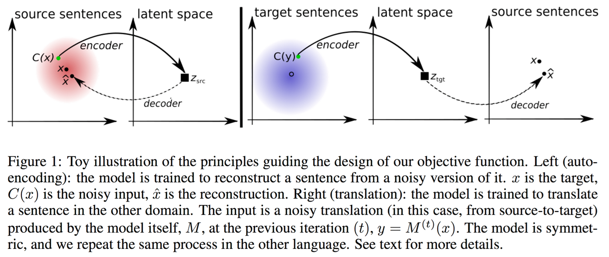
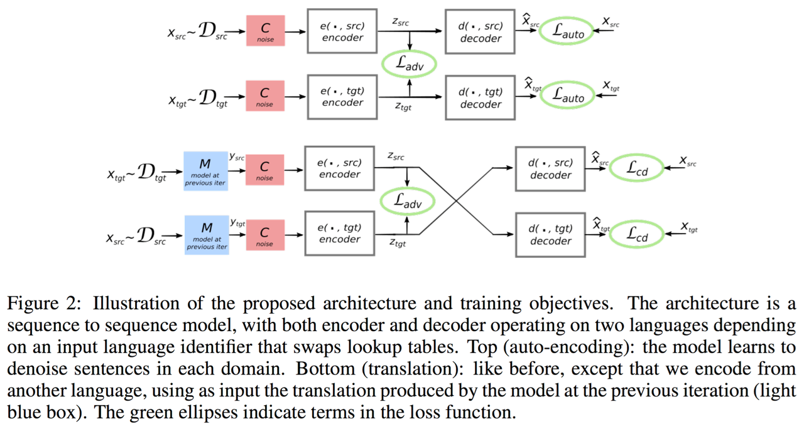
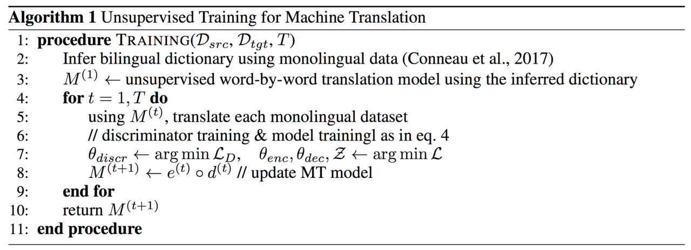

# 깅화학습을 활용한 비지도학습

지도학습(supervised learning) 방식은 높은 정확도를 자랑하지만 레이블 데이터가 필요하기 때문에 데이터 확보, 모델 및 시스템을 구축하는데 높은 비용과 시간이 소요됩니다. 하지만 비지도학습의 경우에는 데이터 확보에 있어서 훨씬 비용과 시간을 절감할 수 있기 때문에 좋은 대안이 될 수 있습니다. 물론 지도학습에 비해서 성능이나 효율이 떨어질 가능성이 높습니다.

그러한 의미에서 병렬 코퍼스에 비해서 확보하기 쉬운 단방향 코퍼스는 좋은 대안이 될 수 있습니다. 소량의 병렬 코퍼스와 다량의 단방향 코퍼스를 결합하여 더 나은 성능을 확보할 수도 있을 것입니다. 이전 챕터에 다루었던 Back translation과 Copied translation에서 이와 관련하여 NMT의 성능을 고도화 하는 방법을 보여주었습니다. 강화학습에서도 마찬가지로 비지도학습 방식을 적용하려는 시도들이 많이 있습니다.

## 비지도학습을 통한 신경망 기계번역

이전까지의 단방향 코퍼스의 활용 방법들과 달리, 이 논문[[Lample at el.2017]](https://arxiv.org/pdf/1711.00043.pdf)은 오직 단방향 코퍼스만을 사용하여 번역기를 제작하는 방법을 제안하였습니다. 따라서 진정한 비지도 학습을 통한 신경망 기계번역(Unsupervised NMT)이라고 할 수 있습니다. 핵심 아이디어는 인코더가 언어에 상관 없이 같은 의미의 문장일 경우에 같은 값으로 임베딩 할 수 있도록 훈련하는 것 입니다. 이를 위해서 적대적 학습 네트워크(GAN)가 도입되었습니다. GAN을 자연어처리에 쓰이지 못한다고 해 놓고 GAN을 썼다니 이게 무슨 소리인가 싶겠지만, 인코더의 출력값은 continuous한 값이기 때문에, GAN의 적용이 가능하였습니다.

이렇게 언어에 상관없이 동일한 내용의 문장에 대해서는 같은 벡터로 인코딩 하도록 훈련 된 인코더의 출력값을 가지고 디코더로 원래의 문장으로 잘 돌아오도록 해 주는 것이 이 논문의 핵심 내용입니다. 따라서 이 논문에서는 언어에 따라서 인코더와 디코더를 다르게 사용한 것이 아니라 언어에 상관없이 1개씩의 인코더와 디코더를 사용하였습니다. 또한 이 논문[[Conneau at el.,2017]](https://arxiv.org/pdf/1710.04087.pdf)에서 제안한 단어대 단어 번역 방식으로 pretraining 한 모델을 사용합니다.

결과적으로 손실 함수는 아래와 같이 3가지 부분으로 구성되어 있습니다.

### 디노이징 오토인코더 (Denoising Autoencoder)

이전 챕터에서 다루었듯이 sequence-to-sequence 모델도 결국 오토인코더의 일종이라고 볼 수 있습니다. 그러한 관점에서 입력을 받아 같은 값으로 출력을 해 주는 오토인코더의 할 일은 굉장히 쉬운 문제에 속합니다. 그러므로 단순히 인코딩 한 소스(source) 문장을 같은 언어의 문장으로 디코딩 하는 것은 매우 쉬운 일이 될 것입니다. 따라서 오토인코더에게 단순히 복사 작업을 지시하는 것이 아닌 노이즈를 섞어 준 소스 문장에서 노이즈를 제거하는 작업(denoising)을 하면서 입력값을 출력에서 복원(reconstruction) 할 수 있도록 훈련해야 합니다. 이는 아래와 같이 표현 가능합니다.

$$\mathcal{L}_{auto}(\theta_{enc},\theta_{dec},\mathcal{Z},\ell)=\Bbb{E}_{x\sim\mathcal{D}_\ell,\hat{x}\sim d(e(C(x),\ell),\ell)}\Big[\triangle(\hat{x},x)\Big]$$

$\hat{x}\sim d(e(C(x),\ell),\ell)$ 는 입력 문장 $ x$ 를 노이즈 모델 $C$ 를 통해 노이즈를 더하고, 같은 언어 $\ell$ 로 인코딩과 디코딩을 수행한 것을 의미합니다. $\triangle(\hat{x},x)$ 는 MRT에서와 같이 원문과 복원된 문장과의 차이(error)를 나타냅니다.

노이즈 모델 $C(x)$ 는 임의로 문장 내 단어들을 드랍하거나, 순서를 섞어주는 일을 합니다. 드랍 비율은 보통 0.1, 순서를 섞어주는 단어사이의 거리는 3정도가 적당합니다.

### 크로스 도메인 훈련 (번역)

이전 이터레이션(iteration)의 모델 $M$ 에서 언어( $\ell_2$ )의 노이즈가 추가되어 번역된 문장( $y$ )을 다시 언어( $\ell_1$ ) 소스 문장으로 원상복구 하는 작업에 대한 목표 함수 입니다.

$$\begin{gathered}
y=M(x) \\
\mathcal{L}_{cd}(\theta_{enc},\theta_{dec},\mathcal{Z},\ell_1,\ell_2)=\mathbb{E}_{x\sim\mathcal{D}_{\ell_1},\hat{x}\sim d(e(C(y),\ell_2),\ell_1)}\Big[\triangle(\hat{x},x)\Big]
\end{gathered}$$

### 적대적 학습

인코더가 언어와 상관없이 항상 같은 분포로 latent 공간에 문장 벡터를 임베딩하는지 감시하기 위한 디스크리미네이터(discriminator)가 추가되어 적대적 학습을 진행합니다. 디스크리미네이터는 latent 변수 $z$ 의 원래 언어를 예측하도록 훈련됩니다. $x_i, \ell_i$ 는 같은 언어(language pair)를 의미합니다.

$$\mathcal{L}_D(\theta_D|\theta,\mathcal{Z})=-\mathbb{E}_{(x_i,\ell_i)}\Big[\log{p_D(\ell_i|e(x_i,\ell_i))}\Big]$$

따라서 GAN과 마찬가지로, 인코더는 디스크리미네이터를 속일 수 있도록 훈련 되야 합니다.

$$\begin{gathered}
\mathcal{L}_{adv}(\theta_{enc},\mathcal{Z}|\theta_D)=-\mathbb{E}_{(x_i,\ell_i)}\Big[\log{p_D}(\ell_j|e(x_i,\ell_i))\Big] \\
\text{where }j=-(i-1).
\end{gathered}$$

위의 3가지 목적함수를 결합하면 최종 목적함수를 얻을 수 있습니다. 각 $\lambda$ 를 통해서 손실 함수 상에서 비율을 조절하여 최적의 파라미터 $\theta$ 를 찾을 수 있도록 합니다.

$$\begin{aligned}
\mathcal{L}(\theta_{enc},\theta_{dec},\mathcal{Z})=&\lambda_{auto}\Big[\mathcal{L}_{auto}(\theta_{enc},\theta_{dec},\mathcal{Z},\ell_{src})+\mathcal{L}_{auto}(\theta_{enc},\theta_{dec},\mathcal{Z},\ell_{tgt})\Big] \\
&+\lambda_{cd}\Big[\mathcal{L}_{cd}(\theta_{enc},\theta_{dec},\mathcal{Z},\ell_{src},\ell_{tgt})+\mathcal{L}_{cd}(\theta_{enc},\theta_{dec},\mathcal{Z},\ell_{tgt},\ell_{src})\Big] \\
&+\lambda_{adv}\mathcal{L}_{adv}(\theta_{enc},\mathcal{Z}|\theta_D)
\end{aligned}$$

<!--

-->

이 논문에서 제안한 방식은 오직 단방향 코퍼스만 존재할 때에 번역기를 만드는 방법에 대해서 다룹니다. 병렬 코퍼스가 없는 상황에서도 번역기를 만들 수 있다는 점은 매우 고무적이지만, 이 방법 자체만으로는 실제 필드에서 사용될 가능성은 적어 보입니다. 보통의 경우 필드에서 번역기를 구축하는 경우에는 병렬 코퍼스가 없는 경우는 드물고, 없다고 하더라도 단방향 코퍼스만으로 번역기를 구축하여 낮은 성능의 번역기를 확보하기보다는, 비용을 들여 병렬 코퍼스를 직접 구축하여, 병렬 코퍼스와 다수의 단방향 코퍼스를 합쳐 번역기를 구축하는 방향으로 나아갈 것이기 때문입니다.
