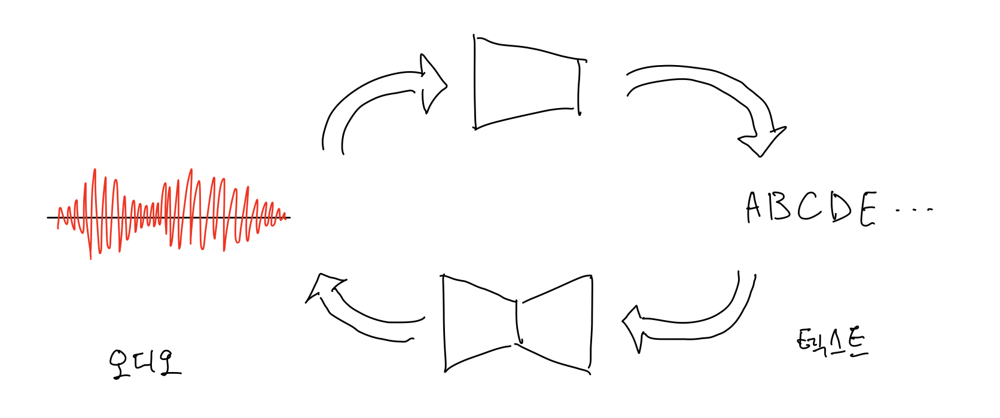

# 듀얼리티 활용하기

듀얼리티(Duality)란 무엇일까요? 우리가 보통 기계학습을 통해 학습하는 것은 어떤 도메인의 데이터 $X$ 를 받아서, 다른 도메인의 데이터 $Y$ 로 맵핑(mapping)해주는 함수를 근사(approximation)하는 것이라 할 수 있습니다. 따라서 대부분의 기계학습에 사용되는 데이터셋은 두 도메인 사이의 데이터로 구성되어있기 마련입니다.

| $D_1$ | $D_1 \rightarrow D_2$ | $D_1 \leftarrow D_2$ | $D_2$ |
|-|-|-|-|
|문장|기계번역|기계번역|문장|
|음성 신호|음성 인식|음성 합성|문장|
|이미지|이미지 분류|이미지 합성|클래스|
|문서|요약|본문 생성|문장|
|문장|텍스트 분류|문장 생성|클래스|

위와 같이 두 도메인 사이의 데이터의 관계를 배우는 방향에 따라서 음성인식이 되기도 하고, 음성합성이 되기도 합니다. 이러한 두 도메인 사이의 관계를 듀얼리티라고 정의 합니다. 대부분의 기계학습 문제들은 이와 같이 듀얼리티 속성을 가지고 있는데, 특히 기계번역은 각 도메인의 데이터 간에 정보량의 차이가 거의 없는 것이 가장 큰 특징이자 장점 입니다. 따라서 우리는 듀얼리티를 적극적으로 활용하여 기계번역을 고도화 할 수 있습니다.

## CycleGAN

그렇다고 번역 이외에도 전혀 듀얼리티를 활용할 수 없는 것은 아닙니다. 또 다른 듀얼리티의 활용 예로, 컴퓨터 비전(Computer Vision)쪽 논문[[Zhu at el.2017]](https://arxiv.org/pdf/1703.10593.pdf)을 이야기 해볼까 합니다. CycleGAN은 아래와 같이 짝지어지지 않은 두 도메인의 이미지들이 있을 때, $X$ 도메인의 이미지를 $Y$ 도메인의 이미지로 변환하는 방법 입니다. 사진의 전체 구조는 유지하되 유명한 화가 모네의 그림풍으로 바꾸어 주기도 하고, 말을 얼룩말로 또는 반대로 바꾸어 주기도 합니다. 겨울 풍경을 여름 풍경으로 바꾸어주기도 합니다.

$X\rightarrow{Y}$ 와 $Y\rightarrow{X}$ 모두 각각 제너레이터(Generator) $G, F$ 와 디스크리미네이터(Discriminator) $D_X, D_Y$ 를 가지고 있어서, $\min\max$ 게임을 수행합니다. 

$G$ 는 $x$ 를 입력으로 받아 $\hat{y}$ 으로 변환 합니다. 그리고 $D_Y$ 는 $\hat{y}$ 또는 $y$ 를 입력으로 받아 합성한 이미지인지 원래 $Y$ 도메인의 이미지인지 예측 합니다. 마찬가지로 $F$ 는 $y$ 를 입력으로 받아 $\hat{x}$ 으로 변환 합니다. 그리고 $D_X$ 는 $\hat{x}$ 또는 $x$ 를 입력으로 받아 합성 유부를 판단 합니다.

이 방식의 핵심은 $\hat{x}$ 나 $\hat{y}$ 를 합성 할 때에 기존의 도메인 $X, Y$ 에 실제로 속하는 이미지 처럼 만들어내야 한다는 것 입니다. 이것을 기계번역에 적용 시켜 보면 어떻게 될까요?
