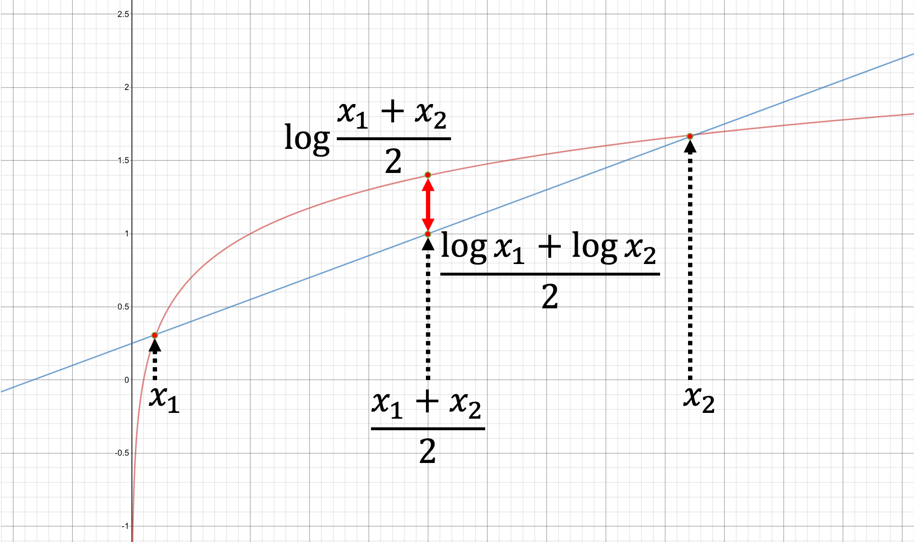

# 쉬어가기: Back-translation을 재해석 하기

이번 섹션에서는 앞선 챕터에서 이야기하였던 back-translation을 듀얼리티 관점에서 수식으로 해석해 보도록 하겠습니다. 기존의 back-translation은 추상적인 관점에서 왜 잘되는지 이야기 하고 넘어갔다면, 이번에는 수식에 대한 해석을 통해 잘 동작하는 이유를 파악할 수 있습니다. [[Zhang et al.,2018]](https://arxiv.org/abs/1803.00353) 에서는 기존의 back-translation에 대한 해석을 듀얼리티 관점에서 수식으로 풀어냈습니다. 한번 살펴보도록 하겠습니다.

우리에게 아래와 같이 N 개의 소스(source) 문장 $x$ , 타겟(target) 문장 $y$ 으로 이루어진 양방향 병렬 코퍼스 $\mathcal{B}$ , S 개의 타겟 문장 $y$ 로만 이루어진 단방향 코퍼스 $\mathcal{M}$ 이 있다고 가정 해 보겠습니다.

$$\begin{aligned}
\mathcal{B}&=\{(x^n, y^n)\}^N_{n=1} \\
\mathcal{M}&=\{y^s\}^S_{s=1}
\end{aligned}$$

앞서 다룬 Dual Unsupervised Learning (DUL)과 같이, 우리가 최종적으로 최소화 하고자 하는 손실함수는 아래와 같이 표현할 수 있습니다.

$$\mathcal{L}(\theta)=-\sum_{n=1}^N{\log{P(y^{n}|x^{n};\theta)}}-\sum_{s=1}^S{\log{P(y^s)}}$$

그럼 DUL과 마찬가지로 $P(y)$ 는 marginal 분포의 속성을 활용하여 표현 할 수 있을겁니다. 다만 여기서는 좌변이 $P(y)$ 가 아닌 $\log{P(y)}$ 임을 주목해 주세요.

$$\begin{aligned}
\log{P(y)}&=\log{\sum_{x\in\mathcal{X}}{P(y|x)P(x)}} \\
&=\log{\sum_{x\in\mathcal{X}}{P(x|y)\frac{P(y|x)P(x)}{P(x|y)}}} \\
&\ge\sum_{x\in\mathcal{X}}{P(x|y)\log{\frac{P(y|x)P(x)}{P(x|y)}}} \\
&=\mathbb{E}_{\text{x}\sim{P(\text{x}|y)}}\Big[\log{P(y|\text{x})}+\log{\frac{P(\text{x})}{P(\text{x}|y)}}\Big] \\
&=\mathbb{E}_{\text{x}\sim{P(\text{x}|y)}}\Big[\log{P(y|\text{x})}\Big]+\mathbb{E}_{\text{x}\sim{P(\text{x}|y)}}\Big[\log{\frac{P(\text{x})}{P(\text{x}|y)}}\Big] \\
&=\mathbb{E}_{\text{x}\sim{P(\text{x}|y)}}\Big[\log{P(y|\text{x})}\Big]-\text{KL}\big(P(\text{x}|y)||P(\text{x})\big)
\end{aligned}$$

우리는 젠센 부등식(Jensen's inequality) 정리를 사용하여 항상 $\log{P(y)}$ 보다 작거나 같은 수식으로 정리할 수 있습니다. 젠센 부등식에 대해서 좀 더 이야기 해 보도록 하겠습니다. 로그의 함수 곡선은 아래와 같이 생겼습니다. 이때, 두 점 $x_1, x_2$ 에 대한 평균을 $x_m=1/2\times(x_1+x_2)$ 라고 하겠습니다. 그럼 $\log{x_m}\ge1/2\times(\log{x_1}+\log{x_2})$ 은 항상 성립하는 것을 알 수 있습니다.

위의 성질을 이용하여 우리는 $\log{P(y)}$ 보다 항상 작거나 같은 lower bound를 구할 수 있습니다. 여기에 음의 부호를 붙여주면 부등호의 방향은 바뀔 것 입니다.

$$-\log{P(y)}\le-\mathbb{E}_{\text{x}\sim{P(\text{x}|y)}}\Big[\log{P(y|\text{x})}\Big]+\text{KL}\big(P(\text{x}|y)||P(\text{x})\big)$$

우리는 부등호가 항상 성립함을 확인하였기 때문에, $-\log{P(y)}$ 보다 항상 큰 수식을 최소화 하는 것은, 마찬가지로 $-\log{P(y)}$ 도 최소화 하는 것임을 알 수 있습니다. 그럼 아까 우리가 최소화 하고자 했던 $\mathcal{L}(\theta)$ 에 이 수식을 대입해 보면 아래와 같이 정리할 수 있습니다.

$$\begin{aligned}
\mathcal{L}(\theta)&\le-\sum_{n=1}^N{\log{P(y^{n}|x^{n};\theta)}}-\sum_{s=1}^S{\Big(\mathbb{E}_{\text{x}\sim{P(\text{x}|y^s)}}\big[\log{P(y^s|\text{x};\theta)}\big]-\text{KL}\big(P(\text{x}|y^s)||P(\text{x})\big)\Big)} \\
&\approx-\sum_{n=1}^N{\log{P(y^{n}|x^{n};\theta)}}-\frac{1}{K}\sum_{s=1}^S{\sum_{i=1}^K{\log{P(y^s|x_i;\theta)}}}+\sum_{s=1}^S{\text{KL}\big(P(\text{x}|y^s)||P(\text{x})\big)} \\
&=\tilde{\mathcal{L}}(\theta)
\end{aligned}$$

우리는 결국 $\tilde{\mathcal{L}}(\theta)$ 를 정의하였습니다. 위의 $-\log{P(y)}$ 에 대한 부등호와 마찬가지로 $\tilde{\mathcal{L}}(\theta)$ 를 최소화 하는 것은 $\mathcal{L}(\theta)$ 를 최소화 하는 효과를 만들 수 있습니다. 따라서 우리는 $\tilde{\mathcal{L}}(\theta)$ 를 최소화 하기 위해서 그래디언트 디센트를 수행하여 최적화를 수행해야 합니다. 그럼 이 새로운 손실 함수를 $\theta$ 에 대해서 미분하면 아래와 같이 될 것 입니다. KL divergence 부분은 $\theta$에 대해서 상수이기 때문에, 생략 될 것 입니다.

$$\nabla_\theta\tilde{\mathcal{L}}(\theta)=-\sum_{n=1}^N{\nabla_\theta\log{P(y^n|x^n;\theta)}}-\frac{1}{K}\sum_{s=1}^S{\sum_{i=1}^K{\nabla_\theta\log{P(y^s|x_i;\theta)}}}$$

최종적으로 얻게 된 손실 함수 각 부분의 의미를 살펴보도록 하겠습니다. 첫 번째 텀 $\sum_{n=1}^N{\nabla_\theta\log{P(y^n|x^n;\theta)}}$ 은 당연히 $x^n$ 이 주어졌을 때, $y^n$ 의 확률을 최대로 하는 $\theta$ 를 찾는 것을 가리킵니다. 두 번째 텀 $\frac{1}{K}\sum_{s=1}^S{\sum_{i=1}^K{\nabla_\theta\log{P(y^s|x_i;\theta)}}}$ 의 경우에는 샘플링 된 문장 $x^i$ 이 주어졌을 때, 단방향 코퍼스의 문장 $y^s$ 가 나올 평균 확률을 최대로 하는 $\theta$ 를 찾는 것이 됩니다. 결국 우리가 back-translation을 통해 수행하던것이 $\tilde{\mathcal{L}}(\theta)$ 를 최소화 하는 것임을 우리는 알 수 있습니다.
