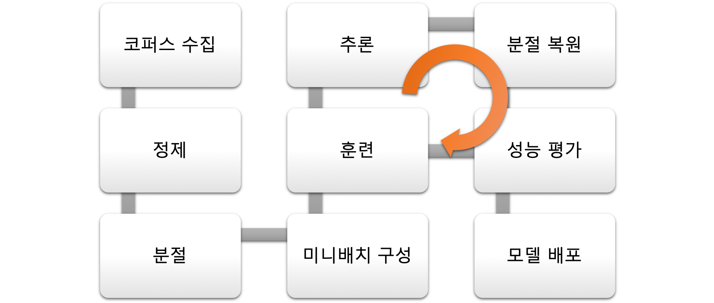

# 파이프라인

이전까지의 챕터들에서 우리는 자연어처리에 대한 다양한 이론과 실습 예제들을 다루었습니다. 이제 이러한 자연어처리 알고리즘들이 어떻게 실제 필드에서 결합되어 적용되고 있는지 살펴보고자 합니다. 구글 마이크로소프트와 같은 여러 회사들도 자신들의 기술력을 자랑하기 위하여 앞다투어 자신들이 적용한 자연어처리(기계번역) 시스템에 대한 논문을 아주 상세하게 논문에 공개 합니다. 많은 회사들이 자신들의 상용화 경험을 토대로 성과를 자랑하는 논문을 써 내고 있습니다. 우리는 딥러닝 자연어처리 분야의 가장 성공적인 상용화 분야인 신경망 기계번역의 상용화 사례에 대해서 다루어 보도록 하겠습니다. 이제 기계번역은 2014년도의 큰 충격 이후로부터 수많은 응용 방법들이 쏟아져나왔고, 어느정도 표준적인 방법 A to Z가 정립되어 가고 있는 시점입니다.

사실, 요즈음과 같이 새로운 기술에 대한 논문 및 소스코드 공개가 당연시되는 현상 아래에서는 각 기계번역 시스템의 알고리즘 수준의 편차가 그렇게 크지 않습니다. 따라서 누가 최신 기술을 구현했느냐보다, 상용화에 대한 경험과 연륜, 데이터의 양과 품질(정제 이슈)에 따라 성능이 결정될 수 있습니다. 따라서 이런점을 항상 명심하고 기초에 충실하도록 해야 합니다.

아래는 현재 대표적인 기계번역 시스템의 현 주소를 살펴볼 수 있는 간단한 샘플 문장 입니다. (2018년 04월 기준)

|원문|차를 마시러 공원에 가던 차 안에서 나는 그녀에게 차였다.|
|-|-|
|Google|I was kicking her in the car that went to the park for tea.|
|Microsoft|I was a car to her, in the car I had a car and went to the park.|
|Naver|I got dumped by her on the way to the park for tea.|
|Kakao|I was in the car going to the park for tea and I was in her car.|
|SK|I got dumped by her in the car that was going to the park for a cup of tea.|

위와 같이 어려운 문장(문장구조는 쉬우나 중의성에 대해서 높은 난이도)에 대해서 어찌보면 갈 길이 멀기도 합니다. 따라서, 위와 같이 누군가 저런 어려운 문제에 대한 한단계 더 높은 기술력을 가졌다기보단, 기술의 수준은 비슷하다고 볼 수 있습니다.

## 기계번역을 위한 파이프라인

이번 섹션에서는 실제 기계번역 시스템을 구축하기 위한 절차와 시스템 파이프라인이 어떻게 구성되는지 살펴보도록 하겠습니다. 이 과정들은 대부분 기계번역 뿐만 아니라 기본적인 자연어처리 문제 전반에 적용 가능하다고 할 수 있습니다. 그리고 실제 구글 등에서 발표한 논문을 통해서 그들의 상용 번역 시스템의 실제 구성에 대해서 살펴보도록 하겠습니다.

통상적으로 번역시스템을 구축하면 아래와 같은 흐름을 가지게 됩니다.

### 준비과정

1. 코퍼스 수집, 정제
    - 병렬 말뭉치(parallel corpus)를 다양한 소스에서 수집합니다. WMT등 번역 시스템 평가를 위해 학술적으로 공개 된 데이터 셋도 있을 뿐더러, 뉴스 기사, 드라마/영화 자막, 위키피디아 등을 수집하여 번역 시스템에 사용 할 수 있습니다.
    - 수집된 데이터는 정제 과정을 거쳐야 합니다. 정제 과정에는 양 언어의 말뭉치에 대해서 문장 단위로 정렬을 시켜주는 작업부터, 특수문자 등의 노이즈(noise)를 제거해 주는 작업도 포함 됩니다.
1. 분절하기(Tokenization)
    - 각 언어 별 형태소 분석기(POS tagger) 또는 분절기(tokenizer 또는 segmenter)를 사용하여 띄어쓰기를 정제합니다. 영어의 경우에는 대소문자에 대한 정제 이슈가 있을 수도 있습니다. 한국어의 경우에는 한국어의 특성 상 인터넷에 공개 되어 있는 코퍼스들은 띄어쓰기가 제멋대로일 수 있습니다.
    - 한국어의 경우에는 Mecab, KoNLPy과 같은 공개 되어 있는 형태소 분석기가 있습니다.
    - 띄어쓰기가 정제 된 이후에는 Subword 또는 WordPiece와 같은 공개되어 있는 툴을 사용하여 Byte Pair Encoding(BPE)를 수행 합니다. 이를 통해 추가적인 분절을 수행하고 어휘 목록을 구성합니다. 이때 BPE 분절을 위해 학습한 분절 모델은 추후 사용을 위해 잘 보관해야 합니다.
1. 미니배치 구성(Batchify)
    - 전처리 작업이 끝난 코퍼스에 대해서 딥러닝 훈련을 시작하기 위해서 미니배치(mini-batch)로 만드는 작업이 필요합니다.
    - 여기서 중요한 점은 미니배치 내의 문장들의 길이를 최대한 같도록 통일시켜 주는 것 입니다. 이렇게 하면 문장 길이가 달라져서 발생하는 훈련 시간의 낭비를 최소화 할 수 있습니다. 
    - 예를 들어 미니배치 내에서 5단어 짜리 문장과 70단어 짜리 문장이 공존할 경우, 5단어 짜리 문장에 대해서는 불필요하게 65 time-step을 더 진행해야 하기 때문입니다. 따라서 5단어와 비슷한 길이의 문장끼리 모아서 미니배치를 구성하면 해당 미니배치에 대해서는 훨씬 훈련 수행 시간을 줄일 수 있습니다.
    - 실제 훈련 할 때에는 이렇게 구성된 미니배치들의 순서를 임의로 섞어(shuffling) 훈련하게 됩니다.
1. 훈련하기
    - 준비된 데이터셋을 사용하여 sequence-to-sequence 모델을 훈련 합니다. 데이터의 양에 따라 한개의 GPU를 사용하여 훈련할 수도 있고, 여러개의 GPU를 병렬 사용하여 훈련하여 시간을 단축할 수도 있습니다.
1. 추론하기(Inference)
    - 성능 평가(evaluation)를 위한 추론을 수행 합니다. 이때에는 사전에 잘 준비된 테스트셋을 사용하여 추론을 수행합니다.
    - 이때 테스트셋이 너무 쉽거나 너무 어려운 문장들로 구성되어 있다면 정확한 평가가 어려울 것 입니다.
    - 풀고자 하는 문제에 따라서 여러 도메인에 대해서 각각 테스트셋을 만들어, 각 도메인에 대한 모델 및 알고리즘의 성능을 평가할 수 있습니다.
1. 분절 복원하기
    - 추론 과정이 끝나더라도 분절이 되어 있어 아직 사람이 실제 사용하는 문장 구성과 형태가 다릅니다. 따라서 분절을 복원하는 작업(detokenization)을 수행하면 실제 사용되는 문장의 형태로 반환 됩니다.
1. 성능 평가(Evaluation)
    - 이제 이렇게 얻어진 문장에 대해서 정량평가를 수행 합니다. 기계번역을 위한 정량평가 방법으로는 BLEU가 있습니다. 비교대상의 BLEU점수와 비교하여 어느 모델이 더 우월한지 알 수 있습니다.
    - 정량평가에서 기존 대비 또는 경쟁사 대비 더 우월한 성능을 갖추었음을 알게 되면, 정성평가를 수행 합니다. 번역의 경우에는 사람이 직접 비교 대상들의 결과들과 비교하여 어느 모델이 우월한지 평가 합니다.
    - 정량평가와 정성평가 모두 성능이 개선되었음을 알게 되면 이제 서비스에 적용 가능 합니다.

### 서비스

1. API 호출 or 사용자로부터의 입력
    - 대부분 서비스 별 API 서버를 만들어 실제 프론트앤드(front-end)로부터 API 호출을 받아 프로세스를 시작 합니다.
    - 서비스의 스케일(scale)에 따라 로드밸런서(load-balancer)등을 두어 부하를 적절히 분배하기도 합니다.
    - 서비스의 형태나 성격에 따라서 실제 모델 추론(inference)을 수행하지 않고, 정해진 응답을 반환하기도 합니다.
1. 분절하기
    - 추론을 위해서 실제 모델에 훈련된 데이터셋과 동일한 형태로 분절을 수행 합니다.
    - 중요한 점은 훈련할 때와 똑같은 툴과 모델(BPE의 경우)을 사용하여 분절해야 한다는 것 입니다.
1. 추론하기
    - 정량/정성 평가를 통해 성능이 입증된 모델을 사용하여 추론을 수행 합니다.
    - 수행 속도에 대한 최적화가 매우 중요합니다. 번역을 예롤 들면, 한개의 문장씩 실시간 번역이 필요한 경우도 있지만, 수십만 이상의 문장에 대한 번역의 요구가 있을 수도 있습니다. 이와 같이 많은 수의 문장에 대해서는 병렬 연산을 수행하여 처리 속도를 높이고, 하나의 문장에 대해서도 빠르게 동작하도록 최적화가 필요 합니다.
1. 분절 복원하기
    - 다시 사람이 읽을 수 있는 형태로 분절을 복원하는 작업(detokenization)을 수행 합니다.
1. API 결과 반환하기 또는 사용자에게 결과 반환하기
    - 최종 결과물을 API 서버에서 반환합니다.
