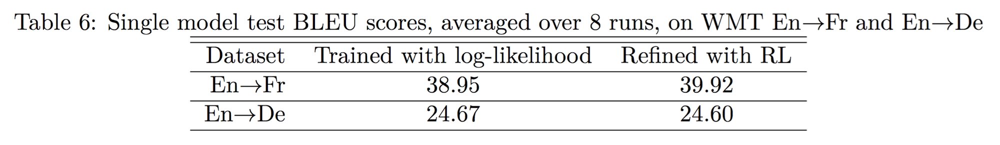
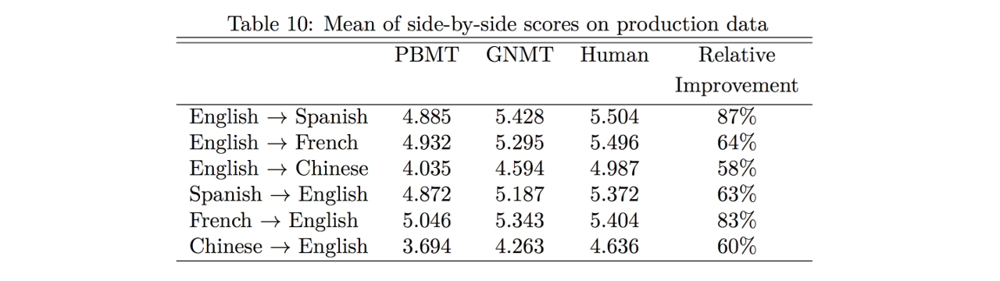

# 구글의 신경망 기계번역 (Google Neural Machine Translation, GNMT)

구글은 2016년 논문([Google’s Neural Machine Translation System: Bridging the Gap between Human and Machine Translation [Wo at el.2016]](https://arxiv.org/pdf/1609.08144.pdf)
)을 발표하여 그들의 번역시스템(GNMT)에 대해서 상세히 소개하였습니다. 실제 시스템에 적용된 모델 구조(architecture)부터 훈련 방법까지 상세히 기술하였기 때문에, 실제 번역 시스템을 구성하고자 할 때에 훌륭한 참고자료가 될 수 있습니다. 또한 다른 논문들에서 실험 결과에 대해 설명할 때, GNMT를 베이스라인으로 참조하기도 합니다. 아래의 내용들은 그들의 논문에서 소개한 내용을 다루도록 하겠습니다.

## 모델 구조

구글도 sequence-to-sequence 기반의 모델을 구성하였습니다. 다만, 구글은 훨씬 방대한 데이터셋을 가지고 있기 때문에 그에 맞는 깊은 모델을 구성하였습니다. 따라서 아래에 소개될 방법들이 깊은 모델들을 효율적으로 훈련 할 수 있도록 사용되었습니다.

### 레지듀얼 커넥션 (Residual Connection)

![레지듀얼 커넥션을 적용한 모습 (출처: [[Wo at el.2016]](https://arxiv.org/pdf/1609.08144.pdf))](../assets/14-02-01.png)

보통 LSTM 레이어를 4개 이상 쌓기 시작하면 모델이 더욱 깊어짐에 따라서 성능 효율이 저하되기 시작한다고 합니다. 따라서 구글은 깊은 모델은 효율적으로 훈련시키기 위하여 레지듀얼 커넥션을 적용하여 이 문제를 해결하고 더 깊은 LSTM을 사용하였습니다.

### 인코더의 첫 레이어에만 양방향으로 사용하기

![인코더의 첫번째 레이어에 적용 된 모습 (출처: [[Wo at el.2016]](https://arxiv.org/pdf/1609.08144.pdf))](../assets/14-02-02.png)

모든 LSTM 레이어에 대해서 양방향(bi-directional) LSTM을 적용하는 대신에, 첫번째 층에 대해서만 양방향 LSTM을 적용하였습니다. 이를 통해 성능의 큰 하락 없이, 훈련 및 추론 속도에 개선이 있었다고 합니다.

## 분절 방법

### Wordpiece 모델

구글도 마찬가지로 BPE 모델을 사용하여 추가적인 분절을 수행하였습니다. 그리고 사용한 분절기를 오픈소스로 공개하였습니다. <comment> [SentencePiece: https://github.com/google/sentencepiece](https://github.com/google/sentencepiece) </comment> 마찬가지로 아래와 같이 띄어쓰기는 underscore로 치환하고, 단어를 서브워드(subword)별로 통계에 따라 분절 합니다.

||문장|
|-|:-|
|원문|Jet makers feud over seat width with big orders at stake|
|wordpieces 적용 후|_J et _makers _fe ud _over _seat _width _with _big _orders _at _stake|

## 훈련 방법

구글은 앞선 챕터에서 설명한 강화학습 기법을 사용하여 Maximum Likelihood Estimation (MLE)방식의 훈련된 모델에 파인튜닝(fine-tuning)을 수행하였습니다. 따라서 아래의 테이블과 같은 추가적이 성능 개선을 얻어낼 수 있었습니다. 기존 MLE 방식의 목적함수를 아래와 같이 구성합니다. $Y^{*(i)}$ 은 최적(optimal)의 정답 데이터를 의미합니다.

$$\mathcal{O}_{ML}(\theta)=\sum_{i=1}^N\log P_\theta(Y^{*(i)}|X^{(i)})$$

여기에 추가로 RL방식의 목적함수를 추가하였는데 이 방식이 폴리시 그래디언트 방식과 같습니다.

$$\mathcal{O}_{RL}(\theta)=\sum_{i=1}^N \sum_{Y \in \mathcal{Y}} P_\theta(Y|X^{(i)})r(Y, Y^{*(i)})$$

따라서 위의 수식도 앞서 소개한 Minimum Risk Training (MRT) 방식과 비슷합니다. $r(Y, Y^{*(i)})$ 또한 정답과 샘플링한 데이터 사이의 유사도(점수)를 의미합니다. 가장 큰 차이점은 기존에는 리스크로 취급하여 최소화(minimize)하는 방향으로 훈련하였지만, 이번에는 정석대로 보상(reward)으로 취급하여 최대화(maximize)하는 방향으로 훈련하게 된다는 것 입니다. 이렇게 새롭게 추가된 목적함수를 아래와 같이 기존의 MLE 방식의 목적함수와 선형 결합(linear combination)을 취하여 최종적인 목적함수가 완성됩니다.

$$\mathcal{O}_{Mixed}(\theta)=\alpha*\mathcal{O}_{ML}(\theta)+\mathcal{O}_{RL}(\theta)$$

이때에 $\alpha$ 값은 주로 0.017로 셋팅하였습니다. 위와 같은 방법의 BLEU 성능을 실험한 결과는 다음과 같습니다.

|데이터셋|MLE|MLE + RL|
|-|:-:|:-:|
|영어 $\rightarrow$ 프랑스어|38.95|39.92|
|영어 $\rightarrow$ 독일어|24.67|24.60|

<!--

-->

영어 $\rightarrow$ 독일어의 경우에는 성능이 약간 하락함을 보였습니다. 하지만 이는 아래에 소개할 디코더의 길이 패널티(length penalty), 커버리지 패널티(coverage penalty)와 결합되었기 때문이고, 이 페널티들이 없을 때에는 훨씬 큰 성능 향상이 있었다고 합니다.

## 양자화(Quantization)

실제 인공신경망을 사용한 제품을 개발할 때에는 여러가지 어려움에 부딪히게 됩니다. 이때, 양자화를 도입함으로써 아래와 같은 여러가지 이점을 얻을 수 있습니다.

- 계산량을 줄여 자원의 효율적 사용과 응답시간의 감소를 얻을 수 있다.
- 모델의 실제 저장되는 크기를 줄여 서비스를 위한 설치(deploy)를 효율적으로 할 수 있다.
- 부가적으로 regularization의 효과를 볼 수 있다.

![양자화에 따른 성능 개선 효과 (출처: [[Wo at el.2016]](https://arxiv.org/pdf/1609.08144.pdf)))](../assets/14-02-04.png)

위의 그래프를 보면 전체적으로 양자화 된 모델이 더 낮은 negative log-likelihood를 보여주는 것을 확인할 수 있습니다.

## 추론

### 길이 패널티(Length Penalty)와 커버리지 패널티(Coverage Penalty)

구글은 기존에 소개한 길이 패널티에 추가로 커버리지 패널티를 사용하여 좀 더 성능을 끌어올렸습니다. 커버리지 패널티는 어텐션 웨이트의 분포에 따라서 매겨집니다. 디코더의 각 time-step이 어텐션을 통해 다양한 인코더의 time-step에 접근 할 수록 더 좋은 점수를 받도록 되어 있습니다.

$$\begin{gathered}
s(Y,X)=\log{P(Y|X)}/lp(Y)+cp(X;Y) \\
lp(Y)=\frac{(5+|Y|)^\alpha}{(5+1)^\alpha} \\
cp(X;Y)=\beta*\sum_{i=1}^{|X|}{\log{(\min{(\sum_{j=1}^{|Y|}{p_{i,j}},1.0)})}} \\
\text{where }p_{i,j}\text{ is the attention weight of the }j\text{-th target word }y_j\text{ on the }i\text{-th source word }x_i.
\end{gathered}$$

커버리지 패널티의 수식을 들여다보면, 각 소스(source) 문장의 단어 $x_i$ 별로 어텐션 웨이트의 합을 구하고, 그것의 평균(합)을 내는 것을 볼 수 있습니다. 로그(log)를 취했기 때문에 그 중에 어텐션 웨이트가 편중되어 있다면, 편중되지 않은 소스 문장의 단어는 매우 작은 음수 값을 가질 것이기 때문에 좋은 점수를 받을 수 없을 겁니다.

실험에 의하면 $\alpha$ 와 $\beta$ 는 각각 0.6, 0.2 정도가 좋은것으로 밝혀졌습니다. 하지만, 상기한 강화학습 방식에 함께 적용하면 그다지 그 값은 중요하지 않다고 하였습니다.

## 훈련 과정

![Optimizer에 따른 손실값의 변화 (출처: [[Wo at el.2016]](https://arxiv.org/pdf/1609.08144.pdf))](../assets/14-02-05.png)

구글은 stochastic gradient descent(SGD) 또는 Adam[Kingma et al.,2014]을 단독으로 사용하여 훈련 시키는 것 보다, 둘을 섞어 사용하면 더 좋은 성능을 발휘하는 것을 확인하였습니다. 첫 번째 에포크(epoch)는 Adam을 사용하여 낮은 손실값까지 빠르게 학습한 이후에, 두 번째 에포크부터 SGD를 사용하여 최적화를 수행하였을 때, 더 좋은 성능을 발휘하는 것을 확인하였다고 합니다.

## 성능 평가

|모델|통계기반|GNMT|사람|애러 감소율|
|:-:|:-:|:-:|:-:|:-:|
|영어 $\rightarrow$ 스페인어|4.885|5.423|5.504|87%|
|영어 $\rightarrow$ 프랑스어|4.932|5.295|5.496|64%|
|영어 $\rightarrow$ 중국어|4.035|4.594|4.987|58%|
|스페인어 $\rightarrow$ 영어|4.872|5.137|5.372|63%|
|프랑스어 $\rightarrow$ 영어|5.046|5.343|5.404|83%|
|중국어 $\rightarrow$ 영어|3.694|4.263|4.636|60%|

<!--

-->

실제 번역 품질을 측정하기 위하여 BLEU 이외에도 정성평가(implicit human evaluation)을 통하여 GNMT의 성능 개선의 정도를 측정하였습니다. 최하점 0점에서 최고점 6점 사이로 점수를 매겨 사람의 번역 결과 점수를 최대치로 가정하고 성능의 개선폭으로 애러 감소율을 계산하였습니다. 실제 통계기반 방식 대비 엄청난 천지개벽 수준의 성능 개선이 이루어진 것을 알 수 있고, 일부 언어쌍에 대해서는 거의 사람의 수준에 필적하는 성능을 보여주는 것을 알 수 있습니다. 이렇게 구글은 이 논문을 통해 기존의 통계기반 기계번역(SMT) 시대의 종말을 선언하고 본격적으로 자연어처리분야에서 딥러닝의 시대를 선포하였습니다.
