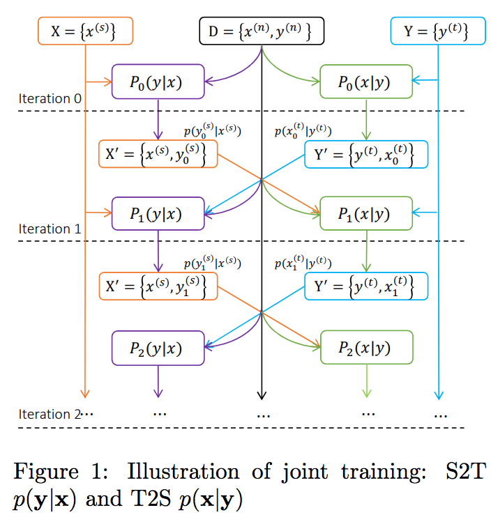
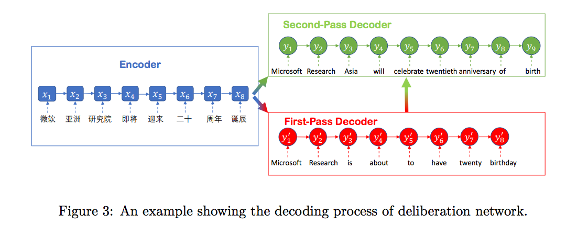
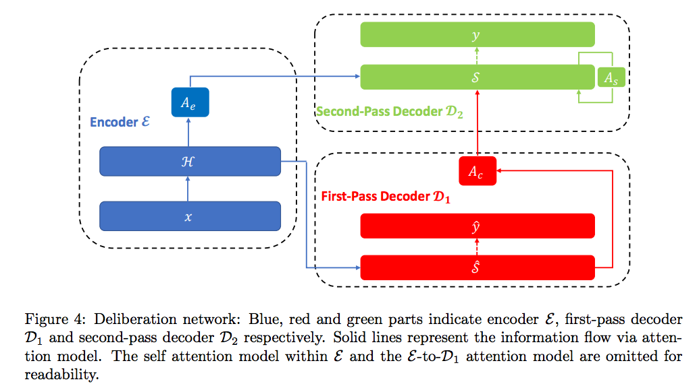

# 마이크로소프트의 신경망 기계번역

구글의 경우에는 앞서 2016년부터 자신의 신경망 번역시스템에 대한 논문을 냈고, 추가적으로 [트랜스포머 [Vaswani et al.2017]](https://arxiv.org/abs/1706.03762)라는 구조를 발표하며 자연어처리 분야에서의 우위성을 일치감치 뽐냈습니다. 페이스북의 경우에도 이에 질세라 [Convolutional Sequence-to-Sequence [Gehring et al.2017]](https://arxiv.org/abs/1705.03122)를 발표하며 그들의 툴킷 [fairseq](https://github.com/pytorch/fairseq)도 오픈소스로 공개 하였습니다. 하지만 마이크로소프트에서는 이렇다할 성과가 그동안 없었습니다.

2018년 3월, 드디어 긴 침묵을 깨고 마이크로소프트도 자신의 기계번역 시스템([Achieving Human Parity on Automatic Chinese to English News Translation [Hassan et al.,2018]](https://arxiv.org/pdf/1803.05567.pdf))에 대한 성능을 뽐냈습니다. 2016년에 발표된 GNMT는 기계번역 자체의 기본 성능을 끌어올리는 모델 아키텍쳐와 훈련 방법 등의 내부 구조에 대해서 많은 설명을 할애하였던 것과 달리, 마이크로소프트의 해당 논문은 기술을 이미 끌어올려진 기술의 기반 위에서 더욱 그 성능을 견고히하는 방법에 대한 설명에 분량을 더 할애하였습니다.

주로 중국어와 영어 간 기계번역 시스템을 다루고 있고, 뉴스 도메인(domain) 번역에 있어서 사람의 번역과 비슷한 성능에 도달하였다고 소개하고 있습니다. 다만 제안한 방법에 의해 구성된 기계번역 시스템이 모든 언어쌍에 대해서, 모든 분야의 도메인에 대해서 같은 사람 번역 수준에 도달하지는 못할 수도 있다고 설명하고 있습니다. 마이크로소프트는 전통적인 RNN 기반의 sequence-to-sequence 대신에, 구글의 트랜스포머 구조를 사용하여 sequence-to-sequence를 구현하였습니다. 이 논문에서 차용한 중점 기술은 아래와 같습니다.

* Back-translation과 듀얼러닝(지도학습 및 비지도학습)을 통한 단방향 코퍼스의 활용 극대화
* Auto-regressive 속성의 단점을 보완하기 위한 딜리버레이션 네트워크(Deliberation Networks, [[Xia et al.,2017](https://papers.nips.cc/paper/6775-deliberation-networks-sequence-generation-beyond-one-pass-decoding.pdf)])와 Kullback-Leibler divergence를 이용한 regularization
* NMT 성능을 극대화 하기 위한 훈련 데이터 선택(selection)과 필터링(filtering)

위의 기술들에 대해서 한 항목씩 차례로 살펴보도록 하겠습니다.

## 듀얼리티를 활용하기

이 논문에서는, 앞 챕터에서 설명한 [Dual Supervised Learning (DSL) [Xia et al.2017]](https://arxiv.org/pdf/1707.00415.pdf) 방식과, 단방향 코퍼스를 활용하여 성능을 극대화하는 [Dual Unsupervised Learning (DUL) [Wang et al.2017]](https://www.microsoft.com/en-us/research/wp-content/uploads/2017/11/17041-72820-1-SM.pdf) 방식을 모두 사용하였습니다.

<!--
### Joint Training of Src2Tgt and Tgt2Src Models

-->

## 딜리버레이션 네트워크 (Deliberation Networks)

마이크로소프트는 [Xia et al.2017]에서 소개한 방식을 통해 번역 성능을 더욱 높이려 하였습니다. 사실 사람은 번역을 할 때에 소스(source) 문장에서 번역 초안을 얻고, 그 초안 문장으로부터 최종적인 타겟(target) 문장을 번역 해 내곤 합니다. 따라서 신경망을 통해 같은 방법을 구현하고자 하였습니다.

<!--
예를 들어 기존의 번역의 수식은 아래와 같이 바뀔 수 있습니다.

$$P(Y|X)=\prod{P(y_i|X,y_{<i})} \longrightarrow P(Y|X)=\prod{P(y_i|X,Y_{mid},y_{<i})}$$

### Agreement Regularization of Left-to-Right and Right-to-Left Models

## Data Selection and Filtering
-->

## 성능평가

|모델|설명|BLEU|
|-|-|-|
|Base|트랜스포머|24.2|
|BT|Base + Back Translation|25.57|
|DL|BT + 듀얼러닝|26.51|
|DLDN|DL + 딜리버레이션 네트워크|27.40|

<!--

-->

마이크로소프트의 논문은 트랜스포머를 메이저 상용시스템에 성공적으로 적용한 좋은 사례가 될 수 있습니다. 사실 이전까지는 주류로 올라오지 못하였던 트랜스포머 모델 구조는 이후에는 널리 쓰이는 모델이 되었습니다. 또한 단방향 코퍼스를 활용하여 번역 성능을 높이고자 하는 노력이 듀얼러닝을 통해 한층 더 끌어올려졌으며, 성공적으로 상용화 시스템에 적용되었음을 알 수 있습니다.
