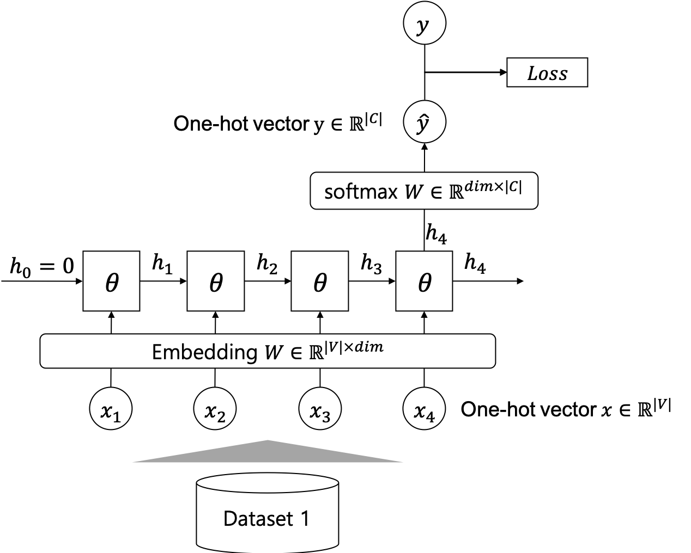
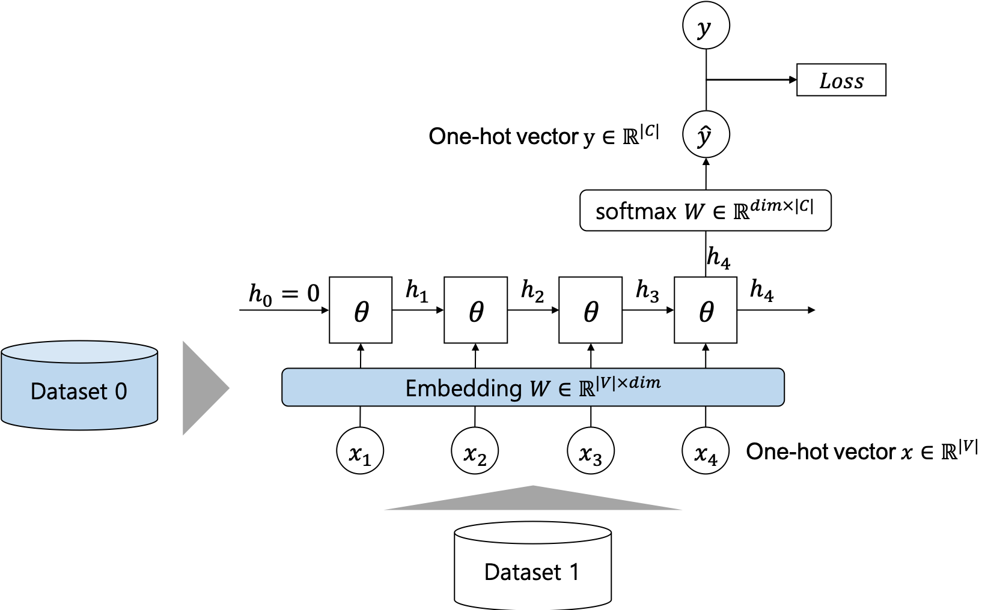
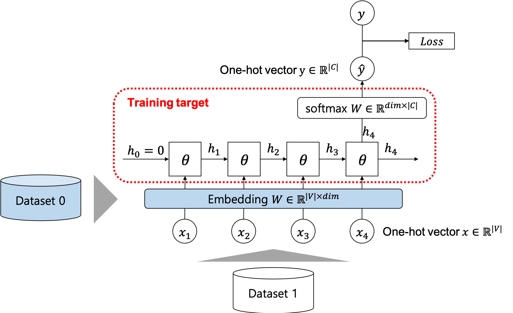
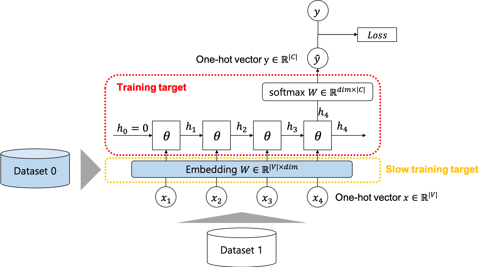
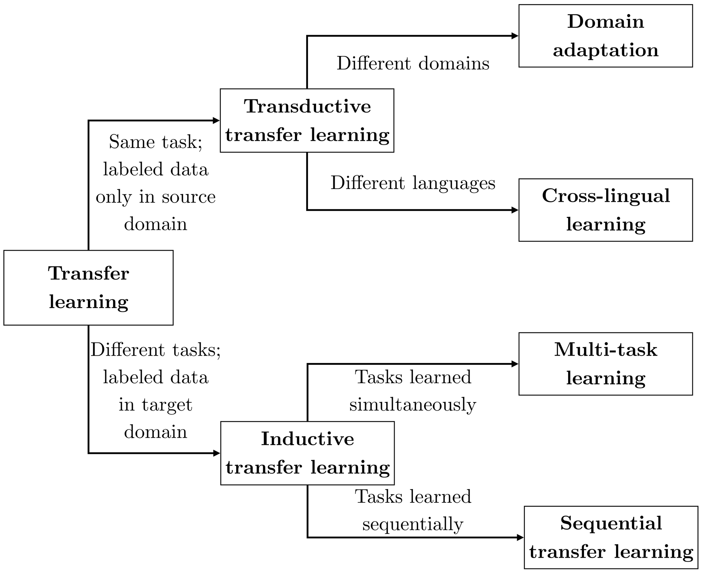

# 기존의 사전훈련 방식

Word2Vec이 등장한 이후, 사람들은 꾸준히 사전훈련된(pretrained) 단어 임베딩 벡터(word embedding vector)를 사용하여 딥러닝 모델을 개선하려 하였습니다. 앞서 단어 임베딩 벡터와 관련된 내용을 다룬 장에서는, 이와 관련하여 사람들이 흔히 갖고 있는 잘못된 개념이라고 설명하였습니다. 물론 기훈련된 단어 임베딩 벡터들을 기존의 머신러닝 알고리즘에 적용하였을 때는 성과가 있을 수 있지만, 딥러닝 모델에서는 생각보다 큰 효과를 거둘 수 없었기 때문입니다. 사전훈련된 단어 임베딩 벡터를 사용하여 텍스트 분류와 같은 문제에 적용할 때, 사용할 수 있는 방법들을 설명하고자 합니다.

아직은 새로운 전이학습 기법들에 대해서 다루지 않았기 때문에, 기존에 단어 임베딩 벡터를 활용한 방법을 가지고 전이학습에 적용하는 방법을 살펴보고자 합니다. 다음의 그림과 같이 RNN을 사용한 간단한 텍스트 분류(text classification) 신경망의 경우를 가정해 보도록 하겠습니다.



예전 텍스트 분류에 관련한 장에서 다루었듯이, 신경망은 소프트맥스(softmax) 계층과 RNN계층들 그리고 임베딩(embedding) 계층으로 이루어져 있습니다. 우리는 원-핫 인코딩 벡터들을 문장 내 단어 대신 입력 $x$ 로 넣어, 신경망 $f_\theta$ 를 통과시켜 클래스를 예측하는 분포 $\hat{y}$ 를 반환하도록 할 것입니다.


이전에 다루었듯이, 원-핫 인코딩 벡터의 특성으로 인해, 1 위치의 값만 살아남게 될 것 입니다. 따라서 임베딩 계층의 웨이트 파라미터 $W$ 의 각 행(row)은 해당 단어의 임베딩 벡터와 같습니다.

## 사전훈련된 웨이트 파라미터를 사용하는 방법

### 신경망 웨이트 파라미터 초기값으로 사용

여기서 다음의 그림과 같이 각 단어의 임베딩 벡터를 사전훈련한 단어 임베딩 벡터로 치환하여 사용하면 될 것 입니다. 이후에 이 임베딩 계층의 웨이트 파라미터 값과, 기타 신경망의 랜덤 초기화된 웨이트 파라미터값에 대해서 오류역전파(back-propagation) 알고리즘과 경사하강법(gradient descent)을 통해 학습을 수행하면 될 것 입니다.



### 신경망 웨이트 파라미터 값으로 고정



이때 임베딩 계층의 웨이트 파라미터는 최적화 대상에서 제외함으로써, 우리는 임베딩 계층을 제외한 신경망의 다른 웨이트 파라미터들만 학습하도록 할 수 있습니다. 아마 기존에는 경사하강법을 수행하기 위해서 다음과 같이 Adam optimizer에게 파라미터를 등록해 주어야 했을 것 입니다. 이때, model.parameters()는 모델 내의 웨이트 파라미터들을 반환해주는 iterator 입니다.

```python
    crit = optim.Adam(model.parameters())
```

따라서 우리는 다음과 같이 임베딩 계층을 제외하고 신경망 내의 다른 구성요소들의 파라미터들을 등록해 줄 수 있을 것 입니다.

```python
    crit = optim.Adam(model.softmax_layer.parameters() + model.rnn.parameters())
```

### 신경망 웨이트 파라미터 초기값으로 사용 및 느린 학습



마지막으로 우리는 임베딩 계층의 웨이트 파라미터를 최적화에서 제외하는 대신에 천천히 학습하도록 할 수도 있습니다. 다만 이때는 또다른 learning rate가 하이퍼 파라미터(hyper-parameter)로 추가될 것 입니다.

```python
    crit = optim.Adam(model.softmax_layer.parameters() + model.rnn.parameters())
    crit_emb = optim.Adam(model.emb_layer.parameters(), lr=1e-6)
```

## 사전훈련된 워드 임베딩 벡터를 사용하는 것이 성공하지 못하는 이유

하지만 이전에도 다루었듯이, 이러한 방식의 전이학습은 그다지 큰 효과를 거둘 수 없었습니다. 그 이유에 대해서 좀 더 자세히 이야기하도록 하겠습니다.

### 기존의 단어 임베딩 알고리즘은 문장의 문맥을 반영하지 못함

Word2Vec의 Skip-gram이나 GloVe 알고리즘은 비록 성공적으로 단어를 latent space에 임베딩 할 수 있었지만, 그 알고리즘은 문장내의 함께 출현(co-occurrence)한 단어들을 예측하는데 기반합니다. 따라서 임베딩된 정보는 매우 한정적일 수 밖에 없습니다. 특히 해당 알고리즘들의 목적함수(objective function)는 우리가 실제 수행하고자하는 문제를 해결하기 위한 목적함수와 매우 다를 것이기 때문에, 우리가 필요한 특징(feature)을 반영하기 힘들 것 입니다.

또한, 기존 단어 임베딩 알고리즘들의 결과는 문장의 문맥을 고려한 단어의 의미를 임베딩 하기에는 너무 단순합니다. 사실 같은 단어라고 할지라도 문장의 문맥에 따라 그 의미가 확연하게 달라지는 것은 사실입니다. 예를 들어 'play'라는 단어가 있을 때, 목적어에 따라서 그 의미는 매우 달라질 것입니다. 

|play|target|
|-|-|
|연주하다|guitar|
|재생하다|movie|
|놀다|football|

또한 문장 내 단어의 위치에 따라서도 쓰임새와 의미가 달라집니다. 이와 같은 정보들이 임베딩 계층 상위 계층에서 잘 추출 및 반영되더라도 애초에 단어 임베딩 할 때에 고려되어 입력으로 주어진것에 비해서 불리할 것은 당연한 사실 입니다.

### 신경망의 입력 계층의 웨이트 파라미터에만 적용됨

또한 위의 적용 방법에 대한 설명에서 보았듯이, 대부분의 기존 적용 방법들은 임베딩 계층(embedding layer)에 국한되어 있습니다. 비록 임베딩 계층의 웨이트 파라미터만 한정하여 봤을때는 전역 최소점에 좀 더 가까울지라도, 신경망 전체 웨이트 파라미터가 고려되었을 때는 최적화에 유리할지는 알 수 없습니다. 따라서 신경망 전체에 대해서 사전훈련하는 방법을 사용하는 것이 더 필요합니다.

## 자연어 처리에서 전이학습의 효과

이번 장에서 소개할 자연어 처리에 전이학습을 적용하기 위한 방법들은 위에서 열거한 기존의 단점들을 효과적으로 보완한 것이 특징입니다. 따라서, 기존의 자연어 처리 문제에 다양하게 적용되어 성공을 거둘 수 있었습니다. 이에 따라, 마치 영상처리(computer vision) 분야에서 성공한 이미지넷의 사전훈련된 신경망 웨이트 파라미터들을 여러 다른 영상처리 분야에 활발하게 사용하였던 것 처럼, 자연어 처리 분야에서도 수많은 문장들을 수집하여 학습한 신경망을 통해 다른 문제에 성공적으로 적용 및 성능을 개선 할 수 있는 방법이 마련되었습니다.



특히, 수집에 비용이 들어가는 병렬 코퍼스나 레이블링(labeling) 텍스트와 달리, 일반적인 문장들의 수집은 매우 쉽고 값싸기 때문에, 전이학습이 더욱 큰 효과를 거둘 수 있습니다. 사실 기존의 데이터셋 수집에 비해서 일반 코퍼스 수집은 거의 비용이 들어가지 않기 때문에, 노력에 대비하여 매우 큰 성과를 위험부담 없이 얻을 수 있는 것입니다.
