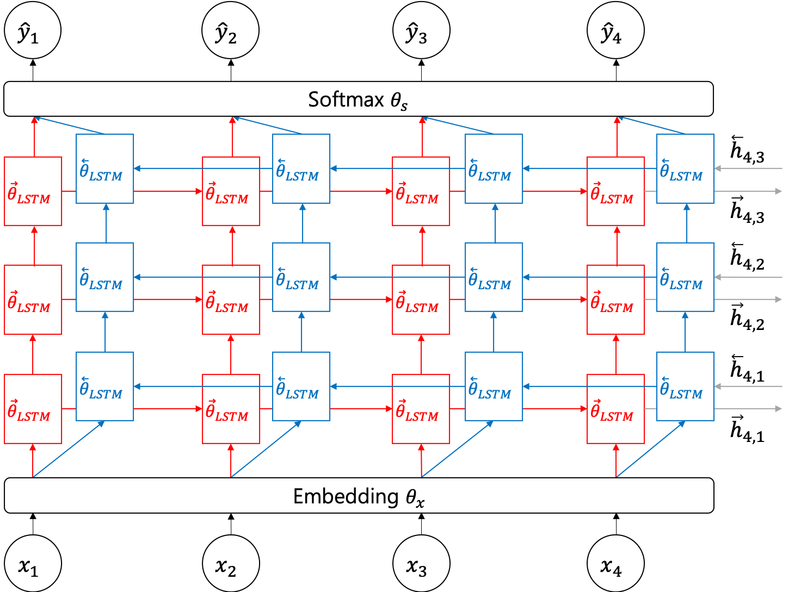
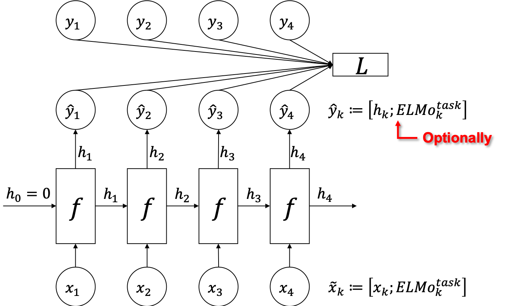

# ELMo

ELMo(Embedding from Language Model)는 2018년 2월에 출판된 논문([Deep contextualized word representations](https://arxiv.org/pdf/1802.05365.pdf))에서 제시된 방법 입니다. ELMo는 앞서 제기한 기존 사전훈련 방식에서의 여러가지 문제점을 해결하기 위한 방법을 제시하였습니다.

입력으로 주어진 문장을 단방향(unidirectional) LSTM에 넣고, 정방향과 역방향 언어모델(language model)을 각각 훈련합니다. <comment> 앞서 언어모델을 소개하는 장에서 이야기 하였듯이, 언어모델은 auto-regressive 모델입니다. 따라서 양방향(bi-directional) LSTM을 통해 훈련할 수는 없습니다. </comment> 

$$\begin{aligned}
p(t_1,t_2,\cdots,t_N)&=\prod_{k=1}^N{p(t_k|t_1,t_2,\cdots,t_{k-1})} \\
&=\prod_{k=1}^N{p(t_k|t_{k+1},t_{k+2},\cdots,t_N)}
\end{aligned}$$

이때 LSTM은 여러개의 계층으로 구성될 수 있으며, 각각의 계층이 주어진 문장 내의 토큰(token) 갯수 만큼 정방향과 역방향에 대해서 훈련 될 것 입니다.

이때, 정방향과 역방향 LSTM은 따로 구성( $\overrightarrow{\theta}_{LSTM},\overleftarrow{\theta}_{LSTM}$ )되어 있지만, LSTM의 입력을 위한 임베딩 계층 $\theta_x$ 와 출력을 받아 단어를 예측하는 소프트맥스(softmax) 계층 $\theta_s$ 은 웨이트 파라미터를 공유합니다.

$$\begin{gathered}
\mathcal{L}(\Theta)=\sum_{k=1}^N{\log{p(t_k|t_1,\cdots,t_{k-1};\theta_x,\overrightarrow{\theta}_{LSTM},\theta_s)}+\log{p(t_k|t_{k+1},\cdots,t_N;\theta_x,\overleftarrow{\theta}_{LSTM},\theta_s)}}, \\
\text{where }\Theta=\{\theta_x,\overrightarrow{\theta}_{LSTM},\overleftarrow{\theta}_{LSTM},\theta_s\}.
\end{gathered}$$

그럼 우리는 단어의 임베딩 벡터를 비롯하여, LSTM의 각 계층별 히든스테이트(hidden state)를 각 time-step 별로 얻을 수 있습니다. 이들에 대한 가중합(weighted sum)을 구하여, 해당 단어(또는 토큰)에 대한 문장 내에서의 임베딩 표현(representation) $\text{ELMo}_k^{task}$ 를 구할 수 있습니다.

$$\begin{gathered}
\text{ELMo}_k^{task}=\gamma^{task}\sum_{j=0}^L{s_j^{task}\cdot{\text{h}_{k,j}^{LM}}} \\
\text{where }h_{k,j}^{LM}=\begin{cases}
x_k\text{ if }j=0, \\
\big[\overrightarrow{h}_{k,j}^{LM};\overleftarrow{h}_{k,j}^{LM}\big]\text{ if }j>0.
\end{cases}
\end{gathered}$$

표현은 각 time-step $k$ 별로 $L$ 개의 LSTM 히든 스테이트들을 가중치 $s_j^{task}$ 에 따라 가중합을 구합니다. 이때, $j=0$ 인 경우에는 단어의 임베딩 벡터를 가리킵니다. $j>0$ 의 경우에는 정방향과 역방향의 LSTM의 히든스테이트 $\overrightarrow{h}_{k,j}^{LM}, \overleftarrow{h}_{k,j}^{LM}$ 가 concatenate되어 구성 됩니다. 이 표현들은 풀고자하는 문제에 따라 달라지기 때문이 $task$ 라는 표시가 된 것을 수식에서 확인할 수 있습니다.

이렇게 얻어진 ELMo 표현(representation)은 실제 문제 수행을 위한 신경망의 입력 벡터에 다음 그림과 같이 concatenate되어 사용됩니다. 이때, ELMo 표현을 위한 신경망의 웨이트 파라미터는 업데이트 되지 않습니다. 즉, 기존에 언어모델을 훈련하여 얻어진 웨이트 파라미터를 고정하여 추론(inference)에 사용합니다.

수식에서, 각 단어의 표현은 LSTM의 정방향과 역방향 히든스테이트도 포함하고 있기 때문에, 문맥에 따른 단어의 의미도 표현이 가능합니다. 즉, 앞서 예를 들었던 'play'의 경우에 함께 출현한 문장내의 단어에 따라서 '연주하다' 또는 '재생하다' 등의 의미가 될 수 있을 것 입니다.

이 논문에서는 이러한 방법을 통해 전이학습을 수행함으로써 SQuAD(Stanford Question Answering Dataset)와 같은 높은 난이도의 Reading Comprehensive 문제에서부터, Semantic Role Labeling (SRL), Named Entity Recognition (NER)과 같은 다양한 자연어 처리 문제에 이르기까지 큰 성능개선을 이루어냈다고 밝혔습니다.

ELMo는 앞서 수식에서 살펴볼 수 있었듯이, 언어모델을 훈련하여 얻어지는 신경망의 히든스테이트(hidden state)를 단어의 임베딩에 사용함으로써, 문장의 문맥에 따른 다양한 의미를 반영할 수 있었습니다. 게다가 레이블링(labeling)이 필요없는 무한히 수집할 수 있는 일반 문장들을 통해 사전훈련(pretraining)을 수행함으로써, 별도의 추가 데이터셋 없이 성능을 크게 끌어올릴 수 있었다는 점에서 매우 큰 의미가 있다고 볼 수 있습니다.
