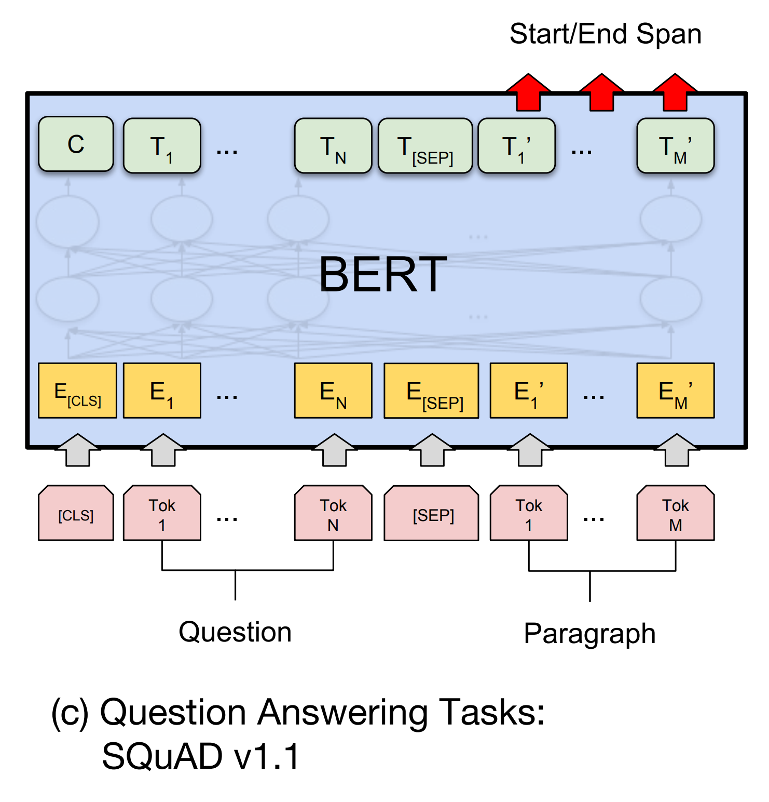
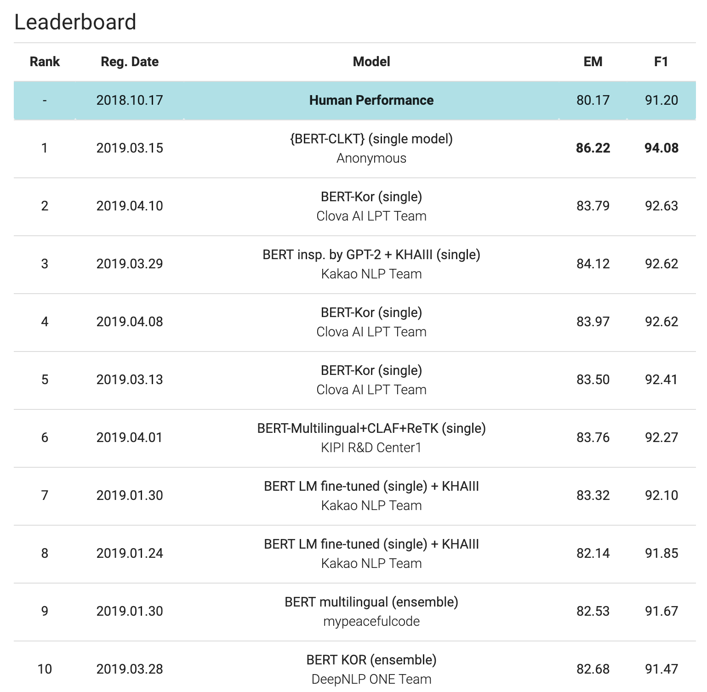
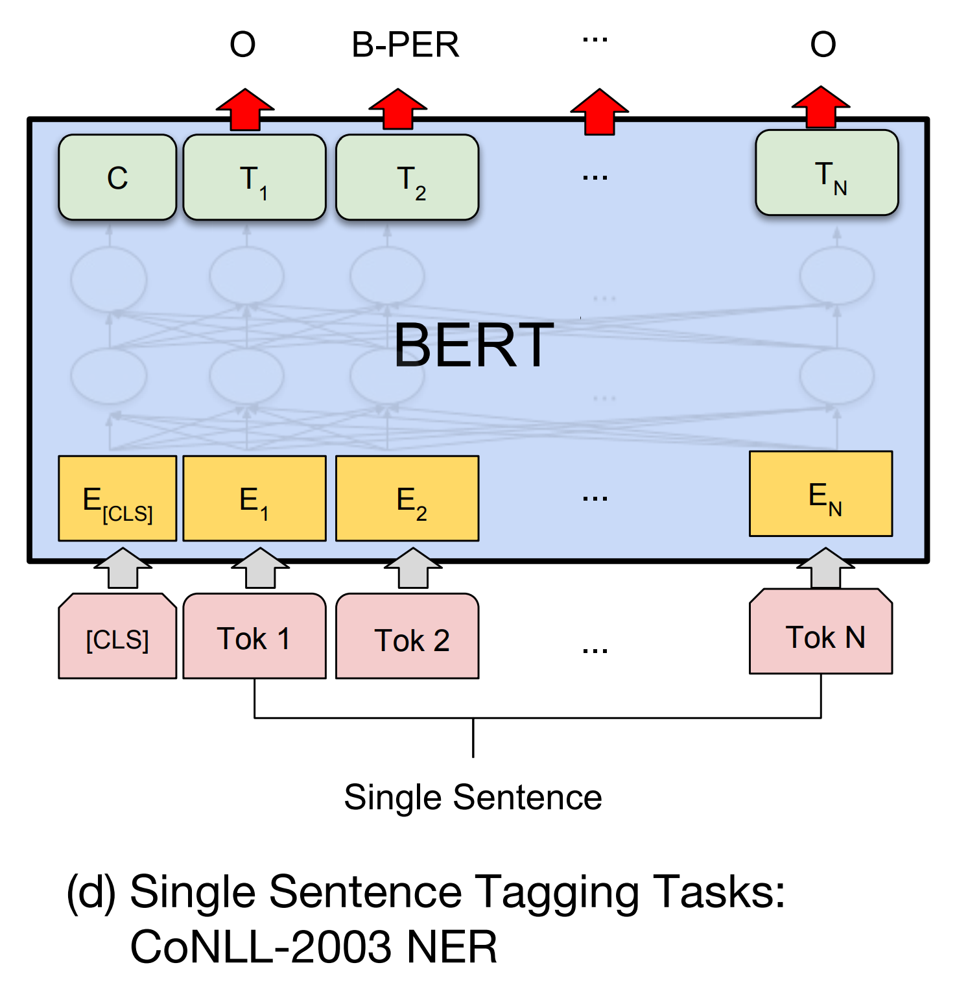

# BERT

ELMo에 이어 2018년말 출시된 BERT 알고리즘([BERT: Pre-training of Deep Bidirectional Transformers for Language Understanding](https://arxiv.org/pdf/1810.04805.pdf))은 자연어 처리 학계 및 실무자들을 흥분시키기에 충분하였습니다.

|방법|특징|
|-|-|
|특징 기반(feature-based) 전이학습|...|
|fine-tuning 기반 전이학습|...|

기존의 특징 기반(feature-based)의 전이학습 방법인 ELMo와는 달리 BERT는 fine-tuning을 통해 접근합니다. 즉, ELMo는 사전훈련(pretrain)된 언어모델(language model)의 각 계층별 히든스테이트들을 가중합하여 해당 time-step의 임베딩 벡터로 사용하였던것과 달리, BERT는 훈련된 언어모델에 단순히 아주 약간의 계층을 추가하여 학습함으로써, 특정 문제(task)에 맞는 신경망을 만들어낼 수 있게 되었습니다. 따라서 ELMo + task 전용 신경망이 필요했던 ELMo에 비하여 (문제 해결을 위한 또 다른 신경망을 구현하는 등의) 추가적인 노력이 매우 적게 요구 됩니다.

심지어 이러한 방법을 통해서 기존의 자연어 처리 문제들의 SOTA(state-of-the-art)마저 갈아치움으로써, 전이학습의 새로운 지평을 열게 됩니다.

BERT는 앞서 신경망 기계번역 심화주제 챕터에서 다루었던 트랜스포머(transformer) 모델에서 인코더(encoder)만을 가져와 언어모델을 훈련하는데 사용합니다. 이때, ELMo, OpenAI GPT와 같은 기존 방법과 달리 MLM(Masked Language Modeling)이라는 방법을 통해 기존의 auto-regressive 속성으로 인한 단방향(uni-directional)의 제약을 뛰어넘어, 양방향(bi-directional) 시퀀셜 모델링을 성공적으로 수행합니다. 또한 한개의 문장만을 모델링하는 것이 아닌 두 개의 문장을 동시에 학습하도록 함으로써, 질의응답과 같은 문제에서 두 개 이상의 문장이 주어졌을 때, 성공적으로 예측을 수행할 수 있도록 합니다.

## 마스크 된 언어 모델링

앞서 설명 하였듯이, 언어모델 또한 auto-regressive 모델이기 때문에, 양방향(bi-directional) RNN을 통해 훈련할 수 없는 것이 일반적이었습니다. 하지만 BERT는 Masked Language Modeling (MLM) 기법을 통해 언어모델 훈련을 단순히 다음 단어를 훈련하는 문제를 벗어나 빈칸을 채우는 문제의 형태로 바꿈으로써, 양방향 인코딩을 적용할 수 있도록 하였습니다. 이름에서 알 수 있듯이, MLM은 랜덤하게 문장 내의 단어(또는 토큰을) [MASK] 토큰 또는 임의의 다른 단어로 치환한 후, 신경망으로 하여금 원래의 문장을 알아맞추도록 학습 시킵니다. 이것은 마치 디노이징(denoising) 오토인코더(autoencoder)와 같은 원리로 이해할 수 있습니다. 이를 통해 트랜스포머 인코더는 좌우 방향에 기반한 언어모델링 없이, 언어를 모델링 할 수 있게 됩니다. 다만, MLM의 도입으로 인해서 학습 수렴 속도가 늦어지는 문제는 발생하지만, 훈련 단계에서 속도의 저하는 그리 큰 문제가 되지 않습니다. 하지만 MLM 방식을 통해서 훨씬 더 큰 성능의 개선이 있었음을 실험에서 확인하였다고 합니다.

## 다음 문장 예측하기

사실 질의응답(question answering)과 같은 문제는 입력으로 여러개의 문장으로 주어지고, 여러 문장간의 관계가 매우 중요하기 때문에, 단순한 언어모델링으로는 문장과 문장 사이의 관계를 모델링 하기 어려울 수 있습니다. 따라서 BERT는 문장의 쌍을 입력으로 삼아 사전훈련(pretraining)을 수행함으로써, 추후 fine-tuning 단계에서 여러개의 문장이 입력으로 주어지는 task에 효과적으로 대처할 수 있도록 합니다. 따라서 다음의 그림과 같이 문장의 순서를 나타내는 정보를 추가로 임베딩 하여 기존의 단어 임베딩 및 위치 임베딩(position embedding)의 합에 더하여 줍니다. 또한 [SEP]라는 특별 토큰을 추가로 도입하여, 문장과 문장 사이의 경계를 신경망에게 알려주도록 합니다.

![각 time-step에는 임베딩 계층의 결과값과 문장 임베딩 벡터, 위치 임베딩 벡터를 더하여 최종 입력 값으로 만들게 됩니다. 또한 문장의 끝에는 [SEP]라는 토큰을 넣어 문장 사이의 경계를 알려줍니다. 그리고 [CLS] 토큰을 통해 분류 레이블을 예측 하는 공간을 마련합니다.](../assets/15-04-01.png)

이와 같이 신경망에게 입력을 주고, 두 번째 입력 된 문장이 다음 문장인지 아닌지를 예측하도록(binary classification 문제) 훈련함으로써, 신경망에게 문장과 문장간의 관계를 배울수 있도록 합니다.

|입력|레이블|
|-|-|
|[CLS] the man went to [MASK] store [SEP] he bought a gallon [MASK] milk [SEP]|IsNext|
|[CLS] the man [MASK] to the store [SEP] penguin [MASK] are flight less birds [SEP]|NotNext|

이를 위해서 코퍼스에서 실제 앞뒤 두 문장을 추출하여 학습하기도 하고, 임의의 관계없는 두 문장을 추출하여 학습하기도 합니다. 이러한 단순한 접근법에도 불구하고 다음 문장 예측 훈련은 질의응답 문제 해결에서 큰 성능 개선이 기여 합니다.

BERT는 fine-tuning를 통해 문제를 해결하기 위해서 사전훈련 후, 각 task마다 추가적인 훈련을 할 때에 요구되는 입력과 출력 그리고 추가 웨이트 파라미터가 다릅니다. 사전훈련 후에 추가된 웨이트 파라미터들은 fine-tuning 단계에서 기존의 웨이트 파라미터와 함께 학습되어 업데이트 됩니다. 다음은 각 task에 따른 좀 더 자세한 내용을 다루도록 합니다.

## Sentence Pair Classification Tasks

![질문응답쌍 찾기와 같은 문제를 위한 fine-tuning 구조: [CLS] 토큰의 위치에서 정답을 예측합니다.](../assets/15-04-02.png)

General Language Understanding Evaluation (GLUE)는 다양한 자연어이해 문제에 대한 성능 평가를 제공합니다. 예를 들어 QNLI (Question Natural Language Inference) 테스트는 SQuAD에서 추출되어 변형된 문제들로, 입력으로 주어진 질문과 문장이 올바른 대답이 들어있는지 맞추는 이진 분류(binary classification) 문제 입니다.

이와 같은 분류 문제에 적용하기 위해서, 트랜스포머 인코더의 가장 첫 time-step 입력은 [CLS]라는 특별 토큰을 입력으로 받습니다. 해당 time-step의 출력 벡터에 추가 소프트맥스(softamx) 계층을 추가하여 fine-tuning함으로써, 우리는 주어진 문제에 대한 분류 신경망을 얻을 수 있습니다.

[CLS]에 해당하는 트랜스포머 인코더의 출력 벡터를 $C\in\mathbb{R}^H$ , $H$ 는 벡터의 차원이라고 합니다. 이때 소프트맥스 계층의 웨이트 파라미터 $W\in\mathbb{R}^{K\times{H}}$ 를 추가합니다. $K$ 는 분류 문제에서 후보 클래스의 갯수를 의미합니다. 그렇다면 각 클래스에 속할 확률 분포 $P\in\mathbb{R}^K$ 를 구할 수 있을 것 입니다.

$$
    P=\text{softmax}(CW^T)
$$

해당 task에 대한 훈련 데이터셋에 대해서 MLE를 수행하며 새롭게 추가된 $W$ 뿐만 아니라, 기존 BERT의 웨이트 파라미터까지 한꺼번에 학습하는 것이 특징 기반의 전이학습 방법인 ELMo와의 차이점 입니다.

## Single Sentence Classification Tasks

![텍스트 분류와 같은 문제를 위한 fine-tuning 구조: [CLS] 토큰의 위치에서 클래스 등을 예측합니다.](../assets/15-04-03.png)

텍스트 분류(text classification)가 대표적으로 이 유형의 문제에 속합니다. 마찬가지로 [CLS] 토큰의 트랜스포머 출력에 대해서 소프트맥스 계층을 추가하여 fine-tuning하여 신경망을 훈련 합니다. 따라서 얻어진 신경망은 인터넷 등을 통해서 수집한 무궁무진한 코퍼스에 대해서 언어모델을 훈련한 결과를 통해, task에 대한 데이터셋만으로 얻어낼 수 있는 성능을 훨씬 상회하는 성능을 발휘할 수 있습니다.

## Question Answering Tasks (SQuAD v1.1)

BERT는 마찬가지로 reading comprehensive 문제에 대해서도 아주 강력한 성능을 발휘하였습니다. SQuAD에 대해서도 매우 뛰어난 결과를 얻을 수 있었습니다. 이뿐만 아니라 한국어 데이터셋인 [KorSQuAD](https://korquad.github.io/)에 대해서도 매우 뛰어난 성능을 거둔 것을 볼 수 있습니다.

SQuAD와 같은 문제는 질문과 문장이 주어졌을 때, 문장 내에서 질문에 해당하는 답을 예측하도록 학습하게 됩니다. 따라서, 정답 단어 또는 구절이 위치한 time-step의 시작과 끝을 출력으로 반환하게 됩니다. 즉, 여러 time-step의 입력을 받아, 여러 time-step의 출력값을 내도록 합니다.

KorSQuAD 순위표에서 볼 수 있듯이, SQuAD 문제는 BERT를 통해 대동단결 되었으며, 이미 해당 문제에 대해서는 사람의 능력치를 뛰어넘은 것을 볼 수 있습니다. <comment> 물론 그렇다고 해서 전반적인 질의응답 문제 해결능력이 사람보다 뛰어나다는 말은 아닙니다. </comment>

## Single Sentence Tagging Tasks

이외에도 BERT는 NER이나 SRL과 같은 문장 내 정보 태깅(tagging) 문제등에도 적용되어 뛰어난 성능을 발휘합니다. 하나의 고정된 아키텍쳐로 단순히 수많은 코퍼스들을 훈련한 결과로 이와 같이 다양한 자연어 처리 전반에서 뛰어난 성능을 거두는 것을 보면 정말 놀라운 성과가 아닐 수 없습니다. 이 경우에는 입력으로 들어온 각 단어(또는 토큰)들에 대한 태깅 정보 등을 출력으로 반환하도록 추가 훈련이 수행 됩니다.
