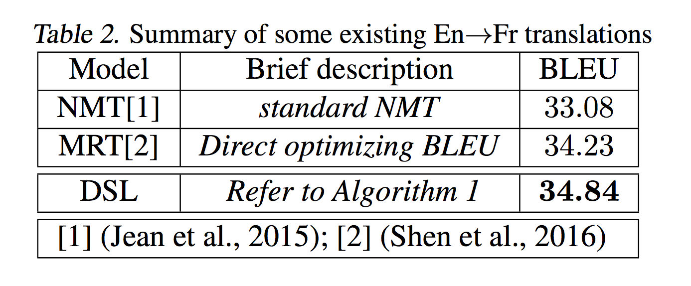

# 듀얼리티를 활용한 지도학습

이번에 소개할 방법은 [Dual Supervised Learning (DSL) [Xia et al.2017]](https://arxiv.org/pdf/1707.00415.pdf) 입니다. 이 방법은 기존의 Teacher Forcing의 문제로 생기는 어려움을 강화학습을 사용하지 않고, 듀얼리티로부터 regularization term을 이끌어내어 해결하였습니다.

먼저 베이즈 정리(Bayes Theorem)에 따라서 우리는 아래의 수식이 언제나 성립함을 알고 있습니다.

$$\begin{aligned}
P(\text{y}|\text{x})&=\frac{P(\text{x}|\text{y})P(\text{y})}{P(\text{x})} \\
P(\text{y}|\text{x})P(\text{x})&=P(\text{x}|\text{y})P(\text{y})
\end{aligned}$$

따라서 위의 수식을 따라서, 우리의 데이터셋을 통해 훈련한 모델들은 아래와 같은 수식을 만족해야 합니다.

$$\begin{gathered}
P(x)P(y|x;\theta_{x \rightarrow y})=P(y)P(x|y;\theta_{y \rightarrow x}) \\
\text{where }(x,y)\sim\mathcal{B}=\{x_i,y_i\}_{i=1}^N
\end{gathered}$$

이 전제를 우리의 번역 훈련을 위한 목표에 적용하면 다음과 같습니다.

$$\begin{aligned}
objective 1: \min_{\theta_{x \rightarrow y}}{\frac{1}{n}\sum^n_{i=1}{\ell_1(f(x_i;\theta_{x \rightarrow y}), y_i)}}, \\
objective 2: \min_{\theta_{y \rightarrow x}}{\frac{1}{n}\sum^n_{i=1}{\ell_1(g(y_i;\theta_{y \rightarrow x}), x_i)}}, \\
s.t.~P(x)P(y|x;\theta_{x \rightarrow y})=P(y)P(x|y;\theta_{y \rightarrow x}), \forall{x, y}.
\end{aligned}$$

위의 수식을 해석하면, 목표(objective1)은 베이즈 정리에 따른 제약조건을 만족함과 동시에, $\ell_1$ 을 최소화(minimize) 하도록 해야 합니다. $\ell_1$ 은 번역함수 $f$ 에 입력 $x_i$ 를 넣어 나온 반환값과 $y_i$ 사이의 손실(loss)를 의미 합니다. 마찬가지로, $\ell_2$ 도 번역함수 $g$ 에 대해 같은 작업을 수행하고 최소화하여 목표(objective2)를 만족해야 합니다.

$$\mathcal{L}_{duality}=\Big(\big(\log{\hat{P}(x)}+\log{P(y|x;\theta_{x \rightarrow y})}\big)-\big(\log{\hat{P}(y)}+\log{P(x|y;\theta_{y \rightarrow x})}\big)\Big)^2$$

그러므로 우리는 $\mathcal{L}_{duality}$ 와 같이 베이즈 정리에 따른 제약조건의 양 변의 값의 차이를 최소화하도록 하는 MSE 손실 함수를 만들 수 있습니다. 위의 수식에서 우리가 동시에 훈련시키는 신경망 네트워크 파라미터를 통해 $\log{P(y|x;\theta_{x \rightarrow y})}$ 와 $\log{P(x|y;\theta_{y \rightarrow x})}$ 를 구하고, 단방향 코퍼스를 통해 별도로 이미 훈련시켜 놓은 언어모델을 통해 $\log{\hat{P}(x)}$ 와 $\log{\hat{P}(y)}$ 를 근사(approximation)할 수 있습니다.

이 부가적인 제약조건의 손실함수를 기존의 손실 함수에 추가하여 동시에 최소화 하도록 하면, 아래와 같이 표현 할 수 있습니다.

$$\begin{aligned}
\theta_{x \rightarrow y} \leftarrow \theta_{x \rightarrow y}-\gamma\nabla_{\theta_{x \rightarrow y}}\frac{1}{n}\sum^n_{i=1}{\Big[\ell_1(f(x_i;\theta_{x \rightarrow y}), y_i)+\lambda_{x \rightarrow y}\mathcal{L}_{duality}\Big]} \\
\theta_{y \rightarrow x} \leftarrow \theta_{y \rightarrow x}-\gamma\nabla_{\theta_{y \rightarrow x}}\frac{1}{n}\sum^n_{i=1}{\Big[\ell_2(g(y_i;\theta_{y \rightarrow x}), x_i)+\lambda_{y \rightarrow x}\mathcal{L}_{duality}\Big]}
\end{aligned}$$

여기서 $\lambda$ 를 통해 손실함수 내에서 비율을 조절할 수 있습니다. 만약 $\lambda$ 가 너무 크다면 최적화 과정에서 regularization term을 최소화하는데 너무 집중하게 될 겁니다. 따라서 적절한 크기의 $\lambda$가 필요 합니다. 따라서 $\lambda$ 는 하이퍼 파라미터이며 실험 결과 $\lambda=0.01$ 일 때 가장 좋은 성능을 나타냅니다.

|모델|설명|BLEU|
|-|-|-|
|NMT[1] [Jean et al.2015] |Teacher Forcing by MLE|33.08|
|MRT[2] [Shen et al.2016] |Minimum Risk Training by BLEU|34.23|
|DSL|Dual Supervised Learning|34.84|

<!--

-->

위의 테이블과 같이 기존의 Teacher Forcing 아래의 MLE 방식([1]번)과 Minimum Risk Training(MRT) 방식([2]번) 보다 더 높은 성능을 보입니다. 이 방법은 강화학습과 같이 비효율적이고 훈련이 까다로운 방식을 벗어나서 regularization term을 추가하여 강화학습을 상회하는 성능을 얻어낸 것이 주목할 점이라고 할 수 있습니다.

## 파이토치 예제 코드

DSL을 파이토치를 사용하여 구현 해 보도록 하겠습니다. 자세한 전체 코드는 이전의 NMT 파이토치 실습 코드의 깃허브에서 다운로드 할 수 있습니다.

- git repo url: https://github.com/kh-kim/simple-nmt

### simple_nmt/dual_trainer.py

```python
# In order to avoid to use hard coding.
X2Y, Y2X = 0, 1
```

```python
def _reordering(self, x, y, l):
    # This method is one of important methods in this class.
    # Since encoder takes packed_sequence instance,
    # the samples in mini-batch must be sorted by lengths.
    # Thus, we need to re-order the samples in mini-batch, if src and tgt is reversed.
    # (Because originally src and tgt are sorted by the length of samples in src.)

    # sort by length.
    indice = l.topk(l.size(0))[1]

    # re-order based on the indice.
    x_ = x.index_select(dim=0, index=indice).contiguous()
    y_ = y.index_select(dim=0, index=indice).contiguous()
    l_ = l.index_select(dim=0, index=indice).contiguous()

    # generate information to restore the re-ordering.
    restore_indice = (-indice).topk(l.size(0))[1]

    return x_, y_, l_, restore_indice
```

```python
    def _get_loss(self, x, y, x_hat, y_hat, x_lm=None, y_lm=None, lagrange=1e-3):
        # |x| = (batch_size, length0)
        # |y| = (batch_size, length1)
        # |x_hat| = (batch_size, length0, output_size0)
        # |y_hat| = (batch_size, length1, output_size1)
        # |x_lm| = |x_hat|
        # |y_lm| = |y_hat|

        losses = []
        losses += [self.crits[X2Y](y_hat.contiguous().view(-1, y_hat.size(-1)),
                                   y.contiguous().view(-1)
                                   )]
        losses += [self.crits[Y2X](x_hat.contiguous().view(-1, x_hat.size(-1)),
                                   x.contiguous().view(-1)
                                   )]
        # |losses[X2Y]| = (batch_size * length1)
        # |losses[Y2X]| = (batch_size * length0)

        losses[X2Y] = losses[X2Y].view(y.size(0), -1).sum(dim=-1)
        losses[Y2X] = losses[Y2X].view(x.size(0), -1).sum(dim=-1)
        # |losses[X2Y]| = (batch_size)
        # |losses[Y2X]| = (batch_size)

        if x_lm is not None and y_lm is not None:
            lm_losses = []
            lm_losses += [self.crits[X2Y](y_lm.contiguous().view(-1, y_lm.size(-1)),
                                          y.contiguous().view(-1)
                                          )]
            lm_losses += [self.crits[Y2X](x_lm.contiguous().view(-1, x_lm.size(-1)),
                                          x.contiguous().view(-1)
                                          )]
            # |lm_losses[X2Y]| = (batch_size * length1)
            # |lm_losses[Y2X]| = (batch_size * length0)

            lm_losses[X2Y] = lm_losses[X2Y].view(y.size(0), -1).sum(dim=-1)
            lm_losses[Y2X] = lm_losses[Y2X].view(x.size(0), -1).sum(dim=-1)
            # |lm_losses[X2Y]| = (batch_size)
            # |lm_losses[Y2X]| = (batch_size)

            # just for information
            dual_loss = lagrange * ((-lm_losses[Y2X] + -losses[X2Y].detach()) - (-lm_losses[X2Y] + -losses[Y2X].detach()))**2

            # Note that 'detach()' is following the loss for another direction.
            dual_loss_x2y = lagrange * ((-lm_losses[Y2X] + -losses[X2Y]) - (-lm_losses[X2Y] + -losses[Y2X].detach()))**2
            dual_loss_y2x = lagrange * ((-lm_losses[Y2X] + -losses[X2Y].detach()) - (-lm_losses[X2Y] + -losses[Y2X]))**2

            losses[X2Y] += dual_loss_x2y
            losses[Y2X] += dual_loss_y2x

        if x_lm is not None and y_lm is not None:
            return losses[X2Y].sum(), losses[Y2X].sum(), dual_loss.sum()
        else:
            return losses[X2Y].sum(), losses[Y2X].sum(), None
```

```python
def train_epoch(self,
                train,
                optimizers,
                no_regularization=True,
                verbose=VERBOSE_BATCH_WISE
                ):
    '''
    Train an epoch with given train iterator and optimizers.
    '''
    total_loss, total_word_count = 0, 0
    total_grad_norm = 0
    avg_loss, avg_grad_norm = 0, 0
    sample_cnt = 0

    progress_bar = tqdm(train,
                        desc='Training: ',
                        unit='batch'
                        ) if verbose is VERBOSE_BATCH_WISE else train
    # Iterate whole train-set.
    for idx, mini_batch in enumerate(progress_bar):
        # Raw target variable has both BOS and EOS token. 
        # The output of sequence-to-sequence does not have BOS token. 
        # Thus, remove BOS token for reference.
        
        # You have to reset the gradients of all model parameters before to take another step in gradient descent.
        optimizers[X2Y].zero_grad()
        optimizers[Y2X].zero_grad()

        x_0, y_0 = (mini_batch.src[0][:, 1:-1],  # Remove BOS and EOS
                    mini_batch.src[1] - 2
                    ), mini_batch.tgt[0][:, :-1]
        # |x_0| = (batch_size, length0)
        # |y_0| = (batch_size, length1)
        y_hat = self.models[X2Y](x_0, y_0)
        # |y_hat| = (batch_size, length1, output_size1)
        with torch.no_grad():
            y_lm = self.language_models[X2Y](y_0)
            # |y_lm| = |y_hat|

        # Since encoder in seq2seq takes packed_sequence instance,
        # we need to re-sort if we use reversed src and tgt.
        x_0, y_0_0, y_0_1, restore_indice = self._reordering(mini_batch.src[0][:, :-1],
                                                                mini_batch.tgt[0][:, 1:-1], # Remove BOS and EOS
                                                                mini_batch.tgt[1] - 2
                                                                )
        y_0 = (y_0_0, y_0_1)
        # |x_0| = (batch_size, length0)
        # |y_0| = (batch_size, length1)
        x_hat = self.models[Y2X](y_0, x_0).index_select(dim=0, index=restore_indice)
        # |x_hat| = (batch_size, length0, output_size0)

        with torch.no_grad():
            x_lm = self.language_models[Y2X](x_0)
            # |x_lm| = |x_hat|

        x, y = mini_batch.src[0][:, 1:], mini_batch.tgt[0][:, 1:]
        losses = self._get_loss(x,
                                y,
                                x_hat,
                                y_hat,
                                x_lm,
                                y_lm,
                                # According to the paper, DSL should be warm-started.
                                # Thus, we turn-off the regularization at the beginning.
                                lagrange=self.config.dsl_lambda if not no_regularization else .0
                                )
        
        losses[X2Y].div(y.size(0)).backward()
        losses[Y2X].div(x.size(0)).backward()

        word_count = int((mini_batch.src[1].detach().sum()) + 
                            (mini_batch.tgt[1].detach().sum())
                            )
        loss = float(losses[X2Y].detach() + losses[Y2X].detach()) - float(losses[-1].detach() * 2)
        param_norm = float(utils.get_parameter_norm(self.models[X2Y].parameters()).detach() + 
                            utils.get_parameter_norm(self.models[Y2X].parameters()).detach()
                            )
        grad_norm = float(utils.get_grad_norm(self.models[X2Y].parameters()).detach() +
                            utils.get_grad_norm(self.models[Y2X].parameters()).detach()
                            )  

        total_loss += loss
        total_word_count += word_count
        total_grad_norm += grad_norm

        avg_loss = total_loss / total_word_count
        avg_grad_norm = total_grad_norm / (idx + 1)

        if verbose is VERBOSE_BATCH_WISE:
            progress_bar.set_postfix_str('|param|=%.2f |g_param|=%.2f loss=%.4e PPL=%.2f' % (param_norm,
                                                                                                grad_norm,
                                                                                                loss / word_count,
                                                                                                exp(avg_loss)
                                                                                                ))

        # In orther to avoid gradient exploding, we apply gradient clipping.
        torch_utils.clip_grad_norm_(self.models[X2Y].parameters(),
                                    self.config.max_grad_norm
                                    )
        torch_utils.clip_grad_norm_(self.models[Y2X].parameters(),
                                    self.config.max_grad_norm
                                    )
        
        # Take a step of gradient descent.
        optimizers[X2Y].step()
        optimizers[Y2X].step()

        sample_cnt += mini_batch.tgt[0].size(0)

        if idx >= len(progress_bar) * self.config.train_ratio_per_epoch:
            break

    if verbose is VERBOSE_BATCH_WISE:
        progress_bar.close()

    return avg_loss, param_norm, avg_grad_norm
```