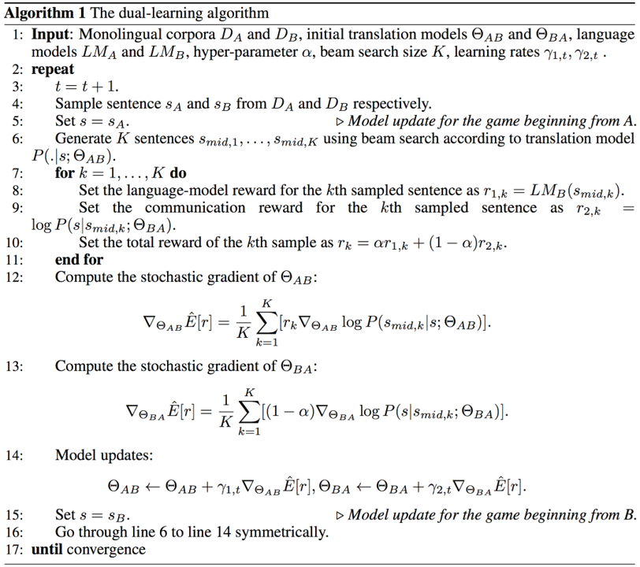
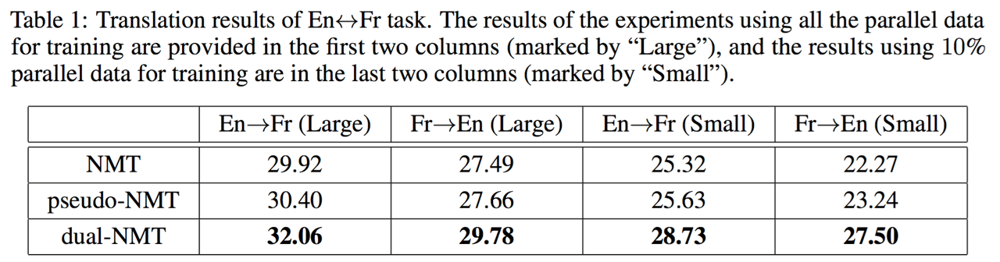
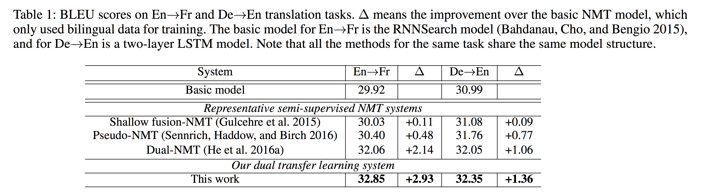

# Dual Unsupervised Learning

## Dual Learning for Machine Translation
  
공교롭게도 CycleGAN과 비슷한 시기에 나온 논문[[Xia at el.2016]](https://arxiv.org/pdf/1611.00179.pdf)이 있습니다. NLP의 특성상 CycleGAN처럼 직접적으로 gradient를 전달해 줄 수는 없었지만 기본적으로는 아주 비슷한 개념입니다. 짝이 없는 단방향(monolingual) corpus를 이용하여 성능을 극대화 하고자 하였습니다.

즉, monolingual sentence $s$ 에 대해서 번역을 하고 그 문장 $s_{mid}$ 을 사용하여 복원을 하였을 때 $\hat{s}$ 원래의 처음 문장으로 돌아올 수 있도록(처음 문장과의 차이를 최소화 하도록) 훈련하는 것입니다. 이때, 번역된 문장 $s_{mid}$ 는 자연스러운 해당 언어의 문장이 되었는가도 중요한 지표가 됩니다.

위에서 설명한 알고리즘을 따라가 보겠습니다. 이 방법에서는 $Set~X,~Set~Y$ 대신에 $Language~A,~Language~B$ 로 표기하고 있습니다. $G_{A \rightarrow B}$ 의 파라미터 $\theta_{AB}$ 와 $F_{B \rightarrow A}$ 의 파라미터 $\theta_{BA}$ 가 등장합니다. 이 $G_{A \rightarrow B}, F_{B \rightarrow A}$ 는 모두 parallel corpus에 의해서 pre-training이 되어 있는 상태 입니다. 즉, 기본적인 저성능의 번역기 수준이라고 가정합니다.

우리는 기존의 policy gradient와 마찬가지로 아래와 같은 파라미터 업데이트를 수행해야 합니다.

$$\begin{aligned}
\theta_{AB} \leftarrow \theta_{AB} + \gamma \triangledown_{\theta_{AB}}\hat{\mathbb{E}}[r] \\
\theta_{BA} \leftarrow \theta_{BA} + \gamma \triangledown_{\theta_{BA}}\hat{\mathbb{E}}[r]
\end{aligned}$$

 $\hat{\mathbb{E}}[r]$ 을 각각의 파라미터에 대해서 미분 해 준 값을 더해주는 것을 볼 수 있습니다. 이 reward의 기대값은 아래와 같이 구할 수 있습니다.

$$\begin{aligned}
r&=\alpha r_{AB} + (1-\alpha)r_{BA} \\
r_{AB}&=LM_{B}(s_{mid}) \\
r_{BA}&=\log{P(s|s_{mid};\theta_{BA})} \\
\end{aligned}$$

위와 같이 $k$ 개의 sampling한 문장에 대해서 각기 방향에 대한 reward를 각각 구한 후, 이를 선형 결합(linear combination)을 취해줍니다. 이때, $s_{mid}$ 는 sampling한 문장을 의미하고, $LM_B$ 를 사용하여 해당 문장이 $language B$ 의 집합에 잘 어울리는지를 따져 reward로 리턴합니다. 여기서 기존의 cross entropy를 사용할 수 없는 이유는 monlingual sentence이기 때문에 번역을 하더라도 정답을 알 수 없기 때문입니다. 또한 우리는 다수의 단방향(monolingual) corpus를 갖고 있기 때문에, $LM$ 은 쉽게 만들어낼 수 있습니다.

$$\begin{aligned}
\triangledown_{\theta_{AB}}\hat{\mathbb{E}}[r]&=\frac{1}{K}\sum_{k=1}^K{[r_k\triangledown_{\theta_{AB}}\log{P(s_{mid,k}|s;\theta_{AB})}]} \\
\triangledown_{\theta_{BA}}\hat{\mathbb{E}}[r]&=\frac{1}{K}\sum_{k=1}^K[(1-\alpha)\triangledown_{\theta_{BA}}\log{P(s|s_{mid,k};\theta_{BA})}]
\end{aligned}$$

이렇게 얻어진 $\mathbb{E}[r]$ 를 각 파라미터에 대해서 미분하게 되면 위와 같은 수식을 얻을 수 있고, 상기 서술한 파라미터 업데이트 수식에 대입하면 됩니다. 비슷한 방식으로 $B \rightarrow A$ 를 구할 수 있습니다.

위의 테이블은 이 방법의 성능을 비교한 결과 입니다. Pseudo-NMT는 이전 챕터에서 설명하였던 back-translation을 의미합니다. 그리고 그 방식보다 더 좋은 성능을 기록한 것을 볼 수 있습니다.

또한, 위 그래프에서 문장의 길이와 상관 없이 모든 구간에서 baseline NMT를 성능으로 압도하고 있는 것을 알 수 있습니다. 다만, 병렬(parallel) corpus의 양이 커질수록 단방향(monolingual) corpus에 의한 성능 향상의 폭이 줄어드는 것을 확인 할 수 있습니다.

이 방법은 강화학습과 Duality를 접목하여 적은 양의 병렬(parallel) corpus와 다수의 단방향(monolingual) corpus를 활용하여 번역기의 성능을 효과적으로 끌어올리는 방법을 제시하였다는 점에서 주목할 만 합니다.

## Dual Transfer Learning for NMT with Marginal Distribution Regularization

Dual Supervised Learning (DSL)은 베이즈 정리에 따른 수식을 제약조건으로 사용하였다면, 이 방법[[Wang et al.2017]](https://www.microsoft.com/en-us/research/wp-content/uploads/2017/11/17041-72820-1-SM.pdf)은 Marginal 분포(distribution)의 성질을 이용하여 제약조건을 만듭니다.

$$P(y)=\sum_{x \in \mathcal{X}}{P(x,y)}=\sum_{x \in \mathcal{X}}{P(y|x)P(x)}$$

Marginal 분포는 결합확률분포(joint distribution)를 어떤 한 variable에 대해서 합 또는 적분 한 것을 이릅니다. 이것을 조건부확률로 나타낼 수 있고, 여기서 한발 더 나아가 기대값 표현으로 바꿀 수 있습니다. 그리고 이를 $K$ 번 샘플링 하도록 하여 Monte Carlo로 근사 표현 할 수 있습니다.

$$\begin{aligned}
P(y)=\sum_{x \in \mathcal{X}}{P(y|x;\theta)P(x)}&=\mathbb{E}_{x \sim P(x)}P(y|x;\theta) \\
&\approx\frac{1}{K}\sum^K_{i=1}{P(y|x^i;\theta)},~x^i\sim P(x)
\end{aligned}$$

이제 위의 수식을 기계번역에 적용해 보도록 하겠습니다. 우리에게 아래와 같이 $N$ 개의 source 문장 $x$ , target 문장 $y$ 으로 이루어진 양방향 corpus $\mathcal{B}$ , $S$ 개의 target 문장 $y$ 로만 이루어진 단방향 corpus $\mathcal{M}$ 이 있다고 가정 해 보겠습니다. 

$$\begin{aligned}
\mathcal{B}&=\{(x^n, y^n)\}^N_{n=1} \\
\mathcal{M}&=\{y^s\}^S_{s=1}
\end{aligned}$$

그럼 우리는 아래의 목적함수(objective function)을 최대화(maximize)하는 동시에 marginal 분포에 따른 제약조건 또한 만족시켜야 합니다.

$$\begin{aligned}
&Objective: \sum^N_{n=1}{\log{P(y^n|x^n;\theta)}}, \\
&s.t.~P(y)=\mathbb{E}_{x\sim P(x)}P(y|x;\theta), \forall{y}\in\mathcal{M}.
\end{aligned}$$

위의 수식을 DSL과 마찬가지로 Lagrange multipliers와 함께 기존의 손실함수(loss function)에 추가하여 주기 위하여 $S(\theta)$ 와 같이 표현합니다.

$$\mathcal{S}(\theta)=[\log\hat{P}(y)-\log{\mathbb{E}_{x\sim\hat{P}(x)}P(y|x;\theta)}]^2$$

$$\mathcal{L}(\theta)=-\sum^N_{n=1}{\log{P(y^n|x^n;\theta)}}+\lambda\sum^S_{s=1}{[\log\hat{P}(y)-\log{\mathbb{E}_{x\sim\hat{P}(x)}P(y|x;\theta)}]^2}$$

이때, DSL과 유사하게 $\hat{P}(x)$ 와 $\hat{P}(y)$ 가 등장합니다. $\hat{P}(y)$ 는 단방향(monolingual) corpus로 만든 언어모델(language model)을 통해 확률값을 구합니다. 위의 수식에 따르면 $\hat{P}(x)$ 를 통해 source 문장 $x$ 를 샘플링(sampling)하여 네트워크 $\theta$ 를 통과시켜 $P(y|x;\theta)$ 를 구해야겠지만, 아래와 같이 좀 더 다른 방법으로 접근합니다.

$$\begin{aligned}
P(y)=\mathbb{E}_{x\sim\hat{P}(x)}P(y|x;\theta)&=\sum_{x\in\mathcal{X}}{P(y|x;\theta)\hat{P}(x)} \\
&=\sum_{x\in\mathcal{X}}\frac{P(y|x;\theta)\hat{P}(x)}{P(x|y)}P(x|y) \\
&=\mathbb{E}_{x\sim P(x|y)}\frac{P(y|x;\theta)\hat{P}(x)}{P(x|y)} \\
&=\frac{1}{K}\sum^K_{i=1}{\frac{P(y|x_i;\theta)\hat{P}(x_i)}{P(x_i|y)}}, x_i\sim P(x|y)
\end{aligned}$$

위와 같이 target 문장 $y$ 를 반대 방향 번역기( $y \rightarrow x$ )에 넣어 $K$ 개의 source 문장 $x$ 를 샘플링(sampling)하여 $P(y)$ 를 구합니다. 이 과정을 다시 하나의 손실함수(loss function)으로 표현하면 아래와 같습니다.

$$\mathcal{L}(\theta)\approx-\sum^N_{n=1}{\log{P(y^n|x^n;\theta)}}+\lambda\sum^S_{s=1}{[\log{\hat{P}(y^s)}-\log{\frac{1}{K}\sum^K_{i=1}\frac{\hat{P}(x^s_i)P(y^s|x^s_i\theta)}{P(x^s_i|y^s)}}]^2}$$

위의 테이블과 같이, 이 방법은 앞 챕터에서 소개한 기존의 단방향 corpus[[Gulcehre et al.2015]](https://arxiv.org/abs/1503.03535)[[Sennrich et al.2016]](https://arxiv.org/abs/1511.06709)를 활용한 방식들과 비교하여 훨씬 더 나은 성능의 개선을 보여주었으며, 바로 앞서 소개한 [Dual Learning[He et al.2016a]](https://arxiv.org/pdf/1611.00179.pdf)보다도 더 나은 성능을 보여줍니다. 마찬가지로, 불안정하고 비효율적인 강화학습을 사용하지 않고도 더 나은 성능을 보여준 것은 주목할 만한 성과라고 할 수 있습니다.

### Appendix: Importance Sampling

$$\begin{aligned}
\mathbb{E}_{X \sim p}[f(x)]&=\int_{x}{f(x)p(x)}dx \\
&=\int_{x}{\Big( f(x)\frac{p(x)}{q(x)}\Big)q(x)}dx \\
&=\mathbb{E}_{X \sim q}[f(x)\frac{p(x)}{q(x)}],
\end{aligned}$$

$$\forall q\text{ (pdf) s.t.} q(x)=0 \implies p(x)=0$$

$$w(x)=\frac{p(x)}{q(x)}$$

$$\begin{aligned}
\mathbb{E}_{X \sim q}[f(x)\frac{p(x)}{q(x)}]&\approx\frac{1}{K}\sum_{i=1}^{K}{f(x_i)\frac{p(x_i)}{q(x_i)}} \\
&=\frac{1}{K}\sum_{i=1}^{K}{f(x_i)w(x_i)} \\
\text{where }& x_i \sim q
\end{aligned}
$$
