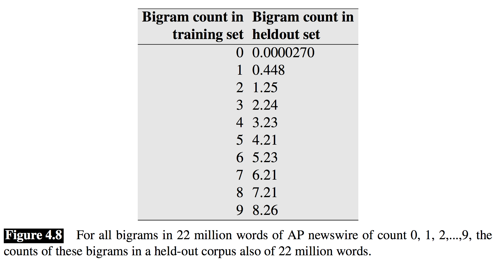

# N-gram

## 희소성(Sparseness) 문제

이전 섹션에서 언어모델에 대해 소개를 간략히 했습니다. 문장의 확률을 수식으로 나타낼 수 있었고, 해당 확률을 근사(approximate)하기 위해서는 우리가 수집한 코퍼스에서 각 단어 시퀀스들의 출현 빈도를 계산하면 된다고 하였습니다. 하지만 만약 그렇다면 우리는 확률 추정치들을 거의 제대로 구할 수 없을 것 입니다. 왜냐하면 비록 우리가 수많은 문장을 온라인에서 수집(crawling)해도, 애초에 출현할 수 있는 단어의 조합(시퀀스)의 경우의 수는 훨씬 더 클 것이기 때문입니다. 단어들의 조합이 조금만 길어지더라도 코퍼스에서 출현 빈도를 구할 수 없어 분자가 0이 되어 확률이 0이 되거나, 심지어 분모가 0이 되어 정의할 수조차 없을 것이기 때문입니다. 이렇게 너무나도 많은 경우의 수 때문에 생기는 문제를 희소성(sparseness or sparsity)문제라고 합니다. <comment>우리는 이미 이전 단어의 의미 및 임베딩 챕터에서 차원의 저주와 희소성에 대해 다루었습니다.</comment>

## 마코프 가정(Markov Assumption)

효과적으로 코퍼스에서 단어 시퀀스에 대한 확률을 추정하기 위해서는 희소성 문제를 해결해야 할 것 입니다. 이때 우리는 마코프 가정을 도입합니다.

$$
P(x_i|x_1,x_2,\cdots,x_{i-1}) \approx P(x_i|x_{i-k},\cdots,x_{i-1})
$$

앞서 출현한 모든 단어를 볼 필요 없이, 앞의 k개의 단어만 보고 다음 단어의 출현 확률을 구하도록 하는 것 입니다. 이렇게 조건을 간소화하여, 우리가 구하고자 하는 확률을 근사(approximation) 하겠다는 것 입니다. 보통 k는 0에서 3의 값을 갖게 됩니다. 즉, $k=2$ 일 경우에는 앞 단어 2개를 참조하여 다음 단어($x_i$)의 확률을 근사하여 나타내게 됩니다.

$$
P(x_i|x_{i-2},x_{i-1})
$$

여기에 체인룰(chine-rule)을 적용하여, 문장에 대한 확률도 다음과 같이 표현 할 수 있습니다.

$$
P(x_1,x_2,\cdots,x_n)\approx\prod_{i=1}^{n}{P(x_i|x_{i-k},\cdots,x_{i-1})}
$$

이것을 로그 확률로 표현하면,

$$
\log{P(x_1,x_2,\cdots,x_n)}\approx\sum_{i=1}^{n}{\log{P(x_i|x_{i-k},\cdots,x_{i-1})}}
$$

우리는 이렇게 전체 단어의 조합 대신에 바로 앞 일부 조합만 출현 빈도를 계산하여 확률 추정을 하는 방법을 $n=k+1$으로 n-gram 이라고 부릅니다.

| k | n-gram | 명칭 |
|-|-|-|
| 0 | 1-gram | uni-gram |
| 1 | 2-gram | bi-gram |
| 2 | 3-gram | tri-gram |

위 테이블과 같이 3-gram 까지는 tri-gram이라고 읽지만 4-gram 부터는 그냥 four-gram 이라고 읽습니다. 앞서 설명 하였듯이 $n$이 커질수록 우리가 가지고 있는 훈련 코퍼스 내에 존재하지 않을 가능성이 많기 때문에, 오히려 확률을 정확하게 추정하는데 어려움이 생길 수도 있습니다. <comment>훈련 코퍼스에 존재 하지 않는다고 세상에서 쓰이지 않는 문장 표현은 아니기 때문 입니다.</comment> 따라서 당연히 훈련 코퍼스의 양이 적을수록 n의 크기도 작아져야 합니다. 보통은 대부분 훈련 코퍼스의 양이 적당하다는 가정 하에서, 3-gram을 가장 많이 사용하고, 훈련 코퍼스의 양이 많을 때는 4-gram을 사용하기도 합니다. 하지만 이렇게 4-gram을 사용하면 언어모델의 성능은 크게 오르지 않는데 반해, 단어 조합의 경우의 수는 지수적(exponential)으로 증가하기 때문에, 사실 크게 효율성이 없습니다.

$$
P(x_i|x_{i-2},x_{i-1})=\frac{\text{Count}(x_{i-2},x_{i-1},x_i)}{\text{Count}(x_{i-2},x_{i-1})}
$$

이제 위와 같이 3개 단어의 출현 빈도와, 앞 2개 단어의 출현 빈도만 구하면 $x_i$의 확률을 근사할 수 있습니다. 즉, 문장 전체의 확률에 대해서 비록 훈련 코퍼스 내에 해당 문장이 존재 한 적이 없더라도, 마코프 가정의 도입을 통해서 우리는 해당 문장의 확률을 근사(approximation)할 수 있게 되었습니다. 즉, 이제 훈련 코퍼스에서 보지 못한 문장에 대해서 확률을 추정할 수 있게 되었습니다.

## 일반화(Genaralization)

좋은 머신러닝이라 함은, 훈련 데이터에서 보지 못한 샘플에 대한 예측 능력, 즉 일반화(generalization)에 있습니다. 따라서, n-gram도 마코프 가정의 도입을 통해서 희소성에 대처하는 일반화 능력을 어느정도 갖게 되었다고 할 수 있습니다. 이제 우리는 이것을 좀 더 향상시킬 수 있는 방법을 살펴 보도록 하겠습니다.

### 스무딩과 디스카운팅(Smoothing and Discounting)

출현 횟수를 단순히 확률 값으로 추정 할 경우 문제점이 무엇이 있을까요? 바로 훈련 코퍼스에 출현하지 않는 단어 시퀀스에 대한 대처 능력 입니다. 비록 앞서 설명한것 처럼, 마코프 가정을 적용하여 우리는 희소성 문제를 훨씬 줄였고 문장의 모든 단어 조합에 대해서 출현 횟수를 세지 않아도 되지만, 훈련 코퍼스에 등장하지 않는 경우는 결국 존재 할 것입니다. 훈련 코퍼스에서 보지 못한 단어 시퀀스(unseen word sequence)라고 해서 확률을 0으로 추정하면 맞지 않을 것 입니다. 따라서 출현 빈도 값 또는 확률 값을 좀 더 다듬어 줘야 할 필요성이 있습니다. 따라서 마치 아래 파란색 막대기와 같이 들쭉날쭉한 출현 횟수 값을 주황색 선으로 부드럽게(smooth) 바꾸어 주기 때문에 스무딩(smoothing) 또는 디스카운팅(discounting)이라고 불립니다.

#### 출현 빈도에 1을 더하기 (add one smoothing)

먼저 우리가 생각 해 볼 수 있는 가장 간단한 방법은, 모든 단어 시퀀스의 출현빈도에 1을 더하는 것 입니다. 그럼 확률 값이 0이 되는 것을 막아주어, 훈련 코퍼스에 출현하지 않은 n-gram의 경우에도 작은 확률이나마 가질 수 있을 것 입니다. 이를 수식으로 나타내면 아래와 같습니다.

$$
P(w_i|w_{<i}) \approx \frac{\text{Count}(w_{<i},w_i)+1}{\text{Count}(w_{<i})+V}
$$

이처럼 1을 더하여 $P(w_i|w_{<i})$를 좀 더 효과적으로 근사할 수 있습니다. 이것을 좀 더 일반화하여 표현하면 아래와 같이 쓸 수 있습니다.

$$
\begin{aligned}
P(w_i|w_{<i}) &\approx \frac{\text{Count}(w_{<i},w_i)+k}{\text{Count}(w_{<i})+kV} \\
&\approx \frac{\text{Count}(w_{<i},w_i)+(m/V)}{\text{Count}(w_{<i})+m}
\end{aligned}
$$

이처럼, 1보다 작은 상수값을 더하여 스무딩을 구현 해 볼 수도 있을 것 입니다. 그렇다면 여기서 또 한발 더 나아가 1-gram의 사전 확률(prior probability)을 이용하여 좀 더 적극적으로 대처 해 볼 수도 있을 것 입니다.

$$
P(w_i|w_{<i}) \approx \frac{\text{Count}(w_{<i},w_i)+m P(w_i)}{\text{Count}(w_{<i})+m}
$$

위의 방법은 매우 간단하고 직관적이지만, 사실 언어모델처럼 희소성(sparseness) 문제가 큰 경우에는 부족합니다. 따라서 언어모델에 쓰이기에 적합한 방법은 아닙니다. <comment>텍스트 분류 챕터에서 나이브 베이즈(naive bayes)와 같은 방법을 사용할 때 활용하는 방법에 대해 다루었습니다.</comment>

<!--
#### 절대값 스무딩 (Absolute Smoothing)

[[Church et al.1991](https://www.sciencedirect.com/science/article/pii/088523089190016J)]은 bigram에 대해서 실험을 한 결과를 제시하였습니다. 훈련 코퍼스에서 n번 나타난 2-gram에 대해서, held-out corpus (validation 또는 development 데이터셋)에서의 출현빈도를 계산하여 평균을 낸 것 입니다. 그 결과는 아래와 같습니다.

재미있게도, 0번과 1번 나타난 2-gram을 제외하면, 2번부터 9번 나타난 2-gram의 경우에는 held-out corpus에서의 출현 횟수는 훈련용 corpus 출현 횟수보다 약 0.75번 정도 적게 나타났다는 것 입니다. 즉, 출현 횟수(counting)에서 상수 $d$를 빼주는 것과 같다는 것입니다.

-->

#### Kneser-Ney 디스카운팅

[[Kneser et al.1995](https://www.semanticscholar.org/paper/Improved-backing-off-for-M-gram-language-modeling-Kneser-Ney/9548ac30c113562a51e603dbbc8e9fa651cfd3ab)]은 한발 더 나아가, KN 디스카운팅을 제시하였습니다.

KN 디스카운팅 주요 아이디어는 단어 $w$가 다른 단어 $v$의 뒤에서 출현 할 때, 얼마나 다양한 단어 뒤에서 출현하는지($v$가 얼마나 다양한지)를 알아내는 것 입니다. 그래서 다양한 단어 뒤에 나타나는 단어일수록, 훈련 코퍼스에서 보지 못한 단어 시퀀스(unseen word sequence)로 나타날 가능성이 높다는 것 입니다.

- "learning"의 앞에 출현한 단어: machine, deep, supervised, unsupervised, generative, discriminative, ...
- "laptop"의 앞에 출현한 단어: slim, favorite, fancy, expensive, cheap, ...

예를 들어, 우리 책은 machine learning(기계학습)과 deep learning(딥러닝)을 다루는 책 이므로, 책을 코퍼스로 만들었을 때 코퍼스 내에서 "learning"이라는 단어의 빈도는 굉장히 높을 것 입니다. 하지만 해당 단어는 주로 "machine"과 "deep"뒤에서만 나타났다고 해 보겠습니다. "learning"이라는 단어에 비해서, "laptop"이라는 단어의 빈도는 낮을 것 입니다. 하지만 "learning"과 같이 특정 단어의 뒤에서 대부분 나타나기 보단, 자유롭게 나타났을 것 같습니다. KN 디스카운팅은 이 경우, "laptop"이 훈련 코퍼스에서 보지 못한 단어 시퀀스에서 나타날 확률이 더 높다고 가정 하는 것 입니다. 한마디로 낯을 가리지 않는 단어를 찾는 것 입니다.

KN 디스카운팅은 $P_{\text{continuation}}$을 아래와 같이 모델링 합니다. 즉, $w$와 같이 나타난 $v$들의 집합의 크기가 클 수록 $P_{\text{continuation}}$은 클 것이라고 가정 합니다.

$$
P_{\text{continuation}}(w)\varpropto|\{ v : \text{Count}(v, w) > 0 \}|
$$

위의 수식은 이렇게 나타내 볼 수 있습니다. $w$와 같이 나타난 $v$들의 집합의 크기를, $v$, $w'$가 함께 나타난 집합의 크기의 합으로 나누어 줍니다.

$$
P_{\text{continuation}}(w)=\frac{|\{ v : \text{Count}(v, w) > 0 \}|}{\sum_{w'}{|\{ v : \text{Count}(v, w') > 0 \}|}}
$$

이렇게 우리는 $P_{\text{KN}}$를 정의 할 수 있습니다.

$$
\begin{gathered}
P_{\text{\text{KN}}}(w_i|w_{i-1})=\frac{\max{(\text{Count}(w_{i-1}, w_i) - d, 0)}}{\text{Count}(w_{i-1})}+\lambda(w_{i-1})P_{\text{continuation}}(w_i), \\
\text{where }\lambda(w_{i-1})=\frac{d}{\sum_v{\text{Count}(w_{i-1}, v)}}\times|\{ w: c(w_{i-1}, w)>0 \}|.
\end{gathered}
$$

### 인터폴레이션 (Interpolation)

인터폴레이션을 통한 언어모델 일반화 방법에 대해 살펴보도록 하겠습니다. 언어모델의 인터폴레이션은 두 다른 언어모델을 선형적으로 일정 비율($\lambda$)로 섞어 주는 것 입니다. 특정 영역(domain)에 대해서 특화된 언어모델을 구축하고자 할 때, 인터폴레이션은 굉장히 유용하게 사용 됩니다. 일반 영역의 코퍼스를 통해 구축한 언어모델을 특정 영역(domain)의 작은 코퍼스로 만든 언어모델과 섞어 주는 것 입니다. 이를 통해 특정 영역에 특화된 언어모델을 강화할 수 있습니다.

$$
\tilde{P}(w_n|w_{n-k}, \cdots , w_{n-1}) = \lambda P_1(w_n|w_{n-k}, \cdots , w_{n-1}) + (1 - \lambda)P_2(w_n|w_{n-k}, \cdots , w_{n-1})
$$

예를 들어 의료 분야의 음성인식(ASR) 또는 기계번역(MT) 시스템을 구축한다고 가정해 보겠습니다. 그렇다면 기존의 일반 영역 코퍼스를 통해 생성한 언어모델의 경우, 의료 용어 표현이 낯설 수도 있습니다. 하지만 반대로 특화 영역의 코퍼스만 사용하여 언어모델을 생성할 경우, 일반화 능력이 너무 떨어질 수도 있습니다.

- 일반 영역(general domain)
    - $P(\text{진정제}|\text{준비},\text{된}) = 0.00001$
    - $P(\text{사나이}|\text{준비},\text{된}) = 0.01$
- 특화 영역(specialized domain)
    - $P(\text{진정제}|\text{준비},\text{된}) = 0.09$
    - $P(\text{약}|\text{준비},\text{된}) = 0.04$
- 인터폴레이션 결과
    - $P(\text{진정제}|\text{준비},\text{된}) = 0.5 * 0.09 + (1 – 0.5) * 0.00001 = 0.045005$

따라서 일반적인 대화에서와 다른 의미를 지닌 단어가 나올 수도 있고, 일반적인 대화에서는 희소(rare)한 단어 시퀀스가 훨씬 더 자주 등장 할 수 있습니다. 또한 특화 영역의 코퍼스에는 일반적인 단어 시퀀스가 매우 부족할 것 입니다. 이런 문제점들을 해결하기 위해서 각 영역의 코퍼스로 생성한 언어모델을 섞어주어 해당 영역에 특화 시킬 수 있습니다.

### Back-off

너무 길거나 복잡한 단어 시퀀스는 실제 훈련 코퍼스에서 굉장히 희소하기 때문에, 우리는 마코프 가정을 통해서 일반화 할 수 있었습니다. Back-off 방식은 여기에서 좀 더 한발 더 나아갑니다. 아래 수식을 보면 특정 n-gram의 확률을 n보다 더 작은 시퀀스에 대해서 확률을 구하여 인터폴레이션(interpolation) 하는 것을 볼 수 있습니다. 아래와 같이 n보다 더 작은 시퀀스의 확률을 활용함으로써 스무딩 효과를 얻고 일반화 효과를 좀 더 얻을 수 있습니다.

$$
\begin{aligned}
\tilde{P}(w_n|w_{n-k}, \cdots , w_{n-1}) = &\lambda_1 P(w_n|w_{n-k}, \cdots , w_{n-1}) \\
&+ \lambda_2 P(w_n|w_{n-k+1}, \cdots , w_{n-1}) \\
&+ \cdots \\
&+ \lambda_k P(w_n), \\ \\
\text{where }&\sum_i{\lambda_i}=1.
\end{aligned}
$$

## 결론

n-gram 방식은 출현 빈도를 통해 확률을 근사하기 때문에 굉장히 쉽고 간편합니다. 대신에 단점도 명확합니다. 훈련 코퍼스에 등장하지 않은 단어 시퀀스는 확률을 정확하게 알 수 없습니다. 따라서 마코프 가정을 통해서 단어 조합에 필요한 조건을 간소화하고, 더 나아가 스무딩(Smoothing)과 Back-off 방식을 통해서 남은 단점을 보완하려 했습니다. 워낙 간단하고 명확하기 때문에 성공적으로 음성인식, 기계번역 등에 정착하였고 십 수년 동안 널리 사용되어 왔습니다. 하지만 여전히 근본적인 해결책은 아니었으므로 실제로 음성인식이나 통계기반 기계번역에서 쓰이는 언어모델 어플리케이션 적용에 있어서 큰 난관으로 작용하였습니다.

지금도 딥러닝의 시대가 되었지만, n-gram은 여전히 강력하게 활용될 수 있습니다. 예를 들어 문장을 생성하는 문제가 아닌 주어진 문장의 유창성(fluency)을 채점하는 문제라면, 굳이 복잡한 뉴럴네트워크의 힘을 빌릴 필요 없이 n-gram 방식도 여전히 좋은 성능을 낼 것 입니다.