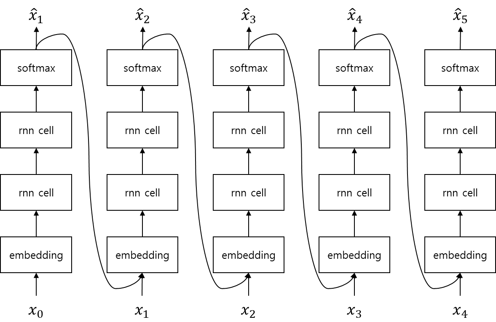

# 뉴럴 네트워크 언어 모델링 (neural network language modeling)

## 희소성을 해결하기 위하여

앞서 설명한 것과 같이 기존의 n-gram 기반의 언어모델은 간편하지만 훈련 데이터에서 보지 못한 단어의 조합에 대해서 상당히 취약한 부분이 있었습니다. 그것의 근본적인 원인은 n-gram 기반의 언어모델은 단어간의 유사도를 알 지 못하기 때문입니다. 예를 들어 우리에게 훈련 코퍼스로 아래와 같은 문장이 주어졌다고 했을 때,

* 고양이는 좋은 반려동물 입니다.

사람은 각 단어간의 유사도를 알기 때문에 다음 중 어떤 확률이 더 큰지 알 수 있습니다.

* $P(\text{반려동물}|\text{강아지는}, \text{좋은})$
* $P(\text{반려동물}|\text{자동차는}, \text{좋은})$

하지만, 컴퓨터는 훈련 코퍼스에 해당 n-gram이 존재하지 않으면, 출현빈도를 계산할 수 없기 때문에 확률을 구할 수 없고, 따라서 확률 간 비교를 할 수도 없습니다.

비록 강아지가 개의 새끼이고 포유류에 속하는 가축에 해당한다는 깊고 해박한 지식이 없을지라도, 강아지와 고양이 사이의 유사도가 자동차와 고양이 사이의 유사도보다 높은 것을 알기 때문에 자동차 보다는 강아지에 대한 반려동물의 확률이 더 높음을 유추할 수 있습니다. 하지만 n-gram 방식의 언어모델은 단어간의 유사도를 구할 수 없기 때문에, 이와 같이 훈련 코퍼스에서 보지 못한 단어(unseen word sequence)의 조합(n-gram)에 대해서 효과적으로 대처할 수 없습니다.

하지만 뉴럴 네트워크 언어모델(NNLM)은 단어 임베딩을 사용하여 단어를 차원축소 함으로써, 강아지와 고양이를 비슷한 dense 벡터로 학습하고, 자동차와 고양이 보다 훨씬 높은 유사도를 가지게 합니다. 따라서 NNLM이 훈련 코퍼스에서 보지 못한 단어의 조합을 보더라도, 비슷한 훈련 데이터로부터 배운 것과 유사하게 대처할 수 있습니다. 즉, 희소성 해소를 통해 더 좋은 일반화(generalization) 성능을 얻어낼 수 있습니다.

NNLM은 다양한 형태를 가질 수 있지만 우리는 가장 효율적이고 흔한 형태인 Recurrent Neural Network(RNN)의 일종인 Long Short Term Memory(LSTM)을 활용한 방식에 대해서 짚고 넘어가도록 하겠습니다.

## Recurrent Neural Network 언어모델



Recurrent Neural Network 언어모델(RNNLM)은 위와 같은 구조를 지니고 있습니다. 기존의 언어모델은 각각의 단어를 descrete한 데이터로 취급하였기 때문에, 단어 시퀀스(word sequence)의 길이가 길어지면 희소성(sparseness)문제가 발생하여 어려움을 겪었습니다. 따라서 마코프 가정을 통해 $n-1$ 이전까지의 단어만 (주로 $n=3$) 조건부로 사용하여 확률을 근사(approximation) 하였습니다. 하지만 RNNLM은 단어 임베딩을 통해 dense 벡터로 만듦으로써, 희소성 문제를 해소하였기 때문에, 문장의 첫 단어부터 해당 단어 직전의 단어까지 모두 조건부에 넣어 확률을 근사 할 수 있습니다.

$$
P(w_1,w_2,\cdots,w_k) = \prod_{i=1}^{k}{P(w_i|w_{<i})}
$$

로그를 취하여 합으로 표현하면 아래와 같습니다.

$$
\log{P(w_1, w_2, \cdots, w_k)} = \sum_{i = 1}^{k}{\log{P(w_i|w_{<i})}}
$$

## 구현

이제 RNN을 활용한 언어모델을 구현 해 보도록 하겠습니다. 파이토치로 구현하기에 앞서, 이를 수식화 해보면 아래와 같습니다.

$$
\begin{gathered}
x_{1:n}=\{x_0,x_1,\cdots,x_n,x_{n+1}\} \\
\text{where }x_0=\text{BOS}\text{ and }x_{n+1}=\text{EOS}. \\ \\
\hat{x}_{i+1}=\text{softmax}(\text{linear}_{\text{hidden\_size} \rightarrow |V|}(\text{RNN}(\text{emb}(x_i)))) \\
\hat{x}_{1:n}[1:]=\text{softmax}(\text{linear}_{\text{hidden\_size} \rightarrow |V|}(\text{RNN}(\text{emb}(x_{1:n}[:-1])))), \\
\\
\text{linear}_{d_1\rightarrow d_2}(x)=Wx+b \text{ where }W\in\mathbb{R}^{d_1\times d_2}\text{ and }b\in\mathbb{R}^{d_2},\\
\text{and hidden\_size is dimension of hidden state and }|V|\text{ is size of vocabulary}.
\end{gathered}
$$

이때 입력 문장의 시작과 끝에는 $x_0$과 $x_{n+1}$이 추가 되어 BOS와 EOS를 나타냅니다. 따라서 실제 문장을 나타내는 시퀀스의 길이는 2만큼 더 늘어납니다.

수식을 과정 별로 따라가 보면, 먼저 문장 $x_{1:n}[:-1]$를 입력으로 받아 각 time-step 별 토큰 $x_i$로 임베딩 레이어 Emb에 넣어 정해진 차원(dimension)의 단어 임베딩 벡터를 얻습니다. 여기서 주의할 점은 EOS를 떼고 임베딩 레이어에 입력으로 주어진다는 것 입니다.

$$
\begin{gathered}
x_{1:n}[:-1]=\{x_0,x_1,\cdots,x_n\} \\
\\
x_{\text{emb}}=\text{emb}(x_{1:n}[:-1]) \\
\text{where }|x_{1:n}[:-1]|=(\text{batch\_size},n+1) \\
\text{ and }|x_\text{emb}|=(\text{batch\_size},n+1,\text{word\_vec\_dim}).
\end{gathered}
$$

RNN은 해당 단어 임베딩 벡터를 입력으로 받아, RNN의 히든 스테이트의 크기인 hidden_size의 벡터를 반환 합니다. 이 과정은 파이토치를 통해 문장의 모든 time-step을 한번에 병렬로 계산할 수 있습니다.

$$
\begin{gathered}
h_{0:n}=\text{RNN}(x_{\text{emb}}) \\
\text{where }|h_{0:n}|=(\text{batch\_size},n+1,\text{hidden\_size})
\end{gathered}
$$

이 벡터를 리니어 레이어(linear layer)와 softmax 함수를 통해 각 단어에 대한 확률 분포인 $\hat{x}_{i+1}$을 구합니다.

$$
\begin{aligned}
\hat{x}_{1:n}[1:]=\text{softmax}(\text{linear}_{\text{hidden\_size} \rightarrow |V|}(h_{0:n})) \\
\text{where }|\hat{x}_{1:n}[1:]|=(\text{batch\_size},n+1,|V|) \\
\text{and }x_{1:n}[1:]=\{x_1,x_2,\cdots,x_{n+1}\}
\end{aligned}
$$

여기서 우리는 LSTM을 사용하여 RNN을 대체 할 것이고, LSTM은 여러 층(layer)로 구성되어 있으며, 각 층 사이에는 드랍아웃(dropout)이 들어갈 수 있습니다. 우리는 테스트 데이터셋에 대해서 perplexity를 최소화 하는 것이 목표이기 때문에, 이전 섹션에서 perplexity와 엔트로피(entropy)와의 관계를 설명하였듯이, 크로스 엔트로피 손실 함수를 사용하여 최적화를 수행 합니다. <comment> one-hot 벡터의 크로스 엔트로피 연산은 이전 기초 수학 챕터를 참고 바랍니다. </comment> 이때 주의할 점은 입력과 반대로 BOS를 제거한 정답 $x_{1:n}[1:]$와 비교한다는 것 입니다.

$$
\begin{gathered}
\mathcal{L}(\hat{x}_{1:n}[1:], x_{1:n}[1:])=-\frac{1}{m}\sum_{i=1}^m{\sum_{j=1}^n{x_j^i\log{\hat{x}_j^i}}} \\
\text{where }x_j^i\text{ is one-hot vector}.
\end{gathered}
$$

## 파이토치 예제 코드

아래의 파이토치 코드는 저자의 깃허브에서 다운로드 할 수 있습니다. (업데이트 여부에 따라 코드가 약간 달라질 수 있습니다.)

- github repo url: https://github.com/kh-kim/OpenNLMTK

### language_model.py

```python
import torch
import torch.nn as nn

import data_loader


class LanguageModel(nn.Module):

    def __init__(self, 
                 vocab_size,
                 word_vec_dim=512,
                 hidden_size=512,
                 n_layers=4,
                 dropout_p=.2,
                 max_length=255
                 ):
        self.vocab_size = vocab_size
        self.word_vec_dim = word_vec_dim
        self.hidden_size = hidden_size
        self.n_layers = n_layers
        self.dropout_p = dropout_p
        self.max_length = max_length

        super(LanguageModel, self).__init__()

        self.emb = nn.Embedding(vocab_size, 
                                word_vec_dim,
                                padding_idx=data_loader.PAD
                                )
        self.rnn = nn.LSTM(word_vec_dim,
                           hidden_size,
                           n_layers,
                           batch_first=True,
                           dropout=dropout_p
                           )
        self.out = nn.Linear(hidden_size, vocab_size, bias=True)
        self.log_softmax = nn.LogSoftmax(dim=2)

    def forward(self, x):
        # |x| = (batch_size, length)
        x = self.emb(x) 
        # |x| = (batch_size, length, word_vec_dim)
        x, (h, c) = self.rnn(x) 
        # |x| = (batch_size, length, hidden_size)
        x = self.out(x) 
        # |x| = (batch_size, length, vocab_size)
        y_hat = self.log_softmax(x)

        return y_hat

    def search(self, batch_size=64, max_length=255):
        x = torch.LongTensor(batch_size, 1).to(next(self.parameters()).device).zero_() + data_loader.BOS
        # |x| = (batch_size, 1)
        is_undone = x.new_ones(batch_size, 1).float()

        y_hats, indice = [], []
        h, c = None, None
        while is_undone.sum() > 0 and len(indice) < max_length:
            x = self.emb(x)
            # |emb_t| = (batch_size, 1, word_vec_dim)

            x, (h, c) = self.rnn(x, (h, c)) if h is not None and c is not None else self.rnn(x)
            # |x| = (batch_size, 1, hidden_size)
            y_hat = self.log_softmax(x)
            # |y_hat| = (batch_size, 1, output_size)
            y_hats += [y_hat]

            # y = torch.topk(y_hat, 1, dim = -1)[1].squeeze(-1)
            y = torch.multinomial(y_hat.exp().view(batch_size, -1), 1)
            y = y.masked_fill_((1. - is_undone).byte(), data_loader.PAD)
            is_undone = is_undone * torch.ne(y, data_loader.EOS).float()            
            # |y| = (batch_size, 1)
            # |is_undone| = (batch_size, 1)
            indice += [y]

            x = y

        y_hats = torch.cat(y_hats, dim=1)
        indice = torch.cat(indice, dim=-1)
        # |y_hat| = (batch_size, length, output_size)
        # |indice| = (batch_size, length)

        return y_hats, indice
```

## 결론

NNLM은 word embedding vector를 사용하여 희소성(sparseness)을 해결하여 큰 효과를 보았습니다. 따라서 훈련 데이터셋에서 보지 못한 단어(unseen word sequence)의 조합에 대해서도 훌륭한 대처가 가능합니다. 하지만 그만큼 연산량에 있어서 n-gram에 비해서 매우 많은 대가를 치루어야 합니다. 단순히 table look-up 수준의 연산량을 필요로 하는 n-gram방식에 비해서 NNLM은 다수의 matrix 연산등이 포함된 feed forward 연산을 수행해야 하기 때문입니다. 그럼에도 불구하고 GPU의 사용과 점점 빨라지는 하드웨어 사이에서 NNLM의 중요성은 커지고 있고, 실제로도 많은 분야에 적용되어 훌륭한 성과를 거두고 있습니다.