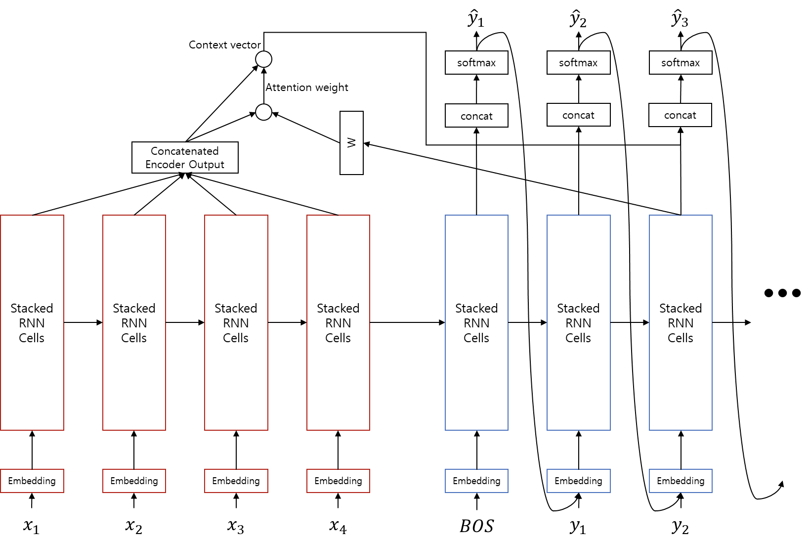

# 어텐션 (Attention)

어텐션은 쿼리(Query)와 비슷한 값을 가진 키(Key)를 찾아서 그 값(Value)을 얻는 과정입니다. 따라서, 우리가 흔히 json이나 프로그래밍에서 널리 사용하는 Key-Value(키밸류)) 방식과 비교하며 어텐션에 대해서 설명하고자 합니다.

### Key-Value 함수

어텐션을 본격적으로 소개하기 전에 먼저 우리가 알고 있는 자료형을 짚고 넘어갈까 합니다. Key-Value 또는 [Python에서 Dictionary](https://wikidocs.net/16)라고 부르는 자료형 입니다. 파이썬에서는 아래와 같이 사용 될 수 있습니다.

```py
>>> dic = {'computer': 9, 'dog': 2, 'cat': 3}
```

위와 같이 Key와 Value에 해당하는 값들을 넣고 Key를 통해 Value 값에 접근 할 수 있습니다. 좀 더 바꿔 말하면, Query가 주어졌을 때, Key 값에 따라 Value 값에 접근 할 수 있습니다. 위의 작업을 함수로 나타낸다면, 아래와 같이 표현할 수 있을겁니다. (물론 실제 파이썬 딕셔너리의 동작은 매우 다릅니다.)

```py
def key_value_func(query):
    weights = []

    for key in dic.keys():
        weights += [is_same(key, query)]
        
    weight_sum = sum(weights)
    for i, w in enumerate(weights):
        weights[i] = weights[i] / weight_sum

    answer = 0

    for weight, value in zip(weights, dic.values()):
        answer += weight * value

    return answer

def is_same(key, query):
    if key == query:
        return 1.
    else:
        return .0
```

코드를 살펴보면, 순차적으로 'dic' 변수 내부의 key값들과 query 값을 비교하여, key가 같을 경우 'weights' 변수에 1.0을 더하고, 다를 경우에는 0을 더합니다. 그리고 'weights'를 'weights'의 총 합으로 나누어 그 합이 1이 되도록 만들어 줍니다. 다시 'dic' 내부의 value값들과 'weights'의 값에 대해서 곱하여 더해 줍니다. 즉, 'weight'가 1.0인 경우에만 'value'값을 'answer'에 더합니다.

### 미분 가능한 Key-Value 함수

좀 더 발전시켜서, 만약 is_same 함수 대신에 다른 함수를 써 보면 어떻게 될까요? how_similar 라는 key와 query 사이의 유사도를 반환하는 가상의 함수가 있다고 가정해 봅시다.

```py
>>> query = 'puppy'
>>> how_similar('computer', query)
0.1
>>> how_similar('dog', query)
0.9
>>> how_similar('cat', query)
0.7
```

그리고 해당 함수에 'puppy'라는 단어를 테스트 해 보았더니 위와 같은 값들을 반환했다고 합시다. 그럼 아래와 같이 실행 될 겁니다.

```py
>>> query = 'puppy'
>>> key_value_func(query)
2.823 # = .1 / (.9 + .7 + .1) * 9 + .9 / (.9 + .7 + .1) * 2 + .7 / (.9 + .7 + .1) * 3
```

2.823라는 값이 나왔습니다. 강아지와 고양이, 그리고 컴퓨터의 유사도의 비율에 따른 'dic'의 값의 비율을 지녔다라고 볼 수 있습니다. is_same 함수를 쓸 때에는 두 값이 같은지 if문을 통해 검사하고 값을 할당했기 때문에, 미분을 할 수 없거나 할 수 있더라도 그래디언트가 0이 됩니다. 하지만, 이제 우리는 key_value_func을 딥러닝에 사용할 수 있습니다.

### 미분 가능한 Key-Value 벡터 함수

만약, dic의 value에는 100차원의 벡터로 들어있었다면 어떻게 될까요? 추가적으로 query와 key 값 모두 벡터를 다룬다면 어떻게 될까요? 즉, 단어 임베딩 벡터라면?
그리고 how_similar 함수는 이 벡터들 간의 코사인 유사도(cosine similarity)를 반환 해 주는 함수라면? 마지막으로 dic의 key 값과 value 값이 서로 같다면 어떻게 될까요?

이를 위해서 다시 가상의 함수를 만들어보겠습니다. word2vec 함수는 단어를 입력으로 받아서 그 단어에 해당하는 미리 정해진 단어 임베딩 벡터를 반환 해 준다고 가정하겠습니다. 그럼 좀 전의 how_similar 함수는 두 벡터 간의 코사인 유사도 값을 반환 할 겁니다.

```py
def key_value_func(query):
    weights = []

    for key in dic.keys():
        weights += [how_similar(key, query)]    # cosine similarity 값을 채워 넣는다.

    weights = softmax(weights)    # 모든 weight들을 구한 후에 softmax를 계산한다.
    answer = 0

    for weight, value in zip(weights, dic.values()):
        answer += weight * value

    return answer
```

이번에 key_value_func는 그럼 그 값을 받아서 weights에 저장 한 후, 모든 weights의 값이 채워지면 softmax 함수를 취할 겁니다. 여기서 softmax는 weights의 합의 크기를 1로 고정시키는 정규화 역할을 합니다. 따라서 유사도의 총 합에서 차지하는 비율 만큼 weight의 값이 채워질 겁니다.

```py
>>> len(word2vec('computer'))
100
>>> word2vec('dog')
[0.1, 0.3, -0.7, 0.0, ...
>>> word2vec('cat')
[0.15, 0.2, -0.3, 0.8, ...
>>> dic = {word2vec('computer'): word2vec('computer'), word2vec('dog'): word2vec('dog'), word2vec('cat'): word2vec('cat')}
>>>
>>> query = 'puppy'
>>> answer = key_value_func(word2vec(query))
```

그럼 이제 answer의 값에는 어떤 벡터 값이 들어 있을 겁니다. 그 벡터는 'puppy' 벡터와 'dog', 'computer', 'cat' 벡터들의 코사인 유사도에 따라서 값이 정해집니다. 즉, 이 함수는 query와 비슷한 key 값을 찾아서 비슷한 정도에 따라서 weight를 나누고, 각 key의 value값을 weight 값 만큼 가져와서 모두 더하는 것 입니다. 이것이 바로 어텐션이 하는 역할 입니다.

## 기계번역에서의 어텐션

그럼 번역에서 어텐션은 어떻게 작용할까요? 번역 과정에서는 인코더의 각 time-step 별 출력을 Key와 Value로 삼고, 현재 time-step의 디코더 출력을 Query로 삼아 어텐션을 계산합니다.

|항목|구성|
|-|-|
|Query|현재 time-step의 디코더의 출력|
|Keys|각 time-step 별 인코더의 출력|
|Values|각 time-step 별 인코더의 출력|

```py
>>> context_vector = attention(query = decoder_output, keys = encoder_outputs, values = encoder_outputs)
```

어텐션을 추가한 sequence-to-sequence의 수식은 아래와 같은 부분이 추가 됩니다.

$$\begin{gathered}
w = \text{softmax}({h_{t}^{\text{tgt}}}^T W \cdot H^{src}) \\
c = H^{src}\cdot w\text{ and }c\text{ is a context vector}. \\
\\
\tilde{h}_{t}^{\text{tgt}}=\tanh(\text{linear}_{2\times hs\rightarrow hs}([h_{t}^{\text{tgt}}; c])) \\
\hat{y}_{t}=\text{softmax}(\text{linear}_{hs\rightarrow|V_{\text{tgt}}|}(\tilde{h}_{t}^{\text{tgt}})) \\
\\
\text{where }hs\text{ is hidden size of RNN, and }|V_{\text{tgt}}|\text{ is size of output vocabulary}.
\end{gathered}$$

원하는 정보를 어텐션을 통해 인코더에서 획득한 후, 해당 정보를 디코더의 출력과 이어붙여(concatenate) $tanh$ 를 취한 후, softmax 계산을 통해 다음 time-step의 입력이 되는 $\hat{y}_{t}$ 을 구합니다.



### 선형 변환

이때 각 입력 파라미터들을 굉장히 거칠게 추상적으로 예상해 본다면, 다음을 의미한다고 볼 수 있습니다. 물론 실제 뉴럴 네트워크 내부의 값은 이보다 훨씬 복잡하고 해석할 수 없는 값으로 채워져 있을 겁니다.

|항목|의미|
|-|-|
|decoder_output|현재 time-step 까지 번역 된 대상 언어(target language)의 단어들 또는 문장, 의미|
|encoder_outputs|각 time-step 에서의 소스 언어(source language) 단어 또는 문장, 의미|

신경망 내부의 각 차원들은 숨겨진 특징 값(latent feature)이므로 딱 잘라 정의할 수 없습니다. 하지만 분명한건 소스 언어와 대상 언어가 애초에 다르다는 것 입니다. 따라서 단순히 벡터 내적을 해 주기보단 소스 언어와 대상 언어 간에 연결고리를 하나 놓아주어야 할 겁니다. 그래서 우리는 추상적으로 상상해 보았을때, 두 언어가 각각 임베딩 된 latent 공간이 선형(linear) 관계에 있다고 가정하고, 내적 연산을 수행하기 전에 선형 변환(linear transformation)을 해 줍니다. 이 선형 변환을 위한 $W$ 값은 뉴럴 네트워크 웨이트 파라미터로써, 피드포워드(feed-forward) 및 back-propagation을 통해서 학습됩니다.


왜 어텐션이 필요한 것일까요? 기존의 sequence-to-sequence는 두 개의 RNN(인코더와 디코더)로 이루어져 있습니다. 여기서 문장 임베딩 벡터에 해당하는 인코더 결과 벡터의 정보를 디코더의 히든 스테이트(hidden state, LSTM의 경우에는 cell state가 추가)로 전달해야 합니다. 그리고 디코더는 인코더로부터 넘겨받은 히든 스테이트로부터 문장을 만들어냅니다. 이때 히든 스테이트만으로는 문장의 모든 정보를 완벽하게 전달하기 힘들기 때문 입니다. 특히 문장이 길어질수록 이 문제는 더 심각해 집니다. 따라서 디코더의 매 time-step마다, 현재 디코더의 상태(히든 스테이트)에 따라 필요한 인코더의 정보(인코더 마지막 레이어의 히든 스테이트)에 접근하여 끌어다 쓰겠다는 것 입니다.


이 선형변환을 배우는 것 자체가 어텐션이라고 표현해도 과하지 않습니다. 선형변환 과정을 통해서 디코더의 현재 상태에 따라, 필요한 query를 만들어 내어, 인코더의 key값들과 비교하여 가중합(weighted sum)을 하는 것이기 때문입니다. 즉, 어텐션을 통해 디코더는 인코더에 query를 날리는 것인데, query를 잘 날려야지 좋은 정답을 얻을 것 입니다.

예를 들어 우리가 어떤 정보에 대해서 알고자 할때, 구글링 또는 네이버를 검색 한다면 검색창에 검색을 잘 하기 위한 query를 만들어 검색 버튼을 누를 것 입니다. 그 query의 질에 따라서 검색 결과의 품질은 천차만별 일 것 입니다. 그리고 같은 정보를 알고자 하더라도, query를 만들어내는 능력에 따라서 검색 결과를 얻을 수 있느냐 없느냐는 달라질 것 입니다. 한마디로 여러분의 부모님이나 아주 어린 자녀들이 여러분보다 구글링을 잘하지 못하는 것은 당연한 것 입니다. 하지만 Query를 만들어내는 훈련을 한다면 그들의 검색능력 또한 좋아질 것 입니다.

마찬가지로 뉴럴 네트워크도 query를 만들어내는 훈련을 하는 것이라고 볼 수 있습니다. 따라서, 현재 디코더의 상태에 따라 필요한 정보가 무엇인지를 스스로 판단하여 선형변환(linear transform)을 통해서 query를 만들어낼 것 입니다. 또한, 선형변환을 위한 웨이트 파라미터 자체도 한계가 있기 때문에, 디코더의 상태 자체도 선형변환이 되어 query가 좋은 형태가 되도록 RNN이 동작 할 것 입니다.

### 어텐션의 적용 결과

](../assets/nmt-attention-evaluation-graph.png)

어텐션을 사용하지 않은 sequence-to-sequence는 전반적으로 성능이 떨어짐을 알 수 있을 뿐만 아니라, 특히 문장이 길어질수록 성능이 더욱 하락함을 알 수 있습니다. 하지만 이에 비해서 어텐션을 사용하면 문장이 길어지더라도 성능이 크게 하락하지 않음을 알 수 있습니다.

## 파이토치 예제 코드

torch.bmm 함수는 batch matrix multiplication(bmm, 배치 행렬곱)을 수행하는 함수로써, 2개 이상의 차원을 지닌 텐서가 주어졌을 때 뒤 2개 차원에 대해서는 행렬곱을 수행하고 앞의 다른 차원은 미니배치로 취급합니다. 따라서 앞의 차원들은 크기가 같아야 하고, 뒤 2개 차원은 행렬 곱을 수행하기 위한 적절한 크기를 지녀야 합니다.

```python
# |t1| = (batch_size, p, q)
# |t2| = (batch_size, q, m)
t3 = torch.bmm(t1, t2)
# |t3| = (batch_size, p, m)
```

선형변환을 위한 웨이트 파라미터를 bias가 없는 Linear 레이어로 대체하였음을 확인할 수 있습니다.

```python
class Attention(nn.Module):

    def __init__(self, hidden_size):
        super(Attention, self).__init__()

        self.linear = nn.Linear(hidden_size, hidden_size, bias = False)
        self.softmax = nn.Softmax(dim = -1)

    def forward(self, h_src, h_t_tgt, mask = None):
        # |h_src| = (batch_size, length, hidden_size)
        # |h_t_tgt| = (batch_size, 1, hidden_size)
        # |mask| = (batch_size, length)

        query = self.linear(h_t_tgt.squeeze(1)).unsqueeze(-1)
        # |query| = (batch_size, hidden_size, 1)

        weight = torch.bmm(h_src, query).squeeze(-1)
        # |weight| = (batch_size, length)
        if mask is not None:
            # Set each weight as -inf, if the mask value equals to 1.
            # Since the softmax operation makes -inf to 0, masked weights would be set to 0 after softmax operation.
            # Thus, if the sample is shorter than other samples in mini-batch, the weight for empty time-step would be set to 0.
            weight.masked_fill_(mask, -float('inf'))
        weight = self.softmax(weight)

        context_vector = torch.bmm(weight.unsqueeze(1), h_src)
        # |context_vector| = (batch_size, 1, hidden_size)

        return context_vector
```