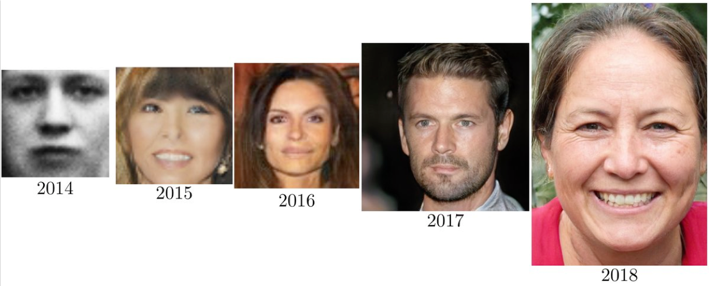

# Deep Learning

딥러닝의 시대가 오고 딥러닝은 하나하나 머신러닝의 분야들을 정복해 나가기 시작했습니다. 가장 먼저 두각을 나타낸 곳은 ImageNet이었지만, 가장 먼저 상용화 부문에서 빛을 본 것은 음성인식 분야였습니다. 음성인식은 여러 구성요소 중에서 고작 하나인 GMM(Gaussian Mixture Model)을 DNN(Deep Neural Networks)으로 대체하였지만, 성능에 있어서 십 수년의 정체를 뚫고 한 차례 큰 발전을 이루어냈습니다. 상대적으로 가장 나중에 빛을 본 곳은 자연어처리 분야였습니다. 아마도 이미지 분류와 음성인식의 음소 인식과 달리 자연어처리는 sequential한 데이터라는 것이 좀 더 장벽으로 다가왔으리라 생각됩니다. 하지만, 결국엔 attention의 등장으로 인해서 요원해 보이던 기계번역 분야마저 end-to-end 딥러닝에의해 정복되었습니다.

## Brief Introduction to History of Deep Learning

### Before 2010's

인공신경망을 필두로한 인공지능의 유행은 지금이 처음이 아닙니다. 이전까지 두 번의 대유행이 있었고, 그에 따른 두 번의 빙하기가 있었습니다. 80년대에 처음 back-propagation(역전파 알고리즘)이 제안된 이후로, 모든 문제는 해결 된 듯 해 보였습니다. 하지만, 다시금 여러가지 한계점을 드러내며 침체기를 맞이하였습니다. 모두가 인공신경망의 가능성을 부인하던 2006년, Hinton 교수는 Deep Belief Networks(DBN)을 통해 여러 층의 hidden layer를 효과적으로 pretraining 시킬 수 있는 방법을 제시하였습니다. 하지만, 아직까지 가시적인 성과가 나오지 않았기 때문에 모두의 관심을 집중 시킬 순 없었습니다.

실제로 주변의 90년대의 빙하기를 겪어보신 세대 분들은 처음 딥러닝이 주목을 끌기 시작했을 때, 모두 부정적인 반응을 보이기 마련이었습니다. 계속 해서 최고 성능을 갈아치우며, 모두가 열광할 때에도, 단순한 잠깐의 유행일 것이라 생각하는 분들도 많았습니다. 하지만 점차 딥러닝은 여러 영역을 하나 둘 정복 해 나가기 시작했습니다.

### Image Recognition

2012년 이미지넷에서 인공신경망을 이용한 AlexNet([[Krizhevsky at el.2012](https://www.cs.toronto.edu/~kriz/imagenet_classification_with_deep_convolutional.pdf)])은 경쟁자들을 큰 차이로 따돌리며 우승을 하고, 딥러닝의 시대의 서막을 올립니다. AlexNet은 여러 층의 Convolutional Layer을 쌓아서 네트워크 구조를 만들었고, 기존의 우승자들과 확연한 실력차를 보여주었습니다. 당시에 AlexNet은 3GB 메모리의 Nvidia GTX580을 2개 사용하여 훈련하였는데, 지금 생각하면 참으로 격세지감이 아닐 수 없습니다.

  

이후, ImageNet은 딥러닝의 경연장이 되었고, 거의 모든 참가자들이 딥러닝을 이용하여 알고리즘을 구현하였습니다. 결국, ResNet([[He et al.2015](https://arxiv.org/pdf/1512.03385.pdf)])은 Residual Connection을 활용하여 150층이 넘는 깊은 네트워크를 구성하며 우승하였습니다.

하지만, 사실 연구에서와 달리, 아직 실생활에서의 이미지 분류 문제는 아직 다른 분야에 비해서 어려움이 있는 것은 사실입니다. 이미지 분류 자체의 난이도가 워낙 높기 때문입니다. 따라서 아직도 이와 관련해서 산업계에서는 많은 연구와 개발이 이어지고 있습니다.

### Speech Recognition

음성인식에 있어서도 딥러닝(당시에는 Deep Neural Network라는 이름으로 더욱 유명하였습니다.)을 활용하여 큰 발전을 이룩하였습니다. 오히려 이 분야에서는 영상처리(computer vision)분야에 비해서 딥러닝 기술을 활용하여 상용화에까지 성공한 더욱 인상적인 사례라고 할 수 있습니다.

  

사실 음성인식은 2000년대에 들어 큰 정체기를 맞이하고 있었습니다. GMM(Gaussian Mixture Model)을 통해 음소(phone)를 인식하고, 이를 HMM(Hidden Markov Model)을 통해 sequential 정보를 반영하여 학습하여 만든 Acoustic Model (AM)과 n-gram기반의 언어모델(Language Model, LM)을 WFST (Weighted Finite State Transeducer)방식을 통해 결합하는 전통적인 음성인식(Automatic Speech Recognition, ASR) 시스템은 위의 설명에서 볼 수 있듯이 너무나도 복잡한 구조와 함께 그 성능의 한계를 보이고 있었습니다.

그러던 중, 2012년 GMM을 DNN으로 대체하며, 십수년간의 정체를 단숨에 뛰어넘는 큰 혁명을 맞이하게 됩니다. (영상처리 자연어처리에서 모두 보이는 익숙한 패턴입니다.) 그리고 점차 AM전체를 LSTM으로 대체하고, 또한 end-to-end model([[Chiu et al.2017](https://arxiv.org/pdf/1712.01769.pdf)])이 점점 저변을 넓혀가고 있는 추세입니다.

### Machine Translation

사실 다른 인공지능의 다른 분야에 비해서 자연어처리 또는 기계번역 분야는 이렇다할 큰 성과를 거두지는 못하고 있었습니다. 하지만 결국 물밀듯이 밀려오는 딥러닝의 침략 앞에서 기계번역 또한 예외일 순 없었습니다. 딥러닝 이전의 기계번역은 통계 기반 기계번역(Statistical Machine Translation, SMT)가 지배하고 있었습니다. 비록 SMT는 규칙기반의 번역방식(Rule based Machine Translation, RBMT)에 비해서 언어간 확장이 용이한 장점이 있었고, 성능도 더 뛰어났지만, 음성인식과 마찬가지로 SMT는 역시 너무나도 복잡한 구조를 지니고 있었습니다.

2014년 Sequence-to-sequence(seq2seq)라는 모델 구조가 소개 되며, end-to-end neural machine translation (NMT)의 시대가 열리게 되었습니다.

Seq2seq를 기반으로 attention mechanism([[Bahdanau et al.2014](https://arxiv.org/pdf/1409.0473.pdf)], [[Luong et al.2015](https://arxiv.org/pdf/1508.04025.pdf)])이 제안되며 결국 기계번역은 Neural Machine Translation에 의해서 대통합이 이루어지게 됩니다.

결국, 기계번역은 가장 늦게 혁명이 이루어졌지만, 가장 먼저 딥러닝만을 사용해 상용화가 된 분야가 되었습니다. 현재의 상용 기계번역 시스템은 모두 딥러닝에 의한 시스템으로 대체되었다고 볼 수 있습니다.

* 읽을거리:
  * [https://devblogs.nvidia.com/introduction-neural-machine-translation-with-gpus/](https://devblogs.nvidia.com/introduction-neural-machine-translation-with-gpus/)
  * [https://devblogs.nvidia.com/introduction-neural-machine-translation-gpus-part-2/](https://devblogs.nvidia.com/introduction-neural-machine-translation-gpus-part-2/)
  * [https://devblogs.nvidia.com/introduction-neural-machine-translation-gpus-part-3/](https://devblogs.nvidia.com/introduction-neural-machine-translation-gpus-part-3/)

### Generative Learning

딥러닝은 패턴 분류 성능에 있어서 타 알고리즘에 비해서 너무나도 압도적인 모습을 보여주었기 때문에, 이미지 분류나 텍스트 분류와 같은 단순한 분류 문제(classification or discriminative learning)는 금방 정복되고 더 이상 연구자들의 흥미를 끌 수 없었습니다.

각 방식이 흥미를 두고 있는 것:

* Discriminative learning

$$
\hat{\theta} = \underset{\theta}{\text{argmax }}{P(Y|X;\theta)}
$$

* Generative learning

$$
\hat{\theta} = \underset{\theta}{\text{argmax }}{P(X;\theta)}
$$

따라서, 곧 연구자들은 또 다른 흥미거리를 찾아 나섰는데, 그것은 Generative Learning이었습니다. 기존의 분류 문제는 $X$가 주어졌을 때, 알맞은 $Y$를 찾아내는 것에 집중했다면, 이제는 $X$ 분포 자체에 집중하기 시작한 것 입니다. 예를 들어 기존에는 사람의 얼굴 사진이 주어지면 남자인지 여자인지, 또는 더 나아가 이 사람이 누구인지 알아내는 것이었다면, 이제는 얼굴 자체를 묘사할 수 있는 모델을 훈련하고자 하였습니다.

이러한 과정에서 Adversarial learning (GAN, [[Goodfellow et al.2014](https://arxiv.org/pdf/1406.2661.pdf)])이나 Variational Auto-encoder (VAE, [[Kingma et al.2013](https://arxiv.org/pdf/1312.6114.pdf)])등이 주목받게 되었습니다. 아직 이러한 연구는 현재 진행형이라 할 수 있고, 이와 관련한 많은 문제들이 남아있습니다.

## Paradigm Shift on NLP from Traditional to Deep Learning

딥러닝 이전의 기존의 전형적인 자연어처리 어플리케이션의 구조는 보통 아래와 같습니다. 문제에 따라서 phonology가 추가되기도 하고, 아래와 같이 여러가지 단계의 모듈로 구성되어 복잡한 디자인을 구성하게 됩니다. 따라서 매우 무겁고 복잡하여 구현 및 시스템 구성이 어려운 단점이 많았습니다. 더군다나, 각각의 모듈이 완벽하게 동작할 수 없기 때문에, 각기 발생한 애러가 중첩 및 가중되어 뒤로 전파되는 error propagation등의 문제도 가질 수 있었습니다.

\]](../assets/intro-traditional-nlp.png)  

하지만, 위에서 언급한 기계번역의 사례 처럼 자연어처리 전반에 걸쳐 딥러닝의 물결이 들어오기 시작했습니다. 처음에는 각 하위 모듈을 대체하는 형태로 진행되었지만, 점차 기계번역의 사례처럼 결국 end-to-end 모델들로 대체 되었습니다. 현재에도 챗봇과 같은 아직 많은 문제들에서 end-to-end 학습이 이루어지지 않았지만, 최종적으로는 end-to-end 모델들이 제안될 것이라 볼 수 있습니다.

\]](../assets/intro-paradigm-shift.png)  

딥러닝이 자연어처리에서도 주류가 되면서, 위와 같은 접근 방법의 변화들을 꼽을 수 있습니다. 사람의 언어는 Discrete(비연속적)한 심볼로 이루어져 있습니다. 비록 그 심볼간에는 유사성이 있을 수 있지만 기본적으로 모든 단어(또는 토큰)은 다른 심볼이라고 볼 수 있습니다. 따라서 기존의 전통적인 자연어처리에서는 discrete 심볼로써 데이터를 취급하였습니다. 따라서 사람이 데이터를 보고 해석하기는 쉬운 장점이 있었지만, 모호성이나 유의성을 다루는데에는 어려움을 겪을 수 밖에 없었습니다.

하지만 word2vec등의 word embedding을 통해서 단어(또는 토큰)을 continuous(연속적인)한 벡터로써 나타낼 수 있게 되고, 모호성과 유의성에서도 이득을 볼 수 있게 되었습니다. 또한, 딥러닝의 장점을 잘 살려 end-to-end 모델을 구현함으로써 더욱 높은 성능을 뽑을 수 있게 되었습니다. 또한, RNN의 단점을 보완한 LSTM과 GRU에 대한 활용법이 고도화 되었고, attention의 등장으로 인해서 긴 time-step의 sequential 데이터에 대해서도 어렵지 않게 훈련할 수 있게 된 점도 큰 터닝 포인트라고 볼 수 있습니다.

\]](../assets/intro-nlp-symbolic-vs-neural.png)  

## Conclusion

\]](../assets/intro-end-2-end-nlp-deep-learning.png)  

다시 말해, 비록 자연어처리는 discrete한 심볼로 이루어진 사람의 언어를 다루는 분야이지만, 성공적인 word embedding과 long term sequential 데이터에 대한 효과적인 대응방법이 나옴에 따라서, 점차 다른 인공지능의 분야들처럼 큰 발전이 이루어지게 되었습니다.

](../assets/intro-growth-of-deeplearning.png)

이렇게 딥러닝이 널리 퍼짐에 따라, 자연어처리를 포함한 인공지능의 여러 분야에서 모두 큰 발전과 성공을 보이고 있습니다. 따라서, 이 책은 기존의 전통적인 방식과 새롭게 제안된 최신의 자연어처리 기술을 모두 소개하고자 합니다.
