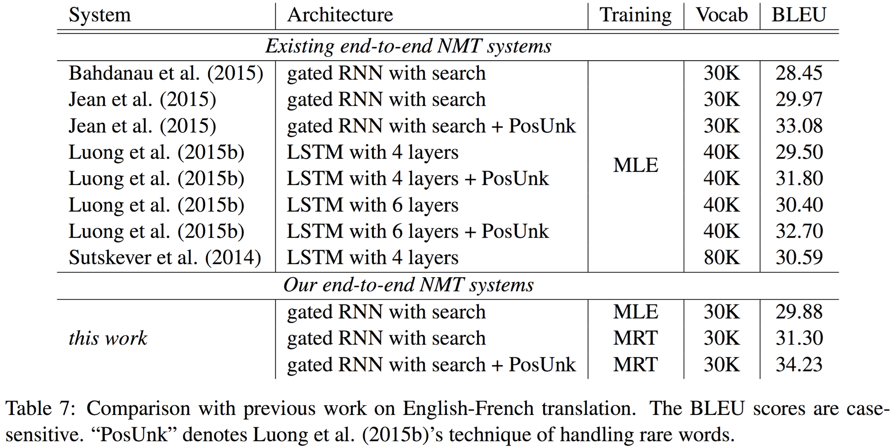

# 지도학습을 통한 기계번역 고도화

자연어생성(NLG)을 위한 sequence-to-sequence의 훈련 과정에 teacher-forcing 및 크로스 엔트로피 손실함수를 적용하게 되면, 그 자체의 특성으로 인해서 실제 번역 품질과의 괴리(discrepancy)가 생기게 됩니다. 일반적으로 BLEU는 실제 사람이 평가한 번역의 품질과 높은 상관관계에 있다고 알려져 있기 때문에, BLEU를 훈련 과정의 목적함수(objective function)로 사용하게 된다면 더 좋은 결과를 얻을 수 있을 것 입니다. 마찬가지로 다른 NLG 문제(요약 및 챗봇 등)에 대해서도 비슷한 접근을 생각 할 수 있습니다.

## Minimum Risk Training (MRT)

위의 아이디어에서 출발한 논문[[Shen at el.2015]](https://arxiv.org/pdf/1512.02433.pdf)이 Minimum Risk Training이라는 방법을 제안하였습니다. 당시 저자는 폴리시 그래디언트를 직접적으로 사용하진 않았지만, 유사한 수식이 유도 되었다는 점이 매우 인상적입니다.

$$\begin{gathered}
\hat{\theta}_{\text{MLE}}=\underset{\theta}{\text{argmin}}~\mathcal{L}(\theta) \\
\text{where }\mathcal{L}(\theta)=-\sum_{s=1}^S\log{P(y^{(s)}|x^{(s)};\theta)}.
\end{gathered}$$

기존의 Maximum Likelihood Estimation (MLE)방식은 위와 같은 손실 함수(Loss function)를 사용하여 $|S|$ 개의 입력과 출력에 대해서 손실(loss)값을 구하고, 이를 최소화 하는 $\theta$ 를 찾는 것이 목표(objective)였습니다. 하지만 이 논문에서는 Risk를 아래와 같이 정의하고, 이를 최소화 하는 학습 방식을 Minimum Risk Training (MRT)라고 하였습니다.

$$\begin{aligned}
\mathcal{R}(\theta)&=\sum_{s=1}^S{\mathbb{E}_{y|x^{(s)};\theta}\big[\triangle(y,y^{(s)})\big]} \\
&=\sum_{s=1}^S{\sum_{y\in\mathcal{Y(x^{(s)})}}{P(y|x^{(s)};\theta)\triangle(y, y^{(s)})}}
\end{aligned}$$

위의 수식에서 $\mathcal{Y}(x^{(s)})$ 는 full search space로써, $s$ 번째 입력 $x^{(s)}$ 가 주어졌을 때, 가능한 정답의 집합을 의미합니다. 또한 $\triangle(y,y^{(s)})$ 는 입력과 파라미터 $\theta$ 가 주어졌을 때, sampling한 $y$ 와 실제 정답 $y^{(s)}$ 의 차이(error)값을 나타냅니다. 즉, 위 수식에 따르면 risk $\mathcal{R}$ 은 주어진 입력과 현재 파라미터 상에서 얻은 y를 통해 현재 모델(함수)을 구하고, 동시에 이를 사용하여 risk의 기대값을 구한다고 볼 수 있습니다.

$$\hat{\theta}_{\text{MRT}}=\underset{\theta}{\text{argmin}}~\mathcal{R}(\theta)$$

이렇게 정의된 risk를 최소화(minimize) 하도록 하는 것이 목표(objective)입니다. 사실 risk 대신에 reward로 생각하면, reward를 최대화(maximize) 하는 것이 목표가 됩니다. 결국은 risk를 최소화 할 때에는 gradient descent, reward를 최대화 할 때는 gradient ascent를 사용하게 되므로, 수식을 풀어보면 결국 완벽하게 같은 이야기라고 볼 수 있습니다. 따라서 실제 구현에 있어서는 $\triangle(y,y^{(s)})$ 사용을 위해서 BLEU 점수에 $-1$을 곱하여 사용 합니다.

$$\begin{aligned}
\tilde{\mathcal{R}}(\theta)&=\sum_{s=1}^S{\mathbb{E}_{y|x^{(s)};\theta,\alpha}\big[\triangle(y,y^{(s)})\big]} \\
&=\sum_{s=1}^S{\sum_{y\in\mathcal{S}(x^{(s)})}{Q(y|x^{(s)};\theta,\alpha)\triangle(y,y^{(s)})}}
\end{aligned}$$

$$\begin{gathered}
\text{where }\mathcal{S}(x^{(s)})\text{ is a sampled subset of the full search space }\mathcal{y}(x^{(s)}) \\
\text{and }Q(y|x^{(s)};\theta,\alpha)\text{ is a distribution defined on the subspace }S(x^{(s)})\text{:} \\
Q(y|x^{(s)};\theta,\alpha)=\frac{P(y|x^{(s)};\theta)^\alpha}{\sum_{y'\in S(x^{(s)})}P(y'|x^{(s)};\theta)^\alpha}
\end{gathered}$$

하지만 주어진 입력에 대한 가능한 정답에 대한 전체 space를 탐색(search)할 수는 없기 때문에, Monte Carlo를 사용하여 서브스페이스(sub-space)를 샘플링(sampling) 하는 것을 택합니다. 그리고 위의 수식에서 $\theta$ 에 대해서 미분을 수행합니다. 미분을 하여 얻은 수식은 아래와 같습니다.

$$\begin{aligned}
\nabla_\theta\tilde{R}(\theta)&=\alpha\sum_{s=1}^{S}{\mathbb{E}_{y|x^{(s)};\theta,\alpha}[\frac{\nabla_\theta P(y|x^{(s)};\theta)}{P(y|x^{(s)};\theta)}\times(\triangle(y,y^{(s)})-\mathbb{E}_{y'|x^{(s)};\theta,\alpha}[\triangle(y',y^{(s)})])]} \\
&=\alpha\sum_{s=1}^{S}{\mathbb{E}_{y|x^{(s)};\theta,\alpha}[\nabla_\theta\log{P(y|x^{(s)};\theta)}\times(\triangle(y,y^{(s)})-\mathbb{E}_{y'|x^{(s)};\theta,\alpha}[\triangle(y',y^{(s)})])]} \\
&\approx\alpha\sum_{s=1}^{S}{\nabla_\theta\log{P(y|x^{(s)};\theta)}\times(\triangle(y,y^{(s)})-\frac{1}{K}\sum_{k=1}^{K}{\triangle(y^{(k)},y^{(s)})})}
\end{aligned}$$

$$\theta\leftarrow\theta-\nabla_\theta\tilde{R}(\theta)$$

이제 미분을 통해 얻은 MRT의 최종 수식을 해석 해 보겠습니다. 이해가 어렵다면 아래의 policy gradients 수식과 비교하며 따라가면 좀 더 이해가 수월할 수 있습니다.

- $s$ 번째 입력 $x^{(s)}$ 를 신경망 $\theta$ 에 넣어 얻은 로그확률 $\log{P(y|x^{(s)};\theta)}$ 을 미분하여 gradient를 얻습니다.
- 그리고 $\theta$ 로부터 샘플링(samping) 한 $y$ 와 실제 정답 $y^{(s)}$ 와의 차이(여기서는 주로 BLEU에 $-1$ 을 곱하여 사용)값에서 
- 또 다시 $\theta$ 로부터 샘플링하여 얻은 $y'$ 와 실제 정답 $y^{(s)}$ 와의 차이(마찬가지로 -BLEU)의 기대값을
- 빼 준 값을 risk로써 로그확률의 gradient에 곱해 줍니다.
- 이 과정을 전체 데이터셋(실제로는 mini-batch) $S$ 에 대해서 수행한 후 합(summation)을 구하고 learning rate $\alpha$ 를 곱 합니다.

최종적으로는 기대값 수식을 monte carlo sampling을 통해 제거할 수 있습니다.

아래는 policy gradients 수식 입니다.

$$\begin{aligned}
\triangledown_\theta J(\theta)&=\mathbb{E}_{\pi_\theta}[\triangledown_\theta \log{\pi_\theta (a|s)} \times Q^{\pi_\theta}(s,a)] \\
\theta &\leftarrow \theta + \alpha \triangledown_\theta J(\theta)
\end{aligned}$$

MRT는 risk에 대해 minimize 해야 하기 때문에 gradient descent를 해 주는 것을 제외하면 똑같은 수식이 나오는 것을 알 수 있습니다. 



위와 같이 훈련한 MRT에 대한 성능을 실험한 결과 입니다. 기존의 MLE 방식에 비해서 BLEU가 1.5가량 상승한 것을 확인할 수 있습니다. 이처럼 MRT는 강화학습으로써의 접근을 전혀 하지 않고도, 수식적으로 policy gradients의 일종인 REINFORCE with baseline 수식을 이끌어내고 성능을 끌어올리는 방법을 제시한 점이 인상깊습니다.

### Implementation

우리는 아래의 방법을 통해 Minimum Risk Training을 PyTorch로 구현 할 겁니다. 

1. 먼저 BLEU를 통해 얻은 reward에 $-1$ 을 곱해주어 risk로 변환 합니다. 
1. 그리고 로그 확률에 risk를 곱해주고, 기존에 Negative Log Likelihodd Loss (NLLLoss)를 사용했으므로 NLLLoss 값에 $-1$ 을 곱해주어 sum of positive log probability를 구합니다. 
1. Summation 결과물에 대해서 $\theta$ 에 대해 미분을 수행하면, back-propagation을 통해서 신경망 $\theta$ 전체에 gradient가 구해집니다. 
1. 이 gradient를 사용하여 gradient descent를 통해 최적화(optimize) 하도록 할 겁니다.

$$\nabla_\theta J(\theta) = \nabla_\theta\sum_{s=1}^{S}{\bigg( \log{P(y|x^{(s)};\theta)}\times\Big(\triangle(y,y^{(s)})-\frac{1}{K}\sum_{k=1}^{K}{\triangle(y^{(k)},y^{(s)})}\Big)\bigg)}$$

$$where~\triangle(\hat{y}, y)=-BLEU(\hat{y}, y)$$

$$\theta \leftarrow \theta - \lambda\nabla_\theta J(\theta)$$

우리는 실험을 통해서 심지어 $K=1$ 일 때도, MRT가 잘 동작함을 확인할 수 있습니다.

### Code

MRT(or RL)을 PyTorch를 사용하여 구현 해 보도록 하겠습니다. 자세한 전체 코드는 이전의 NMT PyTorch 실습 코드의 git repository에서 다운로드 할 수 있습니다.

- git repo url: https://github.com/kh-kim/simple-nmt

#### simple_nmt/rl_trainer.py

```python
from tqdm import tqdm
# from nltk.translate.bleu_score import sentence_bleu as score_func
from nltk.translate.gleu_score import sentence_gleu as score_func
# from utils import score_sentence as score_func

import torch
import torch.nn.utils as torch_utils

import utils
import data_loader

from simple_nmt.trainer import Trainer
```

```python
def _get_reward(self, y_hat, y, n_gram=6):
    # This method gets the reward based on the sampling result and reference sentence.
    # For now, we uses GLEU in NLTK, but you can used your own well-defined reward function.
    # In addition, GLEU is variation of BLEU, and it is more fit to reinforcement learning.

    # Since we don't calculate reward score exactly as same as multi-bleu.perl,
    # (especialy we do have different tokenization,) I recommend to set n_gram to 6.

    # |y| = (batch_size, length1)
    # |y_hat| = (batch_size, length2)

    scores = []

    # Actually, below is really far from parallized operations.
    # Thus, it may cause slow training.
    for b in range(y.size(0)):
        ref = []
        hyp = []
        for t in range(y.size(1)):
            ref += [str(int(y[b, t]))]
            if y[b, t] == data_loader.EOS:
                break

        for t in range(y_hat.size(1)):
            hyp += [str(int(y_hat[b, t]))]
            if y_hat[b, t] == data_loader.EOS:
                break

        # for nltk.bleu & nltk.gleu
        scores += [score_func([ref], hyp, max_len=n_gram) * 100.]

        # for utils.score_sentence
        # scores += [score_func(ref, hyp, 4, smooth = 1)[-1] * 100.]
    scores = torch.FloatTensor(scores).to(y.device)
    # |scores| = (batch_size)

    return scores
```

```python
def _get_gradient(self, y_hat, y, crit=None, reward=1):
    # |y| = (batch_size, length)
    # |y_hat| = (batch_size, length, output_size)
    # |reward| = (batch_size)
    crit = self.crit if crit is None else crit

    # Before we get the gradient, multiply -reward for each sample and each time-step.
    y_hat = y_hat * -reward.view(-1, 1, 1).expand(*y_hat.size())

    # Again, multiply -1 because criterion is NLLLoss.
    log_prob = -crit(y_hat.contiguous().view(-1, y_hat.size(-1)),
                        y.contiguous().view(-1)
                        )
    log_prob.div(y.size(0)).backward()

    return log_prob
```

```python
    def train_epoch(self,
                    train,
                    optimizer,
                    max_grad_norm=5,
                    verbose=VERBOSE_SILENT
                    ):
        '''
        Train an epoch with given train iterator and optimizer.
        '''
        total_reward, total_actor_reward = 0, 0
        total_grad_norm = 0
        avg_reward, avg_actor_reward = 0, 0
        avg_param_norm, avg_grad_norm = 0, 0
        sample_cnt = 0

        progress_bar = tqdm(train,
                            desc='Training: ',
                            unit='batch'
                            ) if verbose is VERBOSE_BATCH_WISE else train
        # Iterate whole train-set.
        for idx, mini_batch in enumerate(progress_bar):
            # Raw target variable has both BOS and EOS token. 
            # The output of sequence-to-sequence does not have BOS token. 
            # Thus, remove BOS token for reference.
            x, y = mini_batch.src, mini_batch.tgt[0][:, 1:]
            # |x| = (batch_size, length)
            # |y| = (batch_size, length)
            
            # You have to reset the gradients of all model parameters before to take another step in gradient descent.
            optimizer.zero_grad()

            # Take sampling process because set False for is_greedy.
            y_hat, indice = self.model.search(x,
                                              is_greedy=False,
                                              max_length=self.config.max_length
                                              )
            # Based on the result of sampling, get reward.
            actor_reward = self._get_reward(indice,
                                            y,
                                            n_gram=self.config.rl_n_gram
                                            )
            # |y_hat| = (batch_size, length, output_size)
            # |indice| = (batch_size, length)
            # |actor_reward| = (batch_size)

            # Take samples as many as n_samples, and get average rewards for them.
            # I figured out that n_samples = 1 would be enough.
            baseline = []
            with torch.no_grad():
                for i in range(self.config.n_samples):
                    _, sampled_indice = self.model.search(x,
                                                          is_greedy=False,
                                                          max_length=self.config.max_length
                                                          )
                    baseline += [self._get_reward(sampled_indice,
                                                  y,
                                                  n_gram=self.config.rl_n_gram
                                                  )]
                baseline = torch.stack(baseline).sum(dim=0).div(self.config.n_samples)
                # |baseline| = (n_samples, batch_size) --> (batch_size)

            # Now, we have relatively expected cumulative reward.
            # Which score can be drawn from actor_reward subtracted by baseline.
            final_reward = actor_reward - baseline
            # |final_reward| = (batch_size)

            # calcuate gradients with back-propagation
            self._get_gradient(y_hat, indice, reward=final_reward)
            
            # Simple math to show stats.
            total_reward += float(final_reward.sum())
            total_actor_reward += float(actor_reward.sum())
            sample_cnt += int(actor_reward.size(0))
            total_grad_norm += float(utils.get_grad_norm(self.model.parameters()))

            avg_reward = total_reward / sample_cnt
            avg_actor_reward = total_actor_reward / sample_cnt
            avg_grad_norm = total_grad_norm / (idx + 1)

            if verbose is VERBOSE_BATCH_WISE:
                progress_bar.set_postfix_str('|g_param|=%.2f rwd=%4.2f avg_frwd=%.2e BLEU=%.4f' % (avg_grad_norm,
                                                                                                 float(actor_reward.sum().div(y.size(0))),
                                                                                                 avg_reward,
                                                                                                 avg_actor_reward
                                                                                                 ))

            # In orther to avoid gradient exploding, we apply gradient clipping.
            torch_utils.clip_grad_norm_(self.model.parameters(),
                                        self.config.max_grad_norm
                                        )
            # Take a step of gradient descent.
            optimizer.step()


            if idx >= len(progress_bar) * self.config.train_ratio_per_epoch:
                break

        if verbose is VERBOSE_BATCH_WISE:
            progress_bar.close()

        return avg_actor_reward, param_norm, avg_grad_norm
```