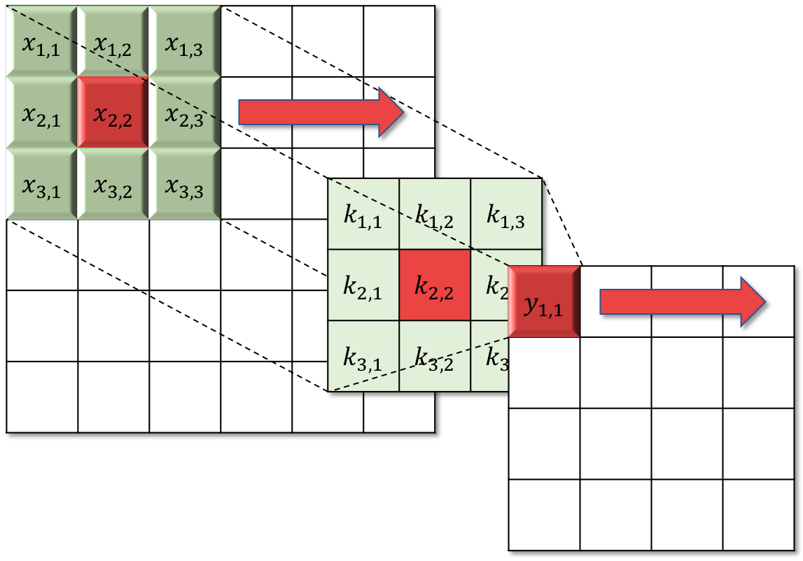
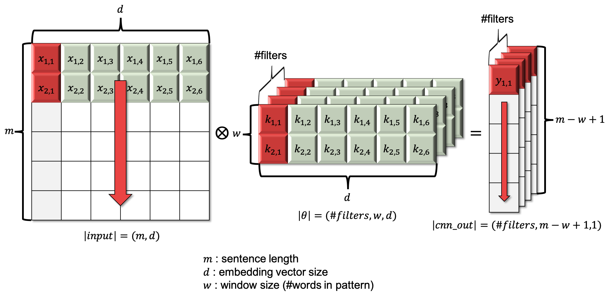

# CNN을 활용하기

이번 섹션에서는 컨볼루션 뉴럴 네트워크(Convolutional Nueral Network, CNN) 레이어를 활용한 텍스트 분류에 대해 다루어 보겠습니다. CNN을 활용한 방법은 [[Kim at el.2014]](https://arxiv.org/pdf/1408.5882.pdf)에 의해서 처음 제안되었습니다. 사실 이전까지 딥러닝을 활용한 자연어처리는 RNN에 국한되어 있는 느낌이 매우 강했습니다. 텍스트 문장은 여러 단어로 이루어져 있고, 그 문장의 길이가 문장마다 상이하며, 문장 내의 단어들은 같은 문장 내의 단어에 따라서 영향을 받기 때문입니다.

좀 더 비약적으로 표현하면 $t$ time-step에 등장하는 단어 $w_t$는 이전 time-step에 등장한 단어들 $w_1,\cdots,w_{t_1}$에 의존하기 때문입니다. (물론 실제로는 $t$ 이후에 등장하는 단어들로부터도 영향을 받습니다.) 따라서 시간 개념이 도입되어야 하기 때문에, RNN의 사용은 불가피하다고 생각되었습니다. 하지만 앞서 소개한 [[Kim at el.2014]](https://arxiv.org/pdf/1408.5882.pdf) 논문에 의해서 새로운 시각이 열리게 됩니다.

## 컨볼루션 연산 (Convolution Operation)

CNN은 영상처리(or Computer Vision) 분야에서 매우 큰 성과를 거두고 있었습니다. CNN의 동기 자체가, 기존의 전통적인 영상처리에서 사용되던 각종 컨볼루션 필터(filter or kernel)를 자동으로 학습하기 위함이기 때문입니다.

### 컨볼루션 필터 (Convolution Filter)

전통적인 영상처리 분야에서는 손으로 한땀한땀 만들어낸 필터를 사용하여 윤곽선(edge)을 검출하는 등의 전처리 과정을 거쳐, 얻어낸 피쳐(feature)들을 통해 객체 탐지(object detection)등을 구현하곤 하였습니다. 예를 들어 주어진 이미지에서 윤곽선을 찾기 위한 컨볼루션 필터는 아래와 같습니다.


이 필터를 이미지에 적용하면 아래와 같은 결과를 얻을 수 있습니다.


이처럼 딥러닝 이전의 영상처리의 경우에는, 전처리 모듈에서 여러 필터들을 해결하고자 하는 문제에 따라 직접 적용하여 피쳐들을 얻어낸 이후에, 다음 단계의 모듈을 적용하여 문제를 해결하는 방식이었습니다.

## 컨볼루션 뉴럴 네트워크 레이어 (Convolutional Neural Network, CNN Layer)

만약 문제에 따라서 필요한 컨볼루션 필터를 자동으로 찾아준다면 어떻게 될까요? CNN이 바로 그러한 역할을 해주게 됩니다. 컨볼루션 연산을 통해 피드포워드(feed-forward) 된 값에 back-propagation을 하여, 더 나은 컨볼루션 필터 값을 찾아나가게 됩니다. 따라서 마지막에 손실 함수의 값이 수렴 한 이후에는, 해당 문제에 딱 맞는 여러 종류의 컨볼루션 필터를 찾아낼 수 있게 되는 것 입니다.



$$
\begin{aligned}
y_{1,1}&=\text{Convolution}(x_{1,1}\cdots,x_{3,3},\theta)\text{ where }\theta=\{k_{1,1},\cdots,k_{3,3}\} \\
&=x_{1,1}*k_{1,1}+\cdots+x_{3,3}*k_{3,3} \\
&=\sum_{i=1}^3{\sum_{j=1}^3{x_{i,j}*k_{i,j}}}
\end{aligned}
$$

컨볼루션 필터 연산의 피드포워드 연산은 위와 같습니다. 필터(또는 커널)가 주어진 이미지 위에서 차례대로 컨볼루션 연산을 수행합니다. 보다시피, 상당히 많은 연산이 병렬(parallel)로 수행될 수 있음을 알 수 있습니다.

기본적으로는 컨볼루션 연산의 결과물은 필터의 크기에 따라 입력에 비해서 크기가 줄어듭니다. 위의 그림에서도 필터의 크기가 $3\times3$ 이므로, $6\times6$ 입력에 적용하면 $4\times4$ 크기의 결과물을 얻을 수 있습니다. <comment> 입력과 같은 크기를 유지하기 위해서는 결과물의 바깥에 패딩(padding)을 추가하여 크기를 유지할 수도 있습니다. </comment> 즉, 입력 차원의 크기와 필터의 크기가 주어졌을 때, 출력 차원의 크기는 아래와 같이 계산 할 수 있습니다.

$$
\begin{gathered}
\text{output\_size}=\text{input\_size}-\text{filter\_size}+1 \\
\\
\text{For example, if }y=\text{CNN}(x,k), \\
y\in\mathbb{R}^{4\times4}\text{ where }x\in\mathbb{R}^{6\times6}\text{ and }k\in\mathbb{R}^{3\times3}.
\end{gathered}
$$

이처럼 CNN은 패턴을 감지하는 필터를 자동으로 최적화하는 역할을 통해, 영상처리(Computer Vision) 등의 분야에서 빼놓을 수 없는 매우 중요한 역할을 하고 있습니다. 또한, 이미지 뿐만 아니라 아래와 같이 음성 분야에서도 효과를 보고 있습니다. 음성 또는 오디오 신호의 경우에도 푸리에 변환을 통해서 2차원의 시계열 데이터를 얻을 수 있습니다. 이렇게 얻어진 데이터에 대해서도 마찬가지로 패턴을 찾아내는 컨볼루션 연산이 매우 유용합니다.

](../assets/tc-audio-cnn.png)

## 텍스트 분류에 CNN을 적용하는 방법

그렇다면 텍스트 분류과정에는 어떻게 CNN을 적용하는 것일까요? 텍스트에 무슨 윤곽선과 같은 패턴이 있는 것일까요? 지금은 일단 미니배치(mini-batch)를 고려하지 않겠습니다. 먼저, One-hot 벡터를 표현하는 인덱스 값을 단어 임베딩 벡터로 변환하면, 1차원(vector)이 됩니다. 그럼 문장 내의 모든 time-step의 단어 임베딩 벡터를 합치면 2차원의 행렬이 됩니다. 이때 컨볼루션을 수행하면, 이제 텍스트에서도 CNN이 효과를 발휘할 수 있게 됩니다.



위의 각 텐서별 크기에서 맨 앞 차원에 미니배치를 위한 차원을 추가하면, 실제 구현에서의 텐서 크기가 될 것 입니다. 이는 아래와 같습니다.

$$
\begin{aligned}
|\text{input}|&=(m,n,d) \\
|k|&=(\text{\#filters},w,d) \\
|\text{output}|&=(m,\text{\#filters},n-w+1,d), \\
\text{where }m&=\text{batch\_size}.
\end{aligned}
$$

좀 더 구체적으로 예를 들어, 주어진 문장에 대해서 긍정/부정 분류를 하는 문제를 생각 해 볼 수 있습니다. 그럼 문장은 여러 단어로 이루어져 있고, 각각의 단어는 embedding layer를 통해 embedding vector로 변환 된 상태 입니다. 각 단어의 embedding vector는 비슷한 의미를 가진 단어일 수록 비슷한 값의 vector 값을 가지도록 될 것 입니다. 

예를 들어 'good'이라는 단어는 그에 해당하는 embedding vector로 구성되어 있을 것 입니다. 그리고 'better', 'best', 'great'등의 단어들도 'good'과 비슷한 vector 값을 갖고 있을 것 입니다. 이때, 쉽게 예상할 수 있듯이, 'good'은 긍정/부정 분류에 있어서 긍정을 나타내는 매우 중요한 신호로 작용 할 수 있을 것 입니다.

그렇다면 'good'에 해당하는 embedding vector의 패턴을 감지하는 filter를 가질 수 있다면, 'good' 뿐만 아니라, 'better', 'best', 'great'등의 단어들도 함께 감지할 수 있을 것 입니다. 한발 더 나아가, 단어들의 조합(시퀀스)의 패턴을 감지하는 filter도 학습할 수 있을 것 입니다. 예를 들어 'good taste', 'worst ever' 등과 비슷한 embedding vector들로 구성된 매트릭스($M\in\mathbb{R}^{w\times d}$)를 감지할 수 있을 것 입니다.

[[Kim at el.2014]](https://arxiv.org/pdf/1408.5882.pdf)에서는 이를 이용하여 CNN 레이어만을 사용한 훌륭한 성능의 텍스트 분류 방법을 제시하였습니다.

![CNN for text classification arthictecture [[Kim at el.2014]](https://arxiv.org/pdf/1408.5882.pdf)](../assets/tc-cnn-text-classification.png)

여러 단어로 이루어진 가변 길이의 문장을 입력으로 받아, 각 단어들을 embedding vector로 변환 후, 단어 별로 여러가지 필터를 적용하여 필요한 패턴을 감지합니다. 문제는 문장의 길이가 문장마다 다르기 때문에, 필터를 적용한 결과물의 크기도 다를 것 입니다. 이때, max pooling layer를 적용하여 가변 길이의 변수를 제거할 수 있습니다. Max pooling 결과의 크기는 필터의 갯수와 같을 것 입니다. 이제 이 위에 linear layer + softmax를 사용하여 각 class 별 확률을 구할 수 있습니다.

## 코드

```py
import torch
import torch.nn as nn


class CNNClassifier(nn.Module):

    def __init__(self,
                 input_size,
                 word_vec_dim,
                 n_classes,
                 dropout_p=.5,
                 window_sizes=[3, 4, 5],
                 n_filters=[100, 100, 100]
                 ):
        self.input_size = input_size  # vocabulary size
        self.word_vec_dim = word_vec_dim
        self.n_classes = n_classes
        self.dropout_p = dropout_p
        # window_size means that how many words a pattern covers.
        self.window_sizes = window_sizes
        # n_filters means that how many patterns to cover.
        self.n_filters = n_filters

        super().__init__()

        self.emb = nn.Embedding(input_size, word_vec_dim)
        # Since number of convolution layers would be vary depend on len(window_sizes),
        # we use 'setattr' and 'getattr' methods to add layers to nn.Module object.
        for window_size, n_filter in zip(window_sizes, n_filters):
            cnn = nn.Conv2d(in_channels=1,
                            out_channels=n_filter,
                            kernel_size=(window_size, word_vec_dim)
                            )
            setattr(self, 'cnn-%d-%d' % (window_size, n_filter), cnn)
        # Because below layers are just operations, 
        # (it does not have learnable parameters)
        # we just declare once.
        self.relu = nn.ReLU()
        self.dropout = nn.Dropout(dropout_p)
        # An input of generator layer is max values from each filter.
        self.generator = nn.Linear(sum(n_filters), n_classes)
        # We use LogSoftmax + NLLLoss instead of Softmax + CrossEntropy
        self.activation = nn.LogSoftmax(dim=-1)

    def forward(self, x):
        # |x| = (batch_size, length)
        x = self.emb(x)
        # |x| = (batch_size, length, word_vec_dim)
        min_length = max(self.window_sizes)
        if min_length > x.size(1):
            # Because some input does not long enough for maximum length of window size,
            # we add zero tensor for padding.
            pad = x.new(x.size(0), min_length - x.size(1), self.word_vec_dim).zero_()
            # |pad| = (batch_size, min_length - length, word_vec_dim)
            x = torch.cat([x, pad], dim=1)
            # |x| = (batch_size, min_length, word_vec_dim)

        # In ordinary case of vision task, you may have 3 channels on tensor,
        # but in this case, you would have just 1 channel,
        # which is added by 'unsqueeze' method in below:
        x = x.unsqueeze(1)
        # |x| = (batch_size, 1, length, word_vec_dim)

        cnn_outs = []
        for window_size, n_filter in zip(self.window_sizes, self.n_filters):
            cnn = getattr(self, 'cnn-%d-%d' % (window_size, n_filter))
            cnn_out = self.dropout(self.relu(cnn(x)))
            # |x| = (batch_size, n_filter, length - window_size + 1, 1)

            # In case of max pooling, we does not know the pooling size,
            # because it depends on the length of the sentence.
            # Therefore, we use instant function using 'nn.functional' package.
            # This is the beauty of PyTorch. :)
            cnn_out = nn.functional.max_pool1d(input=cnn_out.squeeze(-1),
                                               kernel_size=cnn_out.size(-2)
                                               ).squeeze(-1)
            # |cnn_out| = (batch_size, n_filter)
            cnn_outs += [cnn_out]
        # Merge output tensors from each convolution layer.
        cnn_outs = torch.cat(cnn_outs, dim=-1)
        # |cnn_outs| = (batch_size, sum(n_filters))
        y = self.activation(self.generator(cnn_outs))
        # |y| = (batch_size, n_classes)

        return y
```

https://arxiv.org/pdf/1510.03820.pdf