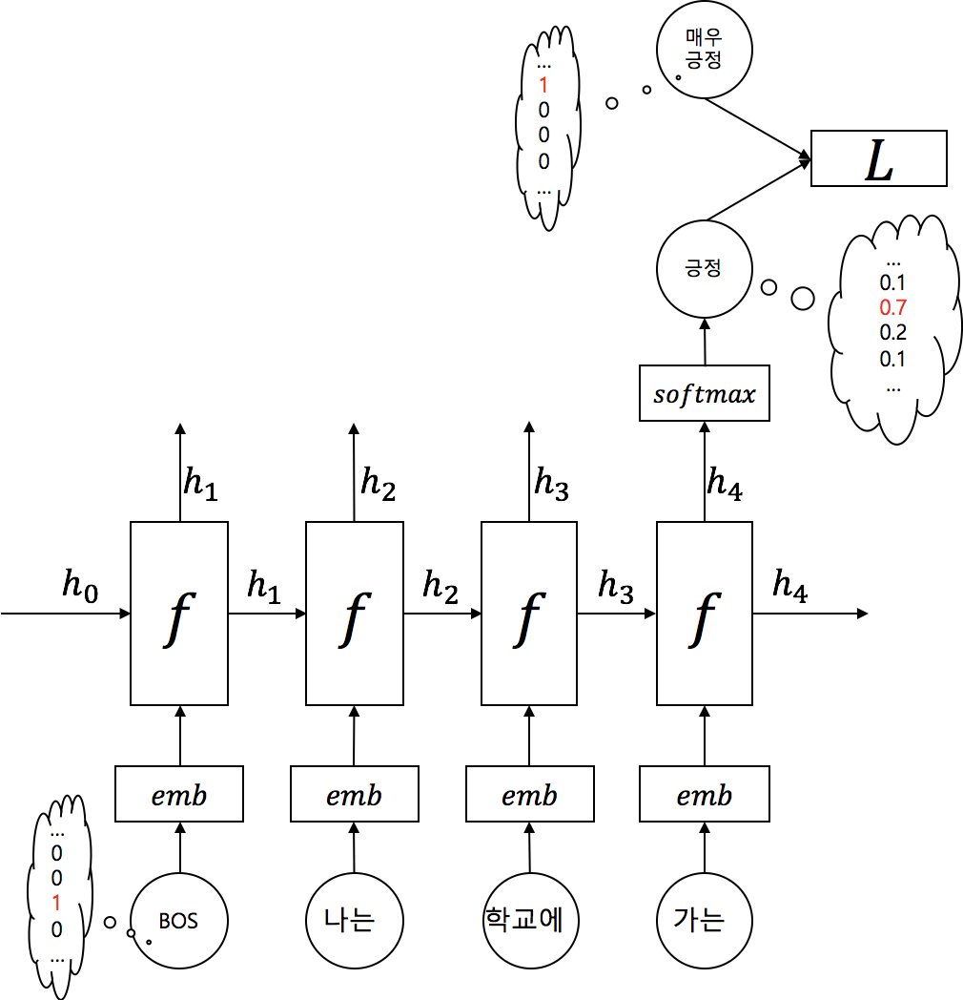

# RNN을 활용한 텍스트 분류

그럼 이제 딥러닝을 통한 텍스트 분류 문제를 살펴 보겠습니다. 딥러닝을 통해 텍스트 분류를 하기 위한 가장 간단한 방법은 Recurrent Neural Network(RNN)를 활용하는것 입니다. 문장은 단어들의 시퀀스로 이루어진 시퀀셜(sequential) 데이터 입니다. 따라서, 각 위치(또는 time-step)의 단어들은 다른 위치의 단어들과 영향을 주고 받습니다. RNN은 이런 문장의 특성을 가장 잘 활용할 수 있는 뉴럴 네트워크 아키텍쳐입니다.

이전 챕터에서 다루었듯이, RNN은 각 time-step의 단어를 입력으로 받아 자신의 상태인 히든 스테이트(hidden state)를 업데이트 합니다. 우리는 이때, 가장 마지막 히든 스테이트를 활용하여 텍스트의 클래스를 분류할 수 있습니다. 따라서, 마치 RNN은 입력으로 주어진 문장을 분류 문제에 맞게 인코딩 한다고 볼 수 있습니다. 즉, RNN의 출력 값은 문장 임베딩 벡터(sentence embedding vector)라고 볼 수 있습니다.



우리가 텍스트 분류를 RNN을 통해 구현한다면 위와 같은 구조가 될 것 입니다. One-hot 벡터로 주어진 

## 파이토치 구현 예제

```python
import torch.nn as nn


class RNNClassifier(nn.Module):

    def __init__(self, 
                 input_size, 
                 word_vec_dim, 
                 hidden_size, 
                 n_classes,
                 n_layers=4, 
                 dropout_p=.3
                 ):
        self.input_size = input_size  # vocabulary_size
        self.word_vec_dim = word_vec_dim
        self.hidden_size = hidden_size
        self.n_classes = n_classes
        self.n_layers = n_layers
        self.dropout_p = dropout_p

        super().__init__()

        self.emb = nn.Embedding(input_size, word_vec_dim)
        self.rnn = nn.LSTM(input_size=word_vec_dim,
                           hidden_size=hidden_size,
                           num_layers=n_layers,
                           dropout=dropout_p,
                           batch_first=True,
                           bidirectional=True
                           )
        self.generator = nn.Linear(hidden_size * 2, n_classes)
        # We use LogSoftmax + NLLLoss instead of Softmax + CrossEntropy
        self.activation = nn.LogSoftmax(dim=-1)

    def forward(self, x):
        # |x| = (batch_size, length)
        x = self.emb(x)
        # |x| = (batch_size, length, word_vec_dim)
        x, _ = self.rnn(x)
        # |x| = (batch_size, length, hidden_size * 2)
        y = self.activation(self.generator(x[:, -1]))
        # |y| = (batch_size, n_classes)

        return y
```