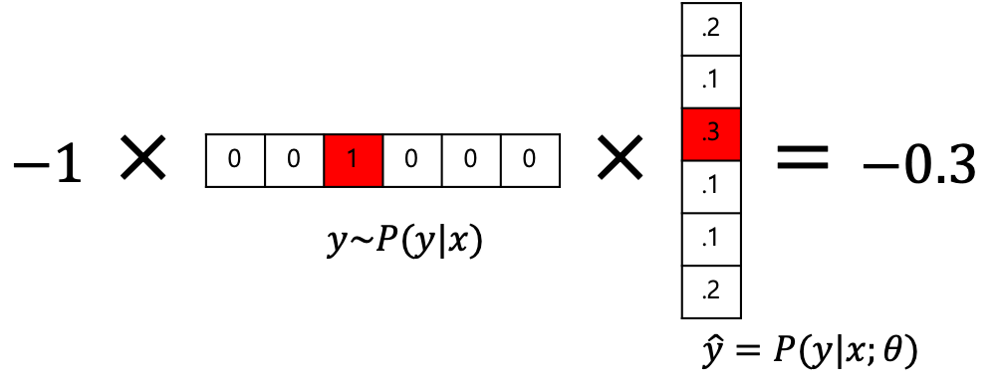

# RNN을 활용하기

그럼 이제 딥러닝을 통한 텍스트 분류 문제를 살펴 보겠습니다. 딥러닝을 통해 텍스트 분류를 하기 위한 가장 간단한 방법은 Recurrent Neural Network(RNN)를 활용하는것 입니다. 문장은 단어들의 시퀀스로 이루어진 시퀀셜(sequential) 데이터 입니다. 따라서, 각 위치(또는 time-step)의 단어들은 다른 위치의 단어들과 영향을 주고 받습니다. RNN은 이런 문장의 특성을 가장 잘 활용할 수 있는 뉴럴 네트워크 아키텍쳐입니다.

이전 챕터에서 다루었듯이, RNN은 각 time-step의 단어를 입력으로 받아 자신의 상태인 히든 스테이트(hidden state)를 업데이트 합니다.

$$h_t=f_\theta(x_t,h_{t-1})$$

n개의 단어로 이루어진 문장 $x$ 가 주어졌을 때, 이를 RNN에 피드포워드(feed-forward)하면 n개의 히든 스테이트를 얻을 수 있습니다. 이때, 가장 마지막 히든 스테이트를 활용하여 텍스트의 클래스를 분류할 수 있습니다.

$$\begin{gathered}
\hat{y}=\underset{y\in\mathcal{Y}}{\text{argmax }}P(\text{y}|x;\theta) \\
\text{where }P(\text{y}|x;\theta)=h_n=f_\theta(x_n,h_{n-1})\text{ and }x=\{w_1,w_2,\cdots,w_n\}.
\end{gathered}$$

따라서, 마치 RNN은 입력으로 주어진 문장을 분류 문제에 맞게 인코딩 한다고 볼 수 있습니다. 즉, RNN의 출력 값은 문장 임베딩 벡터(sentence embedding vector)라고 볼 수 있습니다.

## 아키텍쳐 내부 설명


우리가 텍스트 분류를 RNN을 통해 구현한다면 위와 같은 구조가 될 것 입니다. 내부를 구성하고 있는 레이어들을 하나씩 따라가면서 살펴보도록 하겠습니다.

우리 모두는 잘 알다시피, 텍스트에서 단어(word)는 discrete한 값 입니다. 따라서 이런 단어들이 모여 문장이 되어도 여전히 discrete한 값 입니다. 즉, discrete 확률 분포에서 문장을 샘플링 한 것이라고 볼 수 있습니다. 따라서 입력으로 One-hot 벡터들이 여러 time-step으로 주어집니다. 따라서 미니배치(mini-batch)까지 고려했을 때, 입력은 3차원의 텐서이며 사이즈는 $n \times m \times |V|$ 가 될 것 입니다. 여기서 $n$ 은 미니배치 사이즈, $m$ 은 문장의 길이를 가리킵니다.

$$\begin{gathered}
x\sim P(\text{x}) \\
\text{where }x=\{w_1,w_2,\cdots,w_n\}\text{ and }w_i\in\{0,1\}^{|V|}. \\
\\
\text{Thus, }|x_{1:n}|= (n,m,|V|)\\
\text{where }x_{1:n}=[x_1,x_2,\cdots,x_n]\text{ and }n=\text{batch\_size}.
\end{gathered}$$

하지만 여러분도 잘 알다시피 one-hot 벡터는 주어진 $|V|$ 차원에서, 단 한 개의 1과 $|V|-1$ 개의 0으로 이루어져 있습니다. 우리는 추후 임베딩 레이어와의 연산 뿐만 아니라, one-hot 벡터 자체를 효율적으로 저장하기 위해서 굳이 one-hot 벡터 전체를 가지고 있을 필요가 없습니다. <comment> 워드 임베딩 벡터 챕터 참조 바랍니다. </comment> 따라서 각 벡터 별로 1의 위치 인덱스(index)만 기억하고 있으면 됩니다.

$$|x_{1:n}|=(n,m,1)=(n,m)$$

즉, 0부터 $|V|$ 사이의 정수로 나타낼 수 있고, 이는 3차원 텐서가 아니라 2차원의 행렬(matrix) $n \times m$ 으로 충분합니다.

이렇게 입력으로 주어진 one-hot 인코딩 된 $n \times m$ 텐서를 임베딩 레이어에 통과시키면 워드 임베딩 텐서를 얻을 수 있습니다. 워드 임베딩 텐서의 크기는 아래와 같습니다.

$$\begin{gathered}
\tilde{x}_{1:n}=\text{emb}_\theta(x_{1:n}) \\
|x_{1:n}|=(n,m,d)\text{ where }d=\text{word\_vec\_dim}.
\end{gathered}$$

이후에 워드 임베딩 텐서를 RNN에 통과 시킵니다.

$$\begin{gathered}
h_t=\text{RNN}_\theta(x_t,h_{t-1}) \\
\text{where }|x_t|=(n,1,d)\text{, }|h_t|=(n,1,h)\text{ and }h=\text{hidden\_size}. \\
\end{gathered}$$

이때, 우리는 RNN에 각 time-step 별로, 각 레이어 별로 구분하여 워드 임베딩 텐서 또는 히든 스테이트를 넣어줄 필요가 없습니다. 지금과 같은 상황에서는 단지 초기 히든 스테이트 $h_0$ 와 전체 입력(워드 임베딩 텐서 $x_{1:n}$ )을 RNN에 넣어주면, 파이토치가 최적화된 구현을 통해 매우 빠른 속도로 RNN의 모든 time-step에 대한 출력과 마지막 히든 스테이트를 반환 합니다.

$$\begin{gathered}
H=RNN_\theta(x_t, h_0) \\
\text{where }H=[h_1;h_2;\cdots;h_m]\text{ and }|H|=(n,m,h). \\
\end{gathered}$$

우리는 파이토치 RNN을 통해 얻은 모든 time-step에 대한 RNN의 출력 값 중에서 제일 마지막 time-step만 선택하여 softmax 레이어를 통과시켜 discrete 확률 분포 $P(\text{y}|x;\theta)$ 로 나타냅니다.

$$h_m=H[:, -1]$$

우리는 위와 같이 time-step의 차원(dimension)에서 맨 마지막 인덱스를 슬라이싱(slicing) 할 수 있습니다. 이것을 리니어 레이어를 거친 이후에 softmax를 취합니다.

$$\begin{gathered}
\hat{y}=\text{softmax}(h_m\cdot W+b) \\
\text{where }|\hat{y}|=(n,|\mathcal{C}|),|h_m|=(n,1,h)\text{, }W\in\mathbb{R}^{h\times|\mathcal{C}|}\text{ and }b\in\mathbb{R}^{|\mathcal{C}|}.
\end{gathered}$$

이렇게 구한 $\hat{y}$ 는 데이터 $x$ 와 확률 분포 함수 파라미터 $\theta$ 가 주어졌을 때, 클래스를 나타내는 랜덤 변수 $\text{y}$ 의 확률 분포를 나타냅니다. 그럼 우리는 실제 정답 $y$ 와 $\hat{y}$ 차이의 손실(error, loss) 값을 구하고 이것을 최소화(minimize) 하도록 그래디언트 디센트 최적화(optimization)를 수행 하면 뉴럴 네트워크 $\theta$ 를 훈련할 수 있습니다.

$$\mathcal{L}(\hat{y}, y)=-\frac{1}{m}\sum_{i=1}^m{y_i\log{\hat{y}_i}}$$

위와 같이 우리는 크로스 엔트로피 수식을 통해서 ground-truth 확률분포에 우리의 뉴럴네트워크 확률 분포함수가 근사(approximate)하도록 합니다. 재미있는 것은 $y_i$ 가 one-hot 벡터이므로 1인 인덱스의 로그 확률(log-probability)값만 최대화 하도록 하면 된다는 것 입니다. 그럼 softmax의 수식에 따라 다른 인덱스의 확률값이 작아질 것 입니다. 이 수식은 네가티브 로그 라이클리후드(negative log-likelihood, NLL)를 최소화 하는 것과 똑같습니다.



우리는 이렇게 얻어진 손실 함수에 대해서 확률 분포 함수 뉴럴 네트워크 파라미터 $\theta$ 로 미분하면, 라이클리후드를 최대화 하도록하는 $\theta$ 를 업데이트 할 수 있습니다.

$$\theta\leftarrow\theta-\lambda\nabla_\theta\mathcal{L}(\hat{y},y)$$

## 파이토치 구현 예제

아래는 위의 수식을 파이토치로 구현한 예제 입니다. 위의 수식에서와 달리 아래의 코드에서는 여러 레이어로 이루어진 LSTM을 사용하였습니다. 또한 LSTM 내부의 각 레이어 사이에는 드랍아웃(dropout)이 추가되어 있습니다. 또한 위의 크로스 엔트로피 손실 함수 설명에서 언급하였듯이, 네가티브 로그 라이클리후드(negative log-likelihood, NLL) 손실함수를 사용하여 최적화 하기 위하여, 일반적인 softmax 함수 대신에 로그 확률(log-probability)를 반환하는 log-softmax를 사용합니다.

텍스트 분류기(text classifier)의 전체 소스코드는 저자의 [깃허브](https://github.com/kh-kim/simple-ntc)(https://github.com/kh-kim/simple-ntc)에서 볼 수 있습니다. 코드는 업데이트 될 수 있으므로, 자세한 내용은 깃허브의 코드를 직접 참고 바랍니다. 아래의 코드는 https://github.com/kh-kim/simple-ntc/blob/master/simple_ntc/rnn.py 입니다.

```python
import torch.nn as nn


class RNNClassifier(nn.Module):

    def __init__(self, 
                 input_size, 
                 word_vec_dim, 
                 hidden_size, 
                 n_classes,
                 n_layers=4, 
                 dropout_p=.3
                 ):
        self.input_size = input_size  # vocabulary_size
        self.word_vec_dim = word_vec_dim
        self.hidden_size = hidden_size
        self.n_classes = n_classes
        self.n_layers = n_layers
        self.dropout_p = dropout_p

        super().__init__()

        self.emb = nn.Embedding(input_size, word_vec_dim)
        self.rnn = nn.LSTM(input_size=word_vec_dim,
                           hidden_size=hidden_size,
                           num_layers=n_layers,
                           dropout=dropout_p,
                           batch_first=True,
                           bidirectional=True
                           )
        self.generator = nn.Linear(hidden_size * 2, n_classes)
        # We use LogSoftmax + NLLLoss instead of Softmax + CrossEntropy
        self.activation = nn.LogSoftmax(dim=-1)

    def forward(self, x):
        # |x| = (batch_size, length)
        x = self.emb(x)
        # |x| = (batch_size, length, word_vec_dim)
        x, _ = self.rnn(x)
        # |x| = (batch_size, length, hidden_size * 2)
        y = self.activation(self.generator(x[:, -1]))
        # |y| = (batch_size, n_classes)

        return y
```
