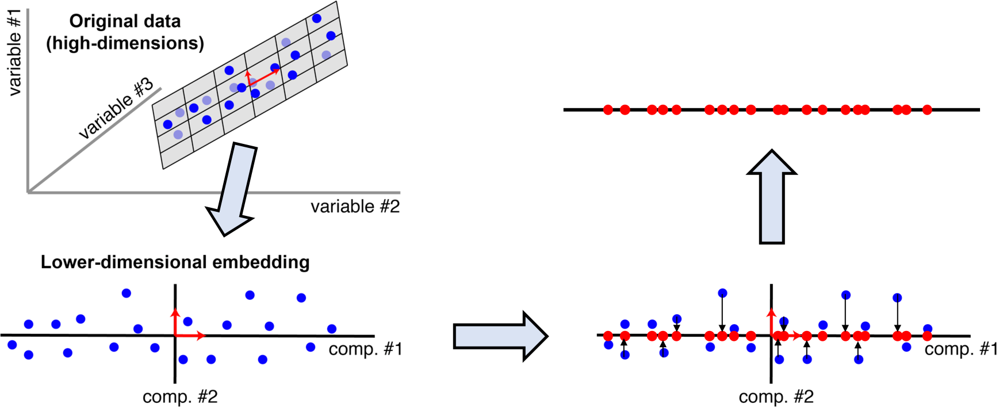
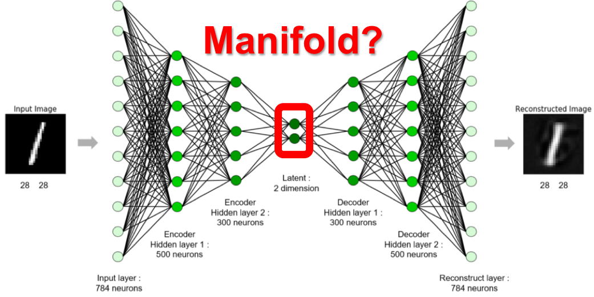
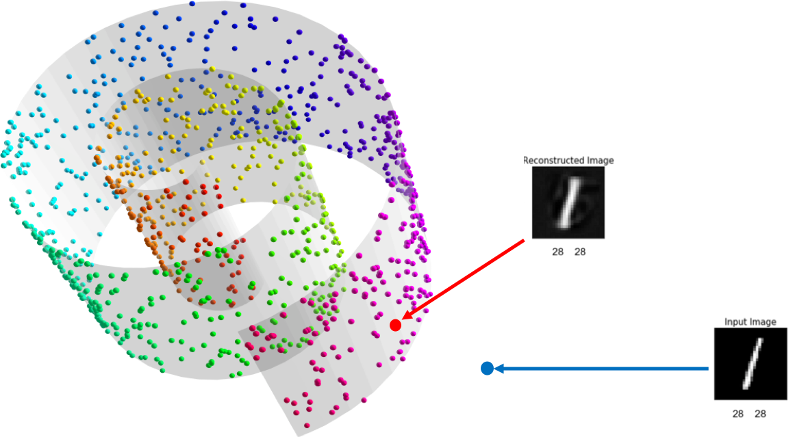

# 차원 축소 (Dimension Reduction)

이전 장에서 우린 높은 차원에서 데이터를 표현하였기 때문에 어려움(희소성 문제)이 많은 것을 살펴보았습니다. 따라서 우리는 같은 정보를 표현하기 위해서 보다 낮은 차원을 사용하는 것이 중요합니다.

이번 장에서는 좀 더 작은 차원으로 효율적으로 정보를 표현하는 이유와 방법에 대해서 다루어 보겠습니다.

## 주성분 분석 (Principal Component Analysis, PCA)

대표적인 차원축소 방법으로는 주성분 분석(Principal Component Analysis, PCA)이 있습니다.

위와 같이 고차원(high-dimension)의 데이터를 보다 낮은 차원으로 표현하는 것이 가능합니다. 주로 Singular Value Decomposition (SVD)를 통해 주성분 분석을 수행 할 수 있습니다.

이때 축소를 위한 주성분(principal component)는 위와 같은 조건을 만족합니다. 고차원에서 주어진 데이터들을 임의의 주성분 고차원 평면(hyper-plane)에 투사(projection)하였을 때, 투사점들 사이가 서로 최대한 멀어지도록 되어야 합니다. 또한, 고차원 평면으로 투사할 때, 원래 벡터와 고차원 평면상의 거리가 최소가 되도록 하여야 합니다.

주성분 분석을 통해 우리는 효과적으로 고차원의 데이터를 보다 낮은 차원으로 압축할 수 있습니다. 하지만 위에서 언급했듯이, 실제 데이터(점)의 위치와 고차원 평면에 투사된 점의 거리가 생길 수 밖에 없습니다. 이는 곧 정보의 손실을 의미합니다. 특히 주성분은 직선 또는 평면일 수 밖에 없기 때문에, 이러한 손실을 최소화 하는 것은 생각보다 어렵습니다. 너무 많은 정보가 손실된다면, 효율적으로 정보를 학습하거나 복구할 수 없기 때문입니다. 따라서 높은 차원에 표현되어있는 정보를 지나치게 낮은 차원으로 축소하여 표현하는 것은 어려움이 따릅니다. 특히 데이터가 비선형적으로 표현되어 있을수록 이는 점점 더 어려워집니다.

## 매니폴드 가설(Manifold Hypothesis)

이때 하나의 가설을 통해 우리는 좀 더 차원축소를 효율적으로 접근해 볼 수 있습니다. 사실 one-hot 인코딩과 같이 대부분의 높은 차원에 존재하는 데이터들은 비록 높은 차원에서 표현되어 있지만, 해당 데이터들을 아우르는 낮은 차원의 매니폴드(manifold, 다양체)가 존재한다는 가설 입니다.

위와 같이 3차원상에 분포한 데이터를 아우르는 소용돌이 모양의 구부려진 2차원 매니폴드가 존재할 수도 있을 것 입니다. 그럼 우리는 이런 매니폴드를 찾아 2차원의 평면 상에 데이터 포인트들을 표현할 수 있을 것 입니다. 만약 이 매니폴드를 찾을 수 있다면 이전 주성분 분석처럼 데이터를 고차원 평면에 투사(projection)하며 생긴 손실을 더욱 최소화 할 수 있을 것 입니다.

또한, 매니폴드 가설에 따르면 또 하나의 흥미로운 특성이 있습니다. 비록 고차원상에서는 가까운 거리에 있던 벡터들일지라도, 매니폴드를 저차원 고차원 평면으로 표현하였을 때는 오히려 거리가 멀어질 수 있다는 것 입니다. 그리고 매니폴드 표면(surface)상에서 가까운 점들끼리는 실제 의미적으로 가까운 데이터를 표현하고 있다는 것 입니다.

예를 들어 위의 그림과 같이 MNIST 데이터를 2차원 저차원(low-dimension latent space) 매니폴드에 표현한다면, 빨간색으로 표시된 각 샘플들은 2차원 매니폴드 공간 상에서는 위와 같은 위치와 관계를 가지고 있겠지만, 원래의 데이터 차원인 784차원 고차원 공간(high-dimension space)에서는 훨씬 더 다른 거리와 관계를 지니고 있을 것 입니다.

## 그동안 딥러닝이 잘 동작한 이유

바로 딥러닝이 훌륭한 성능을 내는 이유가 여기 있습니다. 거의 모든 문제에 있어서 딥러닝이 문제를 풀기위해 수행하는 것은 바로 차원 축소이며, 그 과정은 데이터가 존재하는 고차원(high-dimension)상에서 매니폴드(manifold)를 찾는 과정 그 자체이기 때문입니다. 주성분 분석(PCA)와 같이 다른 선형적인 방식에 비해서 딥러닝은 비선형적인 방식으로 차원축소를 수행하며, 그 과정에서 해당 문제를 가장 잘 해결하기 위한 매니폴드를 자연스럽게 찾아냅니다. 이것이 바로 딥러닝이 이토록 성공적으로 동작하는 이유 입니다.

## 오토인코더 (Auto-encoder)

그럼 본격적으로 자연어처리에서 단어를 표현하기 위한 차원 축소를 다루기에 앞서, 오토인코더(auto-encoder)에 대해 이야기하고 넘어가도록 하겠습니다. 오토인코더는 아래와 같은 구조를 가진 딥러닝 모델 입니다. 

고차원의 샘플 벡터를 입력으로 받아 저차원으로 축소하는 인코더(encoder)를 거쳐 매니폴드인 병목(bottle-neck) 구간에서의 숨겨진(latent, hidden) 벡터로 표현 합니다. 그리고 디코더(decoder)는 저차원의 벡터를 받아, 다시 원래 입력 샘플이 존재하던 고차원으로 데이터를 복원하는 작업을 수행 합니다. 

고차원의 벡터를 저차원으로 압축 후, 다시 복원하는 과정에서 오토인코더는 병목의 차원이 매우 낮기 때문에 복원에 꼭 필요한 정보만 남기고 필요 없는 정보는 버려야 합니다. 따라서 이 구조의 모델을 훈련할 때엔, 복원된 데이터와 실제 입력 데이터 사이의 차이를 최소화 하도록 손실함수(loss function)을 구성합니다. 

하지만 고차원에서 저차원으로 데이터를 표현하는 것에 손실이 따를 수 있기 때문에, 훈련이 완료된 모델일지라도 복원된 데이터는 실제 입력과 차이가 있을 수 있습니다.

<!--

-->

당장 우리는 이 오토인코더를 사용하여 이전 챕터에서 TF-IDF 등을 활용하여 계산한 희소 단어 피쳐 벡터(sparse word feature vector)를 덴스 워드 임베딩 벡터(dense word embedding vector)로 변환할 수 있을 것 입니다.