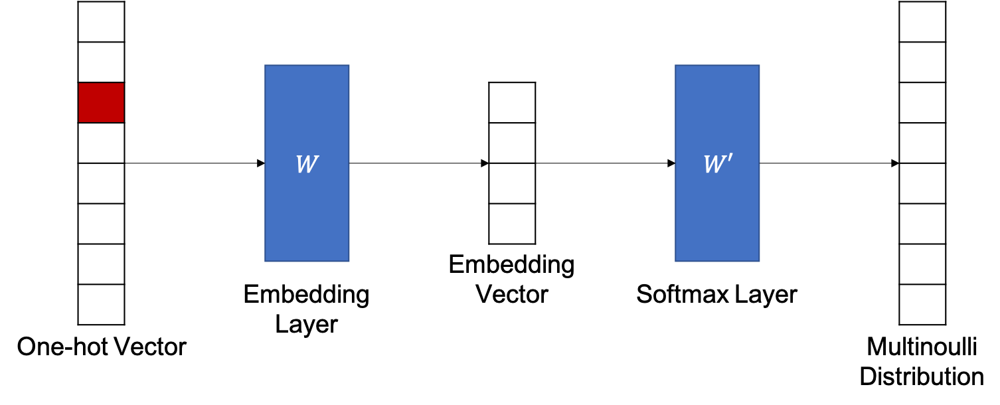

# Word2Vec

2011년 Tomas Mikolov는 Word2Vec이라는 방법을 제시하여 학계에 큰 파장을 일으켰습니다. 물론 이전부터 뉴럴 네트워크를 통해 단어를 임베딩하고자 하는 시도는 많았지만, Mikolov는 복잡한 신경망 네트워크를 사용하여 워드 임베딩 벡터를 계산하는데 의문을 가졌습니다. 이에 빠르고 쉽고 효율적으로 임베딩하는 word2vec을 통해, 딥러닝 연구자들의 자연어처리에 대한 이해도를 한단계 끌어올렸습니다.

Word2Vec은 단어를 임베딩 하는 방법을 2가지 제시하였습니다. 두 방법 모두 공통된 가정을 갖고 있습니다. 함께 나타나는 단어가 비슷할 수록 비슷한 벡터 값을 가질 것이라는 것 입니다.

위와 같이 두 방법 모두 윈도우(window)의 크기가 주어지면, 특정 단어를 기준으로 윈도우 내의 주변 단어들을 사용하여 단어 임베딩을 학습합니다. 단, 윈도우 내에서의 위치는 고려되지 않습니다. 하지만 그렇다고 해서 이때 단어의 위치 정보가 무시되는 것은 아닙니다. 윈도우 자체가 단어의 위치 정보를 내포하고 있기 때문입니다. 왜냐하면 문장 내 단어의 위치에 따라서 윈도우에 포함되는 단어가 달라질 것이기 때문입니다.

## 알고리즘 개요: CBOW와 Skip-gram

먼저 CBOW(Continuous Bag of Words)의 학습원리는 다음과 같습니다. 뉴럴 네트워크는 주변에 나타나는 단어들를 ont-hot 인코딩 된 벡터로써 입력을 받아 해당 단어를 예측하도록 합니다.

이와 반대로 Skip-gram을 학습할 때에는 대상 단어를 ont-hot 인코딩 된 벡터로 입력받아 주변에 나타나는 단어를 예측하도록 하는 네트워크를 구성하여 워드 임베딩 벡터를 학습 합니다.

보통 Skip-gram이 CBOW보다 성능이 뛰어난 것으로 알려져 있고, 따라서 좀 더 널리 쓰입니다.

## 훈련 방법 상세

Skip-gram의 방법을 좀 더 자세하게 살펴보도록 하겠습니다. 먼저 skip-gram을 학습하는 과정은 아래와 같습니다. Maximum Likelihood Estimation (MLE)를 통해 아래의 수식을 최대로 하는 파라미터 $\theta$ 를 찾습니다. 이를 통해, $w_t$ 가 주어졌을떄, 앞뒤 $n$ 개의 단어( $w_{t-\frac{n}{2}},\cdots,w_{t+\frac{n}{2}}$ )를 예측하도록 훈련 됩니다. <comment> 이때 윈도우의 크기는 $n$ 입니다. </comment>

$$\hat{\theta}=\underset{\theta}{\text{argmax}}\sum_{t=1}^T{\Big(\sum_{i=1}^n{\log{P(w_{t-i}|w_t;\theta)}}+\sum_{i=1}^n{\log{P(w_{t+i}|w_t;\theta)}}\Big)}$$

우리는 이전 섹션에서 임베딩 레이어를 통해서 one-hot 인코딩 벡터를 덴스(dense) 벡터인 워드 임베딩 벡터로 변환하는 방법에 대해서 다루었습니다. Skip-gram에서도 마찬가지 방법을 사용 합니다.

$$\begin{gathered}
\hat{y}=\underset{y\in\mathcal{Y}}{\text{argmax }}\text{softmax}(W'Wx) \\
\text{where }W'\in\mathbb{R}^{|V|\times d}, W\in\mathbb{R}^{d\times|V|}\text{ and }x\in\mathbb\{0,1\}^{|V|}.
\end{gathered}$$

위의 수식을 그림으로 표현하면 아래와 같습니다. 수식에서 볼 수 있듯이 1개의 히든 레이어를 갖고 있으며, 매우 간단한 구조입니다. <comment> 소프트맥스 레이어는 출력 레이어 입니다. </comment>

이때 이전에 설명한 임베딩 레이어의 동작 원리와 같이 $W$ 의 각 row가 skip-gram을 통해 얻은 단어 x에 대한 워드 임베딩 벡터가 됩니다.

<!--
## Negative Sampling

사실 위의 방법은 나름 괜찮은 방법이지만, $|V|$ 가 매우 클 경우에 $W$ 와 $W'$ 가 커짐으로 인해서 메모리와 연산량에 있어 부하로 작용할 수 있습니다. 따라서, 이때 negative sampling 방법을 사용하여 우리는 좀 더 효율적으로 skip-gram을 구현할 수 있습니다.
-->